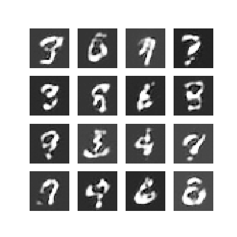

# DCGAN tutorial 


## 简介

生成对抗网络(GANs)属于一种生成网络，它通过两个网络的相互博弈的方式来学习特定的数据分布。而DCGAN则是一种基于卷积/反卷积运算的生成对抗网络，被广泛应用于图像生成领域

本例程将主要演示如何在Oneflow中运行DCGAN网络，而不重点讨论生成对抗网络的原理和细节。如果感兴趣的话，可以参考：

- [Unsupervised Representation Learning with Deep Convolutional Generative Adversarial Networks](https://arxiv.org/abs/1511.06434)

- [NLPS 2016 tutorial:generative adversarial networks](https://arxiv.org/abs/1511.06434)


## 对齐测试

本例程的核心代码在`dcgan.py`文件中，其中的模型结构和参数参考了tensorflow的[官方示例](https://www.tensorflow.org/tutorials/generative/dcgan)

通过以下代码，可以运行一个简单的对齐测试，保证oneflow的模型结果与tensorflow的结果是一致的

```python
dcgan = DCGAN()
dcgan.compare_with_tensorflow()
```


## 数据集准备

例程提供了数据集下载脚本，运行`download.py`下载mnist数据集， 数据集默认保存在`./data/minst`目录中

```bash
python download.py mnist
```


## 训练

在准备好数据集后，可通过DCGAN实例的`train`方法进行DCGAN的训练

```python
dcgan.train(epochs=2)
```

训练将每隔`self.eval_interval`个batch输出生成的图像



## 导出动图

再完成训练后，可以通过DCGAN实例的`save_to_gif`方法将图像导出为动图

```python
dcgan.save_to_gif()
```