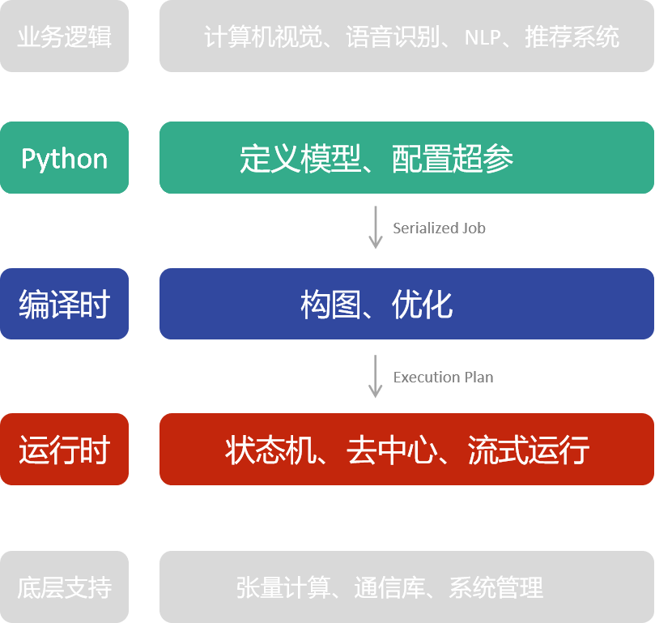

# OneFlow 架构设计概览

在本文中，我们将简要介绍：

* OneFlow 的核心架构

* OneFlow 训练任务从 Python 层到运行时的工作流程

* OneFlow 各个层次中所涉及的技术特色

通过阅读本文，可以对 OneFlow 的架构及源码目录结构有一个初步的了解；本文涉及到的 OneFlow 的每一个技术特色，我们会在后续的文章中分专题进行更深入的介绍。

## OneFlow 的架构层次图解


如上图所示，如果暂时略去 OneFlow 的上层模型库、底层支撑库，集中关注 OneFlow 内部架构中与神经网络训练直接相关的部分，总体上可分为三层：

* Python层：用户通过调用Python接口来配置超参，并编写 OneFlow 的任务函数来定义网络，这一切的信息，最终会在 OneFlow 中序列化为字节流，传递给下一层-- **编译时层**；

* 编译时层：OneFlow 实现的编译器，将接受 Python 层传递的字节流，并将字节流中所承载的任务函数的信息，经分析、优化后，编译、链接为 OneFlow 中的 **执行计划** (Execution Plan)，最后将 `Execution Plan` 传递给下一层-- **运行时层** ；

* 运行时层：OneFlow 的执行引擎接收上一层传递来的执行计划(`Plan`)，执行计划由多个更小单元的任务描述(`Task Proto`)结构组成，OneFlow 的执行引擎会解析 `Plan`，并为每个 `Task Proto` 分配一个执行单元 **actor**，众多 `actor` 一起运作，完成 OneFlow 的 **去中心化、分布式、流式计算** 。

有了以上的基本层次概念后，我们将在下文中，结合具体的数据结构与代码，向大家介绍 OneFlow 的Python层、编译时、运行时的整个流程是如何运行的。


本文讨论对象为 OneFlow 脚本编程所对应的 `lazy` 模式， OneFlow 交互式编程所对应的 `eager` 模式不在本文讨论范围。

### OneFlow 任务是如何跑起来的
如果想结合 OneFlow 的源码研究 OneFlow 的设计，建议重点关注 OneFlow 源码目录下的 [protobuf](https://developers.google.cn/protocol-buffers/) 文件，OneFlow 中控制面的数据结构、协议，都是使用 `protobuf` 定义的，结合这些数据结构，可以更快理解 OneFlow 的内部设计。

以下，我们将针对通常情况下 OneFlow 脚本执行过程(如[3分钟快速上手](../quick_start/quickstart_in_3_min.md))，逐层分析 OneFlow 在Python层、编译时和运行时到底都做了哪些工作。

## Python 层次
我们在使用 OneFlow 的过程中已经知道，OneFlow 需要使用`@oneflow.global_function`装饰器来修饰一个python编写的“任务函数”。
比如：
```python
@flow.global_function(get_train_config())
def train_job():
  # ...
```

在`oneflow/python/framework/function_util.py`中可以找到`global_function`装饰器对应的内部代码：
```python
    def Decorator(job_func):
        #...
        sess = session_ctx.GetDefaultSession()

        @functools.wraps(job_func)
        def Func(*args, **kwargs):
            return _RunLazyJob(sess, job_func, *args, **kwargs)

        sess.AddJob(_CloneFunctionDesc(function_config.function_desc, job_func))
        #...
        return Func
```
可以看到，装饰器返回的是 `Func` 函数，我们在训练过程中调用的任务函数，其实真正执行的是此处的 `Func`。

装饰器的主要作用有：

* 通过调用`sess.AddJob`，将训练的环境配置及任务函数的信息，添加到当前 session 上下文中，我们将看到，这些信息在编译时会被用到

* 通过修饰器，使得任务函数的调用被导向`_RunLazyJob`，我们将看到在`_RunLazyJob`中包括了编译 `job_func` 的代码

以下，我们来展开讨论`sess.AddJob`与`_RunLazyJob`的细节。

### Python 中完成序列化并触发编译

在`/oneflow/python/framework/session_util.py`中可以看到`AddJob`的实现：
```python
class Session(object):
    #...
    def AddJob(self, function_desc):
        #...
        self.job_name2function_desc_[function_desc.job_func.__name__] = function_desc
```
可以看到， `session`中有一个名为 `job_name2function_desc_` 的字典，`AddJob` 将任务函数的名字作为 key，配置信息作(`function_desc`)为 value 放置进去，配置信息可以在 `oneflow/core/job/job.proto`中查看。

将训练配置信息加入到 `session` 中的主要原因，是 OneFlow 在编译时需要这些信息来进行推理、优化。接下来我们来分析 OneFlow 在 Python层次是如何触发编译过程的。

我们观察 `_RunLazyJob` 的内部实现，可以找到 OneFlow 进行序列化并触发 OneFlow C++ 层编译的代码位置：
```python
def _RunLazyJob(session, job_func, *args, **kwargs):
    return session.TryInit().LazyRun(job_func, *args, **kwargs)
```
跟进 `session` 对象的 `TryInit` 方法，可以发现，`session.TryInit` 会根据当前 session 的状态，决定是否触发编译：
```python
class Session(object):
    #...
    def TryInit(self):
        if self.status_ is SessionStatus.OPEN:
            self.Init()
        return self

    def Init(self):
        assert self.status_ is SessionStatus.OPEN
        self.status_ = SessionStatus.RUNNING
        #...
        _TryCompleteConfigProto(self.config_proto)
            for job_name, func_desc in self.job_name2function_desc_.items():
                compiler.Compile(self, func_desc, self.config_proto)
        #...
        c_api_util.StartGlobalSession()
        return self
```
从以上代码可以看到，如果当前 Session 处于 "OPEN" 状态，那么 session 会调用 `Init`， 遍历之前通过 `AddJob` 设置在 session 中的 `job_name2function_desc_` 中的各个 job ，并且调用 `compiler.Compile` 编译，`compiler.Compile`的内部实现为：
```python
def Compile(session, function_desc, config_proto):
    with InterpretScope(session, function_desc, config_proto):
        _CompileJob(function_desc)
        c_api_util.CurJobBuildAndInferCtx_Complete()
```

其中`_CompileJob`中将对`function_desc`所描述的任务函数进行序列化。再通过 `c_api_util.CurJobBuildAndInferCtx_Complete` 告之 C++ 层序列化完成。

完成`compiler.Compile`的工作后，将通过`c_api_util.StartGlobalSession()` 触发 C++ 层，创建 session，开始 C++ 层的编译、构图等工作。


### Python 层运行任务函数
回顾上文提到到的`_RunLazyJob`代码：
```python
def _RunLazyJob(session, job_func, *args, **kwargs):
    return session.TryInit().LazyRun(job_func, *args, **kwargs)
```
我们已经知道在`TryInit()`中完成了任务函数的序列化，并通知 编译时完成编译构图工作。

而`LazyRun`内部，就对应了用户调用任务函数时，Python层如何运行任务函数。

```python
    def LazyRun(self, job_func, *arg):
        #...
        remote_blobs = self.LaunchUserJob(job_func, *arg)
        #...
        return LazyFutureRemoteBlobs(self).SetResult(remote_blobs).Inited()
```
其中 `LaunchUserJob` 接受的参数 `job_func` 与 `arg` 就分别是用户调用任务函数时的任务函数以及传递的参数。

`LaunchUserJob` 会遍历 `job_func` 中需要执行的计算单元，并最终通在`session.LaunchJob`(`/oneflow/python/framework/session_util.py`)中通过调用`c_api_util.LaunchJob(job_instance)`执行计算。

值得一提的是，因为当用户调用任务函数时，OneFlow 已经完成了任务函数的编译构图，得到了执行计划(Execution Plan)，1个 Plan 由多个描述任务的`TaskProto`组成。以上`c_api_util.LaunchJob(job_instance)`所接受的参数`job_instance`，并不是任务函数本身，而是 Plan中的 `Task` 实例化对象，一个任务函数，将对应多个`job_instance`。

## 编译阶段


## 运行时

## OneFlow 各模块的技术特色
