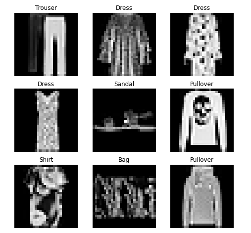
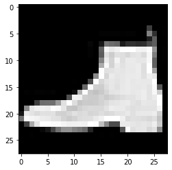

# Dataset 与 DataLoader

OneFlow 的 `Dataset` 与 `DataLoader` 的行为与 [PyTorch](https://pytorch.org/tutorials/beginner/basics/data_tutorial.html) 的是一致的，都是为了让数据集管理与模型训练解耦。

在 [oneflow.utils.vision.datasets](todo_refine_rst_datasets.md) 下，提供的类可以帮助我们自动下载、加载常见的数据集（如 FashionMNIST）。

`DataLoader` 将数据集封装为迭代器，方便训练时遍历并操作数据。

```python
import matplotlib.pyplot as plt

import oneflow as flow
import oneflow.nn as nn
from oneflow.utils.vision.transforms import ToTensor
from oneflow.utils.data import Dataset
import oneflow.utils.vision.datasets as datasets
```

## Dataset 加载数据

以下的例子展示了如何使用内置的 `Dataset` 加载数据。

- `root`：数据集存放的路径
- `train`： `True` 代表下载训练集、`False` 代表下载测试集
- `download=True`： 如果 `root` 路径下数据集不存在，则从网络下载
- `transforms`：指定的数据转换方式


```python
training_data = datasets.FashionMNIST(
    root="data",
    train=True,
    download=True,
    transform=ToTensor()
)

test_data = datasets.FashionMNIST(
    root="data",
    train=False,
    download=True,
    transform=ToTensor()
)
```

第一次运行，会下载数据集，输出：

```text
Downloading http://fashion-mnist.s3-website.eu-central-1.amazonaws.com/train-images-idx3-ubyte.gz
Downloading http://fashion-mnist.s3-website.eu-central-1.amazonaws.com/train-images-idx3-ubyte.gz to data/FashionMNIST/raw/train-images-idx3-ubyte.gz
26422272it [00:17, 1504123.86it/s]                                                          
Extracting data/FashionMNIST/raw/train-images-idx3-ubyte.gz to data/FashionMNIST/raw

Downloading http://fashion-mnist.s3-website.eu-central-1.amazonaws.com/train-labels-idx1-ubyte.gz
Downloading http://fashion-mnist.s3-website.eu-central-1.amazonaws.com/train-labels-idx1-ubyte.gz to data/FashionMNIST/raw/train-labels-idx1-ubyte.gz
29696it [00:00, 98468.01it/s]                                                               
Extracting data/FashionMNIST/raw/train-labels-idx1-ubyte.gz to data/FashionMNIST/raw

Downloading http://fashion-mnist.s3-website.eu-central-1.amazonaws.com/t10k-images-idx3-ubyte.gz
Downloading http://fashion-mnist.s3-website.eu-central-1.amazonaws.com/t10k-images-idx3-ubyte.gz to data/FashionMNIST/raw/t10k-images-idx3-ubyte.gz
4422656it [00:07, 620608.04it/s]                                                            
Extracting data/FashionMNIST/raw/t10k-images-idx3-ubyte.gz to data/FashionMNIST/raw

Downloading http://fashion-mnist.s3-website.eu-central-1.amazonaws.com/t10k-labels-idx1-ubyte.gz
Downloading http://fashion-mnist.s3-website.eu-central-1.amazonaws.com/t10k-labels-idx1-ubyte.gz to data/FashionMNIST/raw/t10k-labels-idx1-ubyte.gz
6144it [00:00, 19231196.85it/s]                                                             
Extracting data/FashionMNIST/raw/t10k-labels-idx1-ubyte.gz to data/FashionMNIST/raw
```

## 遍历数据

`Dataset` 对象，可以像 `list` 一样，用下表索引，比如 `training_data[index]`。
以下的例子，随机访问 `training_data` 中的9个图片，并显示。

```python
labels_map = {
    0: "T-Shirt",
    1: "Trouser",
    2: "Pullover",
    3: "Dress",
    4: "Coat",
    5: "Sandal",
    6: "Shirt",
    7: "Sneaker",
    8: "Bag",
    9: "Ankle Boot",
}
figure = plt.figure(figsize=(8, 8))
cols, rows = 3, 3
from random import randint
for i in range(1, cols * rows + 1):
    sample_idx = randint(0, len(training_data))
    img, label = training_data[sample_idx]
    figure.add_subplot(rows, cols, i)
    plt.title(labels_map[label])
    plt.axis("off")
    plt.imshow(img.squeeze().numpy(), cmap="gray")
plt.show()
```



## 自定义 Dataset

通过继承 [oneflow.utils.data.Dataset](https://oneflow.readthedocs.io/en/master/utils.html?highlight=oneflow.utils.data.Dataset#oneflow.utils.data.Dataset) 可以实现自定义 `Dataset`，自定义 `Dataset` 同样可以配合下一节介绍的 `Dataloader` 使用，简化数据处理的流程。

以下的例子展示了如何实现一个自定义 `Dataset`，它的关键步骤是：

- 继承 `oneflow.utils.data.Dataset`
- 实现类的 `__len__` 方法，返回结果通常为该数据集中的样本数量
- 实现类的 `__getitem__` 方法，它的返回值对应了用户（或框架）调用 `dataset_obj[idx]` 时得到的结果

```python
import numpy as np
class CustomDataset(Dataset):
    raw_data_x = np.array([[1, 2], [2, 3], [4, 6], [3, 1]], dtype=np.float32)
    raw_label = np.array([[8], [13], [26], [9]], dtype=np.float32)

    def __init__(self, transform=None, target_transform=None):
        self.transform = transform
        self.target_transform = target_transform

    def __len__(self):
        return len(raw_label)

    def __getitem__(self, idx):
        x = CustomDataset.raw_data_x[idx]
        label = CustomDataset.raw_label[idx]
        if self.transform:
            x = self.transform(x)
        if self.target_transform:
            label = self.target_transform(label)
        return x, label

custom_dataset = CustomDataset()
print(custom_dataset[0])
print(custom_dataset[1])
```

输出：

```text
(array([1., 2.], dtype=float32), array([8.], dtype=float32))
(array([2., 3.], dtype=float32), array([13.], dtype=float32))
```

## 使用 DataLoader

利用 Dataset 可以一次获取到所有数据。但是在训练中，往往有其它的需求，如：一次读取 batch size 份数据；1轮 epoch 训练后，数据重新打乱（reshuffle）等。

这时候，使用 `DataLoader` 即可。 `DataLoader` 可以将 `DataSet` 封装为迭代器，方便训练循环中获取数据。如以下例子：

- `batch_size=64` ： 指定一次迭代返回的数据 batch size
- `shuffle` ：是否要随机打乱数据的顺序

```python
from oneflow.utils.data import DataLoader

train_dataloader = DataLoader(training_data, batch_size=64, shuffle=True)
x, label = next(iter(train_dataloader))
print(f"shape of x:{x.shape}, shape of label: {label.shape}")
```

输出：
```text
shape of x:flow.Size([64, 1, 28, 28]), shape of label: flow.Size([64])
```

```python
img = x[0].squeeze().numpy()
label = label[0]
plt.imshow(img, cmap="gray")
plt.show()
print(label)
```

输出：



```text
tensor(9, dtype=oneflow.int64)
```

自然我们也可以在训练的循环中，使用 `Dataloader` 迭代器：

```python
for x, label in train_dataloader:
    print(x.shape, label.shape)
    # training...
```
