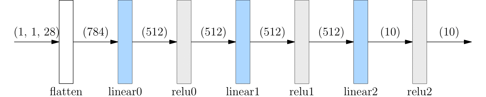

# 搭建神经网络

​神经网络的各层，可以使用 [oneflow.nn](https://oneflow.readthedocs.io/en/master/nn.html) 名称空间下的 API 搭建，它提供了构建神经网络所需的常见 Module（如 [oneflow.nn.Conv2d](https://oneflow.readthedocs.io/en/master/nn.html?highlight=oneflow.nn.Conv2D#oneflow.nn.Conv2d)，[oneflow.nn.ReLU](https://oneflow.readthedocs.io/en/master/nn.html?highlight=oneflow.nn.ReLU#oneflow.nn.ReLU) 等等）。 用于搭建网络的所有 Module 类都继承自 [oneflow.nn.Module](https://oneflow.readthedocs.io/en/master/module.html#oneflow.nn.Module)，多个简单的 Module 可以组合在一起构成更复杂的 Module，用这种方式，用户可以轻松地搭建和管理复杂的神经网络。

```python
import oneflow as flow
import oneflow.nn as nn
```


## 定义 Module 类

`oneflow.nn` 下提供了常见的 Module 类，我们可以直接使用它们，或者在它们的基础上，通过自定义 Module 类搭建神经网络。搭建过程包括：

- 写一个继承自 `oneflow.nn.Module` 的类
- 实现类的 `__init__` 方法，在其中构建神经网络的结构
- 实现类的 `forward` 方法，这个方法针对 Module 的输入进行计算

```python
class NeuralNetwork(nn.Module):
    def __init__(self):
        super(NeuralNetwork, self).__init__()
        self.flatten = nn.Flatten()
        self.linear_relu_stack = nn.Sequential(
            nn.Linear(28*28, 512),
            nn.ReLU(),
            nn.Linear(512, 512),
            nn.ReLU(),
            nn.Linear(512, 10),
            nn.ReLU()
        )

    def forward(self, x):
        x = self.flatten(x)
        logits = self.linear_relu_stack(x)
        return logits
net = NeuralNetwork()
print(net)
```

以上代码，会输出刚刚搭建的 `NeuralNetwork` 网络的结构：

```text
NeuralNetwork(
  (flatten): Flatten(start_dim=1, end_dim=-1)
  (linear_relu_stack): Sequential(
    (0): Linear(in_features=784, out_features=512, bias=True)
    (1): ReLU()
    (2): Linear(in_features=512, out_features=512, bias=True)
    (3): ReLU()
    (4): Linear(in_features=512, out_features=10, bias=True)
    (5): ReLU()
  )
)
```

接着，调用 `net` （注意：不推荐显式调用 `forward`）即可完成前向传播：

```python
X = flow.ones(1, 28, 28)
logits = net(X)
pred_probab = nn.Softmax(dim=1)(logits)
y_pred = pred_probab.argmax(1)
print(f"Predicted class: {y_pred}")
```

会得到类似以下的输出结果：

```text
Predicted class: tensor([1], dtype=oneflow.int32)
```

以上从数据输入、到网络计算，最终推理输出的流程，如下图所示：



## `flow.nn.functional`

除了 `oneflow.nn` 外，[oneflow.nn.functional](https://oneflow.readthedocs.io/en/master/functional.html) 名称空间下也提供了不少 API。它与 `oneflow.nn` 在功能上有一定的重叠。比如 [nn.functional.relu](https://oneflow.readthedocs.io/en/master/functional.html?highlight=relu#oneflow.nn.functional.relu) 与 [nn.ReLU](https://oneflow.readthedocs.io/en/master/nn.html?highlight=relu#oneflow.nn.ReLU) 都可用于神经网络做 activation 操作。

两者的区别主要有：

- `nn` 下的 API 是类，需要先构造实例化对象，再调用；`nn.functional` 下的 API 是作为函数直接调用
- `nn` 下的类内部自己管理了网络参数；而 `nn.functional` 下的函数，需要我们自己定义参数，每次调用的时手动传入

实际上，OneFlow 提供的大部分 Module 是通过封装 `nn.functional` 下的方法得到的。`nn.functional` 提供了更加细粒度管理网络的可能。 

以下的例子，使用 `nn.functional` 中的方法，构建与上文中 `NeuralNetwork` 类等价的 Module `FunctionalNeuralNetwork`，读者可以体会两者的异同：

```python
class FunctionalNeuralNetwork(nn.Module):    
    def __init__(self):
        super(FunctionalNeuralNetwork, self).__init__()
        
        self.weight1 = nn.Parameter(flow.randn(28*28, 512))
        self.bias1 = nn.Parameter(flow.randn(512))

        self.weight2 = nn.Parameter(flow.randn(512, 512))
        self.bias2 = nn.Parameter(flow.randn(512))

        self.weight3 = nn.Parameter(flow.randn(512, 10))
        self.bias3 = nn.Parameter(flow.randn(10))
        
    def forward(self, x):
        x = x.reshape(1, 28*28)
        out = flow.matmul(x, self.weight1)
        out = out + self.bias1
        out = nn.functional.relu(out)

        out = flow.matmul(out, self.weight2)
        out = out + self.bias2
        out = nn.functional.relu(out)

        out = flow.matmul(out, self.weight3)
        out = out + self.bias3
        out = nn.functional.relu(out)

        return out

net = FunctionalNeuralNetwork()
X = flow.ones(1, 28, 28)
logits = net(X)
pred_probab = nn.Softmax(dim=1)(logits)
y_pred = pred_probab.argmax(1)
print(f"Predicted class: {y_pred}")
```


## Module 容器

比较以上 `NeuralNetwork` 与 `FunctionalNeuralNetwork` 实现的异同，可以发现 [nn.Sequential](https://oneflow.readthedocs.io/en/master/nn.html?highlight=nn.Sequential#oneflow.nn.Sequential) 对于简化代码起到了重要作用。

`nn.Sequential` 是一种特殊容器，只要是继承自 `nn.Module` 的类都可以放置放置到其中。

它的特殊之处在于：当 Sequential 进行前向传播时，Sequential 会自动地将容器中包含的各层“串联”起来。具体来说，会按照各层加入 Sequential 的顺序，自动地将上一层的输出，作为下一层的输入传递，直到得到整个 Moudle 的最后一层的输出。

以下是不使用 Sequential 构建网络的例子（不推荐）：

```python
class MyModel(nn.Module):
    def __init__(self):
        super(MyModel, self).__init__()
        self.conv1 = nn.Conv2d(1,20,5)
        self.relu1 = nn.ReLU()
        self.conv2 = nn.Conv2d(20,64,5)
        self.relu2 = nn.ReLU()

    def forward(self, x):
        out = self.conv1(x)
        out = self.relu1(out)
        out = self.conv2(out)
        out = self.relu2(out)
        return out
```

如果使用 Sequential，则看起来是这样，会显得更简洁。

```python
class MySeqModel(nn.Module):
    def __init__(self):
        super(MySeqModel, self).__init__()
        self.seq = nn.Sequential(
          nn.Conv2d(1,20,5),
          nn.ReLU(),
          nn.Conv2d(20,64,5),
          nn.ReLU()
        )

    def forward(self, x):
        return self.seq(x)
```

除了 Sequential 外，还有 `nn.Modulelist` 及 `nn.ModuleDict`，除了会自动注册参数到整个网络外，他们的其它行为类似 Python list、Python dict，只是常用简单的容器，不会自动进行前后层的前向传播，需要自己手工遍历完成各层的计算。 
