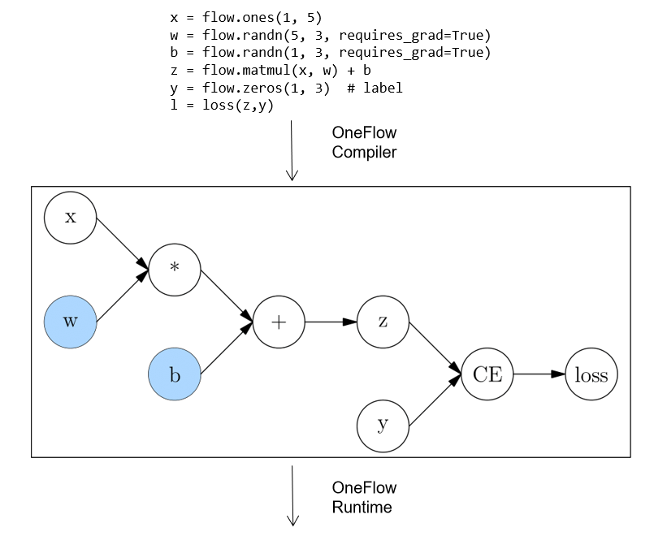

# 静态图模块 nn.Graph

目前，深度学习框架中模型的运行方式主要有两种，即 **动态图** 与 **静态图**，在 OneFlow 中，也被习惯称为 **Eager 模式** 和 **Graph 模式** 。

这两种方式各有优缺点，OneFlow 对两种方式均提供了支持，默认情况下是 Eager 模式。如果你是按顺序阅读本基础专题的教程，那么，到目前为止所接触的所有代码都是 Eager 模式的代码。

一般而言，动态图更易用，静态图性能更具优势。OneFlow 提供的 [nn.Graph](https://oneflow.readthedocs.io/en/master/graph.html) 模块，让用户可以用类似 Eager 的编程习惯，构建静态图并训练模型。

## OneFlow 的 Eager 模式

OneFlow 默认以 Eager 模式运行。

以下脚本，使用 CIFAR10 数据集训练 `mobilenet_v2` 模型。

??? code
    ```python
    import oneflow as flow
    import oneflow.nn as nn
    import flowvision
    import flowvision.transforms as transforms

    BATCH_SIZE=64
    EPOCH_NUM = 1

    DEVICE = "cuda" if flow.cuda.is_available() else "cpu"
    print("Using {} device".format(DEVICE))

    training_data = flowvision.datasets.CIFAR10(
        root="data",
        train=True,
        transform=transforms.ToTensor(),
        download=True,
    )

    train_dataloader = flow.utils.data.DataLoader(
        training_data, BATCH_SIZE, shuffle=True
    )

    model = flowvision.models.mobilenet_v2().to(DEVICE)
    model.classifer = nn.Sequential(nn.Dropout(0.2), nn.Linear(model.last_channel, 10))

    loss_fn = nn.CrossEntropyLoss().to(DEVICE)
    optimizer = flow.optim.SGD(model.parameters(), lr=1e-3)


    for t in range(EPOCH_NUM):
        print(f"Epoch {t+1}\n-------------------------------")
        size = len(train_dataloader.dataset)
        for batch, (x, y) in enumerate(train_dataloader):
            x = x.to(DEVICE)
            y = y.to(DEVICE)

            # Compute prediction error
            pred = model(x)
            loss = loss_fn(pred, y)

            # Backpropagation
            optimizer.zero_grad()
            loss.backward()
            optimizer.step()

            current = batch * BATCH_SIZE
            if batch % 5 == 0:
                print(f"loss: {loss:>7f}  [{current:>5d}/{size:>5d}]")
    ```

输出：

```text
loss: 6.921304  [    0/50000]
loss: 6.824391  [  320/50000]
loss: 6.688272  [  640/50000]
loss: 6.644351  [  960/50000]
...
```

## OneFlow 的 Graph 模式

### 自定义一个 Graph

OneFlow 提供了 [nn.Graph](https://oneflow.readthedocs.io/en/master/graph.html) 基类。用户可以通过继承它，自定义 Graph 类。

```python
import oneflow as flow
import oneflow.nn as nn

class ModuleMyLinear(nn.Module):
    def __init__(self, in_features, out_features):
        super().__init__()
        self.weight = nn.Parameter(flow.randn(in_features, out_features))
        self.bias = nn.Parameter(flow.randn(out_features))

    def forward(self, input):
        return flow.matmul(input, self.weight) + self.bias

model = ModuleMyLinear(4, 3)

class GraphMyLinear(nn.Graph):
  def __init__(self):
    super().__init__()
    self.model = model

  def build(self, input):
    return self.model(input)
```

以上简单的例子，包含了自定义 Graph 所需的重要步骤：

- 继承 `nn.Graph`
- 在 `__init__` 最开始调用 `super().__init__()`，让 OneFlow 完成 Graph 必要的初始化工作
- 在 `__init__` 中复用 Eager 模式下的 `nn.Module` 对象（`self.model = model`）
- 在 `build` 中描述计算过程

然后，就可以实例化并调用 Graph。

```python
graph_mylinear = GraphMyLinear()
input = flow.randn(1, 4)
out = graph_mylinear(input)
print(out)
```

输出：

```text
tensor([[-0.3298, -3.7907,  0.1661]], dtype=oneflow.float32)
```

注意，Graph 与 Module 类似，对象本身是可调用的，并且 **不推荐** 显式调用 `build` 方法。Graph 可以直接复用已经定义好的 Module。因此，用户可以直接参考 [搭建神经网络](./04_build_network.md) 中的内容搭建好神经网络，然后在 Graph 的 `__init__` 中将 Module 设置为 Graph 的成员即可。

比如，直接使用以上 Eager 模式示例的 `model`，作为网络结构：

```python
class ModelGraph(flow.nn.Graph):
    def __init__(self):
        super().__init__()
        self.model = model

    def build(self, x, y):
        y_pred = self.model(x)
        return loss

model_graph = ModelGraph()
```

与 Module 的显著区别在于，Graph 使用 `build` 而不是 `forward` 方法描述计算过程，这是因为 `build` 不仅可以包含前向计算，还可以设置 `loss`，优化器等，在下文会看到使用 Graph 做训练的实际例子。

### 使用 Graph 做预测

以下 Graph 做预测的例子，直接使用了本文开始 Eager 模式训练好的 module。

```python
class GraphMobileNetV2(flow.nn.Graph):
    def __init__(self):
        super().__init__()
        self.model = model

    def build(self, x):
        return self.model(x)


graph_mobile_net_v2 = GraphMobileNetV2()

x, _ = next(iter(train_dataloader))
x = x.to(DEVICE)
y_pred = graph_mobile_net_v2(x)
```

### 使用 Graph 做训练

可以直接使用 Graph 做训练。点击以下 “Code” 查看详细代码。

??? code
    ```python
    import oneflow as flow
    import oneflow.nn as nn
    import flowvision
    import flowvision.transforms as transforms

    BATCH_SIZE=64
    EPOCH_NUM = 1

    DEVICE = "cuda" if flow.cuda.is_available() else "cpu"
    print("Using {} device".format(DEVICE))

    training_data = flowvision.datasets.CIFAR10(
        root="data",
        train=True,
        transform=transforms.ToTensor(),
        download=True,
    )

    train_dataloader = flow.utils.data.DataLoader(
        training_data, BATCH_SIZE, shuffle=True
    )

    model = flowvision.models.mobilenet_v2().to(DEVICE)
    model.classifer = nn.Sequential(nn.Dropout(0.2), nn.Linear(model.last_channel, 10))

    loss_fn = nn.CrossEntropyLoss().to(DEVICE)
    optimizer = flow.optim.SGD(model.parameters(), lr=1e-3)

    class GraphMobileNetV2(flow.nn.Graph):
        def __init__(self):
            super().__init__()
            self.model = model
            self.loss_fn = loss_fn
            self.add_optimizer(optimizer)

        def build(self, x, y):
            y_pred = self.model(x)
            loss = self.loss_fn(y_pred, y)
            loss.backward()
            return loss


    graph_mobile_net_v2 = GraphMobileNetV2()
    # graph_mobile_net_v2.debug()

    for t in range(EPOCH_NUM):
        print(f"Epoch {t+1}\n-------------------------------")
        size = len(train_dataloader.dataset)
        for batch, (x, y) in enumerate(train_dataloader):
            x = x.to(DEVICE)
            y = y.to(DEVICE)
            loss = graph_mobile_net_v2(x, y)
            current = batch * BATCH_SIZE
            if batch % 5 == 0:
                print(f"loss: {loss:>7f}  [{current:>5d}/{size:>5d}]")
    ```

与 Graph 做预测的代码做比较，可以发现，只有以下几点是 Graph 做训练时特有的：

```python
# Optimizer
optimizer = flow.optim.SGD(model.parameters(), lr=1e-3) # (1)

# The MobileNetV2 Graph
class GraphMobileNetV2(flow.nn.Graph):
    def __init__(self):
        # ...
        self.add_optimizer(optimizer) # (2)

    def build(self, x, y):
        # ...
        loss.backward() # (3)
        # ...
```

1. 构造 optimizer 对象，这点和 [反向传播与 optimizer](./06_optimization.md#optimizer_1) 介绍的 Eager 模式的使用方法是完全一致的。
2. 在 Graph 类的 `__init__` 中，调用 `self.add_optimizer` 方法，将上一步构造的 optimizer 对象添加进 Graph 中。
3. 在 Graph 类的 `build` 中调用 `backward`，触发反向传播

### Graph 调试

当前输出 Graph 的调试信息共有两种方式。**第一种** 可以调用 `print` 打印 Graph 对象，输出 Graph 对象的信息。

```python
print(graph_mobile_net_v2)
```

根据 Graph 对象是否 **已经被调用过**，输出的效果略有不同：

如果 Graph 对象调用前 `print`，输出的是网络结构的信息。

以上 `graph_mobile_net_v2` 调用前 `print` 效果：

```text
(GRAPH:GraphMobileNetV2_0:GraphMobileNetV2): (
  (CONFIG:config:GraphConfig(training=True, ))
  (MODULE:model:MobileNetV2()): (
    (MODULE:model.features:Sequential()): (
      (MODULE:model.features.0:ConvBNActivation()): (
        (MODULE:model.features.0.0:Conv2d(3, 32, kernel_size=(3, 3), stride=(2, 2), padding=(1, 1), bias=False)): (
          (PARAMETER:model.features.0.0.weight:tensor(..., device='cuda:0', size=(32, 3, 3, 3), dtype=oneflow.float32,
                 requires_grad=True)): ()
        )
    ...
    (MODULE:model.classifer:Sequential()): (
      (MODULE:model.classifer.0:Dropout(p=0.2, inplace=False)): ()
      (MODULE:model.classifer.1:Linear(in_features=1280, out_features=10, bias=True)): (
        (PARAMETER:model.classifer.1.weight:tensor(..., size=(10, 1280), dtype=oneflow.float32, requires_grad=True)): ()
        (PARAMETER:model.classifer.1.bias:tensor(..., size=(10,), dtype=oneflow.float32, requires_grad=True)): ()
      )
    )
  )
  (MODULE:loss_fn:CrossEntropyLoss()): ()
)
```

在上面的调试信息中，表示基于 Sequential 模型，网络中自定义了 `ConvBNActivation` (对应 `MBConv` 模块)、卷积层(包括详细的 `channel`、`kernel_size` 和 `stride` 等参数信息)、`Dropout`  和全连接层等结构。

如果是 Graph 对象调用后 `print`，除了网络的结构信息外，还会打印输入输出张量的信息，有如下类似效果：

```text
(GRAPH:GraphMobileNetV2_0:GraphMobileNetV2): (
  (CONFIG:config:GraphConfig(training=True, ))
  (INPUT:_GraphMobileNetV2_0-input_0:tensor(..., device='cuda:0', size=(64, 3, 32, 32), dtype=oneflow.float32))
  (INPUT:_GraphMobileNetV2_0-input_1:tensor(..., device='cuda:0', size=(64,), dtype=oneflow.int64))
  (MODULE:model:MobileNetV2()): (
    (INPUT:_model-input_0:tensor(..., device='cuda:0', is_lazy='True', size=(64, 3, 32, 32),
           dtype=oneflow.float32))
    (MODULE:model.features:Sequential()): (
      (INPUT:_model.features-input_0:tensor(..., device='cuda:0', is_lazy='True', size=(64, 3, 32, 32),
             dtype=oneflow.float32))
      (MODULE:model.features.0:ConvBNActivation()): (
        (INPUT:_model.features.0-input_0:tensor(..., device='cuda:0', is_lazy='True', size=(64, 3, 32, 32),
               dtype=oneflow.float32))
        (MODULE:model.features.0.0:Conv2d(3, 32, kernel_size=(3, 3), stride=(2, 2), padding=(1, 1), bias=False)): (
          (INPUT:_model.features.0.0-input_0:tensor(..., device='cuda:0', is_lazy='True', size=(64, 3, 32, 32),
                 dtype=oneflow.float32))
          (PARAMETER:model.features.0.0.weight:tensor(..., device='cuda:0', size=(32, 3, 3, 3), dtype=oneflow.float32,
                 requires_grad=True)): ()
          (OUTPUT:_model.features.0.0-output_0:tensor(..., device='cuda:0', is_lazy='True', size=(64, 32, 16, 16),
                 dtype=oneflow.float32))
        )
    ...
```

**第二种** 方式是调用 Graph 对象的 [debug](https://start.oneflow.org/oneflow-api-cn/graph.html#oneflow.nn.Graph.debug) 方法，就开启了 Graph 的调试模式。

```python
graph_mobile_net_v2.debug(v_level=1) # v_level 参数默认值为 0
```

可以简写为：

```python
graph_mobile_net_v2.debug(1)
```

OneFlow 在编译生成计算图的过程中会打印调试信息，比如，将上面例子代码中 `graph_mobile_net_v2.debug()` 的注释去掉，将在控制台上输出如下输出：

```text
(GRAPH:GraphMobileNetV2_0:GraphMobileNetV2) end building graph.
(GRAPH:GraphMobileNetV2_0:GraphMobileNetV2) start compiling plan and init graph runtime.
(GRAPH:GraphMobileNetV2_0:GraphMobileNetV2) end compiling plan and init graph rumtime.
```

使用 `debug` 的好处在于，调试信息是 **边构图、边输出** 的，这样如果构图过程中发生错误，容易发现构图时的问题。

当前可以使用 `v_level` 选择详细调试信息级别，默认级别为 0，最大级别为 3。

- `v_level=0` 时，只输出最基础的警告和构图阶段信息，如构图时间。
- `v_level=1` 时，将额外打印每个 `nn.Module` 的构图信息，具体内容在下面的表格中介绍。
- `v_level=2` 时，在构图阶段，将额外打印每个 Op 的创建信息，包括名称、输入内容、设备和 SBP 信息等。
- `v_level=3` 时，将额外打印每个 Op 更详细的信息，如与代码位置有关的信息，方便定位代码问题。

此外，为了开发者对 Graph 对象下的类型有更清晰的认知，下面对 `debug` 输出的内容进行分析，基本包括 `GRAPH`、`CONFIG`、`MODULE`、`PARAMETER`、`BUFFER`、`INPUT` 和 `OUTPUT` 七个类别的标签。

|      Name      |                             Info                             |                           Example                            |
| :------------: | :----------------------------------------------------------: | :----------------------------------------------------------: |
|     GRAPH      |    用户所定义的 Graph 信息，依次是类型：名字：构造方法。     |        `(GRAPH:GraphMobileNetV2_0:GraphMobileNetV2)`         |
|     CONFIG     | Graph 的配置信息。如是否处于训练模式，`training=True` 表示 Graph 处于训练模式，如果在 Graph 的预测模式，则对应 `training=False`。 |        `(CONFIG:config:GraphConfig(training=True, )`         |
|     MODULE     | 对应 `nn.Module` ，MODULE 可以在 Graph 标签下层，同时，多个 MODULE 之间也存在层级关系。 | `(MODULE:model:MobileNetV2())`，其中，`MobileNetV2` 为用户复用 Eager 模式下的 Module 类名。 |
|   PARAMETER    | 给出了更清晰的 weight 和 bias 信息。此外，在构图时，tensor 的数据内容不太重要，所以只展示了 tensor 的元信息，这些信息对构建网络更为重要。 | `(PARAMETER:model.features.0.1.weight:tensor(..., device='cuda:0', size=(32,), dtype=oneflow.float32, requires_grad=True))` |
|     BUFFER     |                在训练时产生的统计特性等内容，如 running_mean 和   running_var。                | `(BUFFER:model.features.0.1.running_mean:tensor(..., device='cuda:0', size=(32,), dtype=oneflow.float32))` |
| INPUT & OUPTUT |                   表示输入输出的张量信息。                   | `(INPUT:_model_input.0.0_2:tensor(..., device='cuda:0', is_lazy='True', size=(16, 3, 32, 32), dtype=oneflow.float32))` |

除了以上介绍的方法外，训练过程中获取参数的梯度、获取 learning rate 等功能，也正在开发中，即将上线。


### Graph 的保存与加载

Graph 复用了 Module 的网络参数，因此 Graph 没有自己的 `save` 与 `load` 接口，直接使用 Module 的接口即可。可以参考 [模型的保存与加载](./07_model_load_save.md) 即可。

如以上的 `graph_mobile_net_v2`，若想保存它的训练结果，其实应该保存它其中的 Module（即之前 `model = flowvision.models.mobilenet_v2().to(DEVICE)` 得到的 `model`。

```python
flow.save(model.state_dict(), "./graph_model")
```

!!! Note
    **不能** 用以下方式保存。因为 Graph 在初始化时，会对成员做处理，所以 `graph_mobile_net_v2.model` 其实已经不再是 Module 类型：

    ```python
    flow.save(graph_mobile_net_v2.model.state_dict(), "./graph_model")  # 会报错
    ```

加载之前保存好的模型，也是 Module 的工作：

```python
model = flowvision.models.mobilenet_v2().to(DEVICE)
model.classifer = nn.Sequential(nn.Dropout(0.2), nn.Linear(model.last_channel, 10))
model.load_state_dict(flow.load("./graph_model")) # 加载保存好的模型
# ...
```

## 扩展阅读：动态图与静态图

用户定义的神经网络，都会被深度学习框架转为计算图，如 [自动求梯度](./05_autograd.md) 中的例子：

```python
def loss(y_pred, y):
    return flow.sum(1/2*(y_pred-y)**2)

x = flow.ones(1, 5)  # 输入
w = flow.randn(5, 3, requires_grad=True)
b = flow.randn(1, 3, requires_grad=True)
z = flow.matmul(x, w) + b

y = flow.zeros(1, 3)  # label
l = loss(z,y)
```

对应的计算图为：


**动态图（Dynamic Graph）**

动态图的特点在于，它是一边执行代码，一边完成计算图的构建的。
以上代码和构图关系可看下图（注意：下图对简单的语句做了合并）


因为动态图是一边执行一边构图，所以很灵活，可以随时修改图的结构，运行一行代码就能得到一行的结果，易于调试。但是因为深度学习框架无法获取完整的图信息（随时可以改变、永远不能认为构图已经完成），因此无法进行充分的全局优化，在性能上会相对欠缺。

**静态图（Static Graph）**

与动态图不同，静态图先定义完整的计算图。即需要用户先声明所有计算节点后，框架才开始进行计算。这可以理解为在用户代码与最终运行的计算图之间，框架起到了编译器的作用。



以 OneFlow 框架为例，用户的代码会被先转换为完整的计算图，然后再由 OneFlow Runtime 模块运行。

静态图这种先获取完整网络，再编译运行的方式，使得它可以做很多动态图做不到的优化，因此性能上更有优势。并且编译完成后的计算图，也更容易跨平台部署。

不过，在静态图中真正的计算发生时，已经与用户的代码没有直接关系了，因此静态图的调试较不方便。

两种方式对比总结如下：

|              | 动态图 | 静态图   |
| ------------ | ------------------------------------- | ------------------------ |
| 计算方式 | Eager 模式                             | Graph 模式                 |
| 优点     | 代码编写灵活，易于调试                | 性能好，易于优化和部署   |
| 缺点     | 性能及可移植性差                      | 不易调试                 |

OneFlow 提供的 Eager 模式，与 PyTorch 对齐，让熟悉 PyTorch 的用户可以零成本直接上手。
OneFlow 提供的 Graph 模式，也基于面向对象的编程风格，让熟悉 Eager 开发的用户，只需要改很少量的代码，就可以使用高效率的静态图。

## 相关链接

OneFlow Eager模式下的神经网络搭建：[搭建神经网络](./04_build_network.md)
