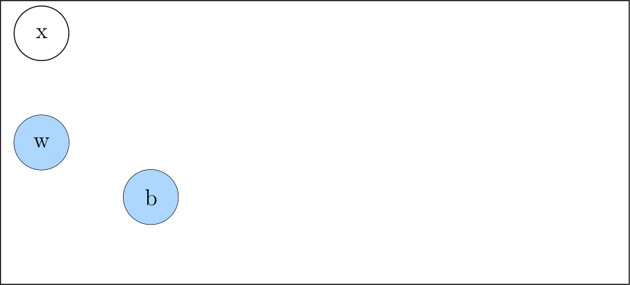
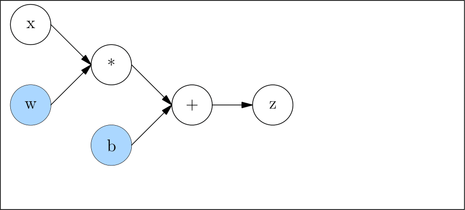

# 静态图模块 nn.Graph

目前，深度学习框架中模型的运行方式主要有两种，即 **动态图** 与 **静态图**，在 OneFlow 中，也被习惯称为 **Eager 模式** 和 **Graph 模式** 。

这两种方式各有优缺点，OneFlow 对两种方式均提供了支持，默认情况下是 Eager 模式。如果你是按顺序阅读本基础专题的教程，那么，到目前为所接触的所有代码都是 Eager 模式的代码。

一般而言，动态图更易用，静态图性能更具优势。OneFlow 提供的 [nn.Graph](todo_rst_nngraph.md) 模块，让用户可以用类似 Eager 的编程习惯，构建静态图并训练模型。

本文包括：

- 动态图与静态图的基本介绍
- `nn.Graph` 模块接口介绍
- Eager 转 Graph 实例


## 动态图 VS 静态图

我们已经知道，用户定义的神经网络，都会被深度学习框架转为计算图，如 [自动求梯度](./05_autograd.md) 中的例子：

```python
def loss(y_pred, y):
    return flow.sum(1/2*(y_pred-y)**2)

x = flow.ones(1, 5)  # 输入
w = flow.randn(5, 3, requires_grad=True)
b = flow.randn(1, 3, requires_grad=True)
z = flow.matmul(x, w) + b

y = flow.zeros(1, 3)  # label
l = loss(z,y)
```

对应的计算图为：


**动态图（Dynamic Graph）**

动态图的特点在于，它是一边运行，一边完成计算图的构建的。
还是以我们的以上代码为例，当我们运行完

```python
x = flow.ones(1, 5)  # 输入
w = flow.randn(5, 3, requires_grad=True)
b = flow.randn(1, 3, requires_grad=True)
```

这几个语句后，动态图构建为：



当继续执行

```python
z = flow.matmul(x, w) + b
```

动态图构建为：



当执行完：

```python
y = flow.zeros(1, 3)  # label
l = loss(z,y)
```

动态图为：


因为动态图是一边执行一边构图，所以很灵活，可以随时修改图的结构，运行一行代码就能得到一行的结果，易于调试。但是因为深度学习框架无法获取完整的图信息（随时可以改变、永远不能认为构图已经完成），因此无法进行充分的全局优化，在性能上会相对欠缺。

  

**静态图（Static Graph）**

- 与动态图不同，静态图先定义完整的计算图（即声明所有计算节点），然后再统一执行计算赋值，因此也被称为*Lazy模式/声明式编程 (Declarative)*。
- 以静态图方式运行的模型：一次构建，可多次使用，并且可以进行图级别的计算性能优化，因此在性能和移植部署方面具有一定优势，但缺点是不容易调试。


两种方式对比总结如下：

|              | 动态图：边定义边运行（Define-by-Run） | 静态图：先定义后运行     |
| ------------ | ------------------------------------- | ------------------------ |
| **计算方式** | Eager 模式                             | Lazy 模式                 |
| **编程范式** | 命令式编程 (Imperative)               | 声明式编程 (Declarative) |
| **优点**     | 代码编写灵活，易于调试                | 性能好，易于优化和部署   |
| **缺点**     | 性能及可移植性差                      | 不易调试                 |


## OneFlow 的 Eager 模式

OneFlow默认以 Eager 模式运行，在[搭建神经网络](./04_build_network.md)的教程中，使用 [nn](https://oneflow.readthedocs.io/en/master/nn.html) 名称空间下的 API 搭建的网络，若不做特殊处理，均默认以 Eager 模式运行。


### 多项式拟合例子（Eager版）

> 注：该例子代码改编自[PyTorch官网教程](https://pytorch.org/tutorials/beginner/pytorch_with_examples.html#nn-module)。为了降低用户的学习成本，OneFlow Eager 模式下的API接口（如 [nn.Conv2d](https://oneflow.readthedocs.io/en/master/nn.html?highlight=oneflow.nn.Conv2D#oneflow.nn.Conv2d)， [nn.Module](https://oneflow.readthedocs.io/en/master/module.html#oneflow.nn.Module)等）基本上做到了与PyTorch一致，通过该例子可以看到，将PyTorch版本的模型代码转换为 OneFlow 版本，需要改动的地方非常少。


**问题描述：**

用多项式`y=a+bx+cx^2+dx^3`拟合正弦函数`y=sinx`，求出一组近似拟合参数`a,b,c,d`。


**解决方法：**

构建一个线性模型，使用神经网络的梯度下降法，迭代求解出似拟合参数`a,b,c,d`。


**OneFlow代码：**

```python
import math
import numpy as np
import oneflow as flow

device = flow.device("cuda")
dtype = flow.float32

# Create Tensors to hold input and outputs.
x = flow.tensor(np.linspace(-math.pi, math.pi, 2000), device=device, dtype=dtype)
y = flow.tensor(np.sin(x), device=device, dtype=dtype)

# For this example, the output y is a linear function of (x, x^2, x^3), so
# we can consider it as a linear layer neural network. Let's prepare the
# tensor (x, x^2, x^3).
xx = flow.cat(
    [x.unsqueeze(-1).pow(1), x.unsqueeze(-1).pow(2), x.unsqueeze(-1).pow(3)], dim=1
)
# The Linear Module
model = flow.nn.Sequential(flow.nn.Linear(3, 1), flow.nn.Flatten(0, 1))
model.to(device)

# Loss Function
loss_fn = flow.nn.MSELoss(reduction="sum")
loss_fn.to(device)

# Optimizer
optimizer = flow.optim.SGD(model.parameters(), lr=1e-6)

for t in range(2000):
    # Forward pass: compute predicted y by passing x to the model.
    y_pred = model(xx)

    # Compute and print loss.
    loss = loss_fn(y_pred, y)
    if t % 100 == 99:
        print(t, loss.numpy())

    # Use the optimizer object to zero all of the gradients for the variables
    # it will update (which are the learnable weights of the model).
    optimizer.zero_grad()

    # Backward pass: compute gradient of the loss with respect to model
    # parameters.
    loss.backward()

    # Calling the step function on an Optimizer makes an update to its
    # parameters.
    optimizer.step()

linear_layer = model[0]

print(
    f"Result: y = {linear_layer.bias.numpy()[0]} + {linear_layer.weight[:, 0].numpy()[0]}*x + {linear_layer.weight[:, 1].numpy()[0]}*x^2 + {linear_layer.weight[:, 2].numpy()[0]}*x^3"
)
```

输出：

```text
99 582.7045
...
1799 9.326502
1899 9.154123
1999 9.040091
Result: y = -0.0013652867637574673 + 0.8422811627388*x + 0.0002355352626182139*x^2 + -0.09127362817525864*x^3
```

```python
import matplotlib.pyplot as plt
w = linear_layer.weight.numpy()[0]
b = linear_layer.bias.numpy()[0]
y_fit = b + w[0]*x + w[1]*x**2 + w[2]*x**3
plt.plot(x.numpy(),y.numpy())
plt.plot(x.numpy(),y_fit.numpy())
```


## OneFlow的Graph模式

### `nn.Graph`

在OneFlow中，通过构建一个`nn.Graph`的子类，并将`nn.Module`构建的模型、损失函数、优化器等相关内容注册到该类中，可以得到 Graph 模式运行的模型。


我们在该类的`__init__()`方法中，进行模型构建和配置，在`build()`方法中，显示指定模型的前向和后向过程（梯度更新将隐式地自动完成）。该类的实例在每次调用时，会自动执行`build()`方法，完成一次模型迭代。


### 多项式拟合例子（Graph版）

将上述多项式拟合例子从Eager模式转换为为Graph模式，需要通过继承`nn.Graph`类构建一个`LinearTrainGraph`类，具体代码如下：

```python
import math
import numpy as np
import oneflow as flow

device = flow.device("cuda")
dtype = flow.float32

# Create Tensors to hold input and outputs.
x = flow.tensor(np.linspace(-math.pi, math.pi, 2000),
                device=device, dtype=dtype)
y = flow.tensor(np.sin(x), device=device, dtype=dtype)

# For this example, the output y is a linear function of (x, x^2, x^3), so
# we can consider it as a linear layer neural network. Let's prepare the
# tensor (x, x^2, x^3).
xx = flow.cat(
    [x.unsqueeze(-1).pow(1), x.unsqueeze(-1).pow(2), x.unsqueeze(-1).pow(3)], dim=1
)

# The Linear Module
model = flow.nn.Sequential(
    flow.nn.Linear(3, 1),
    flow.nn.Flatten(0, 1)
)
model.to(device)

# Loss Function
loss_fn = flow.nn.MSELoss(reduction='sum')
loss_fn.to(device)

# Optimizer
optimizer = flow.optim.SGD(model.parameters(), lr=1e-6)


# The Linear Train Graph
class LinearTrainGraph(flow.nn.Graph):
    def __init__(self):
        super().__init__()
        self.model = model
        self.loss_fn = loss_fn
        self.add_optimizer(optimizer)

    def build(self, x, y):
        y_pred = self.model(x)
        loss = self.loss_fn(y_pred, y)
        loss.backward()
        return loss


linear_graph = LinearTrainGraph()

for t in range(2000):
    # Print loss.
    loss = linear_graph(xx, y)
    if t % 100 == 99:
        print(t, loss.numpy())


linear_layer = model[0]
print(
    f'Result: y = {linear_layer.bias.numpy()} + {linear_layer.weight[:, 0].numpy()} x + {linear_layer.weight[:, 1].numpy()} x^2 + {linear_layer.weight[:, 2].numpy()} x^3')
```


### Graph 模式下的调试工具

调用为 Graph 对象的 `debug` 方法，可以

```
linear_graph = LinearTrainGraph()
linear_graph.debug()
```

OneFlow 在编译生成计算图的过程中会打印调试信息：

```text
Note that nn.Graph.debug() only print debug info on rank 0.
(GRAPH:LinearTrainGraph_0:LinearTrainGraph) start building forward graph.
(INPUT:_LinearTrainGraph_0-input_0:tensor(..., device='cuda:0', size=(20, 3), dtype=oneflow.float32))
(INPUT:_LinearTrainGraph_0-input_1:tensor(..., device='cuda:0', size=(20,), dtype=oneflow.float32))
(MODULE:model:Sequential())
(INPUT:_model-input_0:tensor(..., device='cuda:0', is_lazy='True', size=(20, 3),
       dtype=oneflow.float32))
(MODULE:model.0:Linear(in_features=3, out_features=1, bias=True))
(INPUT:_model.0-input_0:tensor(..., device='cuda:0', is_lazy='True', size=(20, 3),
       dtype=oneflow.float32))
(PARAMETER:model.0.weight:tensor(..., device='cuda:0', size=(1, 3), dtype=oneflow.float32,
       requires_grad=True))
(PARAMETER:model.0.bias:tensor(..., device='cuda:0', size=(1,), dtype=oneflow.float32,
       requires_grad=True))
(OUTPUT:_model.0-output_0:tensor(..., device='cuda:0', is_lazy='True', size=(20, 1),
       dtype=oneflow.float32))
(MODULE:model.1:Flatten(start_dim=0, end_dim=1))
(INPUT:_model.1-input_0:tensor(..., device='cuda:0', is_lazy='True', size=(20, 1),
       dtype=oneflow.float32))
(OUTPUT:_model.1-output_0:tensor(..., device='cuda:0', is_lazy='True', size=(20,), dtype=oneflow.float32))
(OUTPUT:_model-output_0:tensor(..., device='cuda:0', is_lazy='True', size=(20,), dtype=oneflow.float32))
(MODULE:loss_fn:MSELoss())
(INPUT:_loss_fn-input_0:tensor(..., device='cuda:0', is_lazy='True', size=(20,), dtype=oneflow.float32))
(INPUT:_loss_fn-input_1:tensor(..., device='cuda:0', is_lazy='True', size=(20,), dtype=oneflow.float32))
(OUTPUT:_loss_fn-output_0:tensor(..., device='cuda:0', is_lazy='True', size=(), dtype=oneflow.float32))
(OUTPUT:_LinearTrainGraph_0-output_0:tensor(..., device='cuda:0', is_lazy='True', size=(), dtype=oneflow.float32))
(GRAPH:LinearTrainGraph_0:LinearTrainGraph) end building forward graph.
(GRAPH:LinearTrainGraph_0:LinearTrainGraph) start compiling and init graph runtime.
(GRAPH:LinearTrainGraph_0:LinearTrainGraph) end compiling and init graph rumtime.
```

输出中将显示包括计算图中各层的名称、输入输出张量的信息，包括形状、设备信息、数据类型等。


## 相关链接

OneFlow Eager模式下的神经网络搭建：[搭建神经网络](./basics/04_build_network.md)

PyTorch版本的多项式拟合实例代码：[PyTorch: nn](https://pytorch.org/tutorials/beginner/pytorch_with_examples.html#id19)


