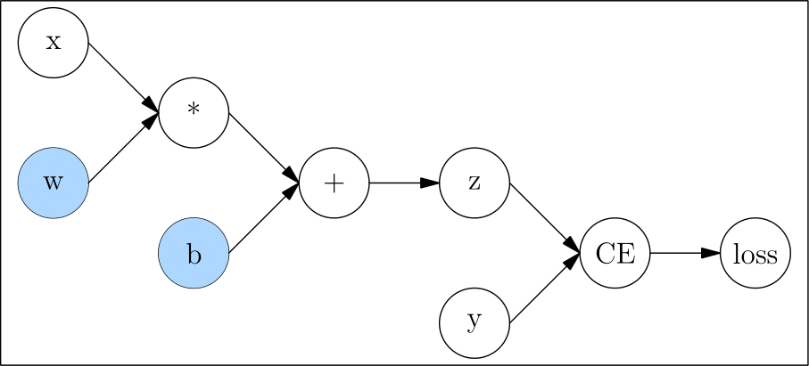

# 静态图模块 nn.Graph

目前，深度学习框架中模型的运行方式主要有两种，即 **动态图** 与 **静态图**，在 OneFlow 中，也被习惯称为 **Eager 模式** 和 **Graph 模式** 。

这两种方式各有优缺点，OneFlow 对两种方式均提供了支持，默认情况下是 Eager 模式。如果你是按顺序阅读本基础专题的教程，那么，到目前为止所接触的所有代码都是 Eager 模式的代码。

一般而言，动态图更易用，静态图性能更具优势。OneFlow 提供的 [nn.Graph](https://oneflow.readthedocs.io/en/master/graph.html) 模块，让用户可以用类似 Eager 的编程习惯，构建静态图并训练模型。


## OneFlow 的 Eager 模式

OneFlow 默认以 Eager 模式运行。

以下脚本，用多项式 $y=a+bx+cx^2+dx^3$ 拟合正弦函数 $y=sin(x)$，求出一组近似拟合参数 $a$, $b$, $c$, $d$。

引入这个例子是为了展示 OneFlow 中 Eager 与 Graph 的关联（大部分代码可以复用）。相信读者对 OneFlow 的 Eager 模式已经很熟悉了，在此我们不再详细解释，感兴趣的读者可以点击 “Code” 展开代码。


> 注：该例子代码改编自 [PyTorch 官网教程](https://pytorch.org/tutorials/beginner/pytorch_with_examples.html#nn-module)。

??? code
    ```python
    import math
    import numpy as np
    import oneflow as flow

    device = flow.device("cuda")
    dtype = flow.float32

    # Create Tensors to hold input and outputs.
    x = flow.tensor(np.linspace(-math.pi, math.pi, 2000), device=device, dtype=dtype)
    y = flow.tensor(np.sin(x), device=device, dtype=dtype)

    # For this example, the output y is a linear function of (x, x^2, x^3), so
    # we can consider it as a linear layer neural network. Let's prepare the
    # tensor (x, x^2, x^3).
    xx = flow.cat(
        [x.unsqueeze(-1).pow(1), x.unsqueeze(-1).pow(2), x.unsqueeze(-1).pow(3)], dim=1
    )
    # The Linear Module
    model = flow.nn.Sequential(flow.nn.Linear(3, 1), flow.nn.Flatten(0, 1))
    model.to(device)

    # Loss Function
    loss_fn = flow.nn.MSELoss(reduction="sum")
    loss_fn.to(device)

    # Optimizer
    optimizer = flow.optim.SGD(model.parameters(), lr=1e-6)

    for t in range(2000):
        # Forward pass: compute predicted y by passing x to the model.
        y_pred = model(xx)

        # Compute and print loss.
        loss = loss_fn(y_pred, y)
        if t % 100 == 99:
            print(t, loss.numpy())

        # Use the optimizer object to zero all of the gradients for the variables
        # it will update (which are the learnable weights of the model).
        optimizer.zero_grad()

        # Backward pass: compute gradient of the loss with respect to model
        # parameters.
        loss.backward()

        # Calling the step function on an Optimizer makes an update to its
        # parameters.
        optimizer.step()

    linear_layer = model[0]

    print(
        f"Result: y = {linear_layer.bias.numpy()[0]} + {linear_layer.weight[:, 0].numpy()[0]}*x + {linear_layer.weight[:, 1].numpy()[0]}*x^2 + {linear_layer.weight[:, 2].numpy()[0]}*x^3"
    )
    ```

输出：

```text
99 582.7045
...
1799 9.326502
1899 9.154123
1999 9.040091
Result: y = -0.0013652867637574673 + 0.8422811627388*x + 0.0002355352626182139*x^2 + -0.09127362817525864*x^3
```

## OneFlow 的 Graph 模式

### 自定义一个 Graph

OneFlow 提供了 [nn.Graph](https://oneflow.readthedocs.io/en/master/graph.html) 基类。用户可以通过继承它，自定义 Graph 类。

```python
import oneflow as flow
import oneflow.nn as nn

class MyLinear(nn.Graph):
  def __init__(self, in_features, out_features):
    super().__init__()
    self.weight = nn.Parameter(flow.randn(in_features, out_features))
    self.bias = nn.Parameter(flow.randn(out_features))

  def build(self, input):
    return flow.matmul(input, self.weight) + self.bias
```

以上简单的例子，包含了自定义 Graph 所需的重要步骤：

- 继承 `nn.Graph`
- 在 `__init__` 最开始调用 `super().__init__()`，让 OneFlow 完成 Graph 必要的初始化工作
- 在 `__init__` 中定义神经网络的结构和状态
- 在 `build` 中描述计算过程

然后，就可以实例化并调用 Graph。

```python
mygraph = MyLinear(4, 3)
input = flow.randn(1, 4)
out = mygraph(input)
print(out)
```

输出：

```text
tensor([[ 4.0638, -1.4453,  3.9640]], dtype=oneflow.float32)
```

注意，Graph 与 Module 类似，对象本身是可调用的，并且 **不推荐** 显式调用 `build` 方法。Graph 的定义与使用与 Module 非常类似，实际上，Graph 可以直接复用已经定义好的 Module。因此，用户可以直接参考 [搭建神经网络](./04_build_network.md) 中的内容在 Graph 模式下搭建神经网络。

比如，直接使用以上 Eager 模式示例的 `model`，作为网络结构：

```python
class ModelGraph(flow.nn.Graph):
    def __init__(self):
        super().__init__()
        self.model = model

    def build(self, x, y):
        y_pred = self.model(x)
        return loss

model_graph = ModelGraph()
```

与 Module 的显著区别在于，Graph 使用 `build` 而不是 `forward` 方法描述计算过程，这是因为 `build` 不仅可以包含前向计算，还可以设置 `loss`，优化器等，在下文会看到使用 Graph 做训练的实际例子。


### 使用 Graph 做预测
以下 Graph 做预测的例子，直接使用了本文开始 Eager 模式训练好的 module。

```python
class LinearPredictGraph(flow.nn.Graph):
    def __init__(self):
        super().__init__()
        self.model = model

    def build(self, x):
        return self.model(x)


linear_graph = LinearPredictGraph()
y_fit = linear_graph(xx)
```

绘制原函数曲线与拟合效果的对比图

```python
import matplotlib.pyplot as plt
plt.plot(x.numpy(),y.numpy())
plt.plot(x.numpy(),y_fit.numpy())
```


### 使用 Graph 做训练

可以直接使用 Graph 做训练。在控制台运行以下命令，体验 Graph 做训练。

```shell
wget https://docs.oneflow.org/master/code/basics/fit_graph_mode.py
python3 ./fit_graph_mode.py
```

点击以下 “Code” 查看详细代码。

??? code
    ```python
    import math
    import numpy as np
    import oneflow as flow

    device = flow.device("cuda")
    dtype = flow.float32

    # Create Tensors to hold input and outputs.
    x = flow.tensor(np.linspace(-math.pi, math.pi, 2000), device=device, dtype=dtype)
    y = flow.tensor(np.sin(x), device=device, dtype=dtype)

    # For this example, the output y is a linear function of (x, x^2, x^3), so
    # we can consider it as a linear layer neural network. Let's prepare the
    # tensor (x, x^2, x^3).
    xx = flow.cat(
        [x.unsqueeze(-1).pow(1), x.unsqueeze(-1).pow(2), x.unsqueeze(-1).pow(3)], dim=1
    )

    # The Linear Module
    model = flow.nn.Sequential(flow.nn.Linear(3, 1), flow.nn.Flatten(0, 1))
    model.to(device)

    # Loss Function
    loss_fn = flow.nn.MSELoss(reduction="sum")
    loss_fn.to(device)

    # Optimizer
    optimizer = flow.optim.SGD(model.parameters(), lr=1e-6)


    # The Linear Train Graph
    class LinearTrainGraph(flow.nn.Graph):
        def __init__(self):
            super().__init__()
            self.model = model
            self.loss_fn = loss_fn
            self.add_optimizer(optimizer)

        def build(self, x, y):
            y_pred = self.model(x)
            loss = self.loss_fn(y_pred, y)
            loss.backward()
            return loss


    linear_graph = LinearTrainGraph()
    # linear_graph.debug()

    for t in range(2000):
        # Print loss.
        loss = linear_graph(xx, y)
        if t % 100 == 99:
            print(t, loss.numpy())


    linear_layer = model[0]
    print(
        f"Result: y = {linear_layer.bias.numpy()} + {linear_layer.weight[:, 0].numpy()} x + {linear_layer.weight[:, 1].numpy()} x^2 + {linear_layer.weight[:, 2].numpy()} x^3"
    )
    ```

与 Graph 做预测的代码做比较，可以发现，只有以下几点是 Graph 做训练时特有的：

```python
# Optimizer
optimizer = flow.optim.SGD(model.parameters(), lr=1e-6) # (1)

# The Linear Train Graph
class LinearTrainGraph(flow.nn.Graph):
    def __init__(self):
        #...
        self.add_optimizer(optimizer) # (2)

    def build(self, x, y):
        #...
        loss.backward() (3)
        #...
```

1. 构造 optimizer 对象，这点和 [反向传播与 optimizer](./06_optimization.md#optimizer_1) 介绍的 Eager 模式的使用方法是完全一致的。
2. 在 Graph 类的 `__init__` 中，调用 `self.add_optimizer` 方法，将上一步构造的 optimizer 对象添加进 Graph 中。
3. 在 Graph 类的 `build` 中调用 `backward`，触发反向传播


### Graph 调试

可以调用 `print` 输出 Graph 对象的信息。

```python
print(linear_graph)
```

根据 Graph 对象是否调用，输出的效果略有不同：

如果 Graph 对象调用前 `print`，输出的是网络结构的信息。

以上 `linear_graph` 调用前 `print` 效果：

```text
(GRAPH:LinearTrainGraph_0:LinearTrainGraph): (
  (MODULE:model:Sequential()): (
    (MODULE:model.0:Linear(in_features=3, out_features=1, bias=True)): (
      (PARAMETER:model.0.weight:tensor(..., device='cuda:0', size=(1, 3), dtype=oneflow.float32,
             requires_grad=True)): ()
      (PARAMETER:model.0.bias:tensor(..., device='cuda:0', size=(1,), dtype=oneflow.float32,
             requires_grad=True)): ()
    )
    (MODULE:model.1:Flatten(start_dim=0, end_dim=1)): ()
  )
  (MODULE:loss_fn:MSELoss()): ()
)
```

如果是 Graph 对象调用后 `print`，除了网络的结构信息外，还会打印输入输出张量的信息，又如下类似效果：

```text
(GRAPH:LinearTrainGraph_0:LinearTrainGraph): (
  (INPUT:_LinearTrainGraph_0-input_0:tensor(..., device='cuda:0', size=(2000, 3), dtype=oneflow.float32))
  (INPUT:_LinearTrainGraph_0-input_1:tensor(..., device='cuda:0', size=(2000,), dtype=oneflow.float32))
  (MODULE:model:Sequential()): (
    (INPUT:_model-input_0:tensor(..., device='cuda:0', is_lazy='True', size=(2000, 3),
           dtype=oneflow.float32))
    (MODULE:model.0:Linear(in_features=3, out_features=1, bias=True)): (
      (INPUT:_model.0-input_0:tensor(..., device='cuda:0', is_lazy='True', size=(2000, 3),
             dtype=oneflow.float32))
      (PARAMETER:model.0.weight:tensor(..., device='cuda:0', size=(1, 3), dtype=oneflow.float32,
             requires_grad=True)): ()
      (PARAMETER:model.0.bias:tensor(..., device='cuda:0', size=(1,), dtype=oneflow.float32,
             requires_grad=True)): ()
      (OUTPUT:_model.0-output_0:tensor(..., device='cuda:0', is_lazy='True', size=(2000, 1),
             dtype=oneflow.float32))
    )
    (MODULE:model.1:Flatten(start_dim=0, end_dim=1)): (
      (INPUT:_model.1-input_0:tensor(..., device='cuda:0', is_lazy='True', size=(2000, 1),
             dtype=oneflow.float32))
      (OUTPUT:_model.1-output_0:tensor(..., device='cuda:0', is_lazy='True', size=(2000,),
             dtype=oneflow.float32))
    )
    (OUTPUT:_model-output_0:tensor(..., device='cuda:0', is_lazy='True', size=(2000,),
           dtype=oneflow.float32))
  )
  (MODULE:loss_fn:MSELoss()): (
    (INPUT:_loss_fn-input_0:tensor(..., device='cuda:0', is_lazy='True', size=(2000,),
           dtype=oneflow.float32))
    (INPUT:_loss_fn-input_1:tensor(..., device='cuda:0', is_lazy='True', size=(2000,),
           dtype=oneflow.float32))
    (OUTPUT:_loss_fn-output_0:tensor(..., device='cuda:0', is_lazy='True', size=(), dtype=oneflow.float32))
  )
  (OUTPUT:_LinearTrainGraph_0-output_0:tensor(..., device='cuda:0', is_lazy='True', size=(), dtype=oneflow.float32))
)
```

此外，调用 Graph 对象的 `debug` 方法，就开启了 Graph 的调试模式。

OneFlow 在编译生成计算图的过程中会打印调试信息，比如，将上面例子代码中`linear_graph.debug()`的注释去掉，将在控制台上输出如下输出：

```text
Note that nn.Graph.debug() only print debug info on rank 0.
(GRAPH:LinearTrainGraph_0:LinearTrainGraph) start building forward graph.
(INPUT:_LinearTrainGraph_0-input_0:tensor(..., device='cuda:0', size=(20, 3), dtype=oneflow.float32))
(INPUT:_LinearTrainGraph_0-input_1:tensor(..., device='cuda:0', size=(20,), dtype=oneflow.float32))
(MODULE:model:Sequential())
(INPUT:_model-input_0:tensor(..., device='cuda:0', is_lazy='True', size=(20, 3),
       dtype=oneflow.float32))
(MODULE:model.0:Linear(in_features=3, out_features=1, bias=True))
(INPUT:_model.0-input_0:tensor(..., device='cuda:0', is_lazy='True', size=(20, 3),
       dtype=oneflow.float32))
(PARAMETER:model.0.weight:tensor(..., device='cuda:0', size=(1, 3), dtype=oneflow.float32,
       requires_grad=True))
(PARAMETER:model.0.bias:tensor(..., device='cuda:0', size=(1,), dtype=oneflow.float32,
       requires_grad=True))
(OUTPUT:_model.0-output_0:tensor(..., device='cuda:0', is_lazy='True', size=(20, 1),
       dtype=oneflow.float32))
(MODULE:model.1:Flatten(start_dim=0, end_dim=1))
(INPUT:_model.1-input_0:tensor(..., device='cuda:0', is_lazy='True', size=(20, 1),
       dtype=oneflow.float32))
(OUTPUT:_model.1-output_0:tensor(..., device='cuda:0', is_lazy='True', size=(20,), dtype=oneflow.float32))
(OUTPUT:_model-output_0:tensor(..., device='cuda:0', is_lazy='True', size=(20,), dtype=oneflow.float32))
(MODULE:loss_fn:MSELoss())
(INPUT:_loss_fn-input_0:tensor(..., device='cuda:0', is_lazy='True', size=(20,), dtype=oneflow.float32))
(INPUT:_loss_fn-input_1:tensor(..., device='cuda:0', is_lazy='True', size=(20,), dtype=oneflow.float32))
(OUTPUT:_loss_fn-output_0:tensor(..., device='cuda:0', is_lazy='True', size=(), dtype=oneflow.float32))
(OUTPUT:_LinearTrainGraph_0-output_0:tensor(..., device='cuda:0', is_lazy='True', size=(), dtype=oneflow.float32))
(GRAPH:LinearTrainGraph_0:LinearTrainGraph) end building forward graph.
(GRAPH:LinearTrainGraph_0:LinearTrainGraph) start compiling and init graph runtime.
(GRAPH:LinearTrainGraph_0:LinearTrainGraph) end compiling and init graph rumtime.
```

输出中将显示包括计算图中各层的名称、输入输出张量的信息，包括形状、设备信息、数据类型等。

使用 `debug` 的好处在于，调试信息是 **边构图、边输出** 的，这样如果构图过程中发生错误，容易发现构图时的问题。

除了以上介绍的方法外，训练过程中获取参数的梯度、获取 learning rate 等功能，也正在开发中，即将上线。

## 扩展阅读：动态图与静态图

用户定义的神经网络，都会被深度学习框架转为计算图，如 [自动求梯度](./05_autograd.md) 中的例子：

```python
def loss(y_pred, y):
    return flow.sum(1/2*(y_pred-y)**2)

x = flow.ones(1, 5)  # 输入
w = flow.randn(5, 3, requires_grad=True)
b = flow.randn(1, 3, requires_grad=True)
z = flow.matmul(x, w) + b

y = flow.zeros(1, 3)  # label
l = loss(z,y)
```

对应的计算图为：



**动态图（Dynamic Graph）**

动态图的特点在于，它是一边执行代码，一边完成计算图的构建的。
以上代码和构图关系可看下图（注意：下图对简单的语句做了合并）


因为动态图是一边执行一边构图，所以很灵活，可以随时修改图的结构，运行一行代码就能得到一行的结果，易于调试。但是因为深度学习框架无法获取完整的图信息（随时可以改变、永远不能认为构图已经完成），因此无法进行充分的全局优化，在性能上会相对欠缺。


**静态图（Static Graph）**

与动态图不同，静态图先定义完整的计算图。即需要用户先声明所有计算节点后，框架才开始进行计算。这可以理解为在用户代码与最终运行的计算图之间，框架起到了编译器的作用。


以 OneFlow 框架为例，用户的代码会被先转换为完整的计算图，然后再由 OneFlow Runtime 模块运行。

静态图这种先获取完整网络，再编译运行的方式，使得它可以做很多动态图做不到的优化，因此性能上更有优势。并且编译完成后的计算图，也更容易跨平台部署。

不过，在静态图中真正的计算发生时，已经与用户的代码没有直接关系了，因此静态图的调试较不方便。


两种方式对比总结如下：

|              | 动态图 | 静态图   |
| ------------ | ------------------------------------- | ------------------------ |
| 计算方式 | Eager 模式                             | Graph 模式                 |
| 优点     | 代码编写灵活，易于调试                | 性能好，易于优化和部署   |
| 缺点     | 性能及可移植性差                      | 不易调试                 |


OneFlow 提供的 Eager 模式，与 PyTorch 对齐，让熟悉 PyTorch 的用户可以零成本直接上手。
OneFlow 提供的 Graph 模式，也基于面向对象的编程风格，让熟悉 Eager 开发的用户，只需要改很少量的代码，就可以使用高效率的静态图。

## 相关链接

OneFlow Eager模式下的神经网络搭建：[搭建神经网络](./04_build_network.md)

PyTorch 版本的多项式拟合实例代码：[PyTorch: nn](https://pytorch.org/tutorials/beginner/pytorch_with_examples.html#id19)
