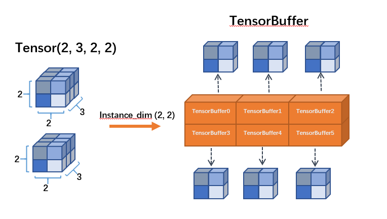
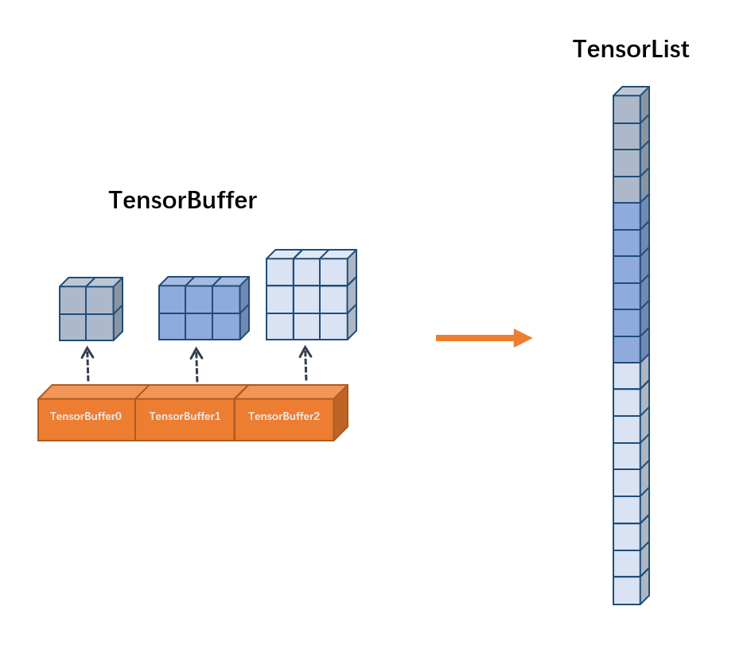

# OneFlow 概念清单

本文将对 OneFlow 中涉及到的，常用的一些概念/名词做一个概括性的解释。主要内容针对算法工程师和框架开发者分为以下两部分：

-  **算法开发** 

-  **框架开发** 

在算法开发部分，我们将解释深度学习算法开发，模型训练等过程中常用的一些概念和名词，而在框架开发部分，我们则侧重于 OneFlow 框架内部设计概念，框架开发相关的底层概念等介绍。


## 算法开发

### 1.Placeholder

Placeholder 即 **数据占位符** ，此概念用于描述输入/输出的数据形状，而并不是实体的数据。

例如：

```python
import oneflow.typing as tp
def test_job(
    images: tp.Numpy.Placeholder((32, 1, 28, 28), dtype=flow.float),
    labels: tp.Numpy.Placeholder((32,), dtype=flow.int32),
) -> Tuple[tp.Numpy, tp.Numpy]:
    # do something with images or labels
    return (images, labels)
```

描述了一个测试的 job 函数中，输入的图片 shape 是(32, 1, 28, 28)，数据类型是 `flow.float32`；输入的 labels 标签的 shape 是(32,)，类型是 `flow.int32`


### 2.Tensor和Blob

在其他框架中常用 Tensor 这个概念，譬如 pytorch 中的 Tensor，其中包含了数据值和类型(data, dtype)、梯度 grad、存放的设备类型 device 等属性。利用 Tensor 可以用来构造和描述前向/反向过程中的计算图。

而在 OneFlow 中，底层也使用了 Tensor 的概念，不过 OneFlow 中的 Tensor 和 pytorch/tensorflow 中的有些不同，为了对分布式和并行提供充分的支持，OneFlow 中的Tensor 更为复杂，类型和属性更多（譬如：逻辑/物理、设备、分布式相关的属性），而且一个逻辑上统一的 Tensor 可能在实际计算过程中，被拆分到了不同的设备上，所以为了简化描述，OneFlow 中屏蔽了各种具体类型的 Tensor，其上层由一个统一的概念— Blob 作为定义。


Blob在 OneFlow 中有对应的基类 `BlobDef`，搭建网络时可以打印 `Blob` 的属性，比如以下代码打印 `conv1` 的 `shape` 和 `dtype` ：

```python
print(conv1.shape, conv1.dtype)
```

Blob可能只是占位符Placeholder，也可能是具体的包含数值的单元。


### 3.Job Function(作业函数)

在 OneFlow 中，我们将训练、验证、预测/推理等具体任务统称为作业函数(job function)，作业函数联系用户的业务逻辑与 OneFlow 管理的计算资源。

在 OneFlow 中，任何被定义为作业函数的方法体都需要用装饰器 `@oneflow.global_function` 修饰，通过此装饰器，我们不仅能定义作业的类型(如：`type="train"`)，同时将为作业绑定一个 `FunctionConfig` 对象用于设置Job作业运行时所需的配置，使得 OneFlow 能方便地为我们管理内存、GPU 等计算资源。


 **为什么要用global_function而不用function？** 

在 OneFlow 设计之初，就是为了解决分布式多卡环境下的深度学习任务，在此种情况下，设置 `global_function` 即意味着对多卡进行全局配置。


### 4.Layer和Operator（op）

#### layer

Layer 即层，layer 的概念和 tensorflow、pytorch 等主流深度学习框架类似，用来描述神经网络模型中的一个层级如：conv2d 卷积层、batch_normalization 层、dense 全连接层、layer_norm 正则化层等。层的存在简化了神经网络模型的搭建过程，譬如你可以用简单的几行代码搭建出 Lenet：

```python
def lenet(data, train=False):
    initializer = flow.truncated_normal(0.1)
    conv1 = flow.layers.conv2d(
        data,
        32,
        5,
        padding="SAME",
        activation=flow.nn.relu,
        name="conv1",
        kernel_initializer=initializer,
    )
    pool1 = flow.nn.max_pool2d(
        conv1, ksize=2, strides=2, padding="SAME", name="pool1", data_format="NCHW"
    )
    conv2 = flow.layers.conv2d(
        pool1,
        64,
        5,
        padding="SAME",
        activation=flow.nn.relu,
        name="conv2",
        kernel_initializer=initializer,
    )
    pool2 = flow.nn.max_pool2d(
        conv2, ksize=2, strides=2, padding="SAME", name="pool2", data_format="NCHW"
    )
    reshape = flow.reshape(pool2, [pool2.shape[0], -1])
    hidden = flow.layers.dense(
        reshape,
        512,
        activation=flow.nn.relu,
        kernel_initializer=initializer,
        name="dense1",
    )
    if train:
        hidden = flow.nn.dropout(hidden, rate=0.5, name="dropout")
    return flow.layers.dense(hidden, 10, kernel_initializer=initializer, name="dense2")
```

layer 底层是由各种算子拼接而成，譬如：`layers.conv2d` 其实是由 `conv2d` 算子和 `variable` 算子组成。

#### op

Operator即算子（简称为op），是 OneFlow 中的 **基本运算单元** 。上面例子中 layer 之间的计算全部由各种算子叠加完成。譬如 `flow.nn.max_pool2d` 就是一种算子，`flow.reshape` 是另一种算子。


### 5.Consistent/Mirrored View

OneFlow 中采取了两种视角： **Mirrored View** 和 **Consistent View** 来描述分布式情况下数据和模型的分布，不同的 view 对应了不同的并行策略。

Mirrored View 来源于 MPI 分布式计算中的镜像策略，用于描述数据并行时，模型镜像到多卡的行为；

Consistent View 则表示将分布式环境下的多机多卡视为一个整体，采取此策略时，OneFlow 会为用户屏蔽掉具体的执行方式，内部将以最优化的策略选择并行方式（可能是数据并行/模型并行或混合并行）

简单来说：

当设置 mirrored view 时（ `flow.scope.mirrored_view` ）表示只能使用 **数据并行** 的方式。譬如在 job function 中设置了4台单卡节点，则模型会被完整的复制/镜像到4台节点的GPU卡上，数据则会切分为4份分别喂给4台节点上的GPU卡。

当设置 consistent view 时( `flow.scope.consistent_view` )，则表示没有限制，OneFlow **可以自由选择模型并行、数据并行或者两者共存的混合并行。**


## 框架开发

### 1.Boxing

负责在运行时根据并行属性转换张量的模块，我们称之为 **Boxing**。

例如：当上下游的op具有不同的并行特性(如并行数不同)，OneFlow 将利用 Boxing 自动处理各种数据转换和传输过程。


### 2.SBP

本质上，神经网络前向后向过程中的大多数操作，都可以归纳为矩阵计算，在矩阵计算中常有根据axis切分、广播等操作。同样 OneFlow 中也有类似的操作，我们称为SBP，当然，OneFlow 中的 SBP 不仅仅是简单的矩阵运算，其还对应了数据在不同物理 GPU 上的划分、广播等实际操作。

SBP即 Split、broadcast、Partial sum 的缩写。其中 Split 表示切分；broadcast 表示广播；Partial sum 表示部分求和。

#### Split

在并行op计算时，张量被 split 切分为多个子张量。不同的op算符允许张量在不同的 axis 轴上进行拆分。Boxing 机制将自动处理一个张量在多种op操作下在不同轴上切分的情况。

#### Broadcast

并行op计算时，一个设备上的张量被广播至多个设备，使每台设备上有相同的张量。

#### Partial Sum

如果一个op具有分配(distributive)属性，则张量会根据属性进行部分维度的加和操作。

### 3.TensorBuffer 和 TensorList

基于静态图机制，OneFlow 可以在编译时提前推理出各个算子的张量形状，并分配好内存，做到程序运行时内存零拷贝。但在某些特殊场景下，OneFlow 需要处理变长的数据，比如 DataLoader 加载的图片形状在编译时无法获知。为了处理这种变长数据，OneFlow 内部设计了两种数据结构，分别是 `TensorBuffer` 和 `TensorList` 。

#### TensorBuffer

TensorBuffer 是一个较为灵活的数据结构，使用的时候，我们需要指定子例的维度。OneFlow 会为每个实例生成对应的 TensorBuffer 对象，TensorBuffer 对象间接引用内存数据，TensorBuffer 所引用的内存区域是**动态的、不连续的**。

<div align="center">
    
</div>

#### TensorList

与 TensorBuffer 类似，TensorList 也是一种存放变长数据的数据结构，最主要的区别在与 TensorList 的数据部分在内存中是**连续的**。

<div align="center">
    
</div>

