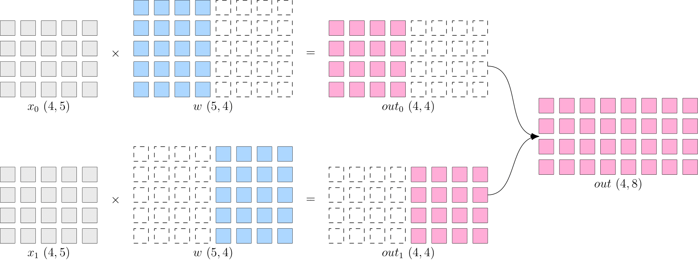
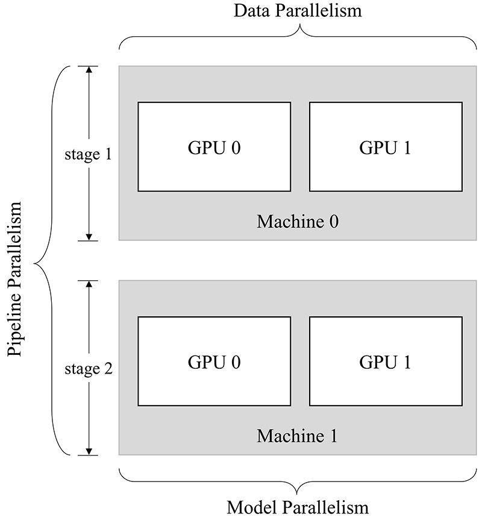

# 使用 Global Tensor 进行多机多设备编程：分布式并行策略

By [Guoliang Cheng](https://github.com/lmyybh), [Xu Xiaoyu](https://github.com/strint)

深度学习是通过神经网络学习样本数据的内在规律和表现层次的一种复杂机器学习算法。计算过程主要涉及数据和模型两部分。

随着深度学习的广泛应用，模型规模不断扩大，对硬件（算力、内存）的需求也在不断提高。然而，受限于物理定律，持续提高芯片的集成越来越困难，单一设备的算力及容量难以跟上模型扩大的需求。

为解决算力增速不足的问题，多节点集群的分布式训练方式逐渐受到重视，高效易用的分布式并行策略的提出势在必行。

## 并行策略

值得注意的是，简单的设备堆叠并不一定会带来算力的增长。因为神经网络的训练并不是单纯的“把原来一个设备做的事情，现在分给多个设备各自做”，它不仅需要多个设备进行计算，还涉及到设备之间的数据传输，只有协调好集群中的计算与通信，才可以实现高效的分布式训练。

常见的并行策略包括 **数据并行** 、**模型并行** 和 **流水并行**，特点如下：

- 数据并行：对 **数据** 进行切分，不同设备数据不同，但模型相同
- 模型并行：对 **模型** 进行切分，不同设备数据相同，但模型不同
- 流水并行：将 **模型** 分为多个阶段，分发到不同设备，各个设备之间以“流水线”的方式完成训练

除上述三种策略外， **混合并行** 也是一种常见的并行策略，通过上述两种或三种方式的混合使用完成训练目的。

本文以矩阵乘法为例，解释并行策略间的区别，以及如何利用 `Global Tensor` 实现不同的并行方式。

假设神经网络中的某一层是进行矩阵乘法计算，其中，输入 $x$ 的形状为 $4\times5$，模型参数 $w$ 的形状为 $5\times8$，那么，矩阵乘法输出形状为 $4\times8$。

基础代码：

```python
import oneflow as flow

x = flow.randn(4, 5)
w = flow.randn(5, 8)
out = flow.matmul(x, w)
print(out.shape) # (4, 8)
```

示意图如下：


单设备的训练中，以上矩阵乘法计算得到 $out$ 后会传递到下一层，并最终计算得到 $loss$。然后，在反向传播过程中，得到 $\frac{\partial loss}{\partial w}$，用于更新 $w$。

### 数据并行

数据并行是将数据进行切分输入不同设备，而每个设备上的模型保持完整和一致。

OneFlow 特有的 Global Tensor 采用 `placement` 与 `sbp` 结合的方式完成分布。其中 `placement` 表示 Global Tensor 分布的物理设备，`sbp` 表示 Global Tensor 分布的方式（详情可见：[创建 Global Tensor](./global_tensor.md/#global-tensor_2)）。

以两卡并行为例，矩阵乘法案例的数据并行程序如下：

**注意：没有多个 GPU 的读者，可以通过将本文并行示例中的 `placement` 指定为 `type="cpu"`， 实现用 CPU 模拟多设备并行**


```python
import oneflow as flow
placement = flow.placement(type="cuda", ranks=[0, 1])
x = flow.randn(4, 5, placement=placement, sbp=flow.sbp.split(dim=0))
w = flow.randn(5, 8, placement=placement, sbp=flow.sbp.broadcast)
out = flow.matmul(x, w)
print(out.shape) # (4, 8)
```

假设以上程序所在脚本文件为 `test.py`，不同于上一篇文章，本文章借助 oneflow 分布式工具，在 Terminal 运行以下命令启动程序：

```shell
python3 -m oneflow.distributed.launch --nproc_per_node 2 test.py
```

数据并行示意图：


以上程序可以看出，Global Tensor 的设计方式使得上述矩阵乘法案例的修改非常简单，只需要将：

1. 数据 $x$ 按第 0 维度切分(`sbp=flow.sbp.split(dim=0)`)，分布在两卡设备上(`placement=flow.placement(type="cuda", ranks=[0, 1])`)
2. 模型 $w$ 保持完整(`sbp=flow.sbp.broadcast`)，分布在两卡设备上(`placement=flow.placement(type="cuda", ranks=[0, 1])`)

### 模型并行

当神经网络非常巨大时，数据并行同步梯度的代价很大，此时可以考虑采用模型并行策略。

与数据并行相反，模型并行是将模型进行切分输入不同设备，而每个设备上的数据保持完整和一致。

同样以两卡为例，矩阵乘法的模型并行程序如下：

```python
import oneflow as flow

placement = flow.placement(type="cuda", ranks=[0, 1])
x = flow.randn(4, 5, placement=placement, sbp=flow.sbp.broadcast)
w = flow.randn(5, 8, placement=placement, sbp=flow.sbp.split(dim=1))
out = flow.matmul(x, w)
print(out.shape) # (4, 8)
```

假设以上程序所在脚本文件为 `test.py`，在 Terminal 运行以下命令启动程序：
```shell
python3 -m oneflow.distributed.launch --nproc_per_node 2 test.py
```

模型并行示意图：



同样只需要修改以下两部分：

1. 数据 $x$ 保持完整(`sbp=flow.sbp.broadcast`)，分布在两卡设备上(`placement=flow.placement(type="cuda", ranks=[0, 1])`)
2. 模型 $w$ 按第 1 维度切分(`sbp=flow.sbp.split(dim=1)`)，分布在两卡设备上(`placement=flow.placement(type="cuda", ranks=[0, 1])`)

### 流水并行

当神经网络过于巨大，无法在一个设备上存放时，可以选择流水并行策略。 流水并行将网络切分为多个阶段，并分发到不同的计算设备上，各个计算设备之间以“流水线”的方式完成训练。

以两卡流水并行为例，构造两阶段示例程序：

```python
import oneflow as flow

P0 = flow.placement(type="cuda", ranks=[0])
P1 = flow.placement(type="cuda", ranks=[1])
BROADCAST = flow.sbp.broadcast

# 模型第一阶段分布在第 0 卡
w0 = flow.randn(5, 8, placement=P0, sbp=BROADCAST)
# 模型第二阶段分布在第 1 卡
w1 = flow.randn(8, 3, placement=P1, sbp=BROADCAST)

# 随机生成数据模拟输入，注意第一阶段的数据分布在第 0 卡
in_stage0 = flow.randn(4, 5, placement=P0, sbp=BROADCAST)
out_stage0 = flow.matmul(in_stage0, w0)
print(out_stage0.shape) # (4, 8)

# 利用 to_global 将第二阶段的数据分布在第 1 卡
in_stage1 = out_stage0.to_global(placement=P1, sbp=BROADCAST)
out_stage1 = flow.matmul(in_stage1, w1)
print(out_stage1.shape) # (4, 3)
```

假设以上程序所在脚本文件为 `test.py`，在 Terminal 运行以下命令启动程序：
```shell
python3 -m oneflow.distributed.launch --nproc_per_node 2 test.py
```

以上程序采用矩阵乘法，模拟了一个两阶段神经网络。与数据并行和模型并行不同，流水并行中的数据和模型均未被切分，而是分别将两个阶段分布在不同的设备上进行计算。

Global Tensor 的设计，使得计算过程中，只需通过 `to_global(...)` 方法调整上一阶段的输出数据的分布策略，作为下一阶段的输入数据即可。

### 混合并行

混合并行是结合使用以上两种或三种策略的并行策略。

OneFlow 同时支持 `Eager 模式` 和 `Graph 模式` 两种模型运行方式，二者均可用于并行计算策略。

- `Eager 模式` 是 OneFlow 的默认模式，网络模型继承自 `nn.Module` 模块。
- `Graph 模式` 需要自定义继承自 `nn.Graph` 的类，并对 `Eager 模式` 的网络模型进行复用。

更多关于 `Graph 模式`的细节请参考：[静态图模块 nn.Graph](../basics/08_nn_graph.md)

此处以 `4 卡`混合并行程序为例进行介绍。

!!! Note
    分别 **点击** 以下 `Eager` 或 `Graph` 标签，查看 两种模式的示例代码

=== "Eager"

    ```python
    import oneflow as flow
    import oneflow.nn as nn

    P01 = flow.placement(type="cuda", ranks=[0, 1])
    P23 = flow.placement(type="cuda", ranks=[2, 3])


    class StageModule(nn.Module):
        def __init__(self, in_dims, out_dims, placement=None, sbp=None):
            super().__init__()
            self.w = nn.Parameter(
                flow.randn(in_dims, out_dims, placement=placement, sbp=sbp)
            )

        def forward(self, x):
            out = flow.matmul(x, self.w)
            return out


    class ModuleModel(nn.Module):
        def __init__(self):
            super().__init__()

            # 模型第一阶段在第 0 和第 1 卡上进行数据并行计算
            self.m_stage0 = StageModule(5, 8, placement=P01, sbp=flow.sbp.broadcast)

            # 模型第二阶段在第 2 和第 3 卡上进行模型并行计算
            self.m_stage1 = StageModule(8, 3, placement=P23, sbp=flow.sbp.split(dim=1))

        def forward(self, x):
            # 第一阶段，数据切分在第 0 和第 1 卡，用于数据并行
            out_stage0 = self.m_stage0(x)

            # 第二阶段需要将输入数据还原完整，并转移至第 2 和第 3 卡，用于模型并行
            in_stage1 = out_stage0.to_global(placement=P23, sbp=flow.sbp.broadcast)
            out_stage1 = self.m_stage1(in_stage1)

            return out_stage0, out_stage1


    if __name__ == "__main__":
        model = ModuleModel()
        # 需要将输入数据切分，用于数据并行
        in_stage0 = flow.randn(4, 5, placement=P01, sbp=flow.sbp.split(dim=0))
        out_stage0, out_stage1 = model(in_stage0)
        print(out_stage0.shape, out_stage1.shape)  # (4, 8) (4, 3)
    ```

=== "Graph"

    ```python
    import oneflow as flow
    import oneflow.nn as nn

    P01 = flow.placement(type="cuda", ranks=[0, 1])
    P23 = flow.placement(type="cuda", ranks=[2, 3])


    class StageModule(nn.Module):
        def __init__(self, in_dims, out_dims, placement=None, sbp=None):
            super().__init__()
            self.w = nn.Parameter(
                flow.randn(in_dims, out_dims, placement=placement, sbp=sbp)
            )

        def forward(self, x):
            out = flow.matmul(x, self.w)
            return out


    class ModuleModel(nn.Module):
        def __init__(self):
            super().__init__()

            # 模型第一阶段在第 0 和第 1 卡上进行数据并行计算
            self.m_stage0 = StageModule(5, 8, placement=P01, sbp=flow.sbp.broadcast)

            # 模型第二阶段在第 2 和第 3 卡上进行模型并行计算
            self.m_stage1 = StageModule(8, 3, placement=P23, sbp=flow.sbp.split(dim=1))

        def forward(self, x):
            # 第一阶段，数据切分在第 0 和第 1 卡，用于数据并行
            out_stage0 = self.m_stage0(x)

            # 第二阶段需要将输入数据还原完整，并转移至第 2 和第 3 卡，用于模型并行
            in_stage1 = out_stage0.to_global(placement=P23, sbp=flow.sbp.broadcast)
            out_stage1 = self.m_stage1(in_stage1)

            return out_stage0, out_stage1


    # Graph
    class GraphModel(nn.Graph):
        def __init__(self):
            super().__init__()
            self.model = ModuleModel()
            self.model.m_stage0.config.set_stage(stage_id=0, placement=P01)
            self.model.m_stage1.config.set_stage(stage_id=1, placement=P23)

        def build(self, x):
            return self.model(x)


    if __name__ == "__main__":
        graph = GraphModel()
        # 需要将输入数据切分，用于数据并行
        in_stage0 = flow.randn(4, 5, placement=P01, sbp=flow.sbp.split(dim=0))
        out_stage0, out_stage1 = graph(in_stage0)
        print(out_stage0.shape, out_stage1.shape)  # (4, 8) (4, 3)
    ```

以上程序构建了一个两阶段网络，其 `2 机 2 卡` 并行方式如下图所示：



模型的两个阶段分别运行在两台机器进行流水并行，且第一阶段在第一台机器上进行两卡数据并行，第二阶段在第二台机器上进行两卡模型并行。

**运行方式：**

`Eager 模式` 和 `Graph 模式` 的运行方式一致，假设脚本文件名为 `test.py`

1. 单机四卡启动方式为：

    ```shell
    python3 -m oneflow.distributed.launch --nproc_per_node 4 test.py
    ```

2. oneflow 分布式工具支持多机多设备并行，以 `2 机 2 卡` 环境为例，启动方式如下：

    在 第 0 号机器上运行：
    ```shell
    python3 -m oneflow.distributed.launch \
        --nnodes=2 \
        --node_rank=0 \
        --nproc_per_node=2 \
        --master_addr="192.168.1.1" \ # 第 0 号机器的 IP
        --master_port=7788 \
        test.py
    ```

    在 第 1 号机器上运行：
    ```shell
    python3 -m oneflow.distributed.launch \
        --nnodes=2 \
        --node_rank=1 \
        --nproc_per_node=2 \
        --master_addr="192.168.1.1" \ # 第 0 号机器的 IP
        --master_port=7788 \
        test.py
    ```

    注意要将 `master_addr` 设置为第 0 号机器的 IP


## 结语

并行策略的选择影响着训练效率，框架对并行训练的接口支持程度，决定了算法工程师的开发效率。

本文介绍了数据并行、模型并行、流水并行以及混合并行这些分布式并行策略，通过示例展示了 OneFlow 针对分布式训练所做的系统级设计和创新，以便于用户轻松上手分布式训练。
