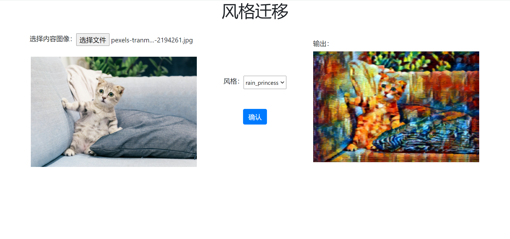

# 模型部署

模型训练好后，需要经过“模型部署”才能够集成到产品中并上线。因为产品上线时的软硬件环境、模型与业务模块的对接方式都可能变化，所以部署的解决方案也多种多样。比如某些方案会将训练好的模型转为其他格式（如 ONNX）后，再依赖特定的 runtime 部署；某些方案会直接使用 汇编/C/C++ 等能生成 native code 的语言重新实现模型，以追求硬件适配或部署性能。

OneFlow 通过对接了 [Triton Inference Server](https://github.com/Triton-inference-server/server)，做到了训练、部署一体化。

OneFlow 用户训练好模型后，可以直接通过 Triton 部署模型，并借助 Triton 丰富的特性，如 Dynamic batching、Model Pipelines、HTTP/gRPC 接口等，并快速高效地集成到线上产品中。

本文内容组织如下：

- OneFlow 部署快速上手
- OneFlow Serving 架构介绍
- OneFlow 从训练到部署流程解析

## OneFlow 部署快速上手

OneFlow Cloud 上准备了一个 [图像风格迁移：基于 OneFlow-Serving](#xxxx) 项目，参照项目说明用户可以一键部署项目，并且查看项目运行效果。



分析项目代码可以发现，有以下几个关键处：

- [run.sh](#xxx) 中通过 docker 启动了 Triton 服务与 WEB 应用服务：
```bash
/opt/tritonserver/bin/tritonserver --model-store $(pwd)/model_repo > 1.txt && python3 server.py
```

- [server.py](#xxx) 中只是简单和普通的 URL 路由，真正做推理工作是由 [infer.py](#xxx) 中的 `stylize` 完成的。`stylize` 函数内部，通过 HTTP 与 Triton 服务端交互得到推理结果。
```python
def stylize(content_path, output_path, style='udnie'):
    triton_client = httpclient.InferenceServerClient(url='127.0.0.1:8000')
    ...
    inputs.append(httpclient.InferInput('INPUT_0', image.shape, 'FP32'))
    ...
    outputs.append(httpclient.InferRequestedOutput('OUTPUT_0', binary_data=True))
    ...
```

- 预训练模型放置在 [model_repo](#yyy) 下，它按照 Triton 的约定组织格式

这个简单的在线示例展示了 OneFlow 模型如何通过 Triton 部署，同时也展示业务模块如何与 Triton 服务端交互获取推理结果。 

接下来，我们会详细介绍 OneFlow 从训练到部署的详细流程。

## OneFlow 从训练到部署流程解析

我们首先通过下图总体了解 OneFlow 与 Triton 的关系。


从上图可以知晓，Triton 处于联接客户端与 OneFlow 的位置：Triton 提供了 HTTP、gRPC 以及 C 接口，使得用户可以灵活地发起推理请求并得到结果。

在 Triton 的架构中，OneFlow 与 Model Repository 一起，为 Triton 提供后端推理能力。Triton 对 Model Repository 的组织格式有预设的要求，OneFlow 提供了对应的接口，将训练好的模型导出为 Triton 要求的组织格式。

此外，Triton 内部还提供了任务调度等的内置功能，使得性能有保证，具体可以参考 [Triton 的官方文档](https://github.com/triton-inference-server/server#features)。

了解这些基本概念后，让我们详细解析 OneFlow 从模型训练到部署的流程：

- 模型保存
- 模型配置
- 启动服务
- 客户端发送请求

### 模型保存

如果是 Graph 模式下训练得到的模型，可以直接通过 `oneflow.save` 导出为部署所需格式；如果是 Eager 模式下训练得到的模型，简单转换后，可以导出为所需格式。具体操作方法，请参阅 [Graph 与部署](../basics/08_nn_graph.md#graph_5) 相关内容。

### 模型配置

Triton 对模型的目录组织结构有一定要求，我们需要按照 [Triton 的约定](https://github.com/triton-inference-server/server/blob/main/docs/model_repository.md#repository-layout) 组织模型目录结构，并且编写相关配置文件。

**目录组织结构**

在本示例程序中，模型文件放置在 `model_repository` 目录下，它的组织结构符合 Triton 的约定，让我们看看其组织方式并解释：

```
$ tree  -L 3 model_repository/
model_repository/
└── fast_neural_style
    ├── 1
    │   └── model
    ├── config.pbtxt
    └── labels.txt
```

- `model_repository` 是模型仓库根目录，在 triton 启动时，可以通过 `--model-repository` 选项指定模型仓库根目录
- `fast_neural_style` 是模型仓库中的一个模型。一个模型仓库下，可以有多个模型，每个一级子目录就是一个模型，在这里我们只准备了 `fast_neural_style` 这一个模型
- 其中的 `1/model` 目录，就是我们之前通过 `flow.save(graph, "1/model")` 保存的模型。其中的 `1` 为版本号，Triton 中约定，一个模型目录下可以有多个模型版本，模型版本的文件夹名必须为 **纯数字**。在模型版本文件夹下，需要放置名为 `model` 的文件夹，其中保存有模型参数和计算图
- `config.pbtxt` 是一个纯文本文件，用于配置该模型仓库的基本信息，我们接下来详细介绍


**模型仓库配置**

`config.pbtxt`，它是一个 protobuf 文本格式的配置文件，通过编写这个文件可以配置模型服务的信息，如指定硬件、输入输出等信息。这个例子中的内容如下：

```text
name: "fast_neural_style"
backend: "oneflow"
max_batch_size: 1
input [
  {
    name: "INPUT_0"
    data_type: TYPE_FP32
    dims: [ 3, 256, 256 ]
  }
]
output [
  {
    name: "OUTPUT_0"
    data_type: TYPE_FP32
    dims: [ 3, 256, 256 ]
  }
]

instance_group [
  {
    count: 1
    kind: KIND_GPU
    gpus: [ 0 ]
  }
]
```

接下来，我们依次解释其中的配置项。


```python
name: "fast_neural_style"
```

`name` 字段用于指定模型。这行说明使用 `fast_neural_style` 这个模型，模型名字需要和上文介绍的模型文件夹名一致。

```
backend: "oneflow"
```

`backend` 用于指定 Triton 后端，用 OneFlow 部署，此字段必须指定为 `oneflow`。

接着，需要定义模型的输入和输出形状。下面的输入输出名字字段，我们需要按照模型的输入输出顺序填写，并且命名格式是 `INPUT_<index>` 和 `OUTPUT_<index>`，用 `<index>` 表示模型输入的顺序，默认从 0 开始。`data_type` 字段定义了数据类型，`dims` 字段定义了张量的形状。

```
input [
  {
    name: "INPUT_0"
    data_type: TYPE_FP32
    dims: [ 3, 1024, 1024 ]
  }
]
output [
  {
    name: "OUTPUT_0"
    data_type: TYPE_FP32
    dims: [ 3, 1024, 1024 ]
  }
]
```

以上的模型名字、推理后端、输入输出配置是最基础的配置，配置完成后，已经可以开始工作。

之后的 `instance_group` 用于配置硬件信息。

```
instance_group [
  {
    count: 1
    kind: KIND_GPU
    gpus: [ 0 ]
  }
]
```

它意味着我们实例化 1 个模型，并将它放置在 0 号 GPU 设备上。更多灵活调配的选项，请参考 [Triton Inference Server 的模型配置文档](https://github.com/triton-inference-server/server/blob/main/docs/model_configuration.md)。


### 启动服务

OneFlow Serving 提供了 Docker 镜像，使用 Docker 启动模型服务。按照上面的目录结构组织好文件之后，就可以映射路径到容器中，启动服务。

```
docker run --rm --runtime=nvidia --network=host -v$(pwd)/model_repository:/models \
  oneflowinc/oneflow-serving:0.0.1 /opt/tritonserver/bin/tritonserver --model-store /models
```

使用下面的命令，可以检查模型服务是否启动。看到 http 200 状态码，那么模型服务已经启动。

```
curl -v localhost:8000/v2/health/ready
```

### 向 Triton Server 发送请求

在这个例子中，我们使用 [tritonclient](https://pypi.org/project/tritonclient/) 与 Triton Server 交互。需要先安装一个 python 包。

```
pip3 install tritonclient[all]
```

> 实际上，客户端可以通过 [HTTP、gRPC 或者 C API 等多种方式](https://github.com/triton-inference-server/server/blob/main/docs/inference_protocols.md) 与 Triton Server 交互，具体内容可以参阅以上文档。


以下代码，是图片进行风格化的核心部分，可以将命令行传递来的图片文件，进行风格化。

```python
#...
import tritonclient.http as httpclient

if __name__ == '__main__':
    parser = argparse.ArgumentParser()
    parser.add_argument('--image',
                        required=True,
                        help='the image to transfer style')
    FLAGS = parser.parse_args()
    triton_client = httpclient.InferenceServerClient(url='127.0.0.1:8000')
    image, w, h = load_image(FLAGS.image, 1024, 1024)
    inputs = []
    inputs.append(httpclient.InferInput('INPUT_0', image.shape, 'FP32'))
    inputs[0].set_data_from_numpy(image, binary_data=True)
    outputs = []
    outputs.append(httpclient.InferRequestedOutput('OUTPUT_0', binary_data=True))
    results = triton_client.infer('fast_neural_style', inputs=inputs, outputs=outputs)
    output0_data = results.as_numpy('OUTPUT_0')
    image = recover_image(output0_data, h, w)
    cv2.imwrite('result.jpg', image)
```

首先，创建一个 `triton_client`，其中的 `127.0.0.1:8000` 是 Triton 服务的默认端口

```python
triton_client = httpclient.InferenceServerClient(url='127.0.0.1:8000')
```

然后，通过 `triton_client.infer` 接口，可以向 Triton Server 发起推理请求并获取输出。
一条 Tirton 推理请求，需要指定模型、输入和输出部分。

可以看到以下代码，主要是在构造输入、输出对象，它们的配置与先前在 `config.pbtxt` 中的配置一致。并最终通过 `triton_client.infer('fast_neural_style', inputs=inputs, outputs=outputs)` 发起推理请求，其中的 `fast_neural_style` 也与 `config.pbtxt` 中的配置一致。

```python
    inputs = []
    inputs.append(httpclient.InferInput('INPUT_0', image.shape, 'FP32'))
    inputs[0].set_data_from_numpy(image, binary_data=True)
    outputs = []
    outputs.append(httpclient.InferRequestedOutput('OUTPUT_0', binary_data=True))
    results = triton_client.infer('fast_neural_style', inputs=inputs, outputs=outputs)
```

获取到的推理结果，转换格式并保存为输出图片：

```python
    output0_data = results.as_numpy('OUTPUT_0')
    image = recover_image(output0_data, h, w)
    cv2.imwrite('result.jpg', image)
```


我们对一只猫进行推理，可以得到如下结果。

```
$ curl -o cat.jpg https://images.pexels.com/photos/156934/pexels-photo-156934.jpeg
$ python client.py --image cat.jpg 
```
