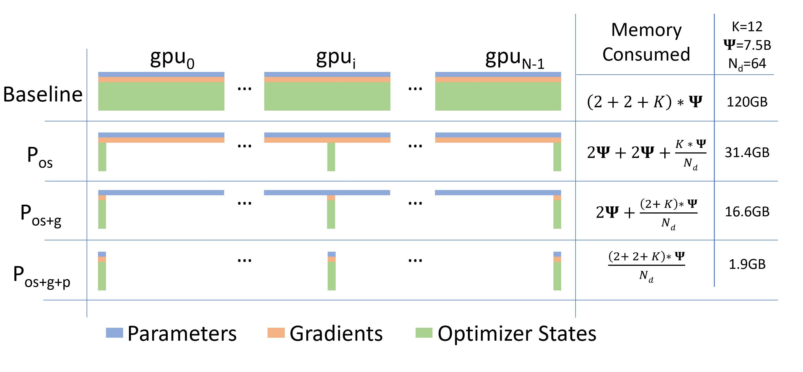

# Zero Redundancy Optimizer (ZeRO)

## ZeRO 简介

**Zero Redundancy Optimizer (ZeRO)** 是论文 [ZeRO: Memory Optimization Towards Training A Trillion Parameter Models](https://arxiv.org/pdf/1910.02054.pdf) 提出的一种用于减少数据并行策略下的显存占用的方法。

在普通的数据并行策略中，每个 GPU 都独立地维护一组完整的模型参数，计算与通信效率较高，但内存效率较差。这个问题在训练大型模型时尤为突出。ZeRO 由 ZeRO-DP 和 ZeRO-R 两部分组成，可以有效地减少显存消耗量，这意味着在同样的显存下，可以训练更大的模型，也意味着对于以往只能通过模型并行策略才能训练的大模型也有可能使用数据并行。

训练深度学习模型时的显存消耗可以分为两大部分：

1. **模型状态(model states)**。对于大型模型来说，大部分显存消耗都是被模型状态占用的，主要包括三部分：优化器的状态(Optimizer States)、梯度(Gradients)、参数(Parameters)。三者简称为 **OPG**。
2. **残余状态(residual states)**。包括激活函数、临时缓冲区和不可用的内存碎片。

ZeRO-DP 可以分为三个阶段，通过对 OPG 状态进行分区而不是直接复制来消除内存冗余，每个 GPU 仅保存部分 OGP。具体来说，ZeRO-DP 有三个主要的优化阶段，分别对应 O、P 和 G。三个阶段逐级递加：

1. 优化器状态分区（P<sub>os</sub>）：显存消耗减少 4 倍，通信量与数据并行相同，此阶段也被称为 ZeRO-OS。
2. 添加梯度分区优化（P<sub>os+g</sub>）：显存消耗减少 8 倍，通信量与数据并行相同。
3. 添加参数分区优化（P<sub>os+g+p</sub>）：模型占用的显存被平均分配到每个 GPU 中，显存消耗量与数据并行的并行度成线性反比关系，但通信量会有些许增加。

三个阶段的显存消耗的分布情况可以参见下图（来自 ZeRO 原论文 Figure 1）：

<div align="center">

</div>

## ZeRO 使用示例

首先导入 OneFlow：
```python
import oneflow as flow
from oneflow import nn
```

### 定义数据并行训练流程

我们定义一个数据并行策略下的训练流程的方法与 [通过设置 SBP 做数据并行训练](../parallelism/05_ddp.md#通过设置-sbp-做数据并行训练) 中所介绍的是类似的。

定义之后要使用到的 placement、SBP 等：
```python
P = flow.placement("cuda", ranks=[0, 1])
B = flow.sbp.broadcast
S0 = flow.sbp.split(0)
DEVICE = "cuda"
```

为了便于演示，我们定义一个简单的模型，然后广播到集群上：
```python
model = nn.Sequential(nn.Linear(256, 128),
                      nn.ReLU(),
                      nn.Linear(128, 10))
model = model.to(DEVICE)
model.train()
model = model.to_global(placement=P, sbp=B)

loss_fn = nn.CrossEntropyLoss().to(DEVICE)
optimizer = flow.optim.SGD(model.parameters(), lr=1e-3)
```

ZeRO 是在 [nn.Graph](../basics/08_nn_graph.md) 中设置的，因此需要将动态图模型转换为 nn.Graph：

```python
class CustomGraph(flow.nn.Graph):
    def __init__(self):
        super().__init__()
        self.model = model
        self.loss_fn = loss_fn
        self.add_optimizer(optimizer)

        # TODO: 设置 ZeRO
    
    def build(self, x, y):
        preds = self.model(x)
        loss = self.loss_fn(preds, y)
        loss.backward()
        return preds
```

定义训练流程：

```python
graph_model = CustomGraph()

for _ in range(100):
    x = flow.randn(128, 256).to(DEVICE)
    y = flow.ones(128, 1, dtype=flow.int64).to(DEVICE)
    global_x = x.to_global(placement=P, sbp=S0)
    global_y = y.to_global(placement=P, sbp=S0)
    
    graph_model(global_x, global_y)
```

然后通过 [launch 模块](../parallelism/04_launch.md) 启动训练即可。

### 在 nn.Graph 中开启 ZeRO

**阶段 1**：通过 [config.set_zero_redundancy_optimizer_mode](https://oneflow.readthedocs.io/en/master/graph.html#oneflow.nn.graph.graph_config.GraphConfig.set_zero_redundancy_optimizer_mode) 接口可以开启阶段 1。即在上面的 nn.Graph 模型中添加：

```python
self.config.set_zero_redundancy_optimizer_mode("distributed_split")
```

!!! Note
    当使用模型连续进行训练和和预测时：训练执行一次后，ZeRO 会自动把模型的 SBP 参数从 Broadcast 改变为 Split；在执行预测时，将会使用 Split 自动推理，无需配置 ZeRO。

!!! Warning
    此 API 未来可能会发生变动。

**阶段 2**：在阶段 1 的基础上，增加 `flow.boxing.nccl.enable_use_compute_stream(True)` 可以开启阶段 2。即在上面的 nn.Graph 模型中添加：

```python
self.config.set_zero_redundancy_optimizer_mode("distributed_split")
flow.boxing.nccl.enable_use_compute_stream(True)
```

**阶段 3**：在阶段 2 的基础上，增加 `flow.boxing.nccl.disable_group_boxing_by_dst_parallel(True)` 可以开启阶段 3。即在上面的 nn.Graph 模型中添加：

```python
self.config.set_zero_redundancy_optimizer_mode("distributed_split")
flow.boxing.nccl.enable_use_compute_stream(True)
flow.boxing.nccl.disable_group_boxing_by_dst_parallel(True)
```

!!! Note
    虽然开启第三阶段可以最大限度地减少显存消耗，但这会增加通信成本，在实践中一般使用第二阶段。
