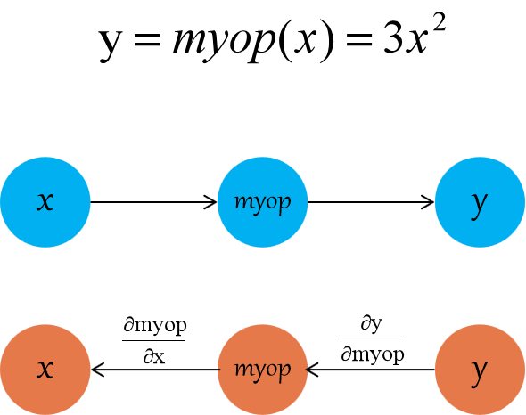

# 自定义 Op

## 背景介绍

### 自定义 op 是什么
OneFlow 将各种对于数据的处理都抽象成了算子（operator），简称 op。 op 是作用在输入 tensor 上的操作，并将操作的结果写到输出 tensor 上。OneFlow 内部已经提供了比较完备的 op 算子，可以在 [ops 目录](https://github.com/Oneflow-Inc/oneflow/tree/master/oneflow/python/ops)下找到。

当 OneFlow 已有的 Python 算子及其组合无法满足构建神经网络的需求，或者 Python 层次的算子无法满足性能需求时，我们可以使用 C++ 开发 OneFlow 自定义 op。

OneFlow 提供了一套机制，我们在这套机制下编写自定义 op 并将其注册到 OneFlow 中，就可以在 Python 中使用自定义 op。

下图展示了 OneFlow 中自定义 op 的注册机制：


可以看到，在 OneFlow 框架中，与自定义 op 注册有关的 Registry 有三种：

* `OpGradRegistry`：管理梯度注册，用于反向图中自动求梯度

* `OpRegistry`：管理 op 注册，用于生成前向图及构建 `Task Graph`

* `OpKernelRegistry`：管理 kernel 注册，用于运行时执行用户编写的 kernel 逻辑

在具体的编程过程中，我们其实是用 C++ 编写自定义 op，并生成动态链接库(so)文件。在 Python 中加载对应的 so 文件，就可以使用该 so 文件中的自定义 op。

在 [user_op_conf.proto](https://github.com/Oneflow-Inc/oneflow/blob/master/oneflow/core/framework/user_op_conf.proto) 中可以查看 user op 的数据结构：
```text
syntax = "proto2";
package oneflow;

import "oneflow/core/framework/user_op_attr.proto";

message UserOpConf {
  message ListString {
    repeated string s = 1;
  }
  required string op_type_name = 1;
  map<string, ListString> input = 2;
  map<string, ListString> output = 3;
  map<string, UserOpAttrVal> attr = 4;
}
```

其中的 `op_type_name` 是代表 op 类别的字符串，也是指明 op 类别的全局唯一 ID，OneFlow 通过 `op_type_name` 查询并确认 op 种类，在本文的后续中会多次出现。

### 基本概念

* op_type_name：如上文所述，op_type_name 是 op 类别的全局唯一 ID， OneFlow 通过 op_type_name 查询并确认 op 的种类，进而实例化 op。op 的种类与 op 的关系，类似于类与对象的关系。

* op：逻辑上的算子，包含构图推理时的输入输出形状等信息，不包含具体的处理数据的逻辑。

* kernel：对于一个逻辑上的 op，在运行时，处理的逻辑会因为物理设备以及数据类型的不同。运行时的具体处理逻辑，由 kernel 完成。简单而言，op 与 kernel 是一对多的关系，我们需要为 op 所支持的所有物理设备及数据类型注册 kernel。

* 注册：通过注册可以建立自定义 op 与 OneFlow 框架的联系。在 OneFlow 中提供了一系列名如 `REGISTER_XXX` 的宏帮助完成 op、kernel 等的注册。

* 加载动态库：自定义的 op 及其 kernel 等被链接为 动态库 so 文件，在 Python 中使用前需要先加载。 OneFlow 提供了 `oneflow.config.load_library` 接口加载自定义 op 的动态库文件。

* Python wrapper：在 Python 中调用 C++ 层实现的自定义 op，需要在 Python 层编写一个 wrapper，OneFlow 提供了 `oneflow.user_op_builder` 接口完成该工作。


### 编写自定义 op 的步骤
1. 实现 op 并注册：op 的实现主要用于前向图构图，包括指定 op 的名称、输入、输出、配置属性以及一些必要的用于推导 tensor 的形状与数据类型的函数

2. 实现 op 对应的 kernel 并注册：kernel 负责运行时的具体运算过程，一个 op 可能会对应多个 kernel

3. （可选）实现 op 对应的 grad 并注册：如果自定义 op 需要支持后向展开，需要实现一个后向函数并注册

4. 编译链接得到 so 文件

5. 在 Python 中加载 so 文件，并且使用 `oneflow.user_op_builder` 封装 C++ 编写的自定义 op

6. 测试

## 示例
我们将实现一个支持 CPU 及 GPU 运算的 "myrelu" 自定义 op。
完整的代码见 [code/extended_topics/create_user_op](https://github.com/Oneflow-Inc/oneflow-documentation/tree/master/cn/docs/code/extended_topics/create_user_op)。

### op 的实现与注册
我们在 `myrelu_op.cpp` 中定义了 op 并完成了注册：
```cpp
#include "oneflow/core/framework/framework.h"

namespace oneflow {

namespace {

REGISTER_USER_OP("myrelu")
  .Input("in")
  .Output("out")
  .SetTensorDescInferFn(
      [](user_op::InferContext *ctx) -> Maybe<void> {
        *ctx->Shape4ArgNameAndIndex("out", 0) =
            *ctx->Shape4ArgNameAndIndex("in", 0);
        *ctx->Dtype4ArgNameAndIndex("out", 0) =
            *ctx->Dtype4ArgNameAndIndex("in", 0);
        return Maybe<void>::Ok();
      });
} // namespace

} // namespace oneflow
```

分析以上代码：

* `oneflow/core/framework/framework.h` 中包含了我们创建一个 op 所需要的所有接口

* 与自定义 op 有关的接口集中在 `oneflow::user_op` 中，使用名称空间 `oneflow` 可以简化类型名称

* 宏 `REGISTER_USER_OP` 用于注册 op，其接受的参数 `myrelu` 是 `op_type_name`。

* 使用 `REGISTER_USER_OP` 注册后，其实会返回一个 `OpRegistry` 类（位于 `oneflow\core\framework\user_op_registry.h`），通过调用该类方法，完成对自定义 op 的设置：
    1. `Input("in")` 表示其有一个名为 "in" 的输入
    2. `Output("out")` 表示其有一个名为 "out" 的输出
    3. `SetTensorDescInferFn` 用于设置形状及数据类型推导函数，描述该算子的输出的形状及类型与输入的关系。以上代码中，输出的形状、数据类型与输入的一致

### CPU kernel 的实现与注册
我们在 `myrelu_cpu_kernel.cpp` 中实现了 CPU 版本的 kernel 并注册：
```cpp
#include "oneflow/core/framework/framework.h"

namespace oneflow {

namespace {

template <typename T>
void MyRelu(DeviceCtx *ctx, const int64_t n, const T *x, T *y) {
  T zero = (T)(0);
  for (int64_t i = 0; i != n; ++i) {
    y[i] = std::max(x[i], zero);
  }
}

template <DeviceType device_type, typename T>
class ReluKernel final : public user_op::OpKernel {
public:
  ReluKernel() = default;
  ~ReluKernel() = default;

private:
  void Compute(user_op::KernelComputeContext *ctx) const override {
    const user_op::Tensor *in_tensor = ctx->Tensor4ArgNameAndIndex("in", 0);
    user_op::Tensor *out_tensor = ctx->Tensor4ArgNameAndIndex("out", 0);
    MyRelu<T>(ctx->device_ctx(),
           in_tensor->shape().elem_cnt(),
           in_tensor->dptr<T>(), 
           out_tensor->mut_dptr<T>());
  }
  bool AlwaysComputeWhenAllOutputsEmpty() const override { return false; }
};

#define REGISTER_RELU_KERNEL(device, dtype)          \
  REGISTER_USER_KERNEL("myrelu")                     \
      .SetCreateFn<ReluKernel<device, dtype>>()      \
      .SetIsMatchedHob(                              \
          (user_op::HobDeviceType() == device) &     \
          (user_op::HobDataType("out", 0)            \
            == GetDataType<dtype>::value));

REGISTER_RELU_KERNEL(DeviceType::kCPU, float)
REGISTER_RELU_KERNEL(DeviceType::kCPU, double)
} // namespace

} // namespace oneflow
```
在 OneFlow 中实现 kernel， 必须定义一个继承自 `oneflow::user_op::OpKernel` 的类，并重写其中的虚函数。

在以上代码中，重写了 `Compute` 与 `AlwaysComputeWhenAllOutputsEmpty` 两个虚函数，他们分别的意义是：

* `Compute` 必须重写，在其中实现具体的运算逻辑

* `AlwaysComputeWhenAllOutputsEmpty` 必须重写，对于绝大多数 op 而言直接返回 `false` 即可。对于极少数内部需要维护状态，因此即使输出为空也需要调用 kernel 进行计算的 op 而言，应该返回 `true`

实现 kernel 类后，需要调用 `REGISTER_USER_KERNEL` 注册。`REGISTER_USER_KERNEL("myrelu")` 所接受的字符串参数，就是 `op_type_name`， 依据 `op_type_name` 完成注册和运行时的查询工作，在 Python 层封装 op 时也需要使用这个 `op_type_name`。

`REGISTER_USER_KERNEL("myrelu")` 会返回一个 `OpKernelRegistry` 对象，需要调用它的各个方法，设置注册信息。上文代码中涉及到

* `SetCreateFn<T>()`：该模板方法的模板参数 `T`，就是我们实现的 kernel 类，OneFlow 将使用它创建 kernel 对象。

* `SetIsMatchedHob`：因为一个 op 可能有多个 kernel，要想根据物理设备及数据格式的不同而选择不同的 kernel 进行计算，就需要调用 `SetIsMatchedHob` 进行设置。该方法接受一个表达式，表达式为 `true` 时，OneFlow 将调用该 kernel 完成计算。

### GPU kernel 的实现与注册
我们在 `myrelu_gpu_kernel.cu` 中实现了 GPU 版本的 kernel 并注册：
```cpp
#include "oneflow/core/framework/framework.h"
#include <cub/cub.cuh>

namespace oneflow {
namespace {
template <typename T>
__global__ void ReluForwardGpu(const int n, const T *x, T *y) {
  CUDA_1D_KERNEL_LOOP(i, n) { y[i] = x[i] > 0 ? x[i] : 0; }
}

class ReluGpuFloatKernel final : public user_op::OpKernel {
public:
  ReluGpuFloatKernel() = default;
  ~ReluGpuFloatKernel() = default;

private:
  void Compute(user_op::KernelComputeContext *ctx) const override {
    const user_op::Tensor *in_tensor = ctx->Tensor4ArgNameAndIndex("in", 0);
    user_op::Tensor *out_tensor = ctx->Tensor4ArgNameAndIndex("out", 0);

    int32_t n = in_tensor->shape().elem_cnt();
    const float *in_ptr = in_tensor->dptr<float>();
    float *out_ptr = out_tensor->mut_dptr<float>();
    ReluForwardGpu<float>
        <<<32, 1024, 0, ctx->device_ctx()->cuda_stream()>>>(n, in_ptr, out_ptr);
  }

  bool AlwaysComputeWhenAllOutputsEmpty() const override { return false; }
};

#define REGISTER_RELU_KERNEL(device, dtype)          \
  REGISTER_USER_KERNEL("myrelu")                     \
      .SetCreateFn<ReluGpuFloatKernel>()             \
      .SetIsMatchedHob(                              \
          (user_op::HobDeviceType() == device) &     \
          (user_op::HobDataType("out", 0)            \
            == GetDataType<dtype>::value));

REGISTER_RELU_KERNEL(DeviceType::kGPU, float)
REGISTER_RELU_KERNEL(DeviceType::kGPU, double)
} // namespace
} // namespace oneflow
```

可以看到， 实现并注册 GPU kernel 的过程与 CPU kernel 几乎一致。区别主要在于：

* 因为使用了 CUDA 编程，所以包含了 CUDA 对应的头文件

* `Compute` 内部使用了 GPU 的方法

* `SetIsMatchedHob` 中所匹配的设备为 GPU

此外，我们马上会在下文看到，因为使用了 CUDA，我们需要使用 nvcc 编译器（而不是 g++）来编译 GPU kernel。

### 编译链接选项说明
在 `oneflow.sysconfig` 下包含了 `get_compile_flags`、`get_include`、`get_lib`、`get_link_flags` 方法分别对应自定义 op 时的：

- 编译选项
- 头文件路径
- 链接库路径
- 链接选项

比如：
```text
>>> import oneflow
>>> oneflow.sysconfig.get_compile_flags()
['-I/home/yaochi/oneflow/build/python_scripts/oneflow/include', '-DHALF_ENABLE_CPP11_USER_LITERALS=0', '-DWITH_CUDA', '-D_GLIBCXX_USE_CXX11_ABI=0']
```

也可以通过命令行直接获取编译、链接选项：
```shell
python -c "import oneflow; print(' '.join(oneflow.sysconfig.get_compile_flags()))"
python -c "import oneflow; print(' '.join(oneflow.sysconfig.get_link_flags()))"
```

对于 GPU kernel，链接时还需要指定 `cudart` 库。

### 编译、链接得到动态库
对于这个简单示例，可以使用以下 Makefile 进行构建：
```bash
CFLAGS = $(shell python -c "import oneflow; print(' '.join(oneflow.sysconfig.get_compile_flags()))")
LFLAGS = $(shell python -c "import oneflow; print(' '.join(oneflow.sysconfig.get_link_flags()))")
CUDAPATH = /usr/local/cuda-10.1/lib64

all: final_relu.so

myrelu_op.o: myrelu_op.cpp
	g++ -std=c++11 -c myrelu_op.cpp \
	-o myrelu_op.o                  \
	-fPIC                           \
	${CFLAGS}                       \
	${LFLAGS}                       \
	-O2

myrelu_cpu_kernel.o: myrelu_cpu_kernel.cpp
	g++ -std=c++11 -c myrelu_cpu_kernel.cpp \
	-o myrelu_cpu_kernel.o                  \
	$(CFLAGS) -fPIC

myrelu_gpu_kernel.o: myrelu_gpu_kernel.cu 
	nvcc -std=c++11 -c myrelu_gpu_kernel.cu \
	-o myrelu_gpu_kernel.o                  \
	$(CFLAGS) -x cu -Xcompiler -fPIC

final_relu.so: myrelu_op.o myrelu_cpu_kernel.o myrelu_gpu_kernel.o
	g++ -std=c++11 myrelu_op.o \
	myrelu_cpu_kernel.o        \
	myrelu_gpu_kernel.o        \
	-shared -o final_relu.so   \
	$(CFLAGS)                  \
	-fPIC                      \
	-L$(CUDAPATH)              \
	-lcudart                   \
	$(LFLAGS)

clean:
	rm -rf *.so *.o
```

我们使用 `g++` 编译 `myrelu_op.cpp`、`myrelu_cpu_kernel.cpp`，使用 `nvcc` 编译 `myrelu_gpu_kernel.cpp`，得到目标文件（".o" 文件），最后把得到的目标文件链接为 `final_relu.so`。

我们将在 Python 中加载 `final_relu.so` 并使用封装、使用自定义 op。

### 在 Python 使用自定义 op 
在 Python 中使用自定义 op 包括以下几个基本步骤：

* 使用 `oneflow.config.load_library` 加载 so 文件

* 使用 `oneflow.user_op_builder` 生成自定义 op 的 Python wrapper

* 调用以上的 Python wrapper 得到结果

以下代码在 Python 层次封装了 `myrelu` 并调用：
```python
import oneflow as flow
import numpy as np
import oneflow.typing as tp

# 加载模块
flow.config.load_library("final_relu.so")

# 默认配置
flow.config.gpu_device_num(1)

# python op wrapper function
def myrelu(input_blob):
    op = (
        flow.user_op_builder("op_myrelu")
        .Op("myrelu")
        .Input("in", [input_blob])
        .Output("out")
        .Build()
    )
    return op.InferAndTryRun().SoleOutputBlob()


# 网络代码
@flow.global_function()
def MyJob(x: tp.Numpy.Placeholder((5,), dtype=flow.float32)) -> tp.Numpy:
    return myrelu(x)

if __name__ == "__main__":
    input = np.array([-2, -1, 0, 1, 2], dtype=np.float32)
    output = MyJob(input)
    print(input)
    print(output)
```
预期结果为：
```text
[-2. -1.  0.  1.  2.]
[0. 0. 0. 1. 2.]
```

以上代码中的：`flow.config.load_library("final_relu.so")` 为加载 so 文件。

我们重点介绍 `myrelu` 内部构建 python wrapper 并运行的过程。

`flow.user_op_builder("op_myrelu")` 其实会返回一个名为 `op_myrelu` 的 `UserOpConfBuilder` 对象。

```python
    op = (
        flow.user_op_builder("op_myrelu")
        .Op("myrelu")
        .Input("in", [input_blob])
        .Output("out")
        .Build()
    )
```

该对象包含 `Op`、`Input` 等方法，用于封装自定义 op，具体解释如下：

* `Op("myrelu")`：参数必须为之前在 C++ 注册时的 `op_type_name`，OneFlow 通过它找到已经注册的 op 类型，并实例化 op 对象。

* `Input("in", [input_blob])`：对应了 C++ 中 op 注册时的 `Input`，第一个参数字符串必须与 C++ 注册 op 时的 `Input` 设置的字符串一致。第二个参数为输入的 blob，是一个 `list`，因为一个 op 允许有多个输入。

* `Output("out")`：对应了 C++ 中 op 注册时的 `Output`。

* `Build`：以上设置完成后，调用 `Build` 可以得到自定义 op 的 Python wrapper

以下代码，将获取自定义 op 的输出 blob：
```python
return op.InferAndTryRun().SoleOutputBlob()
```

其中的 `InferAndTryRun` 完成推导，返回 `UserOp`，如果返回的 blob 只有一个输出，则使用 `SoleOutputBlob` 即可获取该唯一输出，否则，可以使用 `RemoteBlobList` 获取包含多个 blob 的列表。

到现在为止，我们已经完成 `myrelu` op的构建，这是一个比较简单的 op，如果我们需要构建更复杂的 op，就需要在注册过程中使用一些额外的高级特性。
我们将从 op 注册、 kernel 注册、gradient 注册及 Python 层的封装几个方面介绍。


## OpRegistry 详细介绍

### `Attr` 方法
有些 op 除了输入输出外，还需要有配置属性，比如 `reshape` 需要配置形状， `conv` 类算在需要配置对齐方式。我们可以在注册时使用 `Attr` 方法，为 op 设置属性，其原型为：
```cpp
OpRegistry& Attr(const std::string& name, 
                 UserOpAttrType type);
```
我们只需指定属性的名字和类型即可。
比如：

```cpp
REGISTER_USER_OP("reshape")
    .Input("in")
    .Output("out")
    .Attr("shape", UserOpAttrType::kAtShape)
```

```cpp
REGISTER_USER_OP("conv2d")
    .Input("in")
    .Input("weight")
    .Output("out")
    .Attr("padding_before", UserOpAttrType::kAtListInt32)
```

OneFlow 目前支持了如下几种 UserOpAttrType：

| UserOpAttrType | 对应的C++数据类型     |
| -------------- | -------------------- |
| kAtInt32       | int32_t              |
| kAtInt64       | int64_t              |
| kAtBool        | bool                 |
| kAtFloat       | float                |
| kAtDouble      | double               |
| kAtShape       | oneflow::Shape       |
| kAtListInt32   | std::vector<int32_t> |
| kAtListInt64   | std::vector<int64_t> |
| kAtListFloat   | std::vector< float > |
| kAtString      | std::string          |


此外，我们还可以多传递一个参数，为属性配置默认值，默认值的类型即表格中对应的C++数据类型，如：

``` cpp
.Attr("is_transpose", UserOpAttrType::kAtBool, false)
    
.Attr("size", UserOpAttrType::kAtInt32, 10)
    
.Attr("vector_of_size", UserOpAttrType::kAtListInt32, std::vector<int32_t>{10, 11, 12})
```

### `SetCheckAttrFn` 方法
对于某些属性来说，需要更精确地限制取值范围。我们可以通过在注册 op 时使用 `SetCheckAttrFn` 方法来指定取值范围。

例如，对于 `conv` op来说，其有一个配置选项 `data_format`，其类型是 string 字符串，但取值只能是 `channels_first` 或 `channels_last`，除此之外都不合法：

```cpp
.Attr("data_format", UserOpAttrType::kAtString, std::string("NCHW"))
.SetCheckAttrFn(
  [](const user_op::UserOpDefWrapper& def,
    const user_op::UserOpConfWrapper& conf) -> Maybe<void> {
   std::string data_format = conf.attr<std::string>("data_format");
   if (data_format == "channels_first" || data_format == "channels_last") { 
     return Maybe<void>::Ok(); 
   }
   return oneflow::Error::CheckFailed()
         << "data_format value: " 
         << data_format 
         << " for Conv op is illegal.";
})
```

设置一个用于检查的函数，当属性值符合要求时，返回 `Maybe<void>::Ok()`；否则返回 `oneflow::Error::CheckFailed()`。

### 多输入/输出
对于有些 op 来说，可能有多个输入或者输出，这时我们就需要在注册 op 时指定其对应的输入输出的个数。

以 Input 为例：

```cpp
// input 必须对应有1个 blob
.Input("input")        

// input 必须对应有5个 blob
.Input("input", 5) 

// input 必须对应至少5个 blob
.InputWithMinimum("input", 5) 

// input 可能没有对应的 blob，若有则须对应1个 
.OptionalInput("input") 

// input 可能没有对应的 blob，若有则须对应5个  
.OptionalInput("input", 5) 

// input 可能没有对应的 blob，若有则须对应至少5个
.OptionalInputWithMininum("input", 5) 
```
输出设置 `Output` 与 `Input` 类似。

### SetGetSbpFn 方法
`SetGetSbpFn` 用于设置该 `op` 的 [SBP](../basics_topics/essentials_of_oneflow.md#sbp)。
以 "add_n" op 为例：
```cpp
REGISTER_USER_OP("add_n")
    .InputWithMinimum("in", 2)
    .Output("out")
    .SetGetSbpFn([](user_op::SbpContext* ctx) {
      int64_t num_axes = ctx->LogicalTensorDesc4InputArgNameAndIndex("in", 0).shape().NumAxes();
      for (int64_t i = 0; i < num_axes; ++i) {
        ctx->NewBuilder().Split(ctx->inputs(), i).Split(user_op::OpArg("out", 0), i).Build();
      }
      ctx->NewBuilder().PartialSum(ctx->inputs()).PartialSum(user_op::OpArg("out", 0)).Build();
      return Maybe<void>::Ok();
    });
```

## OpKernelRegistry 详细介绍
### SetInferTmpSizeFn 方法
某些 op 的 kernel 实现过程中，在 `Compute` 计算过程中可能需要一些额外的 buffer 用于存储临时数据。

我们可以在注册 kernel 时通过 `SetInferTmpSizeFn` 方法指定 buffer 大小，在 `Compute` 函数中获取该 buffer 并使用。

以下代码注册 kernel 时，通过 `SetInferTmpSizeFn` 指定 buffer 大小为 1024 字节：

``` cpp
REGISTER_USER_KERNEL("XOp")
    .SetInferTmpSizeFn(
      [](const oneflow::user_op::InferContext*) {
         return 1024; 
      });
```

一旦通过 `SetInferTmpSizeFn` 设置了 buffer 大小，在 `Compute` 中就可以通过调用 `KernelContext::Tensor4ArgNameAndIndex` 方法，获取该缓冲区，该缓冲区封装为 `oneflow::user_op::Tensor`，可以通过调用 `dptr` 或 `mut_dptr` 方法转为其它类型的指针。

```cpp
class XKernel final : public oneflow::user_op::OpKernel {
  void Compute(oneflow::user_op::KernelContext* ctx) override {
    oneflow::user_op::Tensor* tmp = ctx->Tensor4ArgNameAndIndex("tmp_buffer", 0);

    //转换后得到 1024 字节的 char* 缓冲区
    char* pBuff = tmp->mut_dptr<char>();

    ...
  }
};
```

## OpGradRegistry 详细介绍

Oneflow 在后向计算图展开过程中会自动求导，OneFlow 框架采用 [Automatic Differentiation](https://en.wikipedia.org/wiki/Automatic_differentiation) 方法求导，即利用链式法则自动求出整个表达式的梯度。

为了对自定义的 op 进行自动求导，我们需要通过宏 `REGISTER_USER_OP_GRAD` 进行注册。从数学角度上看，注册过程就是我们为自定义的 op，指定后向求导的计算方法。从编程角度看，就是为自定义 op 设置一个后向生成函数，在该函数中，编写代码，指定这个 op 的输入梯度的计算方法。

为计算自定义 op 的梯度，我们需要根据自定义 op 的输入、输出以及输出的梯度，构造出输入的梯度。在大多数情况下，我们可以通过 OneFlow 中已有的算子及其组合形式，表示出输入的梯度的计算过程。

编写代码，表示输入的梯度的计算过程，通常包含下面几步：

1. 使用 `ctx->DefineOp()` 和 `BackwardOpBuilder` 来表示计算输入的梯度的方法，因为输入的梯度计算可能是多种运算的组合，因此 `DefineOp` 及 `BackwardOpBuilder` 可能被多次使用；

2. 经过上一步定义了计算过程后，最终在某个算子的输出中，记录了需要的梯度。我们需要调用 `ctx->FwOp().InputGradBind()` 方法，将上一步的计算结果和自定义 op 的输入梯度绑定。

以下示例（包含测试在内的完整代码见 [仓库的 myop_grad 目录](https://github.com/Oneflow-Inc/oneflow-documentation/tree/master/cn/docs/code/extended_topics/myop_grad)），我们将针对一个名为 `myop` 的自定义 op 来注册其后向生成函数。这个 op 仅用于本文展示注册过程，不考虑实际用途，`myop` 的计算功能设定为计算 `3*x*x`。

那么，容易得到其前向传播和后向传播的关系如下图所示，即反向过程中，`x` 的梯度计算公式为 `6*x*dy`：

<div align="center">
  
  </img>
</div>

`myop` 的前向 op 定义如下：
```cpp
REGISTER_USER_OP("myop").Input("in").Output("out").SetTensorDescInferFn(
    [](user_op::InferContext *ctx) -> Maybe<void> {
      *ctx->Shape4ArgNameAndIndex("out", 0) =
          *ctx->Shape4ArgNameAndIndex("in", 0);
      *ctx->Dtype4ArgNameAndIndex("out", 0) =
          *ctx->Dtype4ArgNameAndIndex("in", 0);
      return Maybe<void>::Ok();
    });
```
即 `myop` 包含唯一的输入 `in` 和唯一的输出 `out`。

`myop` 的反向梯度注册代码如下：
```cpp
REGISTER_USER_OP_GRAD("myop").SetBackwardOpConfGenFn(
    [](user_op::BackwardOpConfContext* ctx) {

      const auto op1_name = ctx->FwOp().op_name() + "_grad1";
      
      // 算子 op1_name 用于计算 myop.in*(myop.out的梯度)
      ctx->DefineOp(op1_name, 
        [&ctx](user_op::BackwardOpBuilder& builder) {
          return builder.OpTypeName("multiply")
              .InputBind("x", ctx->FwOp().input("in", 0)) //multiply.x <- myop.in
              .InputBind("y", ctx->FwOp().output_grad("out", 0)) //multiply.y <- myop.out的梯度
              .Output("out")
              .Build();
        });

      const auto op2_name = ctx->FwOp().op_name() + "_grad2";
      // 算子 op2_name 用于计算 6*op1_name
      ctx->DefineOp(op2_name, 
        [&ctx, &op1_name](user_op::BackwardOpBuilder& builder) {
          return builder.OpTypeName("scalar_mul")
              .InputBind("in", ctx->GetOp(op1_name).output("out", 0))
              .Attr("has_float_operand", true)
              .Attr("has_int_operand", false)
              .Attr("float_operand", static_cast<double>(6))
              .Attr("int_operand", static_cast<int64_t>(6))
              .Output("out")
              .Build();
        });
      
      // (myop.in的梯度) <- op1_name.out
      ctx->FwOp().InputGradBind(user_op::OpArg("in", 0), 
        [&ctx, &op2_name]() -> const std::string& {
          return ctx->GetOp(op2_name)
                .output("out", 0);
        });
  });
```

宏 `REGISTER_USER_OP_GRAD("myop")` 接受的字符串参数是 `op_type_name`，需要与 `REGISTER_USER_OP` 注册时的一致。

`REGISTER_USER_OP_GRAD("myop")` 会返回一个 `oneflow::user_op::OpGradRegistry` 对象，我们通过调用它的方法，设置自定义 op 的后向生成函数。

以上梯度注册的过程中，我们最终要求的 `myop` 的输入的梯度的表达式为 `6*x*dy`，可以从代码中看到这个求解过程。

首先，定义了 `op1_name`，利用已有的算子 `multiply` 求解 `x*dy`：
```cpp
// 算子 op1_name 用于计算 myop.in*(myop.out的梯度)
ctx->DefineOp(op1_name, 
  [&ctx](user_op::BackwardOpBuilder& builder) {
    return builder.OpTypeName("multiply")
        .InputBind("x", ctx->FwOp().input("in", 0)) //multiply.x <- myop.in
        .InputBind("y", ctx->FwOp().output_grad("out", 0)) //multiply.y <- myop.out的梯度
        .Output("out")
        .Build();
  });
```

然后，定义了 `op2_name`，利用已有的算子 `op2_name` 求解 `6*op1_name`，即 `6*x*dy`。

```cpp
// 算子 op2_name 用于计算 6*op1_name
ctx->DefineOp(op2_name, 
  [&ctx, &op1_name](user_op::BackwardOpBuilder& builder) {
    return builder.OpTypeName("scalar_mul")
        .InputBind("in", ctx->GetOp(op1_name).output("out", 0))
        .Attr("has_float_operand", true)
        .Attr("has_int_operand", false)
        .Attr("float_operand", static_cast<double>(6))
        .Attr("int_operand", static_cast<int64_t>(6))
        .Output("out")
        .Build();
  });
```

最后，将 `op2_name` 的输出结果（即 `6*x*dy`）绑定到 `myop` 的输入的梯度上，完成注册。

```cpp
// (myop.in的梯度) <- op1_name.out
ctx->FwOp().InputGradBind(user_op::OpArg("in", 0), 
  [&ctx, &op2_name]() -> const std::string& {
    return ctx->GetOp(op2_name)
          .output("out", 0);
  });
```

以上是完整的注册梯度的流程，以下分别介绍相关的类及方法。

### SetBackwardOpConfGenFn 方法
我们使用 `OpGradRegistry::SetBackwardOpConfGenFn(fn)` 设置后向生成函数 `fn`，后向生成函数 `fn` 的函数原型如下：
```cpp
void fn(BackwardOpConfContext* ctx);
```

`BackwardOpConfContext* ctx` 带有生成 op 所需要的信息。

### BackwardOpConfContext 详细介绍
`BackwardOpConfContext` 类中的常用方法及其作用如下：

* `UserOpWrapper& FwOp();`：获取前向 op

* `GetOp(op_name)`: 根据 `op_name` 创建并获取对应的 `op`，`GetOp` 采用延迟创建机制(lazy init)，只有 `GetOp` 被调用时，对应的 op 才会被真正创建

* `void DefineOp(op_name, fn)`：定义名为 `op_name` 的 Op 的创建函数 `fn`。当调用 `ctx->GetOp(op_name)` 时， 在 OneFlow 框架中会触发 `fn` 进行 Op 创建，如果 Op 已经被创建过，那么这里直接获取创建的结果。`fn` 函数接收一个 `BackwardOpBuilder` 参数，用于构建反向 op，我们接下来介绍 `BackwardOpBuilder`。


### BackwardOpBuilder 详细介绍

`BackwardOpBuilder` 用于构建一个反向 op。以上文中的代码片段为例
```cpp
ctx->DefineOp(op1_name, 
  [&ctx](user_op::BackwardOpBuilder& builder) {
    return builder.OpTypeName("multiply")
        .InputBind("x", ctx->FwOp().input("in", 0)) //multiply.x <- myop.in
        .InputBind("y", ctx->FwOp().output_grad("out", 0)) //multiply.y <- myop.out的梯度
        .Output("out")
        .Build();
  });
```
我们在这个函数中，最终调用 `Build` 构建了一个用于计算 `x*dy` 的反向 op。
各个接口的作用如下：

* `OpTypeName("multiply")` 指定一个 op 的 `op_type_name`，使用这个 op 来帮助我们进行反向梯度的计算

* `InputBind(arg_name, blob)` 将 `multiply` 的输入 `arg_name` 与 指定的 `blob` 进行绑定，可以调用多次，如果该 `arg_name` 对应多个输入blob，则调用 `Input` 的顺序就是其对应的 index 顺序

* `Output(arg_name, num)` 指定一个 `arg_name` 实际对应的输出 blob 的数量，如果不填 `num`，则 `num` 默认为1

* `Attr(attr_name, val)` op 设置属性值，与注册 op 时的用法一样

* `Build()` 完成各种设置后，通过调用 `Build` 完成反向 op 的构建


### UserOpWrapper 详细介绍
调用 `ctx->FwOp()` 会返回代表前向自定义 op，即 `myop` 的 `UserOpWrapper` 对象，通过调用 `UserOpWrapper` 的方法，完成梯度绑定。

```cpp
ctx->FwOp().InputGradBind(user_op::OpArg("in", 0), 
  [&ctx, &op2_name]() -> const std::string& {
    return ctx->GetOp(op2_name)
          .output("out", 0);
  });
```

`UserOpWrapper` 的常见方法有：

* `InputGradBind(input, grad_fn)`：绑定前向 op 的输入与获取梯度的函数 `grad_fn`。 OneFlow 会自动判断 `input` 是否需要生成后向的梯度，如果需要则触发 `grad_fn` 并进行绑定；

* `input(arg_name, index)`：得到输入 `arg_name` 对应的 blob

* `output(arg_name,index)`：得到输出 `arg_name` 对应的 blob

* `output_grad(output_arg_name, index)`： 返回前向 op 的输出 `output_arg_name` 对应的后向梯度的 blob

* `attr(attr_name)`：获取属性 `attr_name` 对应的值

* `arg_tensor_desc(arg_name, index)`：返回前向 op 的输入/输出对应的 tensor 信息，包含 `shape`、`dtype` 等

### 为计算梯度定制 op
我们前文提到，在大多数情况下，可以通过已有 op 的组合，表示计算梯度的过程。但是，当某些特殊的前向 op，难以使用已有 op 描述其梯度求解过程时，我们需要为计算梯度专门设计和创建算子。这方面的例子可以参考 [relu_op.cpp](https://github.com/Oneflow-Inc/oneflow/blob/master/oneflow/user/ops/relu_op.cpp)。


## UserOpConfBuilder 详细介绍
在 OneFlow 的 Python 前端中，提供了 `UserOpConfBuilder` 构建自定义 op 的 wrapper，在上文 [在 Python 中使用自定义 op](./user_op.md#python-op) 中已经使用。在这里我们总结下 Python 层的 `UserOpConfBuilder` 的各方法接口与 C++ 层的对应关系。

比如我们封装了一个 `cast` wrapper:
```python
def cast(x, dtype, name):
    return (
        flow.user_op_builder(name)
        .Op("cast")
        .Input("in", [x])
        .Output("out")
        .Attr("dtype", dtype)
        .Build()
        .InferAndTryRun()
        .RemoteBlobList()[0]
    )
)
```

* `Op(op_type_name)`：接受的参数为 C++ 中注册时的 `op_type_name`

* `Input(input_name, input_blob_list)`：输入，`input_name` 应与 C++ 中注册 op 时 `Input` 的第一个参数一致

* `Output(output_name, num=1)`：输出，`output_name` 及 `num` 应与 C++ 中注册 op 时的 `Output` 一致

* `Attr(attr_name, attr_value)`：设置属性，`attr_name` 对应了 C++ 注册时使用 `OpRegistry::Attr` 声明的属性，且 `attr_value` 类型应当与声明时的属性类型一致

* `Build()`：构建得到 Python 层的 user op

通过调用 user op 中的 `InferAndTryRun` 可以完成推导，然后通过调用 `RemoteBlobList` 或者 `SoleOutputBlob` 方法，可以获取计算结果。

* `RemoteBlobList`：获取所有输出，适用于有多个输出的 op，所有的 op 放置在一个 list 中

* `SoleOutputBlob`：获取唯一的输出，适用于只有一个输出的 op
