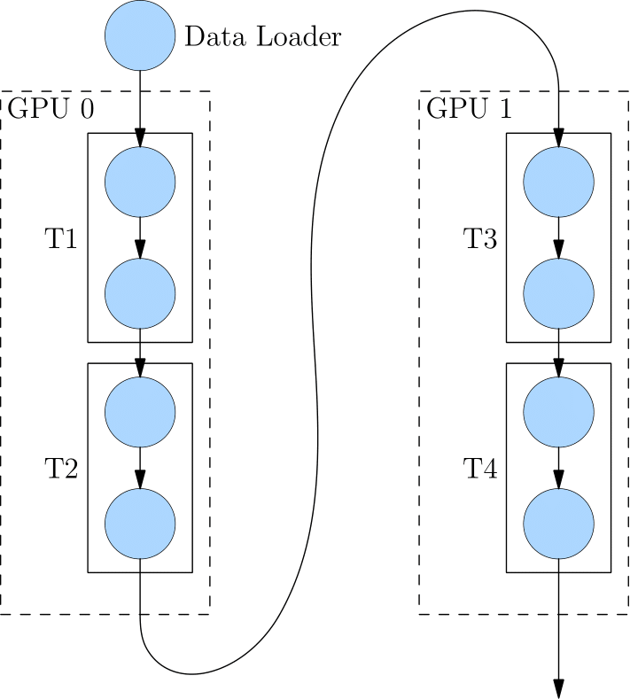

# 常见的分布式并行策略

## 为什么分布式训练越来越流行
近年来，深度学习被广泛应用到各个领域，包括计算机视觉、语言理解、语音识别、广告推荐等。在这些不同的领域中，一个共同的特点就是模型规模越来越大，比如 GPT-3 模型的参数量达到1750亿。即使用1024张 80 GB 的 A100，那么完整训练 GPT-3 的时长都需要1个月。

模型规模的扩大，对硬件（算力、内存）的发展提出要求。然而，因为 [内存墙](https://oneflow.org/a/share/jishuboke/75.html) 的存在，单一设备的算力及容量，受限于物理定律，持续提高芯片的集成越来越困难，难以跟上模型扩大的需求。

为了解决算力增速不足的问题，人们考虑用多节点集群进行分布式训练，以提升算力，分布式训练势在必行。

## 常见的并行策略

简单的机器堆叠并不一定会带来算力的增长。因为神经网络的训练并不是单纯的“把原来一个设备做的事情，现在分给多个设备各自做”，它不仅需要多个设备进行计算，还涉及到设备之间的数据传输，只有协调好集群中的计算与通信，才能做高效的分布式训练。

我们将以矩阵乘法的例子，解释数据并行、模型并行的区别。

先了解以下逻辑上的矩阵乘法例子:

假设神经网络中某一层是做矩阵乘法，其中的输入 $x$ 的形状为 $4\times5$，模型参数 $w$ 的形状为 $5\times8$，那么，矩阵乘法输出形状为 $4\times8$。示意图如下：

单机单卡的训练中，以上矩阵乘法，先计算得到 $out$，并将 $out$ 传递给下一层，并最终计算得到 $loss$，然后在反向传播过程中，得到 $\frac{\partial loss}{\partial w}$，用于更新 $w$。

分布式训练中，依据是切分 $x$ 还是 $w$ 的不同，分为“数据并行”和“模型并行”策略。接下来，我们介绍常见的并行策略。

### 数据并行
所谓的数据并行，就是将数据 $x$ 进行切分，而每个设备上的模型 $w$ 是完整的、一致的。如下图所示，$x$ 被按照第0维度平均切分到2个设备上，两个设备上都有完整的 $w$。

这样，在两台设备上，分别得到的输出，都只是逻辑上输出的一半（形状为 $2\times8$），将两个设备上的输出拼接到一起，才能得到逻辑上完整的输出。

注意，因为数据被分发到了2个设备上，因此反向传播过程，各自设备上得到的 $\frac{\partial loss}{\partial w}$ 会不一样，如果直接使用各个设备上的梯度更新各自的模型，会造成2个设备上的 **模型不一致**，训练就失去了意义（到底用哪个模型好呢？）。

因此，数据并行策略下，在反向传播过程中，需要对各个设备上的梯度进行 [AllReduce](https://docs.nvidia.com/deeplearning/nccl/user-guide/docs/usage/collectives.html#allreduce)，以确保各个设备上的模型始终保持一致。

当数据集较大，模型较小时，由于反向过程中为同步梯度产生的通信代价较小，此时选择数据并行一般比较有优势，常见的视觉分类模型，如 ResNet50，比较适合采用数据并行。

### 模型并行

当神经网络非常巨大，数据并行同步梯度的代价就会很大，甚至网络可能巨大到无法存放到单一计算设备中，这时候，可以采用模型并行策略解决问题。

所谓的模型并行，就是每个设备上的数据是完整的、一致的，而模型 $w$ 被切分到了各个设备上，每个设备只拥有模型的一部分，所有计算设备上的模型拼在一起，才是完整的模型。

如下图所示，$w$ 被按照第1维度平均切分到2个设备上，两个设备上都有完整的 $x$。两个设备上的输出也需要通过拼接才能得到逻辑上的输出。

模型并行的好处是，省去了多个设备之间的梯度 AllReduce；但是，由于每个设备都需要完整的数据输入，因此，数据会在多个设备之间进行广播，产生通信代价。比如，上图中的最终得到的 $out~(4\times8)$ ，如果它作为下一层网络的输入，那么它就需要被广播发送到两个设备上。

语言模型，如 BERT，常采用模型并行。

### 流水并行
当神经网络过于巨大，无法在一个设备上存放时，除了上述的模型并行的策略外，还可以选择流水并行。
流水并行指将网络切为多个阶段，并分发到不同的计算设备上，各个计算设备之间以“接力”的方式完成训练。

如下图，展示了一个逻辑上的4层网络（`T1` 至 `T4`)是如何做流水并行的。

4层网络被切分到2个计算设备上，其中 `GPU0` 上进行 `T1` 与 `T2` 的运算，`GPU1` 上进行 `T3` 与 `T4` 的计算。

`GPU0` 上完成前两层的计算后，它的输出被当作 `GPU1` 的输入，继续进行后两层的计算。

### 混合并行
网络的训练中，也可以将多种并行策略混用，以 GPT-3 为例，以下是它训练时的设备并行方案：

它首先被分为 64 个阶段，进行流水并行。每个阶段都运行在 6 台 DGX-A100 主机上。在6台主机之间，进行的是数据并行训练；每台主机有 8 张 GPU 显卡，同一台机器上的8张 GPU 显卡之间是进行模型并行训练。

并行策略的选择影响着训练效率，框架对并行训练的接口支持程度，决定了算法工程师的开发效率。OneFlow 针对分布式训练所做的系统级设计和创新，为用户轻松上手分布式训练做足了铺垫。我们将在本专题的其它文章中看到相关示例。