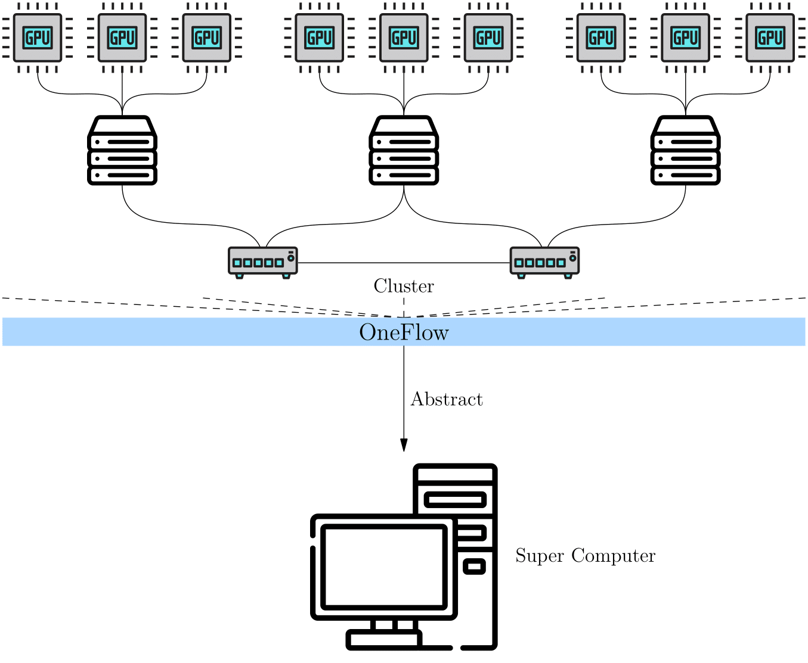
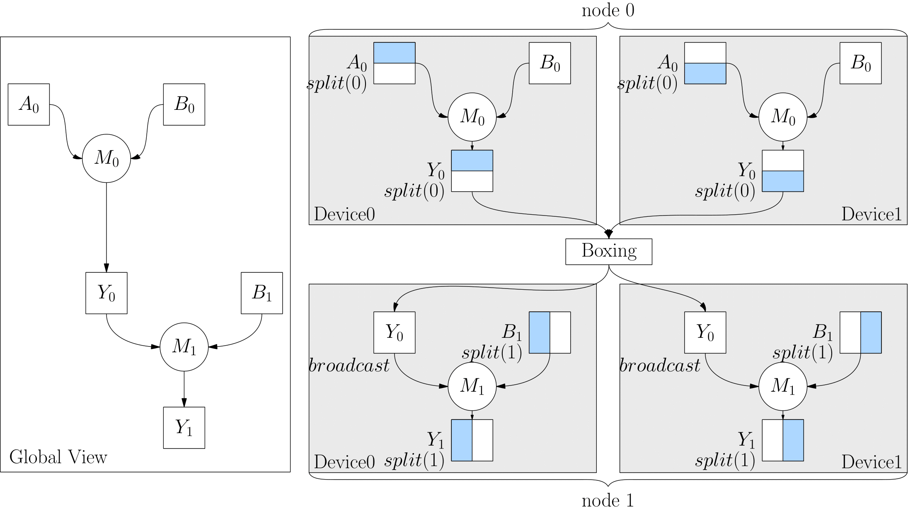

# 集群的全局视角

OneFlow 提出了 **全局视角（Global View）** 的概念，用于简化分布式训练。简单而言，在 OneFlow 的全局视角下，集群被抽象为一台“超级计算设备”。

用户不用关心集群中计算、通信的细节，只需关心逻辑上的数据与计算，依然像单机单卡那样思考、编程，就能进行分布式训练。



OneFlow 的全局视角，依赖几个重要概念：Placement、SBP 与 SBP Signature。

## Placement

OneFlow 全局视角下的 Tensor 有 `placement` 属性，通过 `placement` 属性可以指定该 Tensor 存放在哪个物理设备上。

OneFlow 会自动为集群中的计算设备编号。比如，如果集群中有 4 台主机，每台主机上有 8 张显卡，一共 32 张显卡，那么 OneFlow 会将这 32 张显卡自动编号为 0~31。

如果想将 Tensor 放置在第 0 台机器的前 4 张显卡上，只需要配置：`placement("cuda", [0, 1, 2, 3])`。

如果想将 Tensor 放置在第 0 台机器的后 4 张显卡上，只需要配置：`placement("cuda", [4, 5, 6, 7])`。

`placement` 使得 OneFlow 很容易支持流水并行，我们将在本专题的其它文章中看到与 `placement` 有关的实际例子。

## SBP

SBP 是 OneFlow 发明的概念，描述了“超级计算设备”全局视角下的数据与集群中真实的物理设备上的数据的映射关系，它由 `split`, `broadcast`, `partial` 的首字母组合而成。

详细而言：

- `split` 表示物理设备上的 Tensor，是将全局视角的 Tensor 切分得到的。切分时，需要指定切分的维度。物理设备上的 Tensor ，经过拼接，可以还原得到全局视角的 Tensor 。
- `broadcast` 表示全局视角下的 Tensor，会复制并广播到所有的物理设备上。
- `partial` 表示全局视角下的 Tensor 与物理设备上的 Tensor 的 **形状相同**，但是物理设备上的值，只是全局视角下 Tensor 的 **一部分**。以 `partial sum` 为例，如果我们将集群中所有设备的张量按位置相加，那么就可以还原得到全局视角的 Tensor。除了 `sum` 外，`min`、`max` 等操作也适用于 `partial`。

下图中分别展示了 SBP 的情况，分别是 `split(0)`、`split(1)`、`broadcast` 和 `partial sum`。


在创建 Global Tensor 时，可以指定 Tensor 的 SBP，实际的代码例子将在下一篇文章 [Global Tensor](./03_consistent_tensor.md) 中看到。

## SBP Signature

SBP 描述了全局视角下的数据与物理设备上的数据的映射关系，当进行分布式训练时，OneFlow 根据数据的 SBP 属性，将数据分发到各个物理设备，进行计算，并输出结果。

对于一个孤立的 Tensor，我们可以随意设置它的 SBP 属性。
但是，对于一个有输入、输出数据的算子，我们却不可以随意设置它的输入、输出的 SBP 属性。这是因为随意设置一个算子输入输出的 SBP 属性，可能不符合全局视角下算子的运算法则。

让我们以矩阵乘法为例讨论这个问题。看看在有2个设备的分布式系统中，矩阵乘法的输入、输出的 SBP 要如何组合才合法，如何组合不合法。

假设全局视角下要，一个形状为 $(m, k)$ 的矩阵 $A$ 与形状为 $(k, n)$ 的矩阵 $B$ 相乘得到 $Y$，$Y$ 的形状必然为 $(m, n)$。

依据矩阵乘法的规律，我们可以将矩阵 $A$ 按第0维进行切分，切分为形状分别为 $(m_0, k)$、$(m_1, k)$ 的两个矩阵：$A_0$ 和 $A_1$，然后在2个设备上分别计算：

设备一：

$$
\begin{matrix}
A_0     \times     B     =     Y_0
\\
(m_0, k)     (k, n)      (m_0, n)
\end{matrix}
$$

设备二：

$$
\begin{matrix}
A_1     \times     B     =     Y_1
\\
(m_1, k)     (k, n)      (m_1, n)
\end{matrix}
$$

我们容易得到物理设备上的 $A_0$、$A_1$ 与全局视角 $A$ 的关系，以及 $Y_0$、$Y_1$ 与全局视角数据 $Y$ 的关系：

$$
\begin{matrix}
A &= concat&(A_0 ,& A_1) \\
(m,k) &  & (m_0, k) & (m_1, k)
\end{matrix}
$$

$$
\begin{matrix}
Y &= concat&(Y_0 ,& Y_1) \\
(m,n) &  & (m_0, n) & (m_1, n)
\end{matrix}
$$

> 注意：以上的 `concat` 表示拼接操作。

可见，按照以上的方式，将全局视角的数据分发到各个物理设备上，是能够完成运算，并且最终得到全局视角上的正确结果的。以上较长的篇幅，若 **使用 SBP 来描述，会变得异常简单** ：

$A$ 为 `split(0)`， $B$ 为 `broadcast`，运算结果 $Y$ 为 `split(0)`。

可见，对于矩阵乘法而言，其输入输出的 SBP，按以上方式组合，是合法的。对于矩阵乘法而言，**合法的 SBP 组合不止一种**，比如还可以是：

$A$ 为 `broadcast`， $B$ 为 `split(1)`，运算结果 $Y$ 为 `split(1)`。

或者：

$A$ 为 `split(1)`， $B$ 为 `split(0)`，运算结果 $Y$ 为 `partial sum`。

虽然展示了多个合法的 SBP 组合，但是并不是任意的 SBP 组合都是合法的，比如对于矩阵乘法，如果 $A$、$B$ 均为 `split(0)`，那么：

$$
\begin{matrix}
A &= concat&(A_0 ,& A_1) \\
(m,k) &  & (m_0, k) & (m_1, k)
\end{matrix}
$$

$$
\begin{matrix}
B &= concat&(B_0 ,& B_1) \\
(k,n) &  & (k_0, n) & (k_1, n)
\end{matrix}
$$

那么在物理设备上，因为 $A_0$ 与 $B_0$ 的形状，并不满足矩阵乘法的要求，也就无法在物理设备上完成矩阵乘法。我们可以说， $A$ 为 `split(0)`， $B$ 为 `split(0)` 的 SBP 组合是不合法的。

我们将上文出现的，对于某个算子，其输入输出的一个 **特定的、合法的 SBP 组合**，称为这个算子的一个 **SBP Signature**。

## SBP Signature 自动推导

有了 SBP Signature 的概念后，我们可能会提出几个问题：

- 用户是否要知道算子的所有 SBP Signature，才能用 OneFlow 做好分布式训练？
- 作为算法工程师，用户是否要为每层网络都设置输入的 SBP？

对于前一个问题，用户当然不需要知晓算子所有的 SBP Signature。罗列某个算子所有可能的 SBP Signature 的工作，是 **算子作者** 的责任。算子作者根据算子的运算法则，在开发算子时，就已经罗列并预设好该算子所有可能的 SBP Signature。

这顺便就解答了第二个问题：因为有预设好的 SBP Signature，所以，某一层算子只要有输入的 SBP，OneFlow 就可以根据 SBP Signature 推导出该层算子输出的 SBP。而上游算子的输出，又是下游算子的输入，这样，就确定了下游算子输入的 SBP，然后又可以根据 SBP Signature 确定更下游输出的 SBP……
这样不断推导、传播。因此通常情况下，用户是不需要为每层网络都设置输入的 SBP。而只有最初输入层，或者需要强制指定某层的 SBP 时，才需要显式指定。

用户还可能会有新的问题：

- 一个算子的合法 SBP Signature 常常有多个，OneFlow 运行时到底会选择哪一个呢，它是依据什么做出选择的？

对于这个问题，需要了解 OneFlow 的 **SBP Signature 自动推导** 机制。所谓的 SBP Signature 自动推导，指的是：在给定所有算子的所有合法的 SBP Signature 的前提下，OneFlow 有一套算法，会基于传输代价为每种合法的 SBP Signature 进行打分，并选择传输代价最小的那个 SBP Signature。这样使得系统的吞吐效率最高。

### Boxing 机制

严格地说，OneFlow 的 Boxing 机制对于用户其实是透明的，用户使用 OneFlow 做分布式训练时，不用知晓它也感知不到它。

但是，鉴于某些深入思考的用户，可能了解 SBP Signature 自动推导后，会自然提出以下问题：

- 如果 OneFlow 自动选择的 SBP Signature，上一层算子的输出与下一层算子的输入的 SBP 属性不匹配时，那怎么办呢？

举个具体例子，比如以下代码中，上一层算子 `matmul` 的输出 SBP 本来是 `split(0)`，但是下一层算子 `matmul` 的输入，被转成了 `broadcast`。此时，上一层的输出与下一层的输入，它们的 SBP 其实就不一致了。

```python
import oneflow as flow

P0 = flow.placement("cuda", ranks=[0, 1])
P1 = flow.placement("cuda", ranks=[2, 3])
a0_sbp = flow.sbp.split(0)
b0_sbp = flow.sbp.broadcast
y0_sbp = flow.sbp.broadcast
b1_sbp = flow.sbp.split(1)

A0 = flow.randn(4, 5, placement=P0, sbp=a0_sbp)
B0 = flow.randn(5, 8, placement=P0, sbp=b0_sbp)
Y0 = flow.matmul(A0, B0)

Y0 = Y0.to_global(placement=P1, sbp=y0_sbp)
B1 = flow.randn(8, 6, placement=P1, sbp=b1_sbp)
Y2 = flow.matmul(Y0, B1)
```

这种情况下，OneFlow 其实会检测到这种不一致，并且在上游的输出和下游的输入间插入一个算子，做相关的转换工作。这类自动加入做转换的算子，就称为 **Boxing 算子**。

以上代码的逻辑图和物理执行图的对应关系如下：



## 总结

`placement` 与 `SBP`、`SBP Signature` 是 OneFlow 分布式全局视角的重要保证，OneFlow 的全局视角使得 OneFlow 的分布式训练与单机单卡一样简单。

通常情况下，用户只需要在起始网络层设置 `SBP`，由此可以省略传统分布式训练中手写通信操作的麻烦。更值得一提的是，除了本文介绍的 SBP Signature 自动推导机制外，OneFlow 团队正在研发一种寻求全局最优解的自动并行方法，正在内测，等它上线后，用户可以不做任何 SBP 配置就得到很好的分布式训练效果，敬请期待。

在下一篇 [Global Tensor](./03_consistent_tensor) 中，我们将看到全局视角的编程例子。
