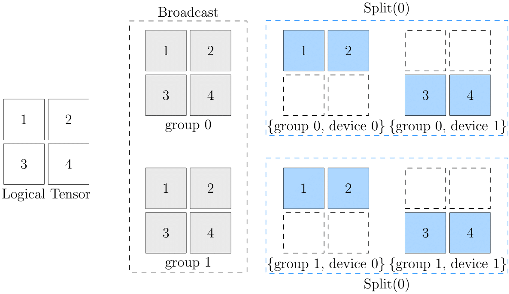

# 2D SBP

阅读 [集群的全局视角](./02_sbp.md) 和 [Global Tensor](./03_consistent_tensor.md) 之后，相信你已经掌握了 SBP 和 SBP Signature 的基本概念，并且能够上手相关的编程任务。实际上，以上资料中涉及都是 **1D SBP**。

本文将在读者掌握 1D SBP 的基础上，介绍 2D SBP，它能够更灵活地应对更复杂的分布式训练场景。

## 2D 设备阵列

我们已经熟悉 1D SBP 的 placement 配置，在 1D SBP 的场景下，通过 [oneflow.placement](https://start.oneflow.org/oneflow-api-cn/placement.html#oneflow.placement) 接口配置集群，比如使用集群中的第 0~3 号 GPU 显卡：

```python
>>> placement1 = flow.placement("cuda", ranks=[0, 1, 2, 3])
```

以上的 `"cuda"` 指定了设备类型，`ranks=[0, 1, 2, 3]` 指定了集群中的计算设备。其实，`ranks` 不仅可以是一维的int list，还可以是多维的int数组：

```python
placement2 = flow.placement("cuda", ranks=[[0, 1], [2, 3]])
```

当 `ranks` 是 `ranks=[0, 1, 2, 3]` 这种一维list的形式时，集群中的所有设备组成了一个 1D 设备向量，这也是 1D SBP 名称的由来。

当 `ranks` 是多维数组的形式时，集群中的设备被分组为一个多维的设备阵列。`ranks=[[0, 1], [2, 3]]` 表示集群中的四个计算设备被划分为了 $2 \times 2$ 的设备阵列。

## 2D SBP

我们已经知道，构造 Global Tensor 时，需要同时指定 `placement` 与 `SBP`。当 `placement` 中的集群是 2 维的设备阵列时；SBP 也必须与之对应，是一个长度为 2 的 `tuple`，这个`tuple`中的第 0 个、第 1 个 元素，分别描述了 Global Tensor 张量在设备阵列第 0 维、第 1 维的分布。

比如，以下代码，配置了 $2 \times 2$ 的设备阵列，并且设置 2D SBP 为 `(broadcast, split(0))`。

```python
>>> a = flow.Tensor([[1,2],[3,4]])
>>> placement = flow.placement("cuda", ranks=[[0, 1], [2, 3]])
>>> sbp = (flow.sbp.broadcast, flow.sbp.split(0))
>>> a_to_global = a.to_global(placement=placement, sbp=sbp)
```

它意味着，逻辑上的数据，在整个设备阵列上，在第 0 维度（“竖着看”）做 `broadcast`；在第 1 维度（“横着看”）做 `split(0)`。

我们通过下图做阐述：



此图的最左边是全局视角的数据，最右边是设备阵列上各个设备的数据。可以看到，从第 0 维的角度看，它们都是 `broadcast` 的关系：

- (group0, device0) 与 (group1, device0) 中数据一致，互为 `broadcast` 关系
- (group0, device1) 与 (group1, device1) 中数据一致，互为 `broadcast` 关系

而从第 1 维的角度看，它们都是 `split(0)` 的关系：

- (group0, device0) 与 (group0, device1) 互为 `split(0)` 关系
- (group1, device0) 与 (group1, device1) 互为 `split(0)` 关系

直接理解逻辑数据和最终的设备阵列中的物理数据对应关系可能有一定难度，大家在思考 2D SBP 时，可以假想一个中间状态（上图中灰色部分），以 `(broadcast, split(0))` 为例：

- 原始逻辑张量，先经过 `broadcast`，广播到 2 个 group 上，得到中间的状态
- 在中间状态的基础上，继续在各自的 group 上，做 `split(0)`，得到最终设备阵列中各个物理张量的状态

## 2D SBP Signature

类似 1D SBP 有 SBP Signature 的概念，算子也有 2D SBP Signature，在掌握了 1D SBP 及其 Signature 概念的基础上，2D SBP Signature 非常简单，只需要遵循一条原则：

- 在各自的维度上独立推导即可

我们以矩阵乘法为例，先回顾 1D SBP 的情况，假定有 $x \times w = y$ 可以有以下的 SBP Signature：

$$ broadcast \times split(1) = split(1) $$

以及

$$ split(0) \times broadcast = split(0) $$

现在，假定我们给 $x$ 设置了 2D SBP 为：$(broadcast, split(0))$， 给 $w$ 设置 2D SBP 为 $(split(1), broadcast)$，那么，在 2D SBP 的背景下， $x \times w = y$ 运算，得到 $y$ 的 SBP 属性为 $(split(1), split(0))$。

也就是说，以下几个 2D SBP，构成矩阵乘法的 2D SBP Signature：

$$ (broadcast, split(0)) \times (split(1), broadcast) =  (split(1), split(0)) $$


## 2D SBP 使用示例
在本节中，我们将在 CIFAR10 数据集上训练 MobileNetv2 模型，以演示如何使用 2D SBP 进行分布式训练。同上文中的例子，假设有一个 $2 \times 2$ 的设备阵列，鉴于读者可能目前并没有多个 GPU 设备，我们将使用 **CPU** 来模拟 $2 \times 2$ 设备阵列的情形，并采取 [常见的分布式并行策略](./01_introduction.md) 中所介绍的“数据并行”策略。

??? code
    ```python
    import oneflow as flow
    import oneflow.nn as nn
    import flowvision
    import flowvision.transforms as transforms

    BATCH_SIZE=64
    EPOCH_NUM = 1
    DEVICE = "cpu"
    print("Using {} device".format(DEVICE))

    PLACEMENT = flow.placement(DEVICE, ranks=[[0, 1], [2, 3]])
    BROADCAST = (flow.sbp.broadcast, flow.sbp.broadcast)
    BS0 = (flow.sbp.broadcast, flow.sbp.split(0))

    training_data = flowvision.datasets.CIFAR10(
        root="data",
        train=True,
        transform=transforms.ToTensor(),
        download=True,
    )

    train_dataloader = flow.utils.data.DataLoader(
        training_data, BATCH_SIZE, shuffle=True
    )

    model = flowvision.models.mobilenet_v2().to(DEVICE)
    model.classifer = nn.Sequential(nn.Dropout(0.2), nn.Linear(model.last_channel, 10))
    model = model.to_global(placement=PLACEMENT, sbp=BROADCAST)

    loss_fn = nn.CrossEntropyLoss().to(DEVICE)
    optimizer = flow.optim.SGD(model.parameters(), lr=1e-3)

    for t in range(EPOCH_NUM):
        print(f"Epoch {t+1}\n-------------------------------")
        size = len(train_dataloader.dataset)
        for batch, (x, y) in enumerate(train_dataloader):
            x = x.to_global(placement=PLACEMENT, sbp=BS0)
            y = y.to_global(placement=PLACEMENT, sbp=BS0)

            # Compute prediction error
            pred = model(x)
            loss = loss_fn(pred, y)

            # Backpropagation
            optimizer.zero_grad()
            loss.backward()
            optimizer.step()

            current = batch * BATCH_SIZE
            if batch % 5 == 0:
                print(f"loss: {loss:>7f}  [{current:>5d}/{size:>5d}]")
    ```

可以发现，上述流程与普通的单机单卡训练流程相差无几，主要区别在于以下几点：

- 定义要使用到的 placement 和 sbp：

```python
    PLACEMENT = flow.placement(DEVICE, ranks=[[0, 1], [2, 3]])
    BROADCAST = (flow.sbp.broadcast, flow.sbp.broadcast)
    BS0 = (flow.sbp.broadcast, flow.sbp.split(0))
```
其中， `PLACEMENT` 的 `ranks` 参数是一个二维 list，代表将集群中的设备划分成 $2 \times 2$ 的设备阵列。如前文所述，SBP 需要与其对应，指定为长度为 2 的 tuple。


- 将模型在集群上广播：

```python
    model = model.to_global(placement=PLACEMENT, sbp=BROADCAST)
```

- 将数据在集群上进行广播和切分：

```python
    x = x.to_global(placement=PLACEMENT, sbp=BS0)
    y = y.to_global(placement=PLACEMENT, sbp=BS0)
```
这里对数据所进行的操作与上文中介绍的例子相同，只不过操作的不是一个 $2 \times 2$ 的张量，而是从 DataLoader 中获取的训练数据。


通过 `oneflow.distributed.launch` 模块可以方便地启动分布式训练，在终端中执行下列命令 （假设上述代码已经保存至当前目录中的名为 "2d_sbp.py" 的文件中）：
```bash
python3 -m oneflow.distributed.launch --nproc_per_node=4 2d_sbp.py
```
在此，通过将参数 `nproc_per_node` 指定为 4 来创建四个进程，模拟共有 4 个 GPU 的情形。
关于此模块的详细用法，请参见：[用 launch 模块启动分布式训练](./04_launch.md)。
