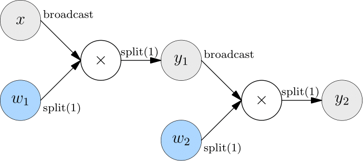
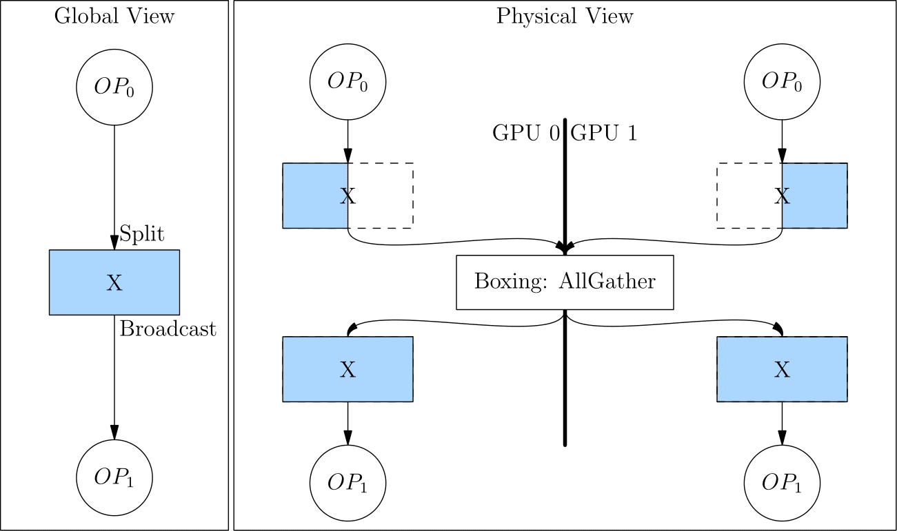

# Consistent Tensor

## 一致性视角与物理视角的映射


## 创建 Consistent Tensor
要在有2张 GPU 显卡的主机上交互式体验 consistent tensor，可以用以下方式在2个控制台分别启动 python。

=== "Terminal 0"
    ```shell
    export MASTER_ADDR=127.0.0.1
    export MASTER_PORT=17789
    export WORLD_SIZE=2
    export RANK=0
    export LOCAL_RANK=0
    python3
    ```

=== "Terminal 1"
    ```shell
    export MASTER_ADDR=127.0.0.1
    export MASTER_PORT=17789
    export WORLD_SIZE=2
    export RANK=1
    export LOCAL_RANK=1
    python3
    ```

### 直接创建 consistent tensor

在两个控制台，分别导入 `oneflow`，并创建 `x`。

其中 `flow.placement("cuda",{0:[0,1]})` 指定了 consistent tensor 在集群的范围。
- `"cuda"` 表示在 GPU 设备上。
- `placement` 的第二个参数是一个字典，它的 `key` 代表机器编号，`value` 代表显卡编号。因此 `{0:[0,1]}` 表示 consistent tensor 在第 0 台机器的第0、1张显卡上。

=== "Terminal 0"
    ```python
    import oneflow as flow

    placement = flow.placement("cuda",{0:[0,1]})
    sbp = flow.sbp.split(0)
    x = flow.randn(4,5,placement=placement, sbp=sbp)
    x.shape
    ```

=== "Terminal 1"
    ```python
    import oneflow as flow

    placement = flow.placement("cuda",{0:[0,1]})
    sbp = flow.sbp.split(0)
    x = flow.randn(4,5,placement=placement, sbp=sbp)
    x.shape
    ```

输出：

=== "Terminal 0"
    ```text
    flow.Size([4, 5])
    ```

=== "Terminal 1"
    ```text
    flow.Size([4, 5])
    ```

### 由 consistent tensor 得到 local tensor

通过 [to_local](todo_rst_to_local.rst) 方法可以查看物理设备上的 local tensor：

=== "Terminal 0"
    ```python
    x.to_local()
    tensor([[ 2.9186e-01, -3.9442e-01,  4.7072e-04, -3.2216e-01,  1.7788e-01],
            [-4.5284e-01,  1.2361e-01, -3.5962e-01,  2.6651e-01,  1.2951e+00]],
        device='cuda:0', dtype=oneflow.float32)
    ```

=== "Terminal 1"
    ```python
    x.to_local()
    tensor([[-0.4363,  0.9985, -2.5387,  0.3003,  0.3803],
            [ 0.0556, -0.8077,  1.1191, -2.1278,  0.1468]], device='cuda:1',
        dtype=oneflow.float32)
    ```

### 由 local tensor 转换得到 consistent tensor

可以先创建 local tensor，再利用 [Tensor.to_consistent](todo_rst_to_consistent.md) 方法，将 local tensor 转为 consistent tensor。

下面的例子中，在2台设备上分别创建了 `shape=(2,5)` 的2个 local tensor。
注意经过 `to_consistent` 方法后，得到的 consistent tensor 的 `shape` 为 `(4,5)`。

这是因为选择的 `sbp=flow.sbp.split(0)`，2个形状为 `(2,5)` 的 local tensor，需要在第0维拼接，得到 `(4,5)` 的 consistent tensor。

=== "Terminal 0"
    ```python
    import oneflow as flow

    x = flow.randn(2,5)
    placement = flow.placement("cuda",{0:[0,1]})
    sbp = flow.sbp.split(0)
    x_consistent = x.to_consistent(placement=placement, sbp=sbp)
    x_consistent.shape
    ```

=== "Terminal 1"
    ```python
    import oneflow as flow

    x = flow.randn(2,5)
    placement = flow.placement("cuda",{0:[0,1]})
    sbp = flow.sbp.split(0)
    x_consistent = x.to_consistent(placement=placement, sbp=sbp)
    x_consistent.shape
    ```

## 实践 SBP Signature 的作用
### 数据并行
以下的代码对应了 [常见的分布式策略](./01_introduction.md#_4) 的数据并行。


=== "Terminal 0"
    ```python
    import oneflow as flow

    placement = flow.placement("cuda",{0:[0,1]})
    x = flow.randn(4,5,placement=placement, sbp=flow.sbp.split(0))
    w = flow.randn(5,8,placement=placement, sbp=flow.sbp.broadcast)
    y = flow.matmul(x,w)
    y.sbp
    y.shape
    ```

=== "Terminal 1"
    ```python
    import oneflow as flow

    placement = flow.placement("cuda",{0:[0,1]})
    x = flow.randn(4,5,placement=placement, sbp=flow.sbp.split(0))
    w = flow.randn(5,8,placement=placement, sbp=flow.sbp.broadcast)
    y = flow.matmul(x,w)
    y.sbp
    y.shape
    ```

可以观察到，`flow.matmul` 根据输入 `x` 与 `w` 的 SBP 分别为 `split(0)`、`broadcast`。OneFlow 自动推倒出输出 `y` 的 SBP 应该为 `split(0)`，完成计算，得到 `shape=(4,8)` 的矩阵。输出：

=== "Terminal 0"
    ```text
    (oneflow.sbp.split(axis=0),)
    flow.Size([4, 8])
    ```

=== "Terminal 1"
    ```text
    (oneflow.sbp.split(axis=0),)
    flow.Size([4, 8])
    ```

### 模型并行

以下的代码对应了 [常见的分布式策略](./01_introduction.md#_5) 的模型并行。


=== "Terminal 0"
    ```python
    import oneflow as flow

    placement = flow.placement("cuda",{0:[0,1]})
    x = flow.randn(4,5,placement=placement, sbp=flow.sbp.broadcast)
    w = flow.randn(5,8,placement=placement, sbp=flow.sbp.split(1))
    y = flow.matmul(x,w)
    y.sbp
    y.shape
    ```

=== "Terminal 1"
    ```python
    import oneflow as flow

    placement = flow.placement("cuda",{0:[0,1]})
    x = flow.randn(4,5,placement=placement, sbp=flow.sbp.broadcast)
    w = flow.randn(5,8,placement=placement, sbp=flow.sbp.split(1))
    y = flow.matmul(x,w)
    y.sbp
    y.shape
    ```

可以观察到，`flow.matmul` 根据输入 `x` 与 `w` 的 SBP 分别为 `broadcast`、`split(1)`。OneFlow 自动推倒出输出 `y` 的 SBP 应该为 `split(1)`，完成计算，得到 `shape=(4,8)` 的矩阵。输出：

=== "Terminal 0"
    ```text
    (oneflow.sbp.split(axis=1),)
    flow.Size([4, 8])
    ```

=== "Terminal 1"
    ```text
    (oneflow.sbp.split(axis=1),)
    flow.Size([4, 8])
    ```

## 扩展阅读 - Boxing：自动转换 SBP

我们已经通过以上代码的例子，知道一个算子会根据输入 tensor 的 SBP 属性以及算子内置的 SBP Signature，自动设置输出 tensor 的 SBP。

但是，细心的用户可能会进一步思考，如果上游算子输出 tensor 的 SBP，与下游算子输入的需要不一致时，怎么办呢？

比如，假设在数据并行中，有2层矩阵乘法，在第一层和和第二层都做模型并行。




因为第一层的输出的 SBP（`split(1)`），并不是第二层输入所期待的（`broadcast`），这时候，OneFlow 会自动在上一层的输出和下一层的输出之间，插入 Boxing 操作，利用集合通信进行必要的数据转换。

从 `split(1)` 转换为 `broadcast`，相当于做了一次 `AllGather` 操作。如下图所示。



因为有 Boxing 机制的存在，使得用户只用关心少数关键地方（如 source 算子）的 SBP 设置，剩下的全部都可以交给 OneFlow 框架。
