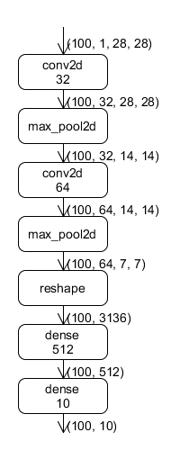

# 使用OneFlow搭建神经网络

在 [识别 MNIST 手写体数字](../quick_start/lenet_mnist.md) 的例子中，我们通过 `flow.layers` 和 `flow.nn` 中提供的接口搭建了一个简单的 LeNet 网络。下面，我们将通过LeNet来介绍 Onflow 中网络搭建的核心元素—算子(op)和层(layer)。

LeNet 是一个主要由卷积层、池化层和全连接层组成的神经网络。

<div align="center">

</div>

上图中有两类元素，一类是方框代表的运算单元，包括 `op` 和 `layer` 两类，比如 `conv2d` 、 `dense` 、 `max_pool2d` 等；一类是箭头代表的数据。它对应了以下代码：

```python
def lenet(data, train=False):
    initializer = flow.truncated_normal(0.1)
    conv1 = flow.layers.conv2d(
        data,
        32,
        5,
        padding="SAME",
        activation=flow.nn.relu,
        name="conv1",
        kernel_initializer=initializer,
    )
    pool1 = flow.nn.max_pool2d(
        conv1, ksize=2, strides=2, padding="SAME", name="pool1", data_format="NCHW"
    )
    conv2 = flow.layers.conv2d(
        pool1,
        64,
        5,
        padding="SAME",
        activation=flow.nn.relu,
        name="conv2",
        kernel_initializer=initializer,
    )
    pool2 = flow.nn.max_pool2d(
        conv2, ksize=2, strides=2, padding="SAME", name="pool2", data_format="NCHW"
    )
    reshape = flow.reshape(pool2, [pool2.shape[0], -1])
    hidden = flow.layers.dense(
        reshape,
        512,
        activation=flow.nn.relu,
        kernel_initializer=initializer,
        name="dense1",
    )
    if train:
        hidden = flow.nn.dropout(hidden, rate=0.5, name="dropout")
    return flow.layers.dense(hidden, 10, kernel_initializer=initializer, name="dense2")
```

作业函数运行时，`data` 是形状为 `100x1×28×28` 的数据，`data` 首先作为 `conv2d` 的输入参与卷积计算，得到计算结果`conv1` ，然后 `conv1` 作为输入传给 `max_pool2d` ，依此类推。

## op 和 layer
算子（Op）是比较常用的一种概念，是 OneFlow 中基本的运算单元，上文代码中的 `reshape` 和 `nn.max_pool2d` 就是两种算子。

`layers.conv2d` 和 `layers.dense` 不是基本的运算单元，它们是由算子组合成的特定的运算层（layer）。层的存在使得搭建神经网络更方便，相关接口使用请参考 [oneflow.layers API](https://oneflow.readthedocs.io/en/master/layers.html)。

通过阅读 [oneflow.layers 源码](https://github.com/Oneflow-Inc/oneflow/blob/master/oneflow/python/ops/layers.py) ，可以学习由基本算子构建运算层的细节。

## 网络构建过程中的数据块
OneFlow 默认模式是静态图机制，网络的构建和运行过程其实是分开的。因此，在定义网络时，各个变量中 **并没有** 真实的数据，它们只是数据的占位符。对于真实数据的计算发生在作业函数的调用过程中。

在构建网络时，我们只是描述了网络中各个节点的性质、形状（如 `shape`、`dtype`）与连接关系等，这些节点中没有具体的数值，仅仅只是 **数据占位符**， OneFlow 可以根据这种数据占位符进行编译推理，得到计算图。

这种数据占位符在 OneFlow 的语境中被称作 `Blob` ，在 OneFlow 中有对应的基类 `BlobDef`。

搭建网络时可以打印 `Blob` 的属性，比如以下代码打印 `conv1` 的 `shape` 和 `dtype` ：
```
print(conv1.shape, conv1.dtype)
```

**Blob 的运算符重载**
`BlobDef` 中定义了运算符重载，也就是说，`BlobDef` 对象之间可以进行加减乘除等操作。

例如下面这句代码中的加号：

```
output = output + fc2_biases
```
这句代码等价于：
```
output = flow.broadcast_add(output, fc2_biases)
```

## 总结
使用 OneFlow 进行神经网络搭建，需要 OneFlow 提供的算子或层作为计算单元。数据占位符 `Blob` 作为算子和层的输入和输出，运算符重载帮助简化了部分语句。

OneFlow 提供的算子可以参阅 API 文档中的：[oneflow.nn](https://oneflow.readthedocs.io/en/master/nn.html)、[oneflow.math](https://oneflow.readthedocs.io/en/master/math.html)、[oneflow.layers](https://oneflow.readthedocs.io/en/master/layers.html) 等模块。
