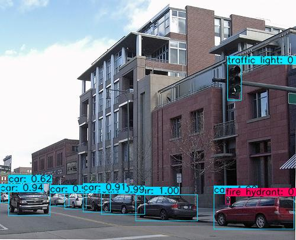
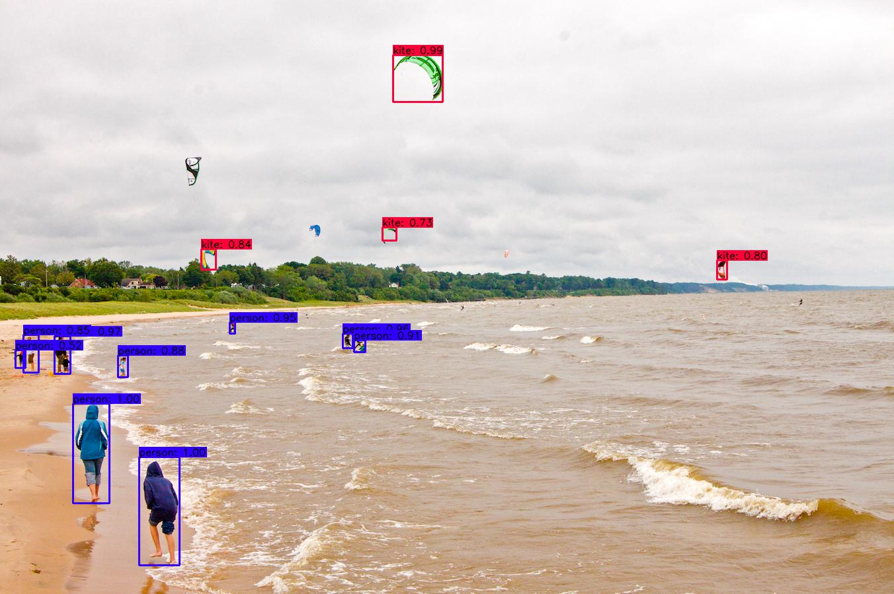

## YoloV3

## 1. Introduction

[YOLO](https://pjreddie.com/darknet/yolo/) series of algorithms (v1~v3), is the first single-stage object detection network, YOLO — You Only Look Once indicates its single-stage feature. Because the network is simple and the single-stage efficiency is fast, it is distinguished from the two-stage target detector represented by Faster-RCNN. Since it was released, it has become popular in the field of the target detection with its fast speed and high accuracy, and has been widely used and praised.

While Yolov3 is the classic and comprehensive one(of course, the official also released Yolov4 recently). It takes Darknet-53 with residual network as the backbone, and integrates features such as multi-scale, 3-way output feature map and upsampling, which greatly improves the model accuracy and small target detection capability.



In this article, we provide an OneFlow implementation of Yolov3. The difference is that we handle NMS process in C++ and call it by customizing user op. Of course, we also support handling NMS process in Python.


## 2. Quick Start

Before we start, please make sure you have installed [OneFlow](https://github.com/Oneflow-Inc/oneflow) properly.

1. Git clone [this repository](https://github.com/Oneflow-Inc/oneflow_yolov3)

```
git clone https://github.com/Oneflow-Inc/oneflow_yolov3.git
```
2. Install python dependency library

```
   pip install -r requirements.txt
```
3. Execute this script in project's root directory

```
bash scripts/test.sh
```
Execute this script to compile the operator defined in cpp code into a callable .so file. You will see in the project path.

- libdarknet.so

- liboneflow_yolov3.so


### Pretrain Model

We use the pretrain model—[yolov3.weight](https://pjreddie.com/media/files/yolov3.weights) provided by Yolov3 author, and generate the model in OneFlow format after transformation. Download pretrain model: [of_model_yolov3.zip](https://oneflow-public.oss-cn-beijing.aliyuncs.com/model_zoo/of_model_yolov3.zip), extract the `of_model` folder and put it in the root directory.


## 3. Predict/inference

Execute the following script：

```
sh yolo_predict.sh
```
Or：
```
sh yolo_predict_python_data_preprocess.sh
```

After executing the script, we will generate the images with bounding box under the `data/result`.



 Parameters description
- --pretrained_model    Pretrain model path

- --label_path                 Coco label path

- --input_dir                    The path of images folder to be detected

- --output_dir                 The output path of the detect structure

- --image_paths             Single/multiple paths of image to be detected. Like：

  --image_paths  'data/images/000002.jpg'  'data/images/000004.jpg'

The training is also very simple. After preparing dataset, we only need to execute `sh yolo_train.sh`. The process of preparing dataset is shown in the Preparing Dataset part.


## 4. Preparing Dataset

Yolov3 supports arbitrary object detection dataset. In the below we use [COCO2014](http://cocodataset.org/#download) as an example to create the training/validation dataset. Other datasets [PASCAL VOC](http://host.robots.ox.ac.uk/pascal/VOC/) or custom datasets, can be created in the same format.

### Resource file

Download COCO2014 training dataset and validation dataset. unzip it and put `train2014` and `val2014` under the `data/COCO/images` directory.

(If you have downloaded COCO2014 dataset locally, you can create a soft link of images to the parent directory of `train2014` and `val2014`)

Prepare resource file: `labels`, `5k.part`, `trainvalno5k.part`

```
wget -c https://pjreddie.com/media/files/coco/5k.part
wget -c https://pjreddie.com/media/files/coco/trainvalno5k.part
wget -c https://pjreddie.com/media/files/coco/labels.tgz
```

### Scripts

Execute the script in `data/COCO` directory:

```
# get label file
tar xzf labels.tgz

# set up image list
paste <(awk "{print \"$PWD\"}" <5k.part) 5k.part | tr -d '\t' > 5k.txt
paste <(awk "{print \"$PWD\"}" <trainvalno5k.part) trainvalno5k.part | tr -d '\t' > trainvalno5k.txt

# copy label txt to image dir
find labels/train2014/ -name "*.txt"  | xargs -i cp {} images/train2014/
find labels/val2014/   -name "*.txt"  | xargs -i cp {} images/val2014/
```

This script will automatically unzip `labels.tgz` file, and generate `5k.txt` and `trainvalno5k.txt` in current directory. Then copy all `label.txt` files in `labels/train2014` and `labels/val2014` to the corresponding training dataset and validation dataset folders (Make sure images and label are in the same directory).

At this point, the preparation of the whole dataset is completed.


## 5. Training

Modify the parameter in `yolo_train.sh` script, let `--image_path_file="data/COCO/trainvalno5k.txt"` and execute:

```
sh yolo_train.sh
```

Then we start training, more detailed parameters are described as follows:

- --gpu_num_per_node    The amount of devices on each machine
- --batch_size                     The batch size
- --base_lr                           The base learning rate
- --classes                           The number of target categories (COCO 80; VOC 20)
- --model_save_dir            The model storage path
- --dataset_dir                    The path of training/validation dataset
- --num_epoch                   The total epochs
- --save_frequency            Specify the epoch interval for model saving


## Descriptions

At present, if we call `yolo_predict.sh`. The data preprocessing is dependent on `darknet`

Among them:

In `predict decoder`, we call `load_image_color`, `letterbox_image` function.

In `train decoder`, we call `load_data_detection` function.
It mainly involves the following operations, which will be replaced in later versions with `OneFlow Decoder Ops`

- image read
- nhwc -> nchw
- image / 255
- bgr2rgb
- resize_image
- fill_image
- random_distort_image
- clip image
- random flip image and box
- randomize_boxes
- correct_boxes
