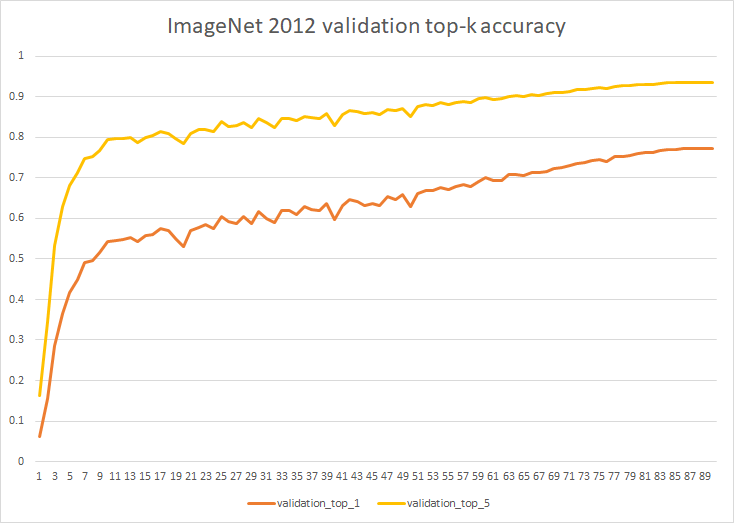
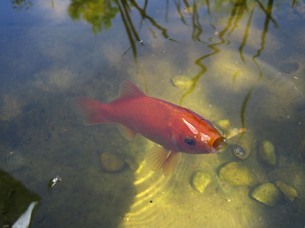

## Introduction

### Image classification and CNN

 **Image classification** refers to the image processing method that distinguishes the different types of targets from the different features reflected in the image information. It is the basis of other tasks in computer vision, such as target detection, semantic segmentation, and face recognition.

ImageNet Large-scale Visual Recognition Challenge (ILSVRC), often called ImageNet competition, includes tasks such as image classification, object positioning, and object detection. It is one of the most important competitions to promote the development of computer vision

In the 2012 ImageNet competition, the deep convolutional network AlexNet came out.With a top-5 accuracy rate exceeding the second place by more than 10%, he won the championship of ImageNet2012 competition.Since then, the deep learning method represented by **CNN (Convolutional Neural Network)** has begun to shine in the field of computer vision, and more and deeper CNN networks have been proposed, such as the champion of the ImageNet2014 competition ResNet, the champion of VGGNet, ImageNet2015 competition.


### ResNet

[ResNet](https://arxiv.org/abs/1512.03385) is the winner of the 2015 ImageNet competition.At present, ResNet is very good compared with traditional machine learning classification algorithms. After it came out, a large number of tasks such as detection, segmentation, and recognition are also completed on the basis of ResNet.

In this introduction, we provide the implementation of ResNet50 v1.5 in OneFlow.After 90 rounds of training on the ImageNet-2012 dataset, the accuracy on the validation set can reach: 77.318% (top1), 93.622% (top5).

For more detailed network parameter alignment, see [cnns of OneFlow-Benchmark](https://github.com/Oneflow-Inc/OneFlow-Benchmark/Classification/cnns)




**Notes on ResNet50 v1.5:**

> ResNet50 v1.5 is an improved version of the original [ResNet50 v1](https://arxiv.org/abs/1512.03385). Compared with the original model, the accuracy is slightly improved (~0.5% top1). For details, please refer to [here](https://github.com/NVIDIA/DeepLearningExamples/tree/master/MxNet/Classification/RN50v1.5).


Are you ready to get your hands dirty and reproduce the above results?


Below, this article takes the ResNet50 above as an example to show how to use OneFlow to train and predict the ResNet50 network step by step.

It mainly includes

- Preparation
  - Project installation and preparation

- Quick Start
  - Prediction/Inference
  - Training and Validation
  - Evaluation
- Detailed Introduction
  - Distributed Training
  - Mixed precision training and prediction
- Advanced
  - Parameter alignment
  - Dataset production (ImageNet2012)
  - Convert OneFlow model to ONNX model


## Requirements

Don't worry, It is very easy to use OneFlow. Just prepare the following three steps to start OneFlow's image recognition journey.

- When installing OneFlow, please refer to [OneFlow project homepage](https://github.com/Oneflow-Inc/oneflow)

- 克隆/下载[OneFlow-Benchmark](https://github.com/Oneflow-Inc/OneFlow-Benchmark)仓库。

  `git clone git@github.com:Oneflow-Inc/OneFlow-Benchmark.git`

  `cd  OneFlow-Benchmark/Classification/cnns`

- Prepare data set (optional)

  - Use synthetic virtual synthetic datasets directly
  - Download the Imagenet (2012) [mini data set](https://oneflow-public.oss-cn-beijing.aliyuncs.com/online_document/dataset/imagenet/mini-imagenet.zip) we made and unzip it into the data directory
  - Or: Make a complete ImageNet dataset in Ofrecord format (see the advanced section below)

We provide the general scripts: train.sh and inference.sh, which are suitable for training, verification, and inference of all cnn network models under this repository.You can use different models and datasets for training/inference by setting parameters.

 **Notes on the model:**

> By default, we use resnet50. You can also specify other models by changing the --model parameter in the script, such as: --model="resnet50", --model="vgg", etc.

**Notes on the dataset:**


> 1) In order to let readers get started quickly, we provide synthetic virtual synthetic data. "Synthetic data" refers to not loading data through disk, but directly generating some random data in memory as the data input source of neural network.
> 
> 2) At the same time, we provide a small mini sample dataset.Download and unzip it directly to the root directory of the cnn project to quickly start training.After being familiar with the process, readers can refer to the data set production part to make a complete Imagenet2012 data set.
> 
> 3) Using Ofrcord format data set can improve data loading efficiency (but it is not necessary, refer to [Data input](https://github.com/Oneflow-Inc/oneflow-documentation/docs/basics_topics/data_input.md), oneflow supports direct loading numpy data).


## Quick Start

So next, let's start OneFlow's image recognition journey!

First, switch to the directory:

```
cd OneFlow-Benchmark/Classification/cnns
```

### Pre-trained model

#### resnet50

[resnet50_v1.5_model](https://oneflow-public.oss-cn-beijing.aliyuncs.com/model_zoo/resnet_v15_of_best_model_val_top1_77318.tgz) (validation accuracy: 77.318% top1，93.622% top5 )

### Prediction/inference

Download our trained model: [resnet50_v1.5_model](https://oneflow-public.oss-cn-beijing.aliyuncs.com/model_zoo/resnet_v15_of_best_model_val_top1_77318.tgz), unzip it and put it in the current directory, and then execute:

```shell
sh inference.sh
```

This script will call the model to classify this goldfish picture:

<div align="center">
    
</div>

若输出下面的内容，则表示预测成功：

```
data/fish.jpg
0.87059885 goldfish, Carassius auratus
```

可见，模型判断这张图片有87.05%的概率是金鱼goldfish。

### Train and Validation

- Training is also very simple, just execute:

  ```shell
  sh train.sh
  ```

  You can start the training of the model, and you will see the following output:

  ```shell
  Loading synthetic data.
  Loading synthetic data.
  Saving model to ./output/snapshots/model_save-20200723124215/snapshot_initial_model.
  Init model on demand.
  train: epoch 0, iter 10, loss: 7.197278, top_1: 0.000000, top_k: 0.000000, samples/s: 61.569
  train: epoch 0, iter 20, loss: 6.177684, top_1: 0.000000, top_k: 0.000000, samples/s: 122.555
  Saving model to ./output/snapshots/model_save-20200723124215/snapshot_epoch_0.
  train: epoch 0, iter 30, loss: 3.988656, top_1: 0.525000, top_k: 0.812500, samples/s: 120.337
  train: epoch 1, iter 10, loss: 1.185733, top_1: 1.000000, top_k: 1.000000, samples/s: 80.705
  train: epoch 1, iter 20, loss: 1.042017, top_1: 1.000000, top_k: 1.000000, samples/s: 118.478
  Saving model to ./output/snapshots/model_save-20200723124215/snapshot_epoch_1.
  ...
  ```

  > In order to facilitate running the demonstration, we use the synthetic virtual synthetic data set by default, so that you can quickly see the effect of the model running

  Similarly, you can also use the [mini sample data set](https://oneflow-public.oss-cn-beijing.aliyuncs.com/online_document/dataset/imagenet/mini-imagenet.zip), download and unzip it and put it into the root directory of the cnn project, and then modify the training script as follows:

  ```shell
  rm -rf core.* 
  rm -rf ./output/snapshots/*

  DATA_ROOT=data/imagenet/ofrecord

  python3 of_cnn_train_val.py \
      --train_data_dir=$DATA_ROOT/train \
      --num_examples=50 \
      --train_data_part_num=1 \
      --val_data_dir=$DATA_ROOT/validation \
      --num_val_examples=50 \
      --val_data_part_num=1 \
      --num_nodes=1 \
      --gpu_num_per_node=1 \
      --model_update="momentum" \
      --learning_rate=0.001 \
      --loss_print_every_n_iter=1 \
      --batch_size_per_device=16 \
      --val_batch_size_per_device=10 \
      --num_epoch=10 \
      --model="resnet50"
  ```

  Running this script will train a classification model on the mini imagenet dataset with only 50 goldfish images. Using it, you can classify goldfish images.

  不要着急，如果您需要在完整的ImageNet2012数据集上进行训练，请参考：[OneFlow-Benchmark](https://github.com/Oneflow-Inc/OneFlow-Benchmark/Classification/cnns)仓库。


### Evaluate

你可以使用自己训练好的模型，或者我们提供的[resnet50_v1.5_model](https://oneflow-public.oss-cn-beijing.aliyuncs.com/model_zoo/resnet_v15_of_best_model_val_top1_77318.tgz) （解压后放入当前目录），对resnet50模型的精度进行评估。

只需运行：

```shell
sh evaluate.sh
```

即可获得训练好的模型在50000张验证集上的准确率：

```shell
Time stamp: 2020-07-27-09:28:28
Restoring model from resnet_v15_of_best_model_val_top1_77318.
I0727 09:28:28.773988162    8411 ev_epoll_linux.c:82]        Use of signals is disabled. Epoll engine will not be used
Loading data from /dataset/ImageNet/ofrecord/validation
validation: epoch 0, iter 195, top_1: 0.773277, top_k: 0.936058, samples/s: 1578.325
validation: epoch 0, iter 195, top_1: 0.773237, top_k: 0.936078, samples/s: 1692.303
validation: epoch 0, iter 195, top_1: 0.773297, top_k: 0.936018, samples/s: 1686.896
```

> 执行sh evaluate.sh前，确保准备了imagenet(2012)的验证集，验证集制作方法请参考：[OneFlow-Benchmark](https://github.com/Oneflow-Inc/OneFlow-Benchmark/Classification/cnns)仓库。

从3轮的评估结果来看，我们的模型在Imagenet(2012)上已经达到了77.32+%的top_1精度。

最后，恭喜你！完成了Resnet模型在ImageNet上完整的训练/验证、推理和评估，为自己鼓个掌吧！


## Details

### Distributed training

**简单而易用的分布式，是OneFlow的主打特色之一。**

OneFlow框架从底层设计上，就原生支持高效的分布式训练。尤其对于分布式的数据并行，用户完全不用操心算法从单机单卡扩展到多机多卡时，数据如何划分以及同步的问题。也就是说，使用OneFlow，用户以单机单卡的视角写好算法，**自动具备多机多卡分布式数据并行的能力。**


#### How to configure and run distributed training?

还是以上面"快速开始"部分演示的代码为例，在`train.sh`中，只要用`--num_nodes` 指定节点（机器）个数，同时用`--node_ips`指定节点的ip地址，然后用`--gpu_num_per_node`指定每个节点上使用的卡数，就轻松地完成了分布式的配置。

例如，想要在2机8卡上进行分布式训练，像下面这样配置：

```shell
# train.sh 
python3 of_cnn_train_val.py \
    --num_nodes=2 \
    --node_ips="192.168.1.1, 192.168.1.2"
    --gpu_num_per_node=4 \
    ...
    --model="resnet50"
```

然后分别在两台机器上，同时执行：

```shell
./train.sh
```

程序启动后，通过`watch -n 0.1 nvidia-smi`命令可以看到，两台机器的GPU都开始了工作。一段时间后，会在`--node_ips`设置中的第一台机器的屏幕上，打印输出。


### Mixed precision training and prediction

目前，OneFlow已经原生支持半精度/全精度的混合精度训练。训练时，模型参数（权重）使用float16进行训练，同时保留float32用作梯度更新和计算过程。由于参数的存储减半，会带来训练速度的提升。

在OneFlow中开启半精度/全精度的混合精度训练模式，ResNet50的训练速度理论上能达到`1.7`倍的加速。


#### How to turn on half-precision/full-precision mixed precision training?

只需要在`train.sh`脚本中添加参数`--use_fp16=True`即可。

#### Mixed precision model

我们为您提供了一个在Imagenet2012完整训练了90个epoch的混合精度模型，top_1：77.33%

您可以直接下载使用：[resnet50_v15_fp16](https://oneflow-public.oss-cn-beijing.aliyuncs.com/model_zoo/resnet_fp16_of_best_model_val_top1_77330.zip)


## Advanced

### Parameter alignment

Oneflow的ResNet50实现，为了保证和[英伟达的Mxnet版实现](https://github.com/NVIDIA/DeepLearningExamples/tree/master/MxNet/Classification/RN50v1.5)对齐，我们从learning rate学习率，优化器Optimizer的选择，数据增强的图像参数设定，到更细的每一层网络的形态，bias,weight初始化等都做了细致且几乎完全一致的对齐工作。具体的参数对齐工作，请参考：[OneFlow-Benchmark](https://github.com/Oneflow-Inc/OneFlow-Benchmark/Classification/cnns)仓库


### Dataset preparation

#### Introduction to datasets for image classification

用于图像分类的公开数据集有CIFAR，ImageNet等等，这些数据集中，是以jpeg的格式提供原始的图片。

- [CIFAR](http://www.cs.toronto.edu/~kriz/cifar.html) is a small data set used to identify universal objects compiled by Hinton students Alex Krizhevsky and Ilya Sutskever.Including Cifar-10 and Cifar-100.

- ImageNet data has changed slightly since 2010. The commonly used ImageNet-2012 data set contains 1000 categories. The training set contains 1,281,167 images, and the data for each category ranges from 732 to 1,300. The validation set contains 50,000 images, with an average of each category. 50 images.ImageNet数据从2010年来稍有变化，常用ImageNet-2012数据集包含1000个类别，其中训练集包含1,281,167张图片，每个类别数据732至1300张不等，验证集包含50,000张图片，平均每个类别50张图片。

完整的ImageNet(2012)制作过程，请参考tools目录下的[README说明](https://github.com/Oneflow-Inc/OneFlow-Benchmark/Classification/cnns/tools/README.md)


### Convert OneFlow model to ONNX model

ONNX (Open Neural Network Exchange) 是一种较为广泛使用的神经网络中间格式，通过 ONNX 格式，OneFlow 模型可以被许多部署框架（如 OpenVINO、ONNX Runtime 和移动端的 ncnn、tnn、TEngine 等）所使用。这一节介绍如何将训练好的 resnet50 v1.5 模型转换为 ONNX 模型并验证正确性，可以在 resnet\_to\_onnx.py 中找到参考代码。

#### How to generate ONNX models

**步骤一：将模型权重保存到本地**

首先将训练得到的网络权重保存到本地磁盘，例如我们保存到 /tmp/resnet50_weights 这个文件夹下

```python
check_point = flow.train.CheckPoint()
check_point.save("/tmp/resnet50_weights")
```

**步骤二：新建一个用于测试/推理的 job function**

然后新建一个用于推理的 job function，它只包含网络结构本身，不包含读取 OFRecord 的算子，并且直接接受 numpy 数组形式的输入。可参考 resnet\_to\_onnx.py 中的 `InferenceNet`。

**步骤三：调用 flow.onnx.export 方法**

接下来调用 `flow.onnx.export` 方法，从 OneFlow 网络得到 ONNX 模型，它的第一个参数是上文所说的专用于推理的 job function，第二个参数是 /tmp/resnet50_weights 这个保存了网络权重的文件夹，第三个参数是 ONNX 模型文件的路径。

```python
flow.onnx.export(InferenceNet, '/tmp/resnet50_weights', 'resnet50_v1.5.onnx')
```

#### Verify the ONNX model

生成 ONNX 模型之后可以使用 ONNX Runtime 运行 ONNX 模型，以验证 OneFlow 模型和 ONNX 模型能够在相同的输入下产生相同的结果。相应的代码在 [resnet\_to\_onnx.py](https://github.com/Oneflow-Inc/OneFlow-Benchmark/Classification/cnns/resnet_to_onnx.py) 的 `check_equality`。

