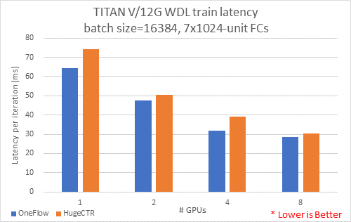
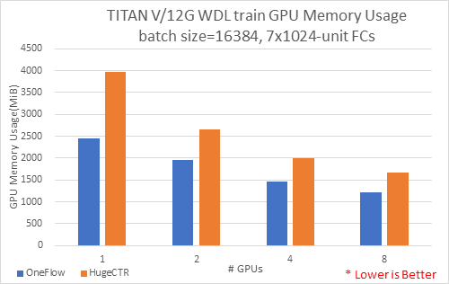
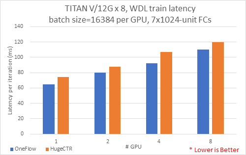
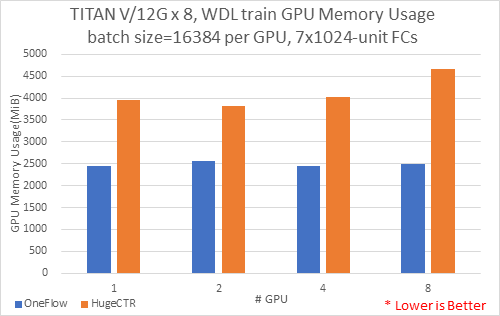
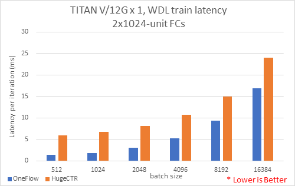
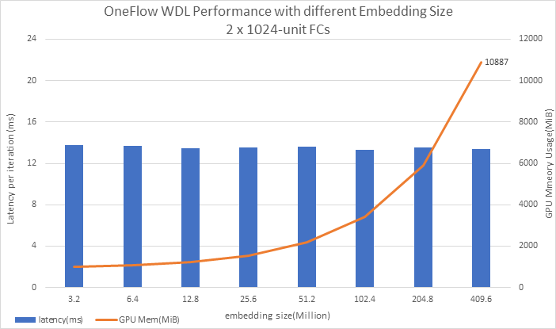
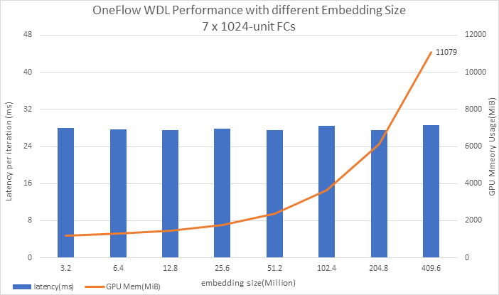
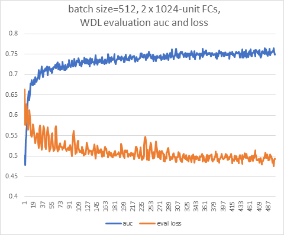
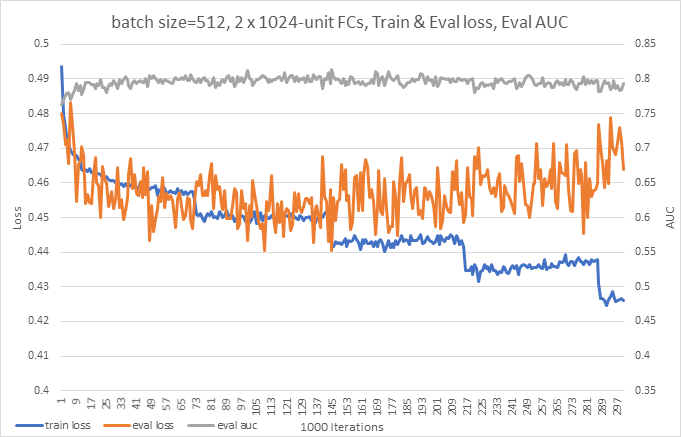

# Wide & Deep

[HugeCTR](https://github.com/NVIDIA/HugeCTR)是英伟达提供的一种高效的GPU框架，专为点击率（CTR）估计训练而设计。

OneFlow对标HugeCTR搭建了Wide & Deep 学习网络（WDL)。OneFlow-WDL网络实现了模型并行与稀疏更新，在8卡12G TitanV的服务器上实现支持超过4亿的词表大小，而且性能没有损失与小词表性能相当。

本文介绍如何使用OneFlow-WDL网络进行训练，以及一些训练结果及分析。

## 环境和准备
运行OneFlow-WDL需要有安装好OneFlow的python环境，并安装了[scikit-learn](https://scikit-learn.org/stable/install.html)。
### 软件要求
- python 3.x（推荐）
- OneFlow 0.x
- scikit-learn

### 数据准备
我们准备了一个小的[样本数据集](https://oneflow-public.oss-cn-beijing.aliyuncs.com/datasets/wdl_ofrecord_examples.tgz)，可以下载进行简单测试。

或者参考[《使用Spark创建WDL数据集》](https://github.com/Oneflow-Inc/OneFlow-Benchmark/blob/master/ClickThroughRate/WideDeepLearning/how_to_make_ofrecord_for_wdl.md)中的步骤，从CriteoLabs官网下载原始数据集并制作成OneFlow所需要的OFRecord格式的数据集。

### OneFlow-WDL脚本
OneFlow-WDL脚本只有一个文件`wdl_train_eval.py`，请从[这里](https://github.com/Oneflow-Inc/OneFlow-Benchmark/blob/master/ClickThroughRate/WideDeepLearning/wdl_train_eval.py)下载。

## 运行OneFlow-WDL脚本
```
EMBD_SIZE=1603616
DATA_ROOT=/path/to/wdl/ofrecord
python3 wdl_train_eval.py \
  --train_data_dir $DATA_ROOT/train \
  --train_data_part_num 256 \
  --train_part_name_suffix_length=5 \
  --eval_data_dir $DATA_ROOT/val \
  --eval_data_part_num 256 \
  --max_iter=300000 \
  --loss_print_every_n_iter=1000 \
  --eval_interval=1000 \
  --batch_size=16384 \
  --wide_vocab_size=$EMBD_SIZE \
  --deep_vocab_size=$EMBD_SIZE \
  --gpu_num 1
```
通常配置好数据集的位置`DATA_ROOT`后，上面的shell脚本就可以被执行了，如果屏幕上能够输出下面类似的结果，就表示已经正确运行。
```
1000 time 2020-07-08 00:28:08.066281 loss 0.503295350909233
1000 eval_loss 0.4846755236387253 eval_auc 0.7616240146992771
2000 time 2020-07-08 00:28:11.613961 loss 0.48661992555856703
2000 eval_loss 0.4816856697201729 eval_auc 0.765256583562705
3000 time 2020-07-08 00:28:15.149135 loss 0.48245503094792364
3000 eval_loss 0.47835959643125536 eval_auc 0.7715609382514008
4000 time 2020-07-08 00:28:18.686327 loss 0.47975033831596375
4000 eval_loss 0.47925308644771575 eval_auc 0.7781267916810946
```
## 测试结果及说明
我们在一台有8块12G显存的TitanV的服务器上对OneFlow-WDL进行了一组测试，并使用HugeCTR提供的docker容器做了同样参数的测试。

### 多GPU性能测试
主要测试目的是在batch size = 16384的情况下，测量不同GPU数量处理每个批次的平均时延（latency）。 测试配置了7个1024神经单元的隐藏层。

结果如下图：



我们同时记录了，测试时实际最大占用显存的大小，结果如下图：



综合上面结果表明，1卡到8卡，OneFlow-WDL在占用较少的显存的情况下，速度要比HugeCTR快。

### batch size=16384每卡，多卡性能测试
主要测试目的是在保证每GPU卡处理16384batch size情况下，使用1至8GPU卡进行训练每个批次的平均时延（latency）。 测试配置了7个1024神经单元的隐藏层。

结果如下图：



我们同时记录了，测试时实际最大占用显存的大小，结果如下图：



综合上面结果表明，随着卡数的增加，时延增加，OneFlow-WDL在占用较少的显存的情况下，速度要比HugeCTR快；因为每卡保证16384 batch size，OneFlow每卡占用的内存并无显著变化。

### 单GPU卡不同batch size性能测试
主要测试目的是在一个GPU卡情况下，测量不同batch size每个批次的平均时延（latency）。 测试配置了2个1024神经单元的隐藏层。

结果如下图：



### 超大词表测试
OneFlow-WDL中配置了两个Embedding Table：
- `wide_embedding` 大小是vocab_size x 1
- `deep_embedding` 大小是vocab_size x 16

HugeCTR中词表大小（vocab_size）是1603616。我们从3200000开始测起，一直到支持4亿的词表大小，结果如下图：

 

上面的图中，蓝色柱子是批次训练的平均时延（latency），红色曲线代表GPU显存的占用。

结论：随着词表大小的增大，内存随之增大，但latency没有明显的变化。

### 收敛性测试1
我们选取了batch size=512进行了收敛性能的测试。

下面这张图是，前500步的结果，每一步训练都在验证集中选取20条记录进行验证，图中的曲线分别是loss和AUC： 

结论：AUC迅速就增长到超过了0.75。

### 收敛性测试2
和收敛性测试1同样的情况，这一次是每训练1000步打印训练loss的平均值，然后选取20条验证集数据进行验证，一共训练30万步，结果如下：



结论与分析：
1. 蓝色的train loss曲线有明显向下的台阶，因为整个训练集有36674623条数据，batch_size=512的情况下，大概71630步就过了整个数据集（一个epoch），30万步就把训练数据集用了4次多，蓝色曲线的台阶印证了这些。OneFlow在训练过程中支持数据的打乱，每当数据集被完整的用完一遍之后，数据会被重新打乱，减少过拟合。OneFlow在训练过程中支持数据的打乱，每当数据集被完整的用完一遍之后，数据会被重新打乱，减少过拟合。
2. 橙色的曲线是验证集loss，在前两个epoch的时候基本保持下降的趋势，从第三个epoch开始，loss开始有上升的趋势，表明已经过拟合了。
3. 灰色是验证集的AUC，AUC也是在第二个epoch的时候达到了峰值，超过了0.8，后面几个epoch就开始下降。
