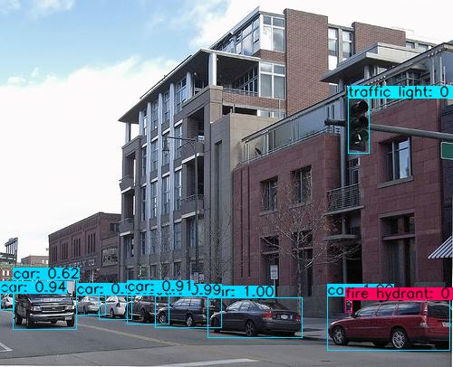
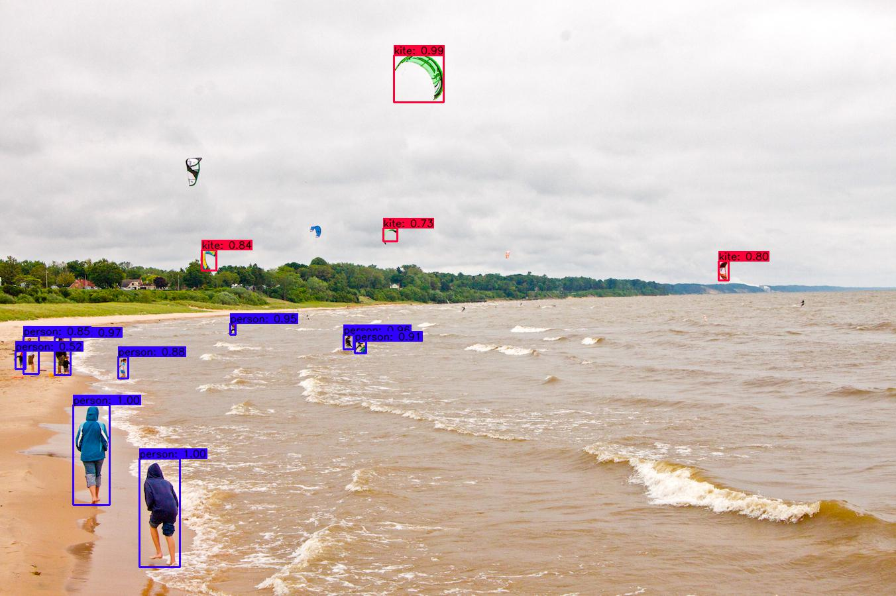

## YoloV3

## 1.简介

[YOLO](https://pjreddie.com/darknet/yolo/)系列的算法(经典的v1~v3)，是单阶段目标检测网络的开山鼻祖，YOLO—You only look once，表明其单阶段的特征，正是由于网络简单，单阶段的效率较快，使其区别于Faster-RCNN为代表的两阶段目标检测器，从一开始推出至今，便以速度快和较高的准确率而风靡目标检测领域，受到广泛使用和好评。

而Yolov3是其中的经典和集大成者(当然官方最近也推出了yolov4)，其以融合了残差网络的Darknet-53为骨干网络，融合了多尺度，3路输出的feature map，上采样等特点，使其模型精度和对小目标检测能力都大为提升。



本文，我们提供了YoloV3的OneFlow版实现，和其他版本实现的区别在于，我们将输出特征的nms过程写进了c++代码中，通过自定义user op的方式来调用，当然，我们也同时支持直接使用python代码处理nms。


## 2.快速开始

开始前，请确保您已正确安装了[oneflow](https://github.com/Oneflow-Inc/oneflow)，并且在python3环境下可以成功import oneflow。

1.git clone[此仓库](https://github.com/Oneflow-Inc/oneflow_yolov3)到本地

```shell
git clone https://github.com/Oneflow-Inc/oneflow_yolov3.git
```
2.安装python依赖库

```shell
   pip install -r requirements.txt
```
3.在项目root目录下，执行:

```
bash scripts/test.sh
```
执行此脚本，将cpp代码中自定义的op算子编译成可调用执行的.so文件，您将在项目路径下看到：

- libdarknet.so

- liboneflow_yolov3.so


### 预训练模型

我们使用了yolov3原作者提供的预训练模型—[yolov3.weight](https://pjreddie.com/media/files/yolov3.weights) ，经转换后生成了OneFlow格式的模型。下载预训练模型：[of_model_yolov3.zip](https://oneflow-public.oss-cn-beijing.aliyuncs.com/model_zoo/of_model_yolov3.zip)  ，并将解压后的of_model文件夹放置在项目root目录下，即可使用。


## 3. 预测/推理

运行：

```shell
sh yolo_predict.sh
```
或者：
```shell
sh yolo_predict_python_data_preprocess.sh
```

运行脚本后，将在data/result下生成检测后带bbox标记框的图片：



参数说明
- --pretrained_model    预训练模型路径

- --label_path                  coco类别标签路径(coco.name)

- --input_dir                    待检测图片文件夹路径

- --output_dir                检测结构输出路径

- --image_paths              单个/多个待检测图片路径，如：

  --image_paths  'data/images/000002.jpg'  'data/images/000004.jpg'

训练同样很简单，准备好数据集后，只需要执行：`sh yolo_train.sh`即可，数据集制作过程见下文【数据集制作】部分。


## 4. 数据集制作

YoloV3支持任意目标检测数据集，下面我们以[COCO2014](http://cocodataset.org/#download)制作过程为例，介绍训练/验证所需的数据集制作，其它数据集如[PASCAL VOC](http://host.robots.ox.ac.uk/pascal/VOC/)或自定义数据集等，都可以采用相同格式。

### 资源文件

下载COCO2014训练集和验证集图片，将解压后的train2014和val2014放在data/COCO/images目录下

（如果本地已下载过COCO2014数据集，可以ln软链接images至本地train2014和val2014的父目录）

准备资源文件：labels，5k.part，trainvalno5k.part

```shell
wget -c https://pjreddie.com/media/files/coco/5k.part
wget -c https://pjreddie.com/media/files/coco/trainvalno5k.part
wget -c https://pjreddie.com/media/files/coco/labels.tgz
```

### 脚本

在data/COCO目录下执行脚本：

```shell
# get label file
tar xzf labels.tgz

# set up image list
paste <(awk "{print \"$PWD\"}" <5k.part) 5k.part | tr -d '\t' > 5k.txt
paste <(awk "{print \"$PWD\"}" <trainvalno5k.part) trainvalno5k.part | tr -d '\t' > trainvalno5k.txt

# copy label txt to image dir
find labels/train2014/ -name "*.txt"  | xargs -i cp {} images/train2014/
find labels/val2014/   -name "*.txt"  | xargs -i cp {} images/val2014/
```

执行脚本将自动解压缩labels.tgz文件，并在当前目录下生成5k.txt和trainvalno5k.txt，然后将labels/train2014和labels/val2014的的所有label txt文件复制到对应的训练集和验证集文件夹中( **保证图片和label在同一目录** )。

至此，完成整个数据集的准备过程。


## 5.训练

修改yolo_train.sh脚本中的参数，令：--image_path_file="data/COCO/trainvalno5k.txt"并执行：

```shell
sh yolo_train.sh
```

即可开始训练过程，更详细的参数介绍如下：

- --gpu_num_per_node    每台机器使用的gpu数量
- --batch_size  batch         批大小
- --base_lr                           初始学习率
- --classes                           目标类别数量（COCO 80；VOC 20）
- --model_save_dir            模型存放文件夹路径
- --dataset_dir                    训练/验证集文件夹路径
- --num_epoch                   迭代总轮数
- --save_frequency            指定模型保存的epoch间隔


## 说明

目前如果调用yolo_predict.sh执行，数据预处理部分对darknet有依赖，其中：predict decoder中调用load_image_color、letterbox_image函数  
train decoder中调用load_data_detection函数  
主要涉及以下操作，在后续的版本中会使用oneflow decoder ops替换

- image read
- nhwc -> nchw
- image / 255
- bgr2rgb
- resize_image
- fill_image
- random_distort_image
- clip image
- random flip image and box
- randomize_boxes
- correct_boxes  
