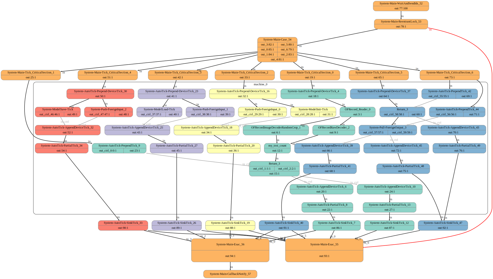

# OneFlow 架构设计概览

在本文中，我们将简要介绍：

* OneFlow 的核心架构

* OneFlow 训练任务从 Python 层到运行时的流程


通过阅读本文，可以对 OneFlow 的架构有一个初步的了解；本文末尾附上 OneFlow 各个模块技术特色深入介绍的文章索引，读者可以根据兴趣和需要自行选择。

## OneFlow 的架构层次图解


如上图所示，如果暂时略去 OneFlow 的上层模型库、底层支撑库，集中关注 OneFlow 内部架构中与神经网络训练直接相关的部分，总体上可分为三层：

* Python层：用户通过调用Python接口来配置超参，并编写 OneFlow 的作业函数来定义网络，这一切的信息，最终会在 OneFlow 中序列化为字节流，传递给下一层-- **编译时层**；

* 编译时层：OneFlow 实现的编译器，将接受 Python 层传递的字节流，并将字节流中所承载的作业函数的信息，经分析、优化后，编译、链接为 OneFlow 中的 **执行计划** (Execution Plan)，最后将 `Execution Plan` 传递给下一层-- **运行时层** ；

* 运行时层：OneFlow 的执行引擎接收上一层传递来的执行计划(`Plan`)，执行计划由多个更小单元的任务描述(`Task Proto`)结构组成，OneFlow 的执行引擎会解析 `Plan`，并为每个 `Task Proto` 分配一个执行单元 **actor**，众多 `actor` 一起运作，完成 OneFlow 的 **去中心化、分布式、流式计算** 。

有了以上的基本层次概念后，我们将在下文中，结合具体的数据结构与代码，向大家介绍 OneFlow 的Python层、编译时、运行时的整个流程是如何运行的。


本文讨论对象为 OneFlow 脚本编程所对应的 `lazy` 模式， OneFlow 交互式编程所对应的 `eager` 模式不在本文讨论范围。

### OneFlow 任务是如何跑起来的
如果想结合 OneFlow 的源码研究 OneFlow 的设计，建议重点关注 OneFlow 源码目录下的 [protobuf](https://developers.google.cn/protocol-buffers/) 文件，OneFlow 中控制面的数据结构、协议，都是使用 `protobuf` 定义的，结合这些数据结构，可以更快理解 OneFlow 的内部设计。

以下，我们将针对通常情况下 OneFlow 脚本执行过程(如[3分钟快速上手](../quick_start/quickstart_in_3_min.md))，逐层分析 OneFlow 在Python层、编译时和运行时到底都做了哪些工作。

## Python 层次
我们在使用 OneFlow 的过程中已经知道，OneFlow 需要使用`@oneflow.global_function`装饰器来修饰一个python编写的“作业函数”。 比如：
```python
@flow.global_function(get_train_config())
def train_job():
  # ...
```

在`oneflow/python/framework/function_util.py`中可以找到`global_function`装饰器对应的内部代码：
```python
    def Decorator(job_func):
        #...
        sess = session_ctx.GetDefaultSession()

        @functools.wraps(job_func)
        def Func(*args, **kwargs):
            return _RunLazyJob(sess, job_func, *args, **kwargs)

        sess.AddJob(_CloneFunctionDesc(function_config.function_desc, job_func))
        #...
        return Func
```
可以看到，装饰器返回的是 `Func` 函数，我们在训练过程中调用的作业函数，其实真正执行的是此处的 `Func`。

装饰器的主要作用有：

* 通过调用`sess.AddJob`，将训练的环境配置及作业函数的信息，添加到当前 session 上下文中，我们将看到，这些信息在编译时会被用到

* 通过修饰器，使得作业函数的调用被导向`_RunLazyJob`，我们将看到在`_RunLazyJob`中包括了编译 `job_func` 的代码

以下，我们来展开讨论`sess.AddJob`与`_RunLazyJob`的细节。

### 作业函数的序列化

在`/oneflow/python/framework/session_util.py`中可以看到`AddJob`的实现：
```python
class Session(object):
    #...
    def AddJob(self, function_desc):
        #...
        self.job_name2function_desc_[function_desc.job_func.__name__] = function_desc
```
可以看到， `session`中有一个名为 `job_name2function_desc_` 的字典，`AddJob` 将作业函数的名字作为 key，配置信息作(`function_desc`)为 value 放置进去，配置信息可以在 `oneflow/core/job/job.proto`中查看。

将训练配置信息加入到 `session` 中的主要原因，是 OneFlow 在编译时需要这些信息来进行推理、优化。接下来我们来分析 OneFlow 在 Python层次是如何触发编译过程的。

我们观察 `_RunLazyJob` 的内部实现，可以找到 OneFlow 进行序列化并触发 OneFlow C++ 层编译的代码位置：
```python
def _RunLazyJob(session, job_func, *args, **kwargs):
    return session.TryInit().LazyRun(job_func, *args, **kwargs)
```
跟进 `session` 对象的 `TryInit` 方法，可以发现，`session.TryInit` 会根据当前 session 的状态，决定是否触发编译：
```python
class Session(object):
    #...
    def TryInit(self):
        if self.status_ is SessionStatus.OPEN:
            self.Init()
        return self

    def Init(self):
        assert self.status_ is SessionStatus.OPEN
        self.status_ = SessionStatus.RUNNING
        #...
        _TryCompleteConfigProto(self.config_proto)
            for job_name, func_desc in self.job_name2function_desc_.items():
                compiler.Compile(self, func_desc, self.config_proto)
        #...
        c_api_util.StartGlobalSession()
        return self
```
从以上代码可以看到，如果当前 Session 处于 "OPEN" 状态，那么 session 会调用 `Init`， 遍历之前通过 `AddJob` 设置在 session 中的 `job_name2function_desc_` 中的各个 job ，并且调用 `compiler.Compile` 编译，`compiler.Compile`的内部实现为：
```python
def Compile(session, function_desc, config_proto):
    with InterpretScope(session, function_desc, config_proto):
        _CompileJob(function_desc)
        c_api_util.CurJobBuildAndInferCtx_Complete()
```

其中`_CompileJob`中将对`function_desc`所描述的作业函数进行序列化并在内部调用 C++ 层代码进行构图优化。再通过 `c_api_util.CurJobBuildAndInferCtx_Complete` 告之 C++ 层序列化完成。

完成`compiler.Compile`的工作后，将通过`c_api_util.StartGlobalSession()` 触发 C++ 层，创建 session，开始 C++ 层的编译 Plan 的工作。


### 作业函数的调用
回顾上文提到到的`_RunLazyJob`代码：
```python
def _RunLazyJob(session, job_func, *args, **kwargs):
    return session.TryInit().LazyRun(job_func, *args, **kwargs)
```
我们已经知道在`TryInit()`中完成了作业函数的序列化，并通知 编译时完成编译构图工作。

而`LazyRun`内部，就对应了用户调用作业函数时，Python层如何运行作业函数。

```python
    def LazyRun(self, job_func, *arg):
        #...
        remote_blobs = self.LaunchUserJob(job_func, *arg)
        #...
        return LazyFutureRemoteBlobs(self).SetResult(remote_blobs).Inited()
```
其中 `LaunchUserJob` 接受的参数 `job_func` 与 `arg` 就分别是用户调用作业函数时的作业函数以及传递的参数。

`LaunchUserJob` 会遍历 `job_func` 中需要执行的计算单元，并最终通在`session.LaunchJob`(`/oneflow/python/framework/session_util.py`)中通过调用`c_api_util.LaunchJob(job_instance)`执行计算。

值得一提的是，因为当用户调用作业函数时，OneFlow 已经完成了作业函数的编译构图，得到了执行计划(Execution Plan)，1个 Plan 由多个描述任务的`TaskProto`组成。以上`c_api_util.LaunchJob(job_instance)`所接受的参数`job_instance`，并不是作业函数本身，而是 Plan中的 `Task` 实例化对象，一个作业函数，将对应多个`job_instance`。

## 编译期阶段
上文提到的 Python 层的 `c_api_util.StartGlobalSession()` 会触发 C++ 代码中的 `StartGlobalSession` 并最终触发 OneFlow 编译时的入口函数 `Oneflow::Init` (`/oneflow/core/job/oneflow.cpp`)：
```c++
Maybe<void> Oneflow::Init(const oneflow::JobSet& job_set) {
  // Runtime
  JUST(CompileAndMergePlanOnMaster(job_set.job(), &plan_));
  // ...
}
```
可以看到，OneFlow 通过 `CompileAndMergePlanOnMaster` 完成编译构图，其中的`job_set.job()`是这个阶段的输入，它是包含了由 Python 接口所定义的神经网络结构及超参配置信息的序列化字节流，而 `plan_` 是输出，称为 **执行计划** (Execution Plan)。

执行计划由一系列对于任务的描述(`oneflow/core/job/task.proto`)组成，每个任务自身都是一个图结构，描述了内部计算类型、内存配额、上游生产者和下游消费者等信息。这些信息包含了 OneFlow 运行时所需要的一切信息。

以下是一个编译后的得到的 `Execution Plan`的图示([点击查看大图](imgs/plan_illustration.svg))：



### 执行计划的生成过程
进入到 `CompileAndMergePlanOnMaster` 中可以看到，首先，会调用一系列的 `MakeXXXJob(s)` 整合序列化后的作业函数信息， 加入到 `jobs` 中：
```cpp
Maybe<void> CompileAndMergePlanOnMaster(const PbRpf<Job>& conf_jobs, Plan* plan) {
  std::vector<std::shared_ptr<Job>> jobs(conf_jobs.size());
  //... 
    if (/*...*/) {
      MakeModelIoV2Jobs(jobs, var_op_name2parallel_blob_conf, AppendJob);
    } else {
      MakeModelIoJobs(jobs, var_op_name2parallel_blob_conf, AppendJob);
    }
  }
  //...
    for (const auto& pair : push_op_name2parallel_blob_conf) {
      //...
      MakePushJob(std::string("System-Push-") + pair.first, 
      //...
    }
    for (const auto& pair : pull_op_name2parallel_blob_conf) {
      //...
      MakePullJob(std::string("System-Pull-") + pair.first, pair.first, pair.second,
                  pull_job.get());
    }
  //...
}
```
然后通过 `CompileCurJobOnMaster` 将 `jobs` 编译为 Plan，值得注意的是 `AddJobName2JobId` 会为每个 `job` 分配一个全局唯一的ID，用于运行时区分任务：
```c++
  FOR_RANGE(int64_t, i, 0, jobs.size()) {
    AddJobName2JobId(jobs.at(i)->job_conf().job_name(), i);
    //...
    JUST(CompileCurJobOnMaster(jobs.at(i).get(), &sub_plans.at(i), true));
  }
```
以上的编译过程，最终会调用 `Compiler::Compile`，在其内部完成 `TaskProto`的构建，并添加到 Plan 中(`oneflow/core/job/compiler.cpp`)：
```c++
  task_gph->ForEachNode([&](TaskNode* task_node) {
    if (task_node->IsMeaningLess()) { return; }
    task_node->ToProto(plan->mutable_task()->Add());
  });
```

不过，以上步骤完成后，得到的 Plan 还不是最终完整的 Plan，OneFlow 还会增加 `main_plan`， 它对应了本节开始 Plan 图示中的 "System-Main-Tick-CriticalSection" 系列节点，具有同步与调度功能，将作为各项任务的入口：
```c++
    Plan main_plan;
    //...
    {
      //...
      MakeMainJob(&main_job, /*...*/);
      //...
      JUST(CompileMainJob(&main_job, /*...*/, &main_plan));
    }
```
以上一切完成后，通过调用 `LinkMainPlan` 将各个 Plan 链接起来，得到这节开始的图片所示 Execution Plan：
```c++
LinkMainPlan(plan, main_plan, identity_tick_op_names);
```

执行计划是编译阶段与运行时的分界线，在得到执行计划后，OneFlow 将启动运行时，并根据执行计划中的信息执行任务。

## 运行时阶段
完成`CompileAndMergePlanOnMaster`后，OneFlow 会实例化`Runtime`，按照 `plan` 中的信息执行任务：

```c++
Maybe<void> Oneflow::Init(const oneflow::JobSet& job_set) {
  // Runtime
  JUST(CompileAndMergePlanOnMaster(job_set.job(), &plan_));
  if (Global<MachineCtx>::Get()->IsThisMachineMaster()) {
    runtime_buffers_scope_.reset(new RuntimeBuffersScope(plan_));
  }
  runtime_.reset(new Runtime(plan_, GetMaxVal<size_t>(), false));
  //...
}
```
在 `Runtime` (`oneflow/core/job/runtime.cpp`)的构造中，将 `Plan` 中的 task 分成了三类：
```c++
  std::vector<const TaskProto*> mdupdt_tasks;
  std::vector<const TaskProto*> source_tasks;
  std::vector<const TaskProto*> other_tasks;
  int64_t this_machine_task_num = 0;
  for (const TaskProto& task : plan.task()) {
    if (task.machine_id() != Global<MachineCtx>::Get()->this_machine_id()) { continue; }
    if (IsMdUpdtTaskType(task.task_type())) {
      mdupdt_tasks.push_back(&task);
    } else if (!HasNonCtrlConsumedRegstDescId(task)) {
      source_tasks.push_back(&task);
    } else {
      other_tasks.push_back(&task);
    }
    this_machine_task_num += 1;
  }
```

* mdupdt_tasks：【……】

* source_tasks：【……】

* other_tasks：【……】

如前文所描述，在 task 中包含了内部计算类型、内存配额、上游生产者和下游消费者 **运行时所需要的全部信息** ，因此 OneFlow 可以通过解析 Task 启动线程执行任务。

OneFlow 使用 `Actor` 执行线程，在 OneFlow 中 **数据是一等公民** ，编译阶段产生的 `Plan` 中的每个 `Task`，记录了自己数据的上游与下游，执行引擎会根据 `Task` 的记录，为每个 `Task` 实例化对应的 `Actor`， `Actor` 负责执行 `Task` 规定的数据处理或数据搬运任务。

以下代码根据 `Task` 构建 `Actor`：

```c++
  RuntimeCtx* runtime_ctx = Global<RuntimeCtx>::Get();
  runtime_ctx->NewCounter("constructing_actor_cnt", this_machine_task_num);
  HandoutTasks(mdupdt_tasks);
  HandoutTasks(source_tasks);
  HandoutTasks(other_tasks);
  runtime_ctx->WaitUntilCntEqualZero("constructing_actor_cnt");
```

OneFlow 执行引擎采用去中心化调度机制，每个 `Actor` 只需要与自己的上下游进行通信， **不需要** 所谓的 master 节点进行中转，actor之间使用消息(message)来实现生产者和消费者之间的握手协议。


## OneFlow 各模块的技术特色
以上，我们只是结合 OneFlow 的 Python 接口，简要介绍了 OneFlow 框架的运行流程。以下文章，分专题更深入介绍 OneFlow 框架内部的各个模块：


### [OneFlow 的并行观](link)

OneFlow 在Python接口层次提供了 `consistent_view`，在框架内部，为了提供给用户逻辑上统一的视角，将 `op` 在物理上的实现划分为多个 `kernel`，并且提出了 **SBP 并行签名机制** ，在严谨的数学基石上进行OneFlow 的工程实践。

并且，OneFlow 的 `boxing` 机制，将 `SBP` 过程中的数据操作变为了透明黑盒，保证了用户使用 OneFlow 进行分布式训练时可保持逻辑单卡视角。

### [自动并行](link)
【一鹏的……】

### [构图与优化](link)
OneFlow 基于数据流模型描述计算任务，神经网络由一系列算子(Operator)构成的有向无环图(DAG)表示。并且通过注册一系列的 `PASS` 在构图与推导过程中进行优化。

### [Actor 机制](link)

OneFlow 的执行引擎，采用 Actor 流水机制，实现了去中心化分布式流式计算，在统一的设计框架内解决了长期困扰深度学习的各类问题，如磁盘 IO、 copyHD、 去中心计算等。

### [网络控制平面的协议设计](link)

控制平面主要实现分布式系统的控制协议，包括节点初始化，集群发现，分布式锁等功能，通常这类网络通信需求只发生在系统初始化或退出阶段，编程易用性比追求苛刻性能更重要， OneFlow 基于 GRPC 实现了该模块。

### [网络数据平面的网络通信实现](link)

分布式深度学习系统在训练过程中 `Actor` 之间的消息及中间运算结果，具有高频、吞吐量大的特点，对网络通信要求高。

OneFlow 自底层定制了网络传输模块用于数据平面的通信。并且有 RDMA 及 epoll 两套方案，可以做到在网络传输层次不依赖 `nccl`，扩大芯片选择范围。

### [内存管理](link)

OneFlow 的训练采用了 **纯静态内存分配方案**，在编译生成 `Plan` 的过程中，就已经确定了所有 `Task` 的内存使用情况，在整个运行时阶段，不再有内存的动态申请、释放，最大限度降低内存分配与回收带来的性能损耗。

此外……【成城的内存方案】

### [eager模式的实现](link)

OneFlow 开发的 eager 模式，通过实现定制的虚拟机使得用户可以采用交互式的方式进行训练。


