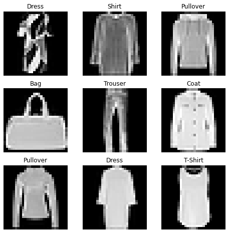

# DATASETS & DATALOADERS

The behavior of OneFlow's `Dataset` and `DataLoader` is the same as [PyTorch](https://pytorch.org/tutorials/beginner/basics/data_tutorial.html). Both of `Dataset` and `DataLoader` are for management of data set and training model decoupling.

[oneflow.utils.vision.datasets](https://oneflow.readthedocs.io/en/master/utils.html#module-oneflow.utils.vision.datasets) provides us a number of classes that can automatically download and load common datasets (such as fashionmnist).

`DataLoader` wraps data into an iterator, for easy iterating and access to samples during training.

```python
import matplotlib.pyplot as plt

import oneflow as flow
import oneflow.nn as nn
from oneflow.utils.vision.transforms import ToTensor
from oneflow.utils.data import Dataset
import oneflow.utils.vision.datasets as datasets
```

## Loading a Dataset

Here is an example of how to load a pre-loaded `Dataset`.

- `root`: the path where the train/test data is stored,
- `train`: `True` for training dataset, `False` for test dataset
- `download=True`: downloads the data from the internet if it’s not available at `root`.
- `transforms`: the feature and label transformations.


```python
training_data = datasets.FashionMNIST(
    root="data",
    train=True,
    download=True,
    transform=ToTensor()
)

test_data = datasets.FashionMNIST(
    root="data",
    train=False,
    download=True,
    transform=ToTensor()
)
```

The first time it runs, it will download the data set and output the following:

```text
Downloading http://fashion-mnist.s3-website.eu-central-1.amazonaws.com/train-images-idx3-ubyte.gz
Downloading http://fashion-mnist.s3-website.eu-central-1.amazonaws.com/train-images-idx3-ubyte.gz to data/FashionMNIST/raw/train-images-idx3-ubyte.gz
26422272it [00:17, 1504123.86it/s]
Extracting data/FashionMNIST/raw/train-images-idx3-ubyte.gz to data/FashionMNIST/raw

Downloading http://fashion-mnist.s3-website.eu-central-1.amazonaws.com/train-labels-idx1-ubyte.gz
Downloading http://fashion-mnist.s3-website.eu-central-1.amazonaws.com/train-labels-idx1-ubyte.gz to data/FashionMNIST/raw/train-labels-idx1-ubyte.gz
29696it [00:00, 98468.01it/s]
Extracting data/FashionMNIST/raw/train-labels-idx1-ubyte.gz to data/FashionMNIST/raw

Downloading http://fashion-mnist.s3-website.eu-central-1.amazonaws.com/t10k-images-idx3-ubyte.gz
Downloading http://fashion-mnist.s3-website.eu-central-1.amazonaws.com/t10k-images-idx3-ubyte.gz to data/FashionMNIST/raw/t10k-images-idx3-ubyte.gz
4422656it [00:07, 620608.04it/s]
Extracting data/FashionMNIST/raw/t10k-images-idx3-ubyte.gz to data/FashionMNIST/raw

Downloading http://fashion-mnist.s3-website.eu-central-1.amazonaws.com/t10k-labels-idx1-ubyte.gz
Downloading http://fashion-mnist.s3-website.eu-central-1.amazonaws.com/t10k-labels-idx1-ubyte.gz to data/FashionMNIST/raw/t10k-labels-idx1-ubyte.gz
6144it [00:00, 19231196.85it/s]
Extracting data/FashionMNIST/raw/t10k-labels-idx1-ubyte.gz to data/FashionMNIST/raw
```

## Iterating the Dataset

We can index `Dataset` manually like a `list`: `training_data[index]`.
The following example randomly accesses 9 pictures in `training_data` and visualizes them.

```python
labels_map = {
    0: "T-Shirt",
    1: "Trouser",
    2: "Pullover",
    3: "Dress",
    4: "Coat",
    5: "Sandal",
    6: "Shirt",
    7: "Sneaker",
    8: "Bag",
    9: "Ankle Boot",
}
figure = plt.figure(figsize=(8, 8))
cols, rows = 3, 3
from random import randint
for i in range(1, cols * rows + 1):
    sample_idx = randint(0, len(training_data))
    img, label = training_data[sample_idx]
    figure.add_subplot(rows, cols, i)
    plt.title(labels_map[label])
    plt.axis("off")
    plt.imshow(img.squeeze().numpy(), cmap="gray")
plt.show()
```



## Creating a Custom Dataset for your files

After inheriting [oneflow.utils.data.Dataset](https://oneflow.readthedocs.io/en/master/utils.html?highlight=oneflow.utils.data.Dataset#oneflow.utils.data.Dataset), we can custom a `Dataset`. Custom `Dataset` can be used with `Dataloader` introduced in the next section to simplify data processing.

Here is an example of how to create a custom `Dataset`, the key steps are:

- inheriting `oneflow.utils.data.Dataset`
- The `__len__`  function returns the number of samples in our dataset.
- The`__getitem__` function loads and returns a sample from the dataset at the given `dataset_obj[idx]`.

```python
import numpy as np
class CustomDataset(Dataset):
    raw_data_x = np.array([[1, 2], [2, 3], [4, 6], [3, 1]], dtype=np.float32)
    raw_label = np.array([[8], [13], [26], [9]], dtype=np.float32)

    def __init__(self, transform=None, target_transform=None):
        self.transform = transform
        self.target_transform = target_transform

    def __len__(self):
        return len(raw_label)

    def __getitem__(self, idx):
        x = CustomDataset.raw_data_x[idx]
        label = CustomDataset.raw_label[idx]
        if self.transform:
            x = self.transform(x)
        if self.target_transform:
            label = self.target_transform(label)
        return x, label

custom_dataset = CustomDataset()
print(custom_dataset[0])
print(custom_dataset[1])
```

Output：

```text
(array([1., 2.], dtype=float32), array([8.], dtype=float32))
(array([2., 3.], dtype=float32), array([13.], dtype=float32))
```

## Using DataLoader

The Dataset retrieves all features of our dataset and labels one sample at a time. While training a model, we typically want to pass samples in “minibatches”, which means they will load a same amount of data as the batch size at the time, and reshuffle the data at every epoch to reduce model overfitting.

At this time, we can use `DataLoader`. `DataLoader` can wrap `Dataset` into an iterator to access data during the training loop. Here is an example:

- `batch_size=64`: a returned dataset of batch size at each iteration
- `shuffle`: whether the data is shuffled after we iterate over all batches 

```python
from oneflow.utils.data import DataLoader

train_dataloader = DataLoader(training_data, batch_size=64, shuffle=True)
x, label = next(iter(train_dataloader))
print(f"shape of x:{x.shape}, shape of label: {label.shape}")
```

Output：
```text
shape of x:flow.Size([64, 1, 28, 28]), shape of label: flow.Size([64])
```

```python
img = x[0].squeeze().numpy()
label = label[0]
plt.imshow(img, cmap="gray")
plt.show()
print(label)
```

Output：(output a picture randomly)


```text
tensor(9, dtype=oneflow.int64)
```

We can also use the `Dataloader` iterator during the training loop.

```python
for x, label in train_dataloader:
    print(x.shape, label.shape)
    # training...
```
