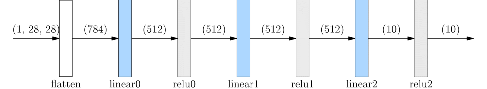

# Build Neural Network

The layers of A neural network can be constructed using API in namespace [oneflow.nn](https://oneflow.readthedocs.io/en/master/nn.html), which provide common modules (e.g.,[oneflow.nn.Conv2d](https://oneflow.readthedocs.io/en/master/nn.html?highlight=oneflow.nn.Conv2D#oneflow.nn.Conv2d), [oneflow.nn.ReLU](https://oneflow.readthedocs.io/en/master/nn.html?highlight=oneflow.nn.ReLU#oneflow.nn.ReLU), etc.) needed to build neural network. All Module classes used to build networks inherit from [oneflow.nn.Module](https://oneflow.readthedocs.io/en/master/module.html#oneflow.nn.Module), and multiple simple Module can be combined to form a more complex Module. In this way, users can easily build and manage complex neural networks.

```python
import oneflow as flow
import oneflow.nn as nn
```


## Define Module Class

Common Module Class are provided in namespace `oneflow.nn` , and we can use them directly or build neural networks based on them by custom Module classes. The build process includes the following:

- Build a Class that inherits from `oneflow.nn.Module` 
- Implement the `__init__` method of Class and construct the structure of neural network
- Implement the class's 'forward' method, which evaluates the input to Module

```python
class NeuralNetwork(nn.Module):
    def __init__(self):
        super(NeuralNetwork, self).__init__()
        self.flatten = nn.Flatten()
        self.linear_relu_stack = nn.Sequential(
            nn.Linear(28*28, 512),
            nn.ReLU(),
            nn.Linear(512, 512),
            nn.ReLU(),
            nn.Linear(512, 10),
            nn.ReLU()
        )

    def forward(self, x):
        x = self.flatten(x)
        logits = self.linear_relu_stack(x)
        return logits
net = NeuralNetwork()
print(net)
```

The code will print the structure of the constructed `NeuralNetwork` neural network:

```text
NeuralNetwork(
  (flatten): Flatten(start_dim=1, end_dim=-1)
  (linear_relu_stack): Sequential(
    (0): Linear(in_features=784, out_features=512, bias=True)
    (1): ReLU()
    (2): Linear(in_features=512, out_features=512, bias=True)
    (3): ReLU()
    (4): Linear(in_features=512, out_features=10, bias=True)
    (5): ReLU()
  )
)
```

Next, use `net` (Note:explicitly call `forward` is not not recommended) to complete Forward propagation:

```python
X = flow.ones(1, 28, 28)
logits = net(X)
pred_probab = nn.Softmax(dim=1)(logits)
y_pred = pred_probab.argmax(1)
print(f"Predicted class: {y_pred}")
```

You get output like this：

```text
Predicted class: tensor([1], dtype=oneflow.int32)
```

The above process from data input, network calculation and final inference output is shown in the figure below:



## `flow.nn.functional`

In addition to `oneflow.nn`, a number of API are provided in the namespace [oneflow.nn.functional](https://oneflow.readthedocs.io/en/master/functional.html). There is some overlap with `oneflow.nn` in function. Such as, both [nn.functional.relu](https://oneflow.readthedocs.io/en/master/functional.html?highlight=relu#oneflow.nn.functional.relu) and [nn.ReLU](https://oneflow.readthedocs.io/en/master/nn.html?highlight=relu#oneflow.nn.ReLU)  can be used to activate neural networks.

The main differences between them:

- The API in namespace `nn` are Class , that need to be instantiated an object of a class before they can be used; The API in namespace `nn.functional` is called directly as a function
- The Class in namespace `nn` manage network parameters internally; but Functions in `nn.functional` require us to define our own parameters and pass them in manually each time we call them

In fact, most of the Module provided by OneFlow are made by encapsulating methods in `nn.functional`. `nn.functional` offers the possibility of more fine-grained network management.

The following code, using the methods in `nn.functional`, builds `FunctionalNeuralNetwork`, the equivalent of class `NeuralNetwork` above, We can see the similarities and differences:

```python
class FunctionalNeuralNetwork(nn.Module):    
    def __init__(self):
        super(FunctionalNeuralNetwork, self).__init__()
        
        self.weight1 = nn.Parameter(flow.randn(28*28, 512))
        self.bias1 = nn.Parameter(flow.randn(512))

        self.weight2 = nn.Parameter(flow.randn(512, 512))
        self.bias2 = nn.Parameter(flow.randn(512))

        self.weight3 = nn.Parameter(flow.randn(512, 10))
        self.bias3 = nn.Parameter(flow.randn(10))
        
    def forward(self, x):
        x = x.reshape(1, 28*28)
        out = flow.matmul(x, self.weight1)
        out = out + self.bias1
        out = nn.functional.relu(out)

        out = flow.matmul(out, self.weight2)
        out = out + self.bias2
        out = nn.functional.relu(out)

        out = flow.matmul(out, self.weight3)
        out = out + self.bias3
        out = nn.functional.relu(out)

        return out

net = FunctionalNeuralNetwork()
X = flow.ones(1, 28, 28)
logits = net(X)
pred_probab = nn.Softmax(dim=1)(logits)
y_pred = pred_probab.argmax(1)
print(f"Predicted class: {y_pred}")
```


## Module Containers

Comparing the similarities and differences between the `NeuralNetwork` and `FunctionalNeuralNetwork` implementations above, you can see that [nn.Sequential](https://oneflow.readthedocs.io/en/master/nn.html?highlight=nn.Sequential#oneflow.nn.Sequential) plays an important role in simplifying the code.

`nn.Sequential` is a special container into which any class that inherits from `nn.Module` can be placed.

It is special in that: As Sequential propagates forward, Sequential automatically "concatenates" the layers contained in the container. Specifically, the output of the upper layer is automatically passed as the input of the next layer in the order in which each layer joins the Sequential sequence, until the output of the last layer of the entire Moudle is achieved.

The following is an example of a Sequential building network that doesn't use it(Not recommended).

```python
class MyModel(nn.Module):
    def __init__(self):
        super(MyModel, self).__init__()
        self.conv1 = nn.Conv2d(1,20,5)
        self.relu1 = nn.ReLU()
        self.conv2 = nn.Conv2d(20,64,5)
        self.relu2 = nn.ReLU()

    def forward(self, x):
        out = self.conv1(x)
        out = self.relu1(out)
        out = self.conv2(out)
        out = self.relu2(out)
        return out
```

The following program uses Sequential and looks succinct.

```python
class MySeqModel(nn.Module):
    def __init__(self):
        super(MySeqModel, self).__init__()
        self.seq = nn.Sequential(
          nn.Conv2d(1,20,5),
          nn.ReLU(),
          nn.Conv2d(20,64,5),
          nn.ReLU()
        )

    def forward(self, x):
        return self.seq(x)
```

In addition to Sequential, there are also `nn.Modulelist` and `nn.ModuleDict`. Except that they will automatically register parameters to the whole network, their other behaviors are similar to Python list and Python dict, but they are common simple containers and do not automatically carry out the Forward propagation of the front and back layers, so they need to manually traverse to complete the calculation of each layer.

