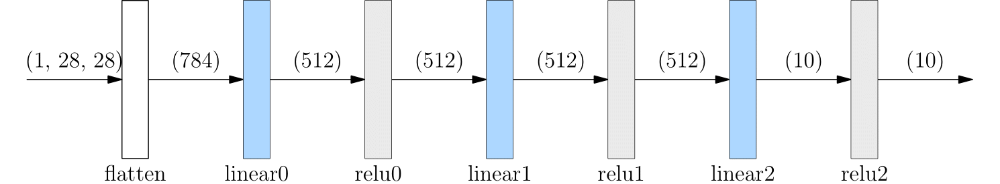

# BUILD NEURAL NETWORK

The layers of a neural network can be built by API in namespace [oneflow.nn](https://oneflow.readthedocs.io/en/master/nn.html), It provides common Module (such as [oneflow.nn.Conv2d](https://oneflow.readthedocs.io/en/master/nn.html?highlight=oneflow.nn.Conv2D#oneflow.nn.Conv2d), [oneflow.nn.ReLU](https://oneflow.readthedocs.io/en/master/nn.html?highlight=oneflow.nn.ReLU#oneflow.nn.ReLU)). All Module classes inherit from [oneflow.nn.Module](https://oneflow.readthedocs.io/en/master/module.html#oneflow.nn.Module), and many simple Module can form more complex Module. In this way, users can easily build and manage complex neural networks.

```python
import oneflow as flow
import oneflow.nn as nn
```

## Define Module class

`oneflow.nn` provides common Module classes and we can use them easily. Or we can build a neural network by customizing the Module class on the basis. This method consists of three parts：

- Write a class that inherits from `oneflow.nn.Module` class
- Write the method of `__init__` class, in which we construct the network structure
- Write the method of `forward` class, which calculates on the basis of the input of Module

```python
class NeuralNetwork(nn.Module):
    def __init__(self):
        super(NeuralNetwork, self).__init__()
        self.flatten = nn.Flatten()
        self.linear_relu_stack = nn.Sequential(
            nn.Linear(28*28, 512),
            nn.ReLU(),
            nn.Linear(512, 512),
            nn.ReLU(),
            nn.Linear(512, 10),
            nn.ReLU()
        )

    def forward(self, x):
        x = self.flatten(x)
        logits = self.linear_relu_stack(x)
        return logits
net = NeuralNetwork()
print(net)
```

The above code will output the structure of the `NeuralNetwork` network：

```text
NeuralNetwork(
  (flatten): Flatten(start_dim=1, end_dim=-1)
  (linear_relu_stack): Sequential(
    (0): Linear(in_features=784, out_features=512, bias=True)
    (1): ReLU()
    (2): Linear(in_features=512, out_features=512, bias=True)
    (3): ReLU()
    (4): Linear(in_features=512, out_features=10, bias=True)
    (5): ReLU()
  )
)
```

Then, call `net` (notice：It is not recommended to explicitly call `forward`):

```python
X = flow.ones(1, 28, 28)
logits = net(X)
pred_probab = nn.Softmax(dim=1)(logits)
y_pred = pred_probab.argmax(1)
print(f"Predicted class: {y_pred}")
```

You will get output similar to the following:

```text
Predicted class: tensor([1], dtype=oneflow.int32)
```

The above process of data input, network calculation and the output of reasoning is shown in the figure below.



## `flow.nn.functional`

In addition to `oneflow.nn`, [oneflow.nn.functional](https://oneflow.readthedocs.io/en/master/functional.html) namespace also provides many API. It overlaps with `oneflow.nn` to some extent. For example, [nn.functional.relu](https://oneflow.readthedocs.io/en/master/functional.html?highlight=relu#oneflow.nn.functional.relu) and [nn.ReLU](https://oneflow.readthedocs.io/en/master/nn.html?highlight=relu#oneflow.nn.ReLU) both can be used for activation in neural network.

The main differences between them are:

- The API under `nn` is a class. It needs to be instantiated before being called; The API under `nn.functional` is a function. It is called directly.
- The API under `nn` manages network parameters automatically；But for the function under `NN. Functional`, we need to define our own parameters and manually pass them in each call.

In fact, most of the Module provided by OneFlow is the result of encapsulating the methods under `nn.functional`. `nn.functional` can manage the network more finely.

The following example uses the methods in `nn.functional` to build a Module `FunctionalNeuralNetwork` equivalent to the `NeuralNetwork` class above. Readers can appreciate the similarities and differences between the two:

```python
class FunctionalNeuralNetwork(nn.Module):

    def __init__(self):
        super(FunctionalNeuralNetwork, self).__init__()

        self.weight1 = nn.Parameter(flow.randn(28*28, 512))
        self.bias1 = nn.Parameter(flow.randn(512))

        self.weight2 = nn.Parameter(flow.randn(512, 512))
        self.bias2 = nn.Parameter(flow.randn(512))

        self.weight3 = nn.Parameter(flow.randn(512, 10))
        self.bias3 = nn.Parameter(flow.randn(10))

    def forward(self, x):
        x = x.reshape(1, 28*28)
        out = flow.matmul(x, self.weight1)
        out = out + self.bias1
        out = nn.functional.relu(out)

        out = flow.matmul(out, self.weight2)
        out = out + self.bias2
        out = nn.functional.relu(out)

        out = flow.matmul(out, self.weight3)
        out = out + self.bias3
        out = nn.functional.relu(out)

        return out

net = FunctionalNeuralNetwork()
X = flow.ones(1, 28, 28)
logits = net(X)
pred_probab = nn.Softmax(dim=1)(logits)
y_pred = pred_probab.argmax(1)
print(f"Predicted class: {y_pred}")
```

## Module container

Comparing the similarities and differences between the `NeuralNetwork` and `FunctionalNeuralNetwork`,we can find that [nn.Sequential](https://oneflow.readthedocs.io/en/master/nn.html?highlight=nn.Sequential#oneflow.nn.Sequential) plays an important role in simplifying the code.

`nn.Sequential` is a special container. Any class inherited from `nn.Module` can be placed in it.

Its specialty is that when Sequential propagates forward, Sequential automatically "concatenates" the layers contained in the container. Specifically, the output of the previous layer will be automatically transferred as the input of the next layer according to the sequence of Sequential added to each layer until the output of the last layer of the whole Moudle is obtained.

The following is an example of building a network without Sequential (not recommended):

```python
class MyModel(nn.Module):
    def __init__(self):
        super(MyModel, self).__init__()
        self.conv1 = nn.Conv2d(1,20,5)
        self.relu1 = nn.ReLU()
        self.conv2 = nn.Conv2d(20,64,5)
        self.relu2 = nn.ReLU()

    def forward(self, x):
        out = self.conv1(x)
        out = self.relu1(out)
        out = self.conv2(out)
        out = self.relu2(out)
        return out
```

If sequential is used, it looks like this, which will be more concise.

```python
class MySeqModel(nn.Module):
    def __init__(self):
        super(MySeqModel, self).__init__()
        self.seq = nn.Sequential(
          nn.Conv2d(1,20,5),
          nn.ReLU(),
          nn.Conv2d(20,64,5),
          nn.ReLU()
        )

    def forward(self, x):
        return self.seq(x)
```

Besides Sequential, there are `nn.ModuleList` and `nn.ModuleDict`. They can automatically register parameters to the whole network. But their other behavior is similar to Python list and Python dict, which are just simple containers and do not automatically propagate forward. You need manually traverse to complete the calculation of each layer.
