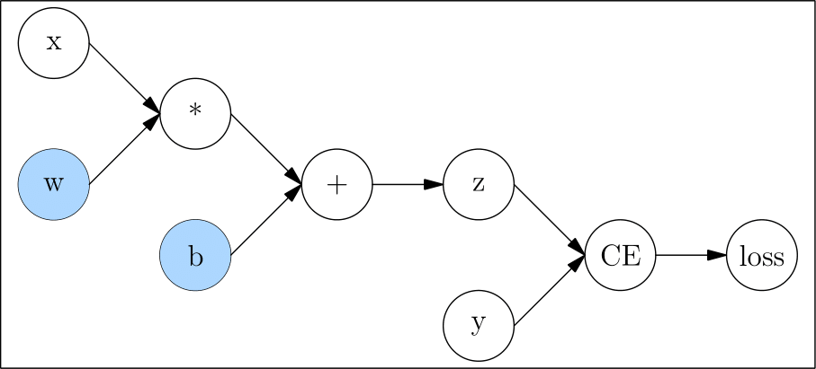
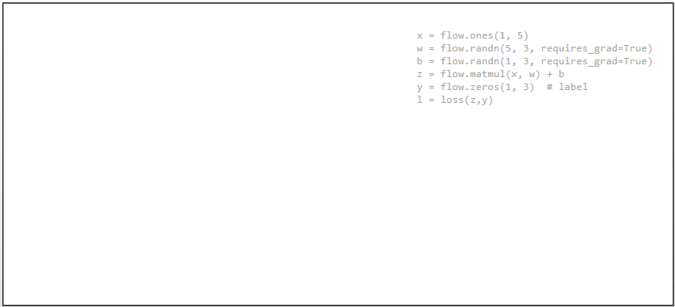

# STATIC GRAPH INTERFACE: NN.GRAPH

At present, there are two ways to run models in deep learning framework, **Dynamic Graph** and **Static Graph**, which are also called **Eager Mode** and **Graph Mode** in OneFlow.

There are pros and cons to both approaches, and OneFlow offers support for both, with the Eager Mode by default. If you are reading the tutorials for this basic topic in order, then all the code you have encountered so far is in Eager Mode.

In general, dynamic graphs are easier to use and static graphs have better performance. OneFlow offers [nn.Graph](https://oneflow.readthedocs.io/en/master/graph.html), so that users can use the eager-like programming style to build static graphs and train the models.

## Eager Mode in OneFlow

OneFlow runs in Eager Mode by default.

The following script, using data set CIFAR10 to train model `mobilenet_v2`.

??? code
    ```python
    import oneflow as flow
    import oneflow.nn as nn
    import flowvision
    import flowvision.transforms as transforms

    BATCH_SIZE=64
    EPOCH_NUM = 1

    DEVICE = "cuda" if flow.cuda.is_available() else "cpu"
    print("Using {} device".format(DEVICE))

    training_data = flowvision.datasets.CIFAR10(
        root="data",
        train=True,
        transform=transforms.ToTensor(),
        download=True,
    )

    train_dataloader = flow.utils.data.DataLoader(
        training_data, BATCH_SIZE, shuffle=True
    )

    model = flowvision.models.mobilenet_v2().to(DEVICE)
    model.classifer = nn.Sequential(nn.Dropout(0.2), nn.Linear(model.last_channel, 10))

    loss_fn = nn.CrossEntropyLoss().to(DEVICE)
    optimizer = flow.optim.SGD(model.parameters(), lr=1e-3)


    for t in range(EPOCH_NUM):
        print(f"Epoch {t+1}\n-------------------------------")
        size = len(train_dataloader.dataset)
        for batch, (x, y) in enumerate(train_dataloader):
            x = x.to(DEVICE)
            y = y.to(DEVICE)

            # Compute prediction error
            pred = model(x)
            loss = loss_fn(pred, y)

            # Backpropagation
            optimizer.zero_grad()
            loss.backward()
            optimizer.step()

            current = batch * BATCH_SIZE
            if batch % 5 == 0:
                print(f"loss: {loss:>7f}  [{current:>5d}/{size:>5d}]")
    ```

Out:

```text
loss: 6.921304  [    0/50000]
loss: 6.824391  [  320/50000]
loss: 6.688272  [  640/50000]
loss: 6.644351  [  960/50000]
...
```

## Graph Mode in OneFlow

### Customize a Graph

OneFlow provide the base class [nn.Graph](https://oneflow.readthedocs.io/en/master/graph.html), which can be inherited to create a customized Graph class.

```python
import oneflow as flow
import oneflow.nn as nn

class ModuleMyLinear(nn.Module):
    def __init__(self, in_features, out_features):
        super().__init__()
        self.weight = nn.Parameter(flow.randn(in_features, out_features))
        self.bias = nn.Parameter(flow.randn(out_features))

    def forward(self, input):
        return flow.matmul(input, self.weight) + self.bias

model = ModuleMyLinear(4, 3)

class GraphMyLinear(nn.Graph):
  def __init__(self):
    super().__init__()
    self.model = model

  def build(self, input):
    return self.model(input)
```

The simple example above contains the important steps needed to customize a Graph:

- Inherits `nn.Graph`.
- Call `super().__init__()` at the begining of `__init__` method to get OneFlow to do the necessary initialization for the Graph.
- In `__init__`, reuse the `nn.Module` object in Eager mode (`self.model = model`)
- Describes the computational process in `build` method.

You can then instantiate and call the Graph:

```python
graph_mylinear = GraphMyLinear()
input = flow.randn(1, 4)
out = graph_mylinear(input)
print(out)
```

Out:

```text
tensor([[-0.3298, -3.7907,  0.1661]], dtype=oneflow.float32)
```

Note that Graph is similar to Module in that the object itself is callable and it is **not recommended** to explicitly call the `build` method. Graph can directly reuse a defined Module. Users can refer the content in [Build Network](./04_build_network.md) to build a neural network. Then, set Module as a member of Graph in `__init__`  of Graph.

For example, use the `model` above as the network structure:

```python
class ModelGraph(flow.nn.Graph):
    def __init__(self):
        super().__init__()
        self.model = model

    def build(self, x, y):
        y_pred = self.model(x)
        return loss

model_graph = ModelGraph()
```

The major difference between Module and Graph is that Graph uses `build` method rather than `forward` method to describe the computation process, because the build method can contain not only forward computation, but also setting `loss`, optimizer, etc. You will see an example of using Graph for training later.

### Inference in Graph Mode

The following example for inference in Graph Mode directly using the model, which we have already trained in Eager Mode at the beginning of this article.

```python
class GraphMobileNetV2(flow.nn.Graph):
    def __init__(self):
        super().__init__()
        self.model = model

    def build(self, x):
        return self.model(x)


graph_mobile_net_v2 = GraphMobileNetV2()

x, _ = next(iter(train_dataloader))
x = x.to(DEVICE)
y_pred = graph_mobile_net_v2(x)
```

### Training in Graph Mode

The Graph can be used for training. Click on the "Code" below to see the detailed code.

??? code
    ```python
    import oneflow as flow
    import oneflow.nn as nn
    import flowvision
    import flowvision.transforms as transforms

    BATCH_SIZE=64
    EPOCH_NUM = 1

    DEVICE = "cuda" if flow.cuda.is_available() else "cpu"
    print("Using {} device".format(DEVICE))

    training_data = flowvision.datasets.CIFAR10(
        root="data",
        train=True,
        transform=transforms.ToTensor(),
        download=True,
    )

    train_dataloader = flow.utils.data.DataLoader(
        training_data, BATCH_SIZE, shuffle=True
    )

    model = flowvision.models.mobilenet_v2().to(DEVICE)
    model.classifer = nn.Sequential(nn.Dropout(0.2), nn.Linear(model.last_channel, 10))

    loss_fn = nn.CrossEntropyLoss().to(DEVICE)
    optimizer = flow.optim.SGD(model.parameters(), lr=1e-3)

    class GraphMobileNetV2(flow.nn.Graph):
        def __init__(self):
            super().__init__()
            self.model = model
            self.loss_fn = loss_fn
            self.add_optimizer(optimizer)

        def build(self, x, y):
            y_pred = self.model(x)
            loss = self.loss_fn(y_pred, y)
            loss.backward()
            return loss


    graph_mobile_net_v2 = GraphMobileNetV2()
    # graph_mobile_net_v2.debug()

    for t in range(EPOCH_NUM):
        print(f"Epoch {t+1}\n-------------------------------")
        size = len(train_dataloader.dataset)
        for batch, (x, y) in enumerate(train_dataloader):
            x = x.to(DEVICE)
            y = y.to(DEVICE)
            loss = graph_mobile_net_v2(x, y)
            current = batch * BATCH_SIZE
            if batch % 5 == 0:
                print(f"loss: {loss:>7f}  [{current:>5d}/{size:>5d}]")
    ```

Comparing to inference, there are only a few things that are unique to training:

```python
# Optimizer
optimizer = flow.optim.SGD(model.parameters(), lr=1e-3) # (1)

# The MobileNetV2 Graph
class GraphMobileNetV2(flow.nn.Graph):
    def __init__(self):
        # ...
        self.add_optimizer(optimizer) # (2)

    def build(self, x, y):
        # ...
        loss.backward() # (3)
        # ...
```

1. Constructing the optimizer object, which is same to the training in Eager Mode introduced in [Backpropagation and Optimizer](./06_optimization.md#optimizer_1).
2. Call `self.add_optimizer` in Graph's `__init__` method to add the optimizer object constructed in the previous step to the Graph.
3. Call `backward` in Graph's `build` to trigger back propagation.

### Debugging in Graph Mode

You can call `print` to print the Graph object, and show information about it.

```python
print(graph_mobile_net_v2)
```

The output is slightly different depending on whether the Graph object **has been called**:

If you use `print` **before** the Graph object is called, the output is information about the network structure.

The output for `print` used before `graph_mobile_net_v2` is called is like this:

```text
(GRAPH:GraphMobileNetV2_0:GraphMobileNetV2): (
  (CONFIG:config:GraphConfig(training=True, ))
  (MODULE:model:MobileNetV2()): (
    (MODULE:model.features:Sequential()): (
      (MODULE:model.features.0:ConvBNActivation()): (
        (MODULE:model.features.0.0:Conv2d(3, 32, kernel_size=(3, 3), stride=(2, 2), padding=(1, 1), bias=False)): (
          (PARAMETER:model.features.0.0.weight:tensor(..., device='cuda:0', size=(32, 3, 3, 3), dtype=oneflow.float32,
                 requires_grad=True)): ()
        )
    ...
    (MODULE:model.classifer:Sequential()): (
      (MODULE:model.classifer.0:Dropout(p=0.2, inplace=False)): ()
      (MODULE:model.classifer.1:Linear(in_features=1280, out_features=10, bias=True)): (
        (PARAMETER:model.classifer.1.weight:tensor(..., size=(10, 1280), dtype=oneflow.float32, requires_grad=True)): ()
        (PARAMETER:model.classifer.1.bias:tensor(..., size=(10,), dtype=oneflow.float32, requires_grad=True)): ()
      )
    )
  )
  (MODULE:loss_fn:CrossEntropyLoss()): ()
)
```

If you use `print` **after** the Graph object is called, in addition to the structure of the network, it will print inputs and outputs of the tensors, the output on the console is like this:

```text
(GRAPH:GraphMobileNetV2_0:GraphMobileNetV2): (
  (CONFIG:config:GraphConfig(training=True, ))
  (INPUT:_GraphMobileNetV2_0-input_0:tensor(..., device='cuda:0', size=(64, 3, 32, 32), dtype=oneflow.float32))
  (INPUT:_GraphMobileNetV2_0-input_1:tensor(..., device='cuda:0', size=(64,), dtype=oneflow.int64))
  (MODULE:model:MobileNetV2()): (
    (INPUT:_model-input_0:tensor(..., device='cuda:0', is_lazy='True', size=(64, 3, 32, 32),
           dtype=oneflow.float32))
    (MODULE:model.features:Sequential()): (
      (INPUT:_model.features-input_0:tensor(..., device='cuda:0', is_lazy='True', size=(64, 3, 32, 32),
             dtype=oneflow.float32))
      (MODULE:model.features.0:ConvBNActivation()): (
        (INPUT:_model.features.0-input_0:tensor(..., device='cuda:0', is_lazy='True', size=(64, 3, 32, 32),
               dtype=oneflow.float32))
        (MODULE:model.features.0.0:Conv2d(3, 32, kernel_size=(3, 3), stride=(2, 2), padding=(1, 1), bias=False)): (
          (INPUT:_model.features.0.0-input_0:tensor(..., device='cuda:0', is_lazy='True', size=(64, 3, 32, 32),
                 dtype=oneflow.float32))
          (PARAMETER:model.features.0.0.weight:tensor(..., device='cuda:0', size=(32, 3, 3, 3), dtype=oneflow.float32,
                 requires_grad=True)): ()
          (OUTPUT:_model.features.0.0-output_0:tensor(..., device='cuda:0', is_lazy='True', size=(64, 32, 16, 16),
                 dtype=oneflow.float32))
        )
    ...
```


In addition, by calling the [debug](https://oneflow.readthedocs.io/en/master/graph.html#oneflow.nn.Graph.debug) method of Graph objects, Graph’s debug mode is turned on.

OneFlow prints debug information when it compiles the computation graph. If the `graph_mobile_net_v2.debug()` is removed from the example code above, the output on the console is like this:

```text
(GRAPH:GraphMobileNetV2_0:GraphMobileNetV2) end building graph.
(GRAPH:GraphMobileNetV2_0:GraphMobileNetV2) start compiling plan and init graph runtime.
(GRAPH:GraphMobileNetV2_0:GraphMobileNetV2) end compiling plan and init graph rumtime.
```

The advantage of using `debug`  is that the debug information is composed and printed at the same time, which makes it easy to find the problem if there is any error in the graph building process.

The Level of detail of `debug` 's output can be adjusted by setting the `v_level` parameter:

```python
graph_mobile_net_v2.debug(v_level=1)  # 输出详细信息
```

In addition to the methods described above, getting the parameters of the gradient during the training process, accessing to the learning rate and other functions are also under development and will come up soon.

### Save and Load of Graph

Graph reuses the network parameters of the Module, so Graph does not have its own `save` and `load` interfaces, just use the Module interface directly. You can refer to [Model saving and loading](./07_model_load_save.md).

If you want to save the training results of the above `graph_mobile_net_v2`, you should actually save its Module (`model` obtained by `model = flowvision.models.mobilenet_v2().to(DEVICE)` before)

```python
flow.save(model.state_dict(), "./graph_model")
```

!!! Note

    **Don't** save in the following way. Because Graph will process members when it is initialized, `graph_mobile_net_v2.model` is actually no longer a Module type:

    ```python
    flow.save(graph_mobile_net_v2.model.state_dict(), "./graph_model")  # it will report an error
    ```

Loading the previously saved model is also the work of the Module:

```python
model = flowvision.models.mobilenet_v2().to(DEVICE)
model.classifer = nn.Sequential(nn.Dropout(0.2), nn.Linear(model.last_channel, 10))
model.load_state_dict(flow.load("./graph_model")) # Load the saved model
# ...
```

## Further Reading: Dynamic Graph vs. Static Graph

User-defined neural networks, are transformed by deep learning frameworks into computation graphs, like the example in [Autograd](./05_autograd.md):

```python
def loss(y_pred, y):
    return flow.sum(1/2*(y_pred-y)**2)

x = flow.ones(1, 5)  # 输入
w = flow.randn(5, 3, requires_grad=True)
b = flow.randn(1, 3, requires_grad=True)
z = flow.matmul(x, w) + b

y = flow.zeros(1, 3)  # label
l = loss(z,y)
```

The corresponding computation graph is:



**Dynamic Graph**

The characteristic of dynamic graph is that it is defined by run.

The code above is run like this (Note: the figure below merges simple statements):



Because the dynamic graph is defined by run, it is very flexible and easy to debug. You can modify the graph structure at any time and get results immediately. However, the deep learning framework can not get the complete graph information(which can be changed at any time and can never be considered as finished), it can not make full global optimization, so its performance is relatively poor.

**Static Graph**

Unlike a dynamic graph, a static graph defines a complete computation graph. It requires the user to declare all compute nodes before the framework starts running. This can be understood as the framework acting as a compiler between the user code and the computation graph that ultimately runs.


In the case of the OneFlow, the user’s code is first converted to a full computation graph and then run by the OneFlow Runtime module.

Static graph, which get the complete network first, then compile and run, can be optimized in a way that dynamic graph can not, so they have an advantage in performance. It is also easier to deploy across platforms after compiling the computation graph.

However, when the actual computation takes place in a static graph, it is no longer directly related to the user’s code, so debugging the static graph is not convenient.

The two approaches can be summarized as follows:

|              | Dynamic Graph | Static Graph   |
| ------------ | ------------------------------------- | ------------------------ |
| Computation Mode | Eager Mode                             | Graph Mode                 |
| Pros     | The code is flexible and easy to debug.                |  Good performance, easy to optimize and deploy.   |
| Cons     |  Poor performance and portability.                    | Not easy to debug.                 |

The Eager Mode in OneFlow is aligned with the PyTorch, which allows users familiar with the PyTorch to get their hands on easily with no more effert.

The Graph Mode in OneFlow is based on the object-oriented programming style, which allows developers familiar with eager programming style to benefit from static graph with minimal code changes.

## Related Links

Building neural network in OneFlow Eager Mode: [Build Network](./04_build_network.md)
