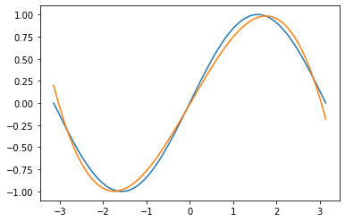

# STATIC GRAPH -- NN.GRAPH

At present, there are two ways to run models in deep learning framework, **Dynamic Graph** and **Static Graph**, which are also called **Eager Mode** and **Graph  Mode** in OneFlow.

There are pros and cons to both approaches, and OneFlow offers support for both, with the  **Eager Mode** by default. If you are reading the tutorials for this basic topic in order, then all the code you have encountered so far is **Eager Mode**.

In general, dynamic graphs are easier to use and static graphs have better performance. OneFlow offers [nn.Graph](https://oneflow.readthedocs.io/en/master/graph.html) module, so that users can use `Eager` programming style to build static graphics and train the model.


## **Eager Mode** in OneFlow

OneFlow runs in **Eager Mode** by default.

The following script, using polynomial $y=a+bx+cx^2+dx^3$ to fit the `sine` function $y=sin(x)$, finds a set of approximate fitting parameters $a$, $b$, $c$, $d$.

This example was introduced to show how **Eager Mode** and **Graph  Mode** are related in OneFlow (most of the code is reusable). Readers may be very familiar with OneFlow's **Eager Mode** now, here we do not explain in detail, interested readers can click on “Code”to expand the Code.

> Note: This sample code is adapted from [PyTorch official tutorial](https://pytorch.org/tutorials/beginner/pytorch_with_examples.html#nn-module).

??? code
    ```python
    import math
    import numpy as np
    import oneflow as flow

    device = flow.device("cuda")
    dtype = flow.float32

    # Create Tensors to hold input and outputs.
    x = flow.tensor(np.linspace(-math.pi, math.pi, 2000), device=device, dtype=dtype)
    y = flow.tensor(np.sin(x), device=device, dtype=dtype)

    # For this example, the output y is a linear function of (x, x^2, x^3), so
    # we can consider it as a linear layer neural network. Let's prepare the
    # tensor (x, x^2, x^3).
    xx = flow.cat(
        [x.unsqueeze(-1).pow(1), x.unsqueeze(-1).pow(2), x.unsqueeze(-1).pow(3)], dim=1
    )
    # The Linear Module
    model = flow.nn.Sequential(flow.nn.Linear(3, 1), flow.nn.Flatten(0, 1))
    model.to(device)

    # Loss Function
    loss_fn = flow.nn.MSELoss(reduction="sum")
    loss_fn.to(device)

    # Optimizer
    optimizer = flow.optim.SGD(model.parameters(), lr=1e-6)

    for t in range(2000):
        # Forward pass: compute predicted y by passing x to the model.
        y_pred = model(xx)

        # Compute and print loss.
        loss = loss_fn(y_pred, y)
        if t % 100 == 99:
            print(t, loss.numpy())

        # Use the optimizer object to zero all of the gradients for the variables
        # it will update (which are the learnable weights of the model).
        optimizer.zero_grad()

        # Backward pass: compute gradient of the loss with respect to model
        # parameters.
        loss.backward()

        # Calling the step function on an Optimizer makes an update to its
        # parameters.
        optimizer.step()

    linear_layer = model[0]

    print(
        f"Result: y = {linear_layer.bias.numpy()[0]} + {linear_layer.weight[:, 0].numpy()[0]}*x + {linear_layer.weight[:, 1].numpy()[0]}*x^2 + {linear_layer.weight[:, 2].numpy()[0]}*x^3"
    )
    ```

Out:

```text
99 582.7045
...
1799 9.326502
1899 9.154123
1999 9.040091
Result: y = -0.0013652867637574673 + 0.8422811627388*x + 0.0002355352626182139*x^2 + -0.09127362817525864*x^3
```

## Graph Mode in OneFlow

### Customize a Graph

OneFlow provide the base class [nn.Graph](https://oneflow.readthedocs.io/en/master/graph.html), which can be inherited to create a customized Graph class.


```python
import oneflow as flow
import oneflow.nn as nn

class MyLinear(nn.Graph):
  def __init__(self, in_features, out_features):
    super().__init__()
    self.weight = nn.Parameter(flow.randn(in_features, out_features))
    self.bias = nn.Parameter(flow.randn(out_features))

  def build(self, input):
    return flow.matmul(input, self.weight) + self.bias
```

The simple example above contains the important steps needed to customize a Graph:

- Inherits `nn.Graph`.
- Call `super().__init__()` at the begining of `__init__` to get OneFlow to do the necessary initialization for the Graph.
- Defines the structure and state of a neural network in `__init__`.
- Describes the computational process in `build`.

You can then instantiate and call the Graph.

```python
mygraph = MyLinear(4, 3)
input = flow.randn(1, 4)
out = mygraph(input)
print(out)
```

Out:

```text
tensor([[ 4.0638, -1.4453,  3.9640]], dtype=oneflow.float32)
```


Note that Graph is similar to Module in that the object itself is callable and it is **not recommended** to explicitly call the `build` method. The definition of a Graph is very similar to the use of a Module, in fact, Graph can directly reuse a defined Module. Users can refer the content in [Build Network](./04_build_network.md) directly to build a neural network in Graph mode.

For example, use the `model` for `Eager Mode` above as the network structure:


```python
class ModelGraph(flow.nn.Graph):
    def __init__(self):
        super().__init__()
        self.model = model

    def build(self, x, y):
        y_pred = self.model(x)
        return loss

model_graph = ModelGraph()
```

The major difference between Module and Graph is that Graph uses `build` rather than `forward` methods to describe the calculation, because the build can contain not only forward calculation, but also set `loss`, optimizer, etc. Below you will see a practical example of using Graph for training.

### Inference in Graph Mode
The following example for inference in Graph Mode directly using the module, which we have already trained in Eager Mode at the beginning of this article.

```python
class LinearPredictGraph(flow.nn.Graph):
    def __init__(self):
        super().__init__()
        self.model = model

    def build(self, x):
        return self.model(x)


linear_graph = LinearPredictGraph()
y_fit = linear_graph(xx)
```

Draw the contrast plot between the original function curve and the fitting result:

```python
import matplotlib.pyplot as plt
plt.plot(x.numpy(),y.numpy())
plt.plot(x.numpy(),y_fit.numpy())
```



### Training in Graph Mode

The Graph can be used for training. Click on the “Code”below to see the detailed Code.

??? code
    ```python
    import math
    import numpy as np
    import oneflow as flow

    device = flow.device("cuda")
    dtype = flow.float32

    # Create Tensors to hold input and outputs.
    x = flow.tensor(np.linspace(-math.pi, math.pi, 2000), device=device, dtype=dtype)
    y = flow.tensor(np.sin(x), device=device, dtype=dtype)

    # For this example, the output y is a linear function of (x, x^2, x^3), so
    # we can consider it as a linear layer neural network. Let's prepare the
    # tensor (x, x^2, x^3).
    xx = flow.cat(
        [x.unsqueeze(-1).pow(1), x.unsqueeze(-1).pow(2), x.unsqueeze(-1).pow(3)], dim=1
    )

    # The Linear Module
    model = flow.nn.Sequential(flow.nn.Linear(3, 1), flow.nn.Flatten(0, 1))
    model.to(device)

    # Loss Function
    loss_fn = flow.nn.MSELoss(reduction="sum")
    loss_fn.to(device)

    # Optimizer
    optimizer = flow.optim.SGD(model.parameters(), lr=1e-6)


    # The Linear Train Graph
    class LinearTrainGraph(flow.nn.Graph):
        def __init__(self):
            super().__init__()
            self.model = model
            self.loss_fn = loss_fn
            self.add_optimizer(optimizer)

        def build(self, x, y):
            y_pred = self.model(x)
            loss = self.loss_fn(y_pred, y)
            loss.backward()
            return loss


    linear_graph = LinearTrainGraph()
    # linear_graph.debug()

    for t in range(2000):
        # Print loss.
        loss = linear_graph(xx, y)
        if t % 100 == 99:
            print(t, loss.numpy())


    linear_layer = model[0]
    print(
        f"Result: y = {linear_layer.bias.numpy()} + {linear_layer.weight[:, 0].numpy()} x + {linear_layer.weight[:, 1].numpy()} x^2 + {linear_layer.weight[:, 2].numpy()} x^3"
    )
    ```

Comparing to inference, there are only a few things that are unique to training:

```python
# Optimizer
optimizer = flow.optim.SGD(model.parameters(), lr=1e-6) # (1)

# The Linear Train Graph
class LinearTrainGraph(flow.nn.Graph):
    def __init__(self):
        #...
        self.add_optimizer(optimizer) # (2)

    def build(self, x, y):
        #...
        loss.backward() (3)
        #...
```

1. Construct the optimizer object, which is same to the training in Eager Mode introduced in [Backpropagation and Optimizer](./06_optimization.md#optimizer_1).
2. Call `self.add_optimizer` in Graph's `__init__` to add the optimizer object constructed in the previous step to the Graph.
3. Call `backward` in Graph's `build` to trigger back propagation.


### Debugging in Graph Mode

You can call `print` to output information about the Graph object.


```python
print(linear_graph)
```

The output is slightly different depending on whether the Graph object is called:

If you use `print` before the Graph object is called, the output is information about the network structure.

The output for `print` used before `linear_graph` is called:  

```text
(GRAPH:LinearTrainGraph_0:LinearTrainGraph): (
  (MODULE:model:Sequential()): (
    (MODULE:model.0:Linear(in_features=3, out_features=1, bias=True)): (
      (PARAMETER:model.0.weight:tensor(..., device='cuda:0', size=(1, 3), dtype=oneflow.float32,
             requires_grad=True)): ()
      (PARAMETER:model.0.bias:tensor(..., device='cuda:0', size=(1,), dtype=oneflow.float32,
             requires_grad=True)): ()
    )
    (MODULE:model.1:Flatten(start_dim=0, end_dim=1)): ()
  )
  (MODULE:loss_fn:MSELoss()): ()
)
```

If you use `print` after the Graph object is called, in addition to the structure of the network, it will print inputs and outputs of the tensors, the output is like this:

```text
(GRAPH:LinearTrainGraph_0:LinearTrainGraph): (
  (INPUT:_LinearTrainGraph_0-input_0:tensor(..., device='cuda:0', size=(2000, 3), dtype=oneflow.float32))
  (INPUT:_LinearTrainGraph_0-input_1:tensor(..., device='cuda:0', size=(2000,), dtype=oneflow.float32))
  (MODULE:model:Sequential()): (
    (INPUT:_model-input_0:tensor(..., device='cuda:0', is_lazy='True', size=(2000, 3),
           dtype=oneflow.float32))
    (MODULE:model.0:Linear(in_features=3, out_features=1, bias=True)): (
      (INPUT:_model.0-input_0:tensor(..., device='cuda:0', is_lazy='True', size=(2000, 3),
             dtype=oneflow.float32))
      (PARAMETER:model.0.weight:tensor(..., device='cuda:0', size=(1, 3), dtype=oneflow.float32,
             requires_grad=True)): ()
      (PARAMETER:model.0.bias:tensor(..., device='cuda:0', size=(1,), dtype=oneflow.float32,
             requires_grad=True)): ()
      (OUTPUT:_model.0-output_0:tensor(..., device='cuda:0', is_lazy='True', size=(2000, 1),
             dtype=oneflow.float32))
    )
    (MODULE:model.1:Flatten(start_dim=0, end_dim=1)): (
      (INPUT:_model.1-input_0:tensor(..., device='cuda:0', is_lazy='True', size=(2000, 1),
             dtype=oneflow.float32))
      (OUTPUT:_model.1-output_0:tensor(..., device='cuda:0', is_lazy='True', size=(2000,),
             dtype=oneflow.float32))
    )
    (OUTPUT:_model-output_0:tensor(..., device='cuda:0', is_lazy='True', size=(2000,),
           dtype=oneflow.float32))
  )
  (MODULE:loss_fn:MSELoss()): (
    (INPUT:_loss_fn-input_0:tensor(..., device='cuda:0', is_lazy='True', size=(2000,),
           dtype=oneflow.float32))
    (INPUT:_loss_fn-input_1:tensor(..., device='cuda:0', is_lazy='True', size=(2000,),
           dtype=oneflow.float32))
    (OUTPUT:_loss_fn-output_0:tensor(..., device='cuda:0', is_lazy='True', size=(), dtype=oneflow.float32))
  )
  (OUTPUT:_LinearTrainGraph_0-output_0:tensor(..., device='cuda:0', is_lazy='True', size=(), dtype=oneflow.float32))
)
```

In addition, by calling the `debug` method of Graph objects, Graph’s debug mode is turned on.

OneFlow prints debugging information as it compiles the computation graph.If the `linear_graph.debug()` is removed from the example code above, the output on the console will be like this:


```text
Note that nn.Graph.debug() only print debug info on rank 0.
(GRAPH:LinearTrainGraph_0:LinearTrainGraph) start building forward graph.
(INPUT:_LinearTrainGraph_0-input_0:tensor(..., device='cuda:0', size=(20, 3), dtype=oneflow.float32))
(INPUT:_LinearTrainGraph_0-input_1:tensor(..., device='cuda:0', size=(20,), dtype=oneflow.float32))
(MODULE:model:Sequential())
(INPUT:_model-input_0:tensor(..., device='cuda:0', is_lazy='True', size=(20, 3),
       dtype=oneflow.float32))
(MODULE:model.0:Linear(in_features=3, out_features=1, bias=True))
(INPUT:_model.0-input_0:tensor(..., device='cuda:0', is_lazy='True', size=(20, 3),
       dtype=oneflow.float32))
(PARAMETER:model.0.weight:tensor(..., device='cuda:0', size=(1, 3), dtype=oneflow.float32,
       requires_grad=True))
(PARAMETER:model.0.bias:tensor(..., device='cuda:0', size=(1,), dtype=oneflow.float32,
       requires_grad=True))
(OUTPUT:_model.0-output_0:tensor(..., device='cuda:0', is_lazy='True', size=(20, 1),
       dtype=oneflow.float32))
(MODULE:model.1:Flatten(start_dim=0, end_dim=1))
(INPUT:_model.1-input_0:tensor(..., device='cuda:0', is_lazy='True', size=(20, 1),
       dtype=oneflow.float32))
(OUTPUT:_model.1-output_0:tensor(..., device='cuda:0', is_lazy='True', size=(20,), dtype=oneflow.float32))
(OUTPUT:_model-output_0:tensor(..., device='cuda:0', is_lazy='True', size=(20,), dtype=oneflow.float32))
(MODULE:loss_fn:MSELoss())
(INPUT:_loss_fn-input_0:tensor(..., device='cuda:0', is_lazy='True', size=(20,), dtype=oneflow.float32))
(INPUT:_loss_fn-input_1:tensor(..., device='cuda:0', is_lazy='True', size=(20,), dtype=oneflow.float32))
(OUTPUT:_loss_fn-output_0:tensor(..., device='cuda:0', is_lazy='True', size=(), dtype=oneflow.float32))
(OUTPUT:_LinearTrainGraph_0-output_0:tensor(..., device='cuda:0', is_lazy='True', size=(), dtype=oneflow.float32))
(GRAPH:LinearTrainGraph_0:LinearTrainGraph) end building forward graph.
(GRAPH:LinearTrainGraph_0:LinearTrainGraph) start compiling and init graph runtime.
(GRAPH:LinearTrainGraph_0:LinearTrainGraph) end compiling and init graph rumtime.
```

The output will display the names of the layers in the computation graph, and input/output tensor information, including shape, device information, data type, and so on.

The advantage of using `debug`  is that the debug information is composed and printed at the same time, which makes it easy to find the problem if there is any error in the graph building process.


In addition to the methods described above, getting the parameters of the gradient during the training process, accessing to the learning rate and other functions are also under development and will come up soon.

## Extended Reading: Dynamic Graph vs. Static Graph

User-defined neural networks, are transformed by deep learning frameworks into computation graphs, like the example in [Autograd](./05_autograd.md):

```python
def loss(y_pred, y):
    return flow.sum(1/2*(y_pred-y)**2)

x = flow.ones(1, 5)  # 输入
w = flow.randn(5, 3, requires_grad=True)
b = flow.randn(1, 3, requires_grad=True)
z = flow.matmul(x, w) + b

y = flow.zeros(1, 3)  # label
l = loss(z,y)
```

The corresponding computation graph is:


**Dynamic Graph**

The characteristic of dynamic graph is that it is define by run.

The code above is run like this:
(Note: the figure below merges simple statements)


Because the dynamic graph is define by run, it is very flexible and easy to debug. You can modify the graph structure at any time and get results immediately. However, the deep learning framework can not get the complete graph information(which can be changed at any time and can never be considered as finished), it can not make full global optimization, so its performance is relatively poor.

**Static Graph**

Unlike a dynamic graph, a static graph defines a complete computation graph. It requires the user to declare all compute nodes before the framework starts running. This can be understood as the framework acting as a compiler between the user code and the computation graph that ultimately runs.


In the case of the OneFlow, the user’s code is first converted to a full computation graph and then run by the OneFlow Runtime module.

Static graph, which get the complete network first, then compile and run, can be optimized in a way that dynamic graph can not, so they have an advantage in performance. It is also easier to deploy across platforms after compiling the computation graph.

However, when the actual computation takes place in a static graph, it is no longer directly related to the user’s code, so debugging the static graph is not convenient.


The two approaches can be summarized as follows:

|              | Dynamic Graph | Static Graph   |
| ------------ | ------------------------------------- | ------------------------ |
| Computation Mode | Eager Mode                             | Graph Mode                 |
| Pros     | The code is flexible and easy to debug.                |  Good performance, easy to optimize and deploy.   |
| Cons     |  Poor performance and portability.                    | Not easy to debug.                 |


The Eager Mode in OneFlow is aligned with the PyTorch, which allows users familiar with the PyTorch to get their hands on easily with no more effert. 

The Graph Mode in OneFlow is based on an object-oriented programming style, which allows developers familiar with Eager programming style to benefit from static graph with minimal code changes.

## Related Links

Building neural network in OneFlow Eager Mode: [build network](./04_build_network.md)

PyTorch 版本的多项式拟合实例代码：[PyTorch: nn](https://pytorch.org/tutorials/beginner/pytorch_with_examples.html#id19)
PyTorch version of polynomial fitting example: [PyTorch: nn](https://pytorch.org/tutorials/beginner/pytorch_with_examples.html#id19)