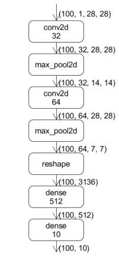

# Build a Neural Network

In the article [Recognition of MNIST Handwritten Digits](../quick_start/lenet_mnist.md), we have used "operator" in `oneflow.nn` and "layer" in `oneflow.layers` to build a LeNet neural network. Now we will use this simple neural network to introduce the core element for network construction in OneFlow: operator and layer.

LeNet is constructed by convolution layer, pooling layer and fully connected layer. 

<div align="center">

</div>

There are two types of elements in the above diagram, one is the computing units represented by boxes which including `op` and `layer` such as `conv2d`, `dense`, `max_pool2d` and etc. The other is the data represented by arrows. It corresponds to the following code:

```python
def lenet(data, train=False):
    initializer = flow.truncated_normal(0.1)
    conv1 = flow.layers.conv2d(
        data,
        32,
        5,
        padding="SAME",
        activation=flow.nn.relu,
        name="conv1",
        kernel_initializer=initializer,
    )
    pool1 = flow.nn.max_pool2d(
        conv1, ksize=2, strides=2, padding="SAME", name="pool1", data_format="NCHW"
    )
    conv2 = flow.layers.conv2d(
        pool1,
        64,
        5,
        padding="SAME",
        activation=flow.nn.relu,
        name="conv2",
        kernel_initializer=initializer,
    )
    pool2 = flow.nn.max_pool2d(
        conv2, ksize=2, strides=2, padding="SAME", name="pool2", data_format="NCHW"
    )
    reshape = flow.reshape(pool2, [pool2.shape[0], -1])
    hidden = flow.layers.dense(
        reshape,
        512,
        activation=flow.nn.relu,
        kernel_initializer=initializer,
        name="dense1",
    )
    if train:
        hidden = flow.nn.dropout(hidden, rate=0.5, name="dropout")
    return flow.layers.dense(hidden, 10, kernel_initializer=initializer, name="dense2")
```
When the job function is run, `data` is in shape of `100x1×28×28`. `data` is firstly used as input in `conv2d` to participate in the convolution calculation and obtained the result `conv1` then `conv1` is passed to `max_pool2d` as input.

## Operator and Layer
Operator is a common concept. It is the basic calculation unit in OneFlow. `reshape` and `nn.max_pool2d` used in LeNet code are two kinds of operators.

In contrast, `layers.conv2d` and `layers.dense` are not operator. They are layers which constructed by specific operators. The existence of layers makes it easier to build neural networks, please refer to [oneflow.layers API](https://oneflow.readthedocs.io/en/master/layers.html) 

By reading [oneflow.layers source code](https://github.com/Oneflow-Inc/oneflow/blob/master/oneflow/python/ops/layers.py), you can learn the details of building a layer of calculations from basic operators.

## Data block in neural network
OneFlow's default mode is a static graph mechanism and the network is actually built and run separately. As a result, when defining the network, there is **no** real data in each variable which means they are just placeholders. The computation of the real data occurs during the call of the job function.

When building the network by defining job function, we only describe the attributes and shapes(such as `shape`, `dtype`) of the nodes in network. There is no data in the node, we call the node as **PlaceHolder**, OneFlow can compile and infer according to these placeholders to get the computation graph. 

The placeholders are usually called `Blob` in OneFlow. There is a corresponding base class `BlobDef` in OneFlow.

When we build network, we can print the information of `Blob`. For example, we can print data `shape` and `dtype` as follow.
```python
print(conv1.shape, conv1.dtype)
```

### Operator Overloading
The `BlobDef` class implements operator overloading which means `BlobDef` supports math operators such as addition, subtraction, multiplication and division and so on.

Like '+' in the following code:

```
output = output + fc2_biases
```
which is same as:
```
output = flow.broadcast_add(output, fc2_biases)
```

## Summary
Neural network builds by OneFlow require the operators or layers provided by OneFlow as compute units. The placeholder `Blob` serves as input and output for the operators and layers and operator reloading helps simplify some of the statements.

The operators provided by OneFlow can be found in the API documentation: [oneflow.nn](https://oneflow.readthedocs.io/en/master/nn.html), [oneflow.math](https://oneflow. readthedocs.io/en/master/math.html), [oneflow.layers](https://oneflow.readthedocs.io/en/master/layers.html)
