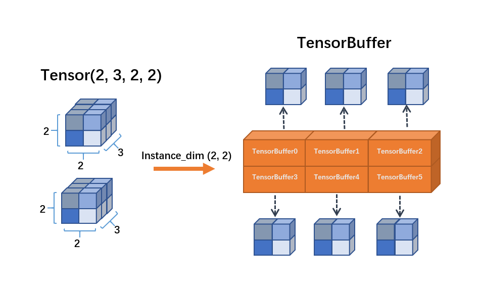
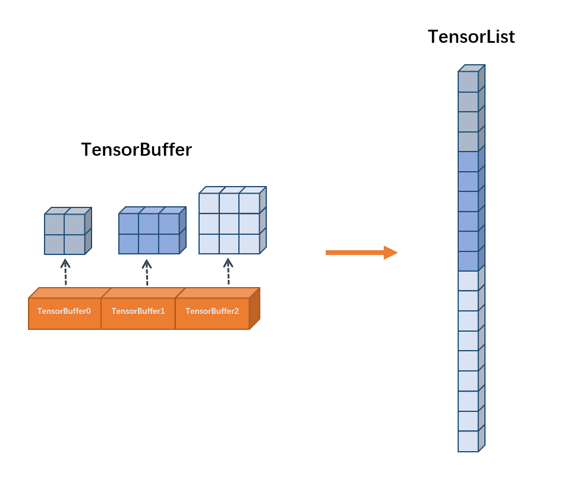

# Term & Concept in OneFlow

In this article, we will explain some common terms and concepts in OneFlow. The main content is divided for algorithm engineers and framework developers:

-  **Algorithm Development**
-  **Framework Development**

In algorithms development part, we will explain some common terms and concepts used in the process of deep learning algorithms development and in framework development part, we will focus on the inner design concepts of OneFlow and some relevant element concepts. 

## Algorithms Development

### 1.Placeholder

Placeholder is **data placeholder**. This concept is used to store the shape of input or output data. There is no actual data in Placeholder. 

For example:

```python
import oneflow.typing as tp
def test_job(
    images: tp.Numpy.Placeholder((32, 1, 28, 28), dtype=flow.float),
    labels: tp.Numpy.Placeholder((32,), dtype=flow.int32),
) -> Tuple[tp.Numpy, tp.Numpy]:
    # do something with images or labels
    return (images, labels)
```

The code above shows that the `images` shape is (32, 1, 28, 28) and `images` data type is `flow.float32` , the `labels` shape is (32,) and `labels` data type is `flow.int32`.

### 2.Tensor and Blob

Tensor is a common concept in other framework. In PyTorch, Tensor contains the data, data type, grad, storing device and other attributes. Tensor can be used to create and describe the computation graph in forward and backward process. 

OneFlow Tensor is basically the same, but there are some difference. In order to provide sufficient support for distributed system and parallelism, the Tensor in OneFlow is more complex and have more types and attributes (Such as logical, physical, devices and attributes of distribution). The Tensor at logical level could be divided to different devices. In order to simplify description, OneFlow hides the different types of Tensor, all the things are defined by a higher level concept named Blob.

In OneFlow, Blob has a base class `BlobDef`. You can print the attributes of  `Blob` when building network. As in the following code, we can print  `conv1`'s `shape` and `dtype`:

```python
print(conv1.shape, conv1.dtype)
```

Blob can be Placeholder at compile time, but can also contains values at running time. 


### 3.Job Function

In OneFlow, we call the training, evaluating, predicting and inference tasks as job function. Job function connects logic of user and computing resources that managed by OneFlow.

In OneFlow, we can use decorator `@oneflow.global_function` to convert a function to a job function. By this decorator, we can not only define the type of job function(such as: `type="train"`), but also bind a `FunctionConfig` object to set the configuration of job function which can help OneFlow to manage memory and device resources.


### 4.Layer and Operator

#### Layer

The layer concept in OneFlow is basically the same as the layer in TensorFlow, PyTorch and other popular deep learning framework. It is used to describe a layer in neural network such as convolution layer, batch normalization layer, fully connected layer and normalization layer. Layer can simplify the process of building neural network. For example you can use just few lines of code to build LeNet:

```python
def lenet(data, train=False):
    initializer = flow.truncated_normal(0.1)
    conv1 = flow.layers.conv2d(
        data,
        32,
        5,
        padding="SAME",
        activation=flow.nn.relu,
        name="conv1",
        kernel_initializer=initializer,
    )
    pool1 = flow.nn.max_pool2d(
        conv1, ksize=2, strides=2, padding="SAME", name="pool1", data_format="NCHW"
    )
    conv2 = flow.layers.conv2d(
        pool1,
        64,
        5,
        padding="SAME",
        activation=flow.nn.relu,
        name="conv2",
        kernel_initializer=initializer,
    )
    pool2 = flow.nn.max_pool2d(
        conv2, ksize=2, strides=2, padding="SAME", name="pool2", data_format="NCHW"
    )
    reshape = flow.reshape(pool2, [pool2.shape[0], -1])
    hidden = flow.layers.dense(
        reshape,
        512,
        activation=flow.nn.relu,
        kernel_initializer=initializer,
        name="dense1",
    )
    if train:
        hidden = flow.nn.dropout(hidden, rate=0.5, name="dropout")
    return flow.layers.dense(hidden, 10, kernel_initializer=initializer, name="dense2")
```

Layer is composed by operators. For example: `layers.conv2d` is composed by  `conv2d` and `variable`.

#### Operator

Operator is the **basic calculation unit** in OneFlow. The calculation in above example is completed by operators. `flow.nn.max_pool2d` and `flow.reshape` are two kinds of operators.


### 5.Mirrored View and Consistent View

OneFlow use two types of view:  **Mirrored View** and **Consistent View**. They are used to describe the distribution of data and model under distributed system. Different view is corresponding to different parallelism view.

Mirrored View comes from mirrors view of MPI. It is used to describe the mirrored model to multiple devices when using data parallelism.

Consistent View regards multi hosts and devices as one in distributed environment. From this view, OneFlow will hide the detailed parallelism strategy and try to find the optimal parallelism plan(data/model/hybrid parallelism).

Basically:

When we set the mirrored view (`flow.scope.mirrored_view`), it means we can only use **data parallelism**. For example, when we set one host and four devices in job function, the model will be broadcasted to all devices, the data will be divided into four parts and send to each device.

When set consistent view (`flow.scope.consistent_view`), OneFlow **can choose data parallelism, model parallelism or hybrid parallelism by its compiler.**


## Framework developing

### 1.Boxing

The module responsible for splitting or merging data blob according the parallelism strategy. We called it **Boxing**.

Such as: When the op of upstream and downstream has different parallelism feature (such as different parallelism number), OneFlow will use Boxing to automatic process the data conversion and transmission.


### 2.SBP

All the forward and backward operations in neural network can be calculated by matrix. In block matrix calculation, matrix needs split and broadcast operations at different axises. OneFlow operator has an attribute to describe this, we call it SBP. Of course, the SBP in OneFlow is not only matrix calculation. It also corresponding to divided data into different devices, broadcast and some other operations.

SBP is abbreviated for Split, Broadcast, Partial sum.

#### Split

In parallelism operations, tensor is divided into many sub tensors. Different operators allow tensor to be divided on different axis. Boxing will automatically handle the splitting of tensor on different axis. 

#### Broadcast

In parallelism operator calculation, the tensor will be broadcasted to many devices. This makes the tensor be same on each device.

#### Partial Sum

If an operator has distributive property, different part of tensor can be simply added.

### 3.TensorBuffer and TensorList

Base on static map mechanism, OneFlow can infer the tensor shape of each operator and distribute the memory in advance when compiling. It can achieve zero copies of memory when running programs. But in some specific scenarios, OneFlow needs handle growing data. For example, the shape of the image loaded by DataLoader is  unknown when compiling. In order to handle the growing data, OneFlow have two type of data format which is `TensorBuffer` and `TensorList`.

#### TensorBuffer

TensorBuffer is a flexible data format. When using TensorBuffer. We need to specify the dimension of the instance. OneFlow will generate a corresponding TensorBuffer object for each instance. TensorBuffer will indirectly references memory data and the memory section is **dynamic and discontinuous**.

<div align="center">
    
</div>


#### TensorList

Similar with TensorBuffer, TensorList also can store the growing data. The main difference is that the data of TensorList is **continuous** in memory.

<div align="center">
    
</div>


