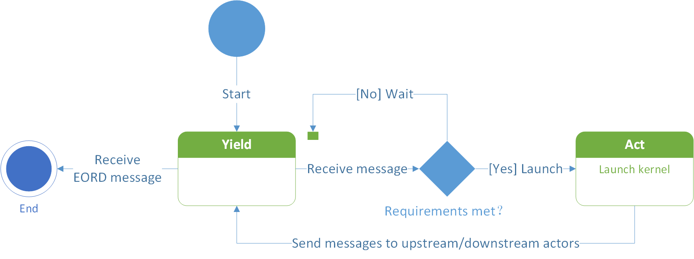
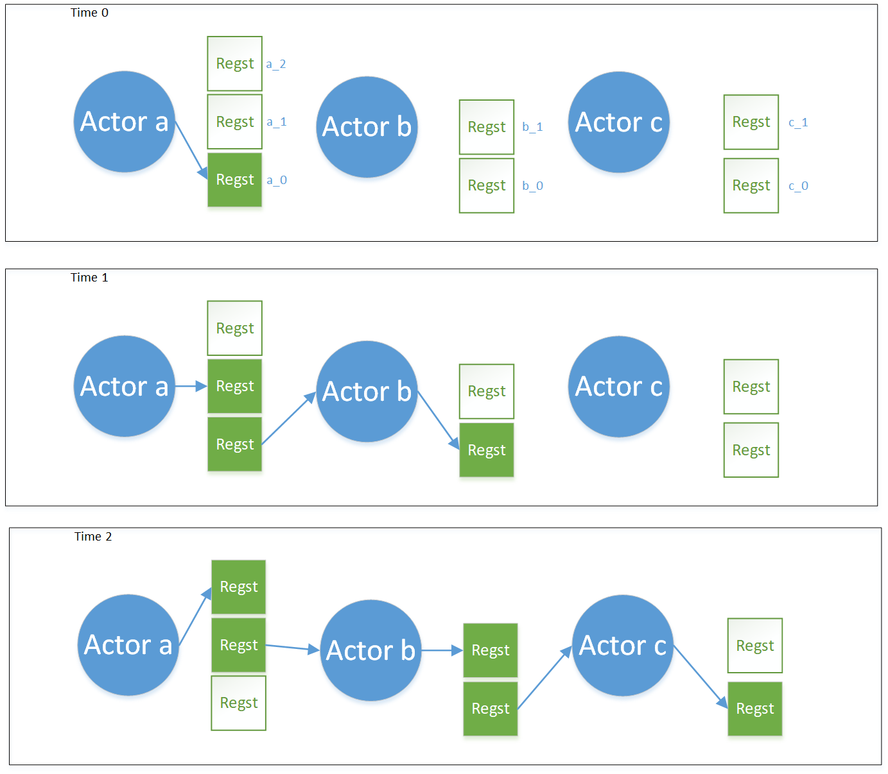
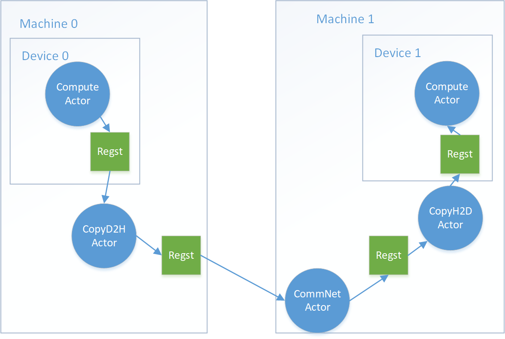
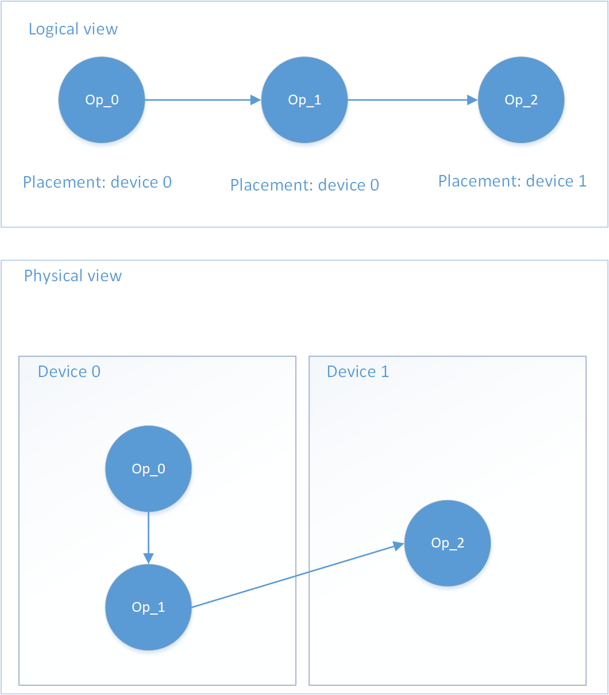
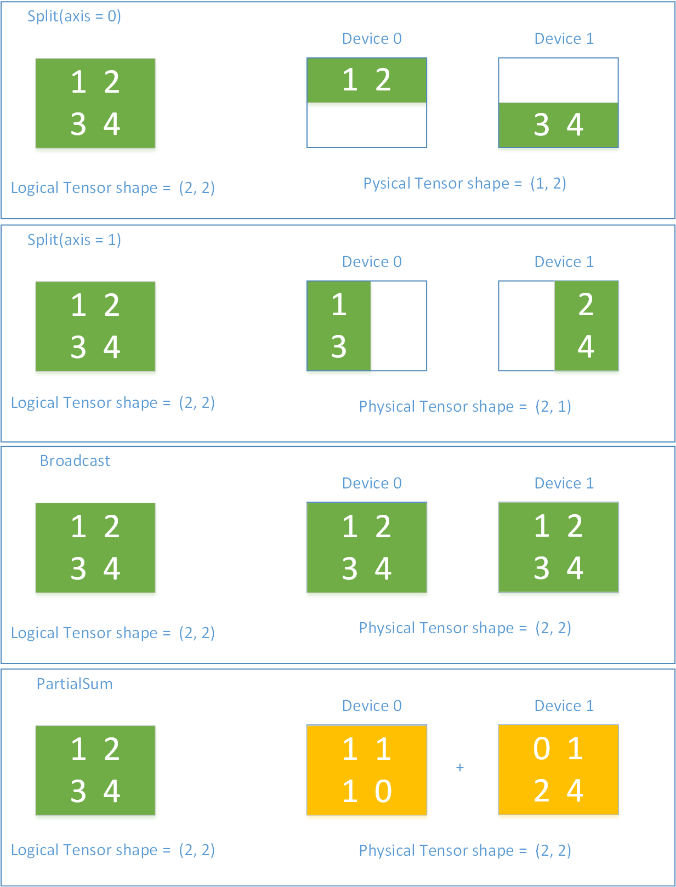
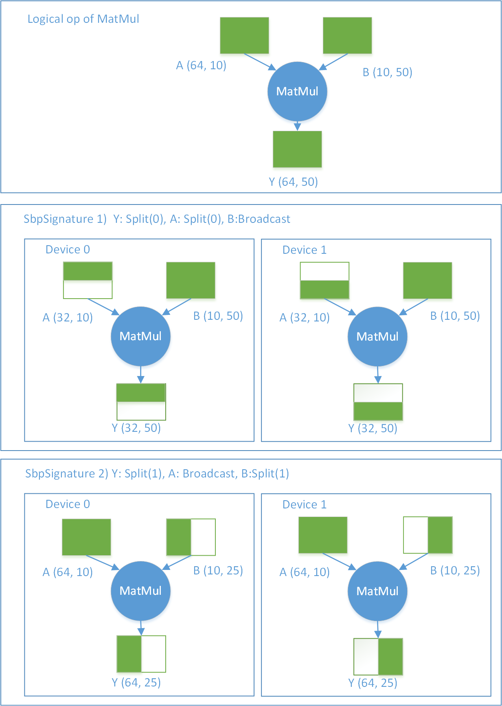
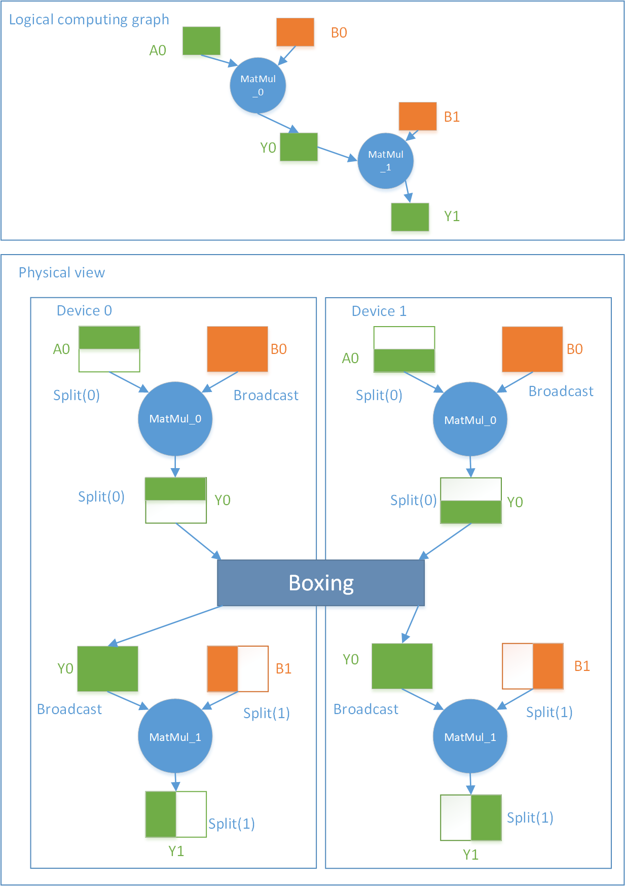

# OneFlow System Design

In this article, we will cover these topics:

* Motivation for OneFlow
- OneFlow feature 1: Actor and Decentralization
* OneFlow feature 2: SBP
* Summarization

## Motivation for OneFlow

OneFlow is born for performance and horizontal scalability, especially in multi-nodes and multi-devices scenarios. We expect that users can leverage the power of multiple machines and multiple devices in a way as easy as using a single machine with one device, and enjoy the efficiency of linear speedup.

Why does OneFlow focus on the performance and user experience in distributed scenarios? With the development of deep learning, the model becomes increasingly large, and the computing power required to train deep learning models will become higher and higher. At the same time, the speed of model getting larger is greater than the speed of expansion of a single device memory; the requirement of the increase of the computing power is greater than the growth rate of single device computing power. The computing power and the memory of a single device are far from meeting the needs of deep learning model training, and multiple machines and multiple devices are required for parallelism speedup.

If the deep learning framework can make multiple interconnected devices work well together and achieve linear speedup, even if the performance of each device is "normal", it can also meet the computing power needs of any scale. This is the so-called horizontal scalability. We do believe this is the solution to the increase in computing power。

However, the existing frameworks first focus on the user experience of a single device, and only handle the multi-machine and multi-devices scenarios that works for data parallelism. That is, copy the computation graph on a single device to multiple machines and multiple devices, each device and machine assists the module used for collaborative computing.

For models with a huge amount of parameters such as BERT/GPT-3, users often find it not friendly to use, hard to deploy and not efficient to train models on multiple machines and multiple devices when using existing deep learning frameworks. It is also time-consuming for users to learn how to do distributed training. They also need to care about the synchronization of models between multiple machines and multiple devices. In order to solve the problems above of distributed deep learning, the industry not only improved the deep learning framework itself, but also developed a variety of third-party plugins, such as NCCL, Horovod, BytePS, HugeCTR, Mesh-tensorflow, Gpipe, etc. However, it still can’t meet users' ultimate pursuit of the performance.

The core design concept of OneFlow is to allow multi-machine and multi-devices distributed training to work efficiently and collaboratively, and at the same time, to allow users to have the multi-machine and multi-devices training experience as simple and easy as a single device. Let's introduce the two core ideas of OneFlow to achieve this goal, and explain how OneFlow views deep learning training in distributed scenarios.

## Actor and Decentralization

Key features:

* Decentralized scheduling

* pipeline

* data movement is a first-class citizen

* transmission is covered by calculation

* control logic is covered by execution logic

In the design of OneFlow, it is divided into two periods: Compile time and Runtime. In the Compile time, user-defined neural networks and distributed environment information are compiled into a static graph execution plan, called "Plan", which is composed of the description information of the execution unit Actor; During the runtime , each machine actually created many Actor instances belonging to its own machine based on the Actor description information in the Plan, and then started the Actor operating system. During the entire deep learning training period, the basic unit of OneFlow execution is the Actor, which corresponds to the nodes on the static execution graph. The data produced and consumed between Actors is stored in Registers, and the Actors cooperate through message passing.

### Actor mechanism allows decentralized scheduling
OneFlow's runtime decentralized scheduling is implemented using the Actor mechanism. In the entire static graph composed of actors, there is no central scheduler. Each actor only needs to care about the producer of the data it needs (upstream Actor) and the consumer of the data it produces (downstream Actor). In this way, in the ultra-large-scale distributed training scenario, **completely decentralized scheduling** can avoid the single-point performance bottleneck problem of central scheduling.

Each Actor has a state machine inside, and the messages sent and received by the Actor and the execution status will change its own state. It should be noted that Register is a storage block, which stores the data produced by the Actor, and the message is a lightweight data containing the memory address of the Register storage block. There are messages, instead of Register, that are passed between Actors, which achieves zero-copy.

When the Actor receives a new message and judges that the Register it needs to consume is ready for execution, and the data it produces has free Register to be written, the Actor executes (Act) once to produce a Register.

After production, the Actor sends a message to the consumer Actors who need to consume the Register, indicating that "you can read the data I produced"; At the same time, the Actor also needs to return the Register it consumes to the producer of the Register, Actors, indicating that "I have used up your data and you can reclaim it." The state machine inside the Actor is shown in Figure 1.

<div align="center">
    
</div>

<center>
Figure 1 Actor state machine inside
</center>

After the Actor starts, it will switch its two states according to the messages sent and received with other actors: **waiting state** and **execution state** .

The messages received by an Actor are generally divided into several types:

* The upstream producer Actor sends a message saying that you can read the data I produce;

* the downstream consumer Actor sends a message saying that I have used up the data you produced.

When this data is used up by all consumers, it can be recycled as a free block and wait for the Actor to produce a new data next time.

After receiving a message, an Actor will try to determine whether the current execution conditions are met. There are generally two execution conditions:

* Whether all the data to be read is available;

* Whether there are free blocks that can be used for production. When the execution state is satisfied, the actor starts to call its own internal Kernel to read and write data.

After execution, the Actor will send messages to upstream and downstream:

* Send a message to the downstream consumer Actor saying that I just produced a piece of data, you can read it;

* Send a message to the upstream producer Actor saying that I just used up The data you sent me before.

Actors only need to care about upstream and downstream messages to decide whether they can execute or not. Each Actor realizes a **completely decentralized** distributed collaborative work through its own internal state machine and message sending and receiving mechanism.

### Actor mechanism realizes pipelining

We introduced the internal state machine of Actors above. Message transfer and data transfer between Actors are implemented by Register. Whether an Actor can execute is only related to two conditions:

* Whether the Registers consumed by itself are readable;

* Whether the Registers produced by itself have free blocks to write.

For a Register, if we allocate multiple free blocks to it when it’s running, then two adjacent Actors can work at the same time, and the working time overlaps, thus realizing the pipelining between each Actor. In an ideal state, the execution time of the entire static execution graph is the total running time of the Actor that is the performance bottleneck in the entire system, and the execution time of the remaining actors is covered by the pipelining.

Let's take an example to explain how the pipeline under the Actor mechanism works. Figure 2 is an execution sequence diagram of a computation graph composed of 3 Actors (a, b, c). The dark green Regst square represents the Register block being used, and the white Regst square represents the spare free block of the same Register.

* 1) At Time0, Actor a produces a Regst_a_0, and Actor b and Actor c are in a waiting state because they have no readable Register. Assume that the execution time of each Actor is unit time.

* At Time1, Actor a sends a message to Actor b saying that you can read the Regst_a_0 that I produced. Actor b received the message and checked whether there is a free block available in the Register b produced by itself, and found that there is available Regst_b_0 , so Actor b executes at Time1, reads Regst_a_0, writes Regst_b_0; at the same time, Actor a will also check whether it has a free block to write, and finds that it has a free block to write, so Actor a is also executing at Time1, writing Regst_a_1. (It should be noted here that Regst_a_0 and Regst_a_1 logically belong to the same Register, but they are spatially divided into different free blocks for backup. In the deep learning training task, Regst_a_0 and Regst_a_1 store data of different batches produced by a same operator.) So Actor a and Actor b work in parallel. Actor c is still waiting because there is no data to read.

* At Time2, Actor b has produced Regst_b_0, so it sends a message to the downstream consumer Actor c that you can read the Regst_b_0 I produced, and at the same time sends a message to the upstream producer Actor a that I have used up your Regst_a_0 . At this point, Actor a has sent the newly produced Regst_a_1 to Actor b. Actor b checks that it still has Regst_b_1 available, so Actor b starts to read Regst_a_1 and write Regst_b_1; Actor c receives Regst_b_0 and finds that it has Regst_c_0 available, so Actor c starts execution, reads Regst_b_0 and writes Regst_c_0; Actor a receives Regst_a_0 that Actor b has used up and returned, and checks that all consumers of Regst_a_0 are used up, so Regst_a_0 is recycled and marked as a free block, and Actor a can continue to execute and write Regst_a_2.

<div align="center">
    
</div>

<center>
Figure 2 Actor
 producer-consumer relationship and execution sequence diagram
</center>


In the above example, at Time2, Actors a, b, and c are all working. In the deep learning training task, Regst_b_0 and Regst_c_0 at Time2 store the data of Batch 0, and Regst_a_1 and Regst_b_1 store the data of Batch 1. Regst_a_2 stores data of Batch 2. By the design of a Register with multiple free blocks, the Actor mechanism realizes pipelining parallelism.

Here we raise a further in-depth question: the execution of the entire data flow is like a network, and the data flow in the network completes the calculation. How to avoid the producer's production too fast for the consumer to consume, and how to avoid the producer's production is too slow, and consumers get hungry. This involves planning for computing, memory, and transmission bandwidth, so that the bottleneck of the system is as wide as possible. It is necessary to solve the problem of flow control and resource allocation (For example, how many memory block quotas are allocated to the Register of each Actor). This is critical problem has been solved by the OneFlow system.

### Data movement is the first-class citizen

In a distributed environment with multiple machines and multiple devices, the data transmission between each machine and each device is often the most important factor affecting the horizontal scalability of the system. If the transmission overhead can be covered by the computational overhead, then distributed deep learning training can achieve he ideal linear speedup ratio. Compared with other frameworks, OneFlow regards data movement as an operation with the same status as data computing, thus proposing the idea of **"data movement is the first-class citizen"**.

The focus of the existing frameworks during the compile time is data calculation. And the existing frameworks believes that data movement occurs implicitly behind the scenes. Therefore, the overlapping arrangement of calculation and movement is skipped in the static analysis of the computation graph. OneFlow explicitly expresses the data movement in the computation graph and treat data movement and data calculation equally during static analysis to maximize overlap movement and calculation.

In the final execution diagram, data movement operations are also done by Actors. In addition to the actors used for data calculation on the device, there are also Actors responsible for data copy from computer memory to device memory, network Actors for network communication between machines, Actors responsible for data segmentation, merging, and replication, Actors responsible for fetching and reading the disk data, and Actors responsible for loading and saving the model, etc. Many other frameworks make data loading, synchronization of multi-devices model gradients, networks, model loading updates, etc. into a separate module, but design of OneFlow is that all functions are implemented in a static execution graph composed of Actors. The design of OneFlow is not only simple and elegant, but also very efficient.

<div align="center">
    
</div>

<center>
Figure 3 Data transimition from one device to another
</center>

Figure 3 shows that, without device-Direct, in the Runtime of OneFlow, how the data is transported if a computing node on one device consumes the computing node of another device.

### Use parallelism as much as possible

In the design of OneFlow, parallelism is used as much as possible to achieve optimal distributed performance. For example, when considering the distributed training model of gradient synchronization, the transmission bandwidth from video memory to memory is higher than the network transmission bandwidth between machines. OneFlow will perform two-level scatter and gather operations (local and between each machine) to increase locality and improve overall performance.

Another example, when deep learning training is started asynchronously, the control logic of user who use Python is executed in parallel with the execution graph when OneFlow is running. At the same time, OneFlow has a set of mutually exclusive section design to ensure efficient and correct execution.

Whether the data loading part is to read data from disk or feed data from python, OneFlow can ensure that it uses parallelism if possible, so that the computing device will not cause performance degradation due to waiting for data.

If existing frameworks want to nest data movement and calculations as much as possible, they generally use multi-layer callback functions. When there are too many nesting levels, the so-called **Callback Hell** will be troublesome, and the accuracy and readability may decrease. But in OneFlow, the above parallel concurrency features are implemented under this simple and clear Actor mechanism, which solves the Callback Hell problem.

In addition, in the multi-machine network communication part, the infrastructure level of network communication library in OneFlow naturally supports RDMA high-performance communication, and there is also a set of efficient communication design based on epoll. However, even for Pytorch , the most popular framework at present, needs to use RPC for data synchronization in the multi-machine network communication.

## What makes OneFlow the most user-friendly framework for distributed computing
OneFlow is currently the most user-friendly deep learning framework that supports data parallelism, model parallelism, and pipelining parallelism in distributed scenarios. Users only need to build a network model as if it’s on a single device, and tell OneFlow which machines and which devices are available, and OneFlow will use these machines and devices in the most efficient way.

This stems from a unique design of OneFlow: Consistent View. For multi-machines and multi-devices, OneFlow will **abstract it into a super large device** , which we call a logical device. The video memory of this logical device is the sum of the actual video memory of multiple physical devices, and the computing power of this logical device is also the sum of the actual computing power of multiple physical devices.

The user only needs to define how the deep learning model is constructed in this logical super device, and don’t need to worry about the rest of the operation. OneFlow completes the mapping from the logical device to the physical device.

Here are two concepts: "logical" and "physical". "Logical" means that OneFlow abstracts the distributed cluster into calculations and data behind a supercomputer, and "physical" means the calculations and data that are actually deployed on various machines and devices.

The deep learning network is a computation graph composed of Op, and Op produces and consumes Tensor data. In a multi-machine and multi-devices environment, a logical Op corresponds to multiple physical Ops. The calculations actually performed by each physical Op are part of the logical Op calculations, and a logical Tensor also correspond to multiple physical Tensors, and each physical Tensor is part of the logical Tensor.

For distributed training defined by other frameworks, each device is a "world", and the model gradients are synchronized between multiple devices according to the exposed interface; For OneFlow, multiple machines and multiple devices are also a "world" , we use a set of Placement+SBP method for overall management.

### Placement
During the construction of OneFlow's computation graph, each calculation Op has an attribute called Placement, which means the machines and equipments the logical Op is to deploy on. For general data parallelism, all Ops are deployed on all devices. However, OneFlow also supports user-specified Op Placement. For example, when the network is too large for a single device to accommodate at all, OneFlow allows the first part of the network to be on one device and the second part on the other device. "Relay" work enables pipeline parallelism.

Figure 4 shows an example of a possible Placement. The user defines a network consisting of 3 Ops: Op_0 -> Op_1 -> Op_2.

Among them, the Placement of Op_0 and Op_1 is Device 0, and the Placement of Op_2 is Device 1. This is an example of pipeline parallelism. Oneflow will automatically insert the Copy Op needed for data transfer between Op_1 and Op_2.

<div align="center">
    
</div>

<center>
Figure 4 pipelining parallelism with placement
</center>


### SBP
SBP is a unique concept of OneFlow. It is a combination of the initials of three words: Split, Broadcast, PartialSum (take PartialSum as an example, in fact, it can also be a reduce operation such as PartialMin, PartialMax). The full name is of SBP is SbpParallel, which represents a mapping relationship between the logic Tensor and the physical Tensor.

Among them, Split means that the physical Tensor is obtained by splitting the logical Tensor on a certain dimension. There’s a parameter axis in Split, which indicates the dimension of the split. If multiple physical Tensors are concatenated according to the dimensions of Split, the logical Tensor can be restored.

Broadcast indicates that the physical Tensor is exactly the same as the logical Tensor.

PartialSum indicates that although the physical Tensor has the same shape as the logical Tensor, the value in the physical Tensor is a part of the value in the corresponding position in the logical Tensor, if you add multiple physical Tensors according to the corresponding positions, you can restore the logical Tensor.

Figure 5 shows a simple example of SbpParallel.

<div align="center">
    
</div>

<center>
Figure 5 Examples of SbpParallel
</center>

SbpSignature is a collection of SbpParallel, which is the attribute of Op in the design of OneFlow. It depicts how a logical Op is mapped to multiple physical Ops on each device, and how these physical Ops treat the logical and physical mapping relationship of their input Output Tensor. An Op has multiple legal SbpSignatures. The simplest legal signature is that both input and output are Broadcast, which means that the Op needs the entire logical Tensor data.

After the logical computation graph constructed by the user is determined, when OneFlow generates a distributed physical execution graph in the Compiler, among the Placement of each Op and the list of legal SbpSignature allowed by the Op, it will select a SbpSignature with the least transmission overhead as the SbpSignature of the training to guide the Compiler to generate the most efficient execution graph.

Regarding the list of legal SbpSignature of Op, we will give an example of an Op of matrix multiplication (matmul).

Definition: `Y = matmul(A,B)`, `A`, `B`, `Y` are all `Tensor`, which means `Y = AB`. Then there are at least two legal SbpSignatures:

* 1) Y: `Split(0)`, A: `Split(0)` , B: `Broadcast`

* 2) Y: `Split(1)`, A: `Broadcast`, B: `Split(1)`

The diagram of the two legal signatures on the two devices is shown in Figure 6. Assume that the shape of the logical input and output Tensor of MatMul is:

```text
A(64, 10) × B(10, 50) -> Y(64, 50)
```

<div align="center">
    
</div>

<center>
Figure 6 Two leagal SbpSignature of MatMul
</center>

And the Op is distributed on two devices. Under the first type of SbpSignature, A on device 0 is the first half of logical A, A on device 1 is the second half of logical A (division according to the 0th dimension), and B on both devices is exactly the same as the logical B. The output Y from the two devices is the first half and the second half of the logical Y respectively. The second SbpSignature can also be analyzed the same way.

It should be noted that when A is data and B is model, the first SbpSignature is **data parallelism** , and the second SbpSignature is **model parallelism** . If there’re two adjacent MatMul ops, the former uses the first SbpSignature and the latter uses the second SbpSignature, the entire network will achieve **hybrid parallelism** .

Figure 7 is an example of hybrid parallelism. It defines Y0 = MatMul_0(A0, B0), Y1 = MatMul_1(Y0, B1), a computation graph composed of two ops, where A0, Y0, Y1 are data Tensor, B0 , B1 is the model Tensor.

<div align="center">
    
</div>

<center>
Figure 7 Hybrid parallelism
</center>


In Figure 7, Y0 produced by MatMul_0 is consumed by MatMul_1, but the two ops view the SBP of the same Tensor differently. MatMul_0 considers Y0 to be a Split (axis=0) segment, but MatMul_1 needs a Broadcast Y0 input. At this time, OneFlow will automatically insert a "universal" Boxing Op to do the necessary data splitting, concatenating, handling and summing operations, so that all Ops can efficiently get the data they want in a distributed environment.

In data parallelism, if the Tensor in a training forward model is Broadcast, the gradient corresponding to the backpropagation is PartialSum. When the Optimizer needs all the gradients to update the model, it will trigger the Boxing mechanism of OneFlow to perform efficient gradient synchronization.

### The most user-friendly distributed framework

OneFlow’s Placement + SBP + Boxing mechanism allows Op and Tensor in user-defined computation graphs to be distributed on various machines and devices in any way. Whether it is data parallelism, model parallelism or pipelining parallelism, for OneFlow, it is just a combination of a specific SbpSignature under a specific Placement, which can be easily configured by the user, or handed over to OneFlow for automatic processing.

In addition, before Microsoft launched the ZeRO-2 framework, OneFlow already supported similar features. In the multiple machines and multiple devices scenarios, each model Tensor is only saved on one of the devices, reducing the memory usage in gradient calculations.

## Summary
In summary, during the compile time, OneFlow has designed a mathematically rigorous formal system to express all legal parallel modes, and supports the compiler to automatically search for the optimal parallel scheme more easily.

During the runtime, the Actor system supports for parallel and concurrent execution in an flexible and efficient way. The core of OneFlow has the advantages of simplicity, efficiency and high scalability.

Based on this design, OneFlow makes the performance of distributed training extremely efficient, and distributed training as easy as training on a single device.
