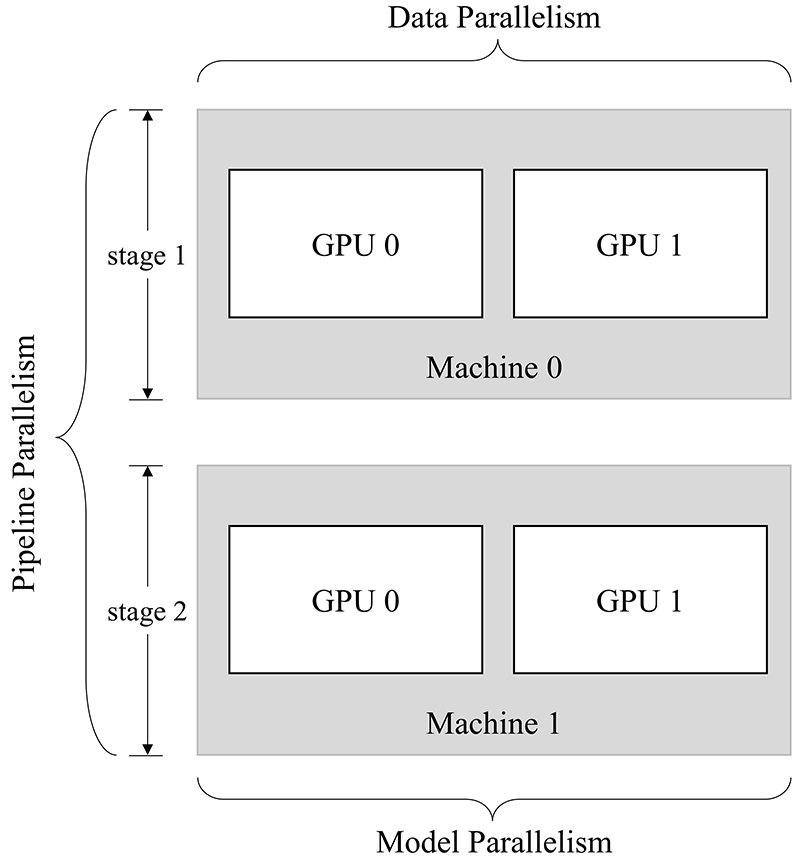

# Distributed Programming with Global Tensor: Distributed Parallelism Strategies 

By [Guoliang Cheng](https://github.com/lmyybh), [Xu Xiaoyu](https://github.com/strint)

Deep learning is a complicated machine learning algorithm that uses a neural network to learn the patterns and representations of the training data. The computation mainly involves two parts: data and model.

The increasingly wide application of deep learning and the growing model size impose higher demands for hardware (computing power and memory). However, by some physical laws, it’s getting harder and harder to put more transistors on one chip. Thus, it is difficult for one single device to meet the computing and memory requirements for the ever-enlarging deep learning models. 

Distributed training with multi-node clusters emerges as a solution. We are in urgent need of some efficient and easy-to-use distributed parallelism strategies. 

## Parallelism Strategies

It should be noted that simply multiplying the number of computing devices doesn’t necessarily bring increase in computing power, because neural network training is more complicated than just splitting the work of one device among multiple devices. In addition to computation on each device, distributed training entails inter-device communication. That means we need to schedule the computation and communication well in order to achieve high efficiency in distributed training. 

Common parallelism strategies include **data parallelism**, **model parallelism**, and **pipeline parallelism**, which are detailed as follows:

- Data Parallelism: The **data** is partitioned. Each device runs the same model but processes different data shards.
- Model Parallelism: The **model** is partitioned. Each device runs different parts of the model but processes the same data.
- Pipeline Parallelism: The **model** is partitioned into stages, which are distributed to various devices. The devices execute the stages in a pipeline fashion.  

Another frequently used strategy is **mixed parallelism**, which refers to the combined use of two or three of the above strategies for neural network training.

In the remainder of this article, we will explain the differences between these parallelism strategies with matrix multiplication as an example and introduce how to implement these strategies using ` Global Tensor`.

Assuming that a certain layer in a neural network is dedicated to matrix multiplication, if the shape of the input $x$ is $4\times5$ and that of the model parameter $w$ is $5\times8$, then the shape of the output will be $4\times8$.

Basic code: 

```python
import oneflow as flow

x = flow.randn(4, 5)
w = flow.randn(5, 8)
out = flow.matmul(x, w)
print(out.shape) # (4, 8)
```

Here is the illustration:


In single-device training, the above computation will produce an output $out$, which will be passed to the next layer. Eventually, we will get a $loss$. Then, in backward propagation, we will get $\frac{\partial loss}{\partial w}$, which will be used to update $w$.

### Data Parallelism

In data parallelism, we input different data shards into different devices, and each device runs the same whole model to process its given data shard.

In OneFlow’s unique Global Tensor, the distribution is implemented via `placement` and `sbp`. `placement` refers to the physical devices that the global tensor is distributed among, and `sbp` refers to the way that the global tensor is distributed. (For more information, please refer to [Create a Global Tensor](https://docs.oneflow.org/en/master/cookies/global_tensor.html))

Take two-GPU parallelism as an example, the data parallelism program for the aforementioned matrix multiplication is as follows:

**Note: If you don’t have multiple GPUs, you can simulate multi-device parallelism with CPUs via designating the `placement` as `type="cpu"`.**

```python
import oneflow as flow
placement = flow.placement(type="cuda", ranks=[0, 1])
x = flow.randn(4, 5, placement=placement, sbp=flow.sbp.split(dim=0))
w = flow.randn(5, 8, placement=placement, sbp=flow.sbp.broadcast)
out = flow.matmul(x, w)
print(out.shape) # (4, 8)
```

Supposing that the above program is in a `test.py` script, unlike what we’ve mentioned in the previous article, here we utilize a OneFlow distribution tool and execute the following command to start the program in terminal: 

```shell
python3 -m oneflow.distributed.launch --nproc_per_node 2 test.py
```

Illustration of data parallelism:


As can be seen, the design of global tensor makes it easy to modify the code for the above matrix multiplication. All you need to do is to: 

<br/>

1. Partition the data $x$ on dimension 0 (`sbp=flow.sbp.split(dim=0)`), and distribute the data shards across two GPUs (`placement=flow.placement(type="cuda", ranks=[0, 1])`).
2. Keep the model parameter $w$ intact (`sbp=flow.sbp.broadcast`), and broadcast it to two GPUs (`placement=flow.placement(type="cuda", ranks=[0, 1])`).

### Model Parallelism

When the neural network is extremely large, data parallelism can result in huge cost of gradient synchronization. This is when model parallelism comes in handy.

In contrast with data parallelism, with model parallelism, you partition the model and feed different parts of the model to various devices. Each device processes the same whole data.

Still, we take two-GPU parallelism as an example. The model parallelism program for the aforementioned matrix multiplication is as follows:

```python
import oneflow as flow

placement = flow.placement(type="cuda", ranks=[0, 1])
x = flow.randn(4, 5, placement=placement, sbp=flow.sbp.broadcast)
w = flow.randn(5, 8, placement=placement, sbp=flow.sbp.split(dim=1))
out = flow.matmul(x, w)
print(out.shape) # (4, 8)
```

Supposing that the above program is in a `test.py` script, we execute the following command to start the program in terminal:

```shell
python3 -m oneflow.distributed.launch --nproc_per_node 2 test.py
```

Illustration of model parallelism:


Similarly, the modification is simple:

<br/>
1. Keep the data $x$ intact (`sbp=flow.sbp.broadcast`), and broadcast it to two GPUs (`placement=flow.placement(type="cuda", ranks=[0, 1])`).
<br/>
2. Partition the model parameter $w$ on dimension 1 (`sbp=flow.sbp.split(dim=1)`), and distribute the shards across two GPUs (`placement=flow.placement(type="cuda", ranks=[0, 1])`).

### Pipeline Parallelism

If the neural network is too large to be placed on one device, pipeline parallelism can help. Pipeline parallelism means to partition the neural network into stages and distribute the stages to various devices. The devices will execute their given stage in a pipeline fashion.

For example, we build a two-stage program for two-GPU pipeline parallelism:

```python
import oneflow as flow

P0 = flow.placement(type="cuda", ranks=[0])
P1 = flow.placement(type="cuda", ranks=[1])
BROADCAST = flow.sbp.broadcast

# Place the first stage of the model on GPU 0.           
w0 = flow.randn(5, 8, placement=P0, sbp=BROADCAST)  
# Place the second stage of the model on GPU 1.
w1 = flow.randn(8, 3, placement=P1, sbp=BROADCAST)

# Randomly generate data to be used as input. Note that the data for the first stage should be placed on GPU 0.
in_stage0 = flow.randn(4, 5, placement=P0, sbp=BROADCAST)
out_stage0 = flow.matmul(in_stage0, w0)
print(out_stage0.shape) # (4, 8)

# Place the data for the second stage on GPU 1 via to_global.
in_stage1 = out_stage0.to_global(placement=P1, sbp=BROADCAST)
out_stage1 = flow.matmul(in_stage1, w1)
print(out_stage1.shape) # (4, 3)
```

Supposing that the above program is in a `test.py` script, we execute the following command to start the program in terminal:

```shell
python3 -m oneflow.distributed.launch --nproc_per_node 2 test.py
```

In the above program, we simulate a two-stage neural network with matrix multiplication. Different from data parallelism and model parallelism, pipeline parallelism does not shard the data or the model, but place the two stages of the model on two devices for computation.

Thanks to the neat design of global tensor, during the computation, all you need to do is adjusting the distribution strategy of the output data from the previous stage via `to_global(...)` so the data can be used as the input for the next stage.

### Mixed Parallelism

Mixed parallelism refers to the combined use of two or three of the above parallelism strategies.

OneFlow supports two model execution modes: `Eager Mode` and `Graph Mode`. Both modes support parallel computing strategies. 

- `Eager Mode` is the default mode in OneFlow. The neural network model is inherited from `nn.Module`.
- In `Graph Mode`, you need to customize the classes inherited from `nn.Graph`, and reuse the neural network model in `Eager Mode`.

For more information of `Graph Mode`, please check: [Static Graph Interface: nn.Graph](../basics/08_nn_graph.md)

The following example is a mixed parallelism program for `4 GPUs`.

!!! Note 
    **Click** `Eager` and `Graph` for the corresponding sample code 

    
=== "Eager"

    ```python
    import oneflow as flow
    import oneflow.nn as nn
    
    P01 = flow.placement(type="cuda", ranks=[0, 1])
    P23 = flow.placement(type="cuda", ranks=[2, 3])
    
    class StageModule(nn.Module):
        def __init__(self, in_dims, out_dims, placement=None, sbp=None):
            super().__init__()
            self.w = nn.Parameter(
                flow.randn(in_dims, out_dims, placement=placement, sbp=sbp)
            )
            
        def forward(self, x):
            out = flow.matmul(x, self.w)
            return out
            
    class ModuleModel(nn.Module):
        def __init__(self):
            super().__init__()
            
            # The first stage of the model: execute data parallelism on GPU 0 and 1.
            self.m_stage0 = StageModule(5, 8, placement=P01, sbp=flow.sbp.broadcast)
            
            # The second stage of the model: execute model parallelism on GPU 2 and 3.
            self.m_stage1 = StageModule(8, 3, placement=P23, sbp=flow.sbp.split(dim=1))
            
        def forward(self, x)
            # First stage: the data is partitioned across GPU 0 and 1 for data parallelism.
            out_stage0 = self.m_stage0(x)
            
            # Second stage: stitch the data together and pass them to GPU 2 and 3 for model parallelism.
            in_stage1 = out_stage0.to_global(placement=P23, sbp=flow.sbp.broadcast)
            out_stage1 = self.m_stage1(in_stage1)
            
            return out_stage0, out_stage1
            
            
    if __name__ == "__main__":
        model = ModuleModel()
        # Partition the input data for data parallelism.
        in_stage0 = flow.randn(4, 5, placement=P01, sbp=flow.sbp.split(dim=0))
        out_stage0, out_stage1 = model(in_stage0)
        print(out_stage0.shape, out_stage1.shape)  # (4, 8) (4, 3)
    ```

=== "Graph"

    ```python
    import oneflow as flow
    import oneflow.nn as nn
    
    P01 = flow.placement(type="cuda", ranks=[0, 1])
    P23 = flow.placement(type="cuda", ranks=[2, 3])
    
    class StageModule(nn.Module):
        def __init__(self, in_dims, out_dims, placement=None, sbp=None):
            super().__init__()
            self.w = nn.Parameter(
                flow.randn(in_dims, out_dims, placement=placement, sbp=sbp)
            )
            
        def forward(self, x):
            out = flow.matmul(x, self.w)
            return out
            
    class ModuleModel(nn.Module):
        def __init__(self):
            super().__init__()
            
            # The first stage of the model: execute data parallelism on GPU 0 and 1.
            self.m_stage0 = StageModule(5, 8, placement=P01, sbp=flow.sbp.broadcast)
            
            # The second stage of the model: execute model parallelism on GPU 2 and 3.
            self.m_stage1 = StageModule(8, 3, placement=P23, sbp=flow.sbp.split(dim=1))
        def forward(self, x):
        
            # First stage: the data is partitioned across GPU 0 and 1 for data parallelism.
            out_stage0 = self.m_stage0(x)
            
            # Second stage: stitch the data together and pass them to GPU 2 and 3 for model parallelism.
            in_stage1 = out_stage0.to_global(placement=P23, sbp=flow.sbp.broadcast)
            out_stage1 = self.m_stage1(in_stage1)
            
            return out_stage0, out_stage1
            
    # Graph
    class GraphModel(nn.Graph):
        def __init__(self):
            super().__init__()
            self.model = ModuleModel()
            self.model.m_stage0.to(nn.graph.GraphModule).set_stage(stage_id=0, placement=P01)
            self.model.m_stage1.to(nn.graph.GraphModule).set_stage(stage_id=1, placement=P23)
            
        def build(self, x):
            return self.model(x)
            
    if __name__ == "__main__":
        graph = GraphModel()
        # Partition the input data for data parallelism.
        in_stage0 = flow.randn(4, 5, placement=P01, sbp=flow.sbp.split(dim=0))
        out_stage0, out_stage1 = graph(in_stage0)
        print(out_stage0.shape, out_stage1.shape)  # (4, 8) (4, 3)
    ```

The above programs construct a two-stage network, whose `two-device two-GPU` parallelism is illustrated as follows:



The two stages of the model are separately executed on two machines, which constitutes pipeline parallelism. For the first stage, Machine 0 executes two-GPU data parallelism; for the second stage, Machine 1 executes two-GPU model parallelism.

**Execution**

`Eager Mode` and `Graph Mode` shares the same way of execution. Assuming that the script is a `test.py` file,

1. For a single-device 4-GPU environment, here is how it is started:

    ```shell
    python3 -m oneflow.distributed.launch --nproc_per_node 4 test.py
    ```

2. The OneFlow distribution tool supports multi-device multi-GPU parallelism. For example, for a `two-device two-GPU` environment, here is how it is started:
    
    Execution on Machine 0:
    
    ```shell
    python3 -m oneflow.distributed.launch \
        --nnodes=2 \
        --node_rank=0 \
        --nproc_per_node=2 \
        --master_addr="192.168.1.1" \ # IP of Machine 0
        --master_port=7788 \
        test.py
    ```
    
    Execution on Machine 1:
    
    ```shell
    python3 -m oneflow.distributed.launch \
        --nnodes=2 \
        --node_rank=1 \
        --nproc_per_node=2 \
        --master_addr="192.168.1.1" \ # IP of Machine 0
        --master_port=7788 \
        test.py
    ```
    
    Note that `master_addr` should be set to the IP of Machine 0.


## Conclusion

Your training efficiency is dependent on your choice of parallelism strategy, while the development efficiency of algorithm engineers is largely affected by how well their framework supports parallel training.

To sum up, in this article, we explain four distributed parallelism strategies: data parallelism, model parallelism, pipeline parallelism, and mixed parallelism. Also, we introduce the system-level innovations of OneFlow that allow users to apply distributed training more easily.

