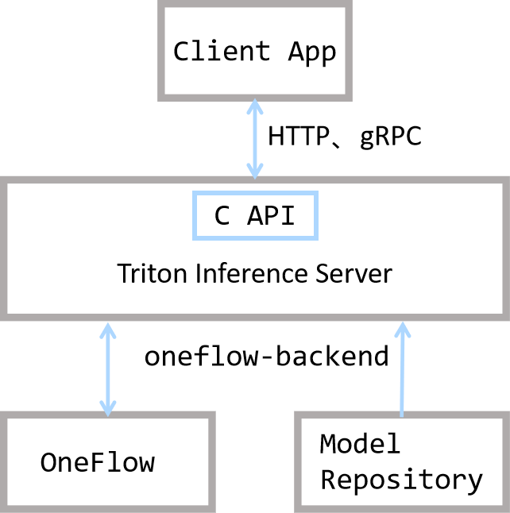

#  Model Deployment

Trained model needs to go through "Model Deployment" before it can be integrated into the product and launched. Because the software and hardware environment and the connection method between models and business modules may change when the product is launched, the deployed solutions are also varied. For example, some schemes convert the trained model to other formats (such as ONNX), and then rely on a specific runtime deployment; some schemes will directly use C/C++ and other languages that can generate native code to re-implement the model, and introduce code optimization in pursuit of hardware adaptation or deployment performance.

OneFlow provides services for the model by docking with the [Triton Inference Server](https://github.com/Triton-inference-server/server). 

OneFlow developers can deploy the model directly through Triton after training the model, use the rich features of Triton, such as Dynamic batching, Model Pipelines and HTTP/gRPC interface, and integrate it into online products quickly and efficiently.

Contents of this article：

- Quick Start of OneFlow deployment
- Introduction to OneFlow Serving Architecture
- Analysis of OneFlow Process from Training to Deployment

## Quick Start of OneFlow deployment

The project [OneFlow Serving: Neural Style Transfer](https://oneflow.cloud/#/project/public/code?id=2eec2f768cdfe5709dc4c01e389fd65c) has been prepared on OneFlow Cloud. Referring to the description, developers can deploy the project with one click and view the running result.


Analyzing the code, we can find the following key points:

- Triton server and WEB application server are started in `run_cloud.sh`:
```bash
/opt/tritonserver/bin/tritonserver --model-store $(pwd)/model_repo > 1.txt &
  python3 server.py
```

- `server.py` is just simple and normal URL routing, so `stylize` in `infer.py` does the real inference work. Its result is obtained inside the `stylize` function through interacting with the HTTP and Triton server.
```python
def stylize(content_path, output_path, style='udnie'):
    triton_client = httpclient.InferenceServerClient(url='127.0.0.1:8000')
    ...
    inputs.append(httpclient.InferInput('INPUT_0', image.shape, 'FP32'))
    ...
    outputs.append(httpclient.InferRequestedOutput('OUTPUT_0', binary_data=True))
    ...
```

- Pretrained models are placed under `model_repo`, which is organized according to Triton's conventions.

This simple online example illustrates that how the OneFlow model can be deployed through Triton and how business modules interact with the Triton server to obtain inference results.

If you want to run this example locally, you can also download [demo.zip](https://oneflow-public.oss-cn-beijing.aliyuncs.com/oneflow-documentation/serving/demo.zip), unzip it and run the file `run.sh` in it.

```shell
bash run.sh
```

Next we will introduce the detailed process of OneFlow from training to deployment in detail.

## Analysis of OneFlow Process from Training to Deployment

Firstly we can understand the relationship between OneFlow and Triton in general through the following figure.



As can be seen from the above figure, Triton is in the position of connecting the client and OneFlow: it provides HTTP, gRPC and C interfaces, so that developers can flexibly make an inference request and get the result. 

OneFlow and Model Repository provide Triton in its architecture with back-end reasoning capabilities together. OneFlow provides a corresponding interface to export the trained model to the organizational format that is preset by Triton.

In addition, Triton also provides built-in functions such as task scheduling to ensure performance. For details, please refer to [Triton's official documentation](https://github.com/triton-inference-server/server#features).

After understanding these basic concepts, let's analyze the process of OneFlow from model training to deployment in detail:

- Model save
- Model deployment
- Start service
- Client sends request

### Model Save

The model trained in Graph mode can be directly exported to the format required for deployment through `oneflow.save`; if it is trained in Eager mode, it can be exported to the required format after simple conversion. For details, please refer to [Graph and Deployment](../basics/08_nn_graph.md#graph_5).

### Model Deployment

Triton has certain requirements for the directory structure of the model, so we need follow [Triton's convention](https://github.com/triton-inference-server/server/blob/main/docs/model_repository.md#repository-layout) to organize the model directory structure and write related configuration files.

**Directory Structure**

In this example program, the model files are placed in the `model_repository` directory, and its structure conforms to Triton's conventions. Let's see how it is organized and explain:

```
$ tree  -L 3 model_repository/
model_repository/
└── fast_neural_style
    ├── 1
    │   └── model
    └── config.pbtxt
```

- `model_repository` is the root directory of the model repository. When starting Triton, you can specify it through the `--model-repository` option.
- `fast_neural_style` is a model in repository. There can be multiple models in a repository, and each first-level subdirectory is a model. Here we only prepare the `fast_neural_style` model.
- The `1/model` directory is the model we saved earlier through `flow.save(graph, "1/model")`. `1` is the version number in it. There can be multiple model versions in a model directory agreed in Triton, and the folder name of the model version must be **pure number**. Under the model version folder, you need to place a folder named `model`, which saves model parameters and computation graphs.(!需要检查)
- `config.pbtxt` is a plain text file used to configure the basic information of the model repository, we will introduce it in detail next.


**Model repository configuration**

`config.pbtxt` is a configuration file in protobuf text format. By writing this file, you can configure the information of model services, such as Specified hardware, input and output. The example content is as follows:

```text
name: "fast_neural_style"
backend: "oneflow"
max_batch_size: 1
input [
  {
    name: "INPUT_0"
    data_type: TYPE_FP32
    dims: [ 3, 256, 256 ]
  }
]
output [
  {
    name: "OUTPUT_0"
    data_type: TYPE_FP32
    dims: [ 3, 256, 256 ]
  }
]

instance_group [
  {
    count: 1
    kind: KIND_GPU
    gpus: [ 0 ]
  }
]
```

Next we explain the configuration items in turn.


```python
name: "fast_neural_style"
```

The `name` field（!字段不确定是不是用field) is used to specified model. This line indicates that when using `fast_neural_style` model, its name needs to be the same as the model folder name introduced above.

```
backend: "oneflow"
```

`backend` deployed with Oneflow is used to specify the Triton backend, and this field must be specified as `oneflow`.

Next the shapes of input and output in model need to be defined. We need to fill in the order of according to their name fields, and the naming format is `INPUT_<index>` and `OUTPUT_<index>`, using `<index>` to indicate the order of model input. Start at 0 by default. The `data_type` field defines the data type, and the `dims` defines the shape of the tensor.

```
input [
  {
    name: "INPUT_0"
    data_type: TYPE_FP32
    dims: [ 3, 256, 256 ]
  }
]
output [
  {
    name: "OUTPUT_0"
    data_type: TYPE_FP32
    dims: [ 3, 256, 256 ]
  }
]
```

The above model name, inference backend, and input and output configuration are the most basic configurations. Once configured, we can start working.

The `instance_group` after that is used to configure hardware information.

```
instance_group [
  {
    count: 1
    kind: KIND_GPU
    gpus: [ 0 ]
  }
]
```

It means we instantiate one model and place it on GPU 0. For more flexible configuration options, please refer to [Model Configuration Documentation for Triton Inference Server](https://github.com/triton-inference-server/server/blob/main/docs/model_configuration.md).


### Start Service

OneFlow Serving provides Docker images which uses Docker to start model service. After organizing the files according to the above directory structure, you can map the path to the container and start the service.

```
docker run --rm --runtime=nvidia --network=host -v$(pwd)/model_repository:/models \
  oneflowinc/oneflow-serving:0.0.1 /opt/tritonserver/bin/tritonserver --model-store /models
```

Run the command below to check whether the model service is start. When you see the http 200 status code, the service has started.

```
curl -v localhost:8000/v2/health/ready
```

### Send Request to Triton Server

In this example, we use [tritonclient](https://pypi.org/project/tritonclient/) to interact with Triton Server. We need to install a python package first.

```
pip3 install tritonclient[all]
```

> Actually, clients can interact with Triton Server via [HTTP, gRPC or C API etc.](https://github.com/triton-inference-server/server/blob/main/docs/inference_protocols.md) For details, please refer to the above document.


The following code is the core part of image stylization, which can stylize the image file passed from the command. You can view the complete code on [Cloud Platform](https://oneflow.cloud/#/project/public/code?id=2eec2f768cdfe5709dc4c01e389fd65c), or download [demo.zip](https://oneflow-public.oss-cn-beijing.aliyuncs.com/oneflow-documentation/serving/demo.zip).

```python
#...
import tritonclient.http as httpclient

if __name__ == '__main__':
    parser = argparse.ArgumentParser()
    parser.add_argument('--image',
                        required=True,
                        help='the image to transfer style')
    FLAGS = parser.parse_args()
    triton_client = httpclient.InferenceServerClient(url='127.0.0.1:8000')
    image, w, h = load_image(FLAGS.image, 256, 256)
    inputs = []
    inputs.append(httpclient.InferInput('INPUT_0', image.shape, 'FP32'))
    inputs[0].set_data_from_numpy(image, binary_data=True)
    outputs = []
    outputs.append(httpclient.InferRequestedOutput('OUTPUT_0', binary_data=True))
    results = triton_client.infer('fast_neural_style', inputs=inputs, outputs=outputs)
    output0_data = results.as_numpy('OUTPUT_0')
    image = recover_image(output0_data, h, w)
    cv2.imwrite('result.jpg', image)
```

First create a `triton_client` where `127.0.0.1:8000` is the default port for the Triton service.

```python
triton_client = httpclient.InferenceServerClient(url='127.0.0.1:8000')
```

Then through the `triton_client.infer` interface, you can initiate an inference request to the Triton Server and get the output.
A Tirton inference request needs to specify the model, input and output.

You can see the following code, mainly constructing input and output objects. Their configuration is consistent with the previous that in `config.pbtxt`. And finally through `triton_client.infer('fast_neural_style', inputs=inputs, outputs=outputs)` to initiate an inference request, its `fast_neural_style` is also consistent with the configuration in `config.pbtxt`.

```python
    inputs = []
    inputs.append(httpclient.InferInput('INPUT_0', image.shape, 'FP32'))
    inputs[0].set_data_from_numpy(image, binary_data=True)
    outputs = []
    outputs.append(httpclient.InferRequestedOutput('OUTPUT_0', binary_data=True))
    results = triton_client.infer('fast_neural_style', inputs=inputs, outputs=outputs)
```

Convert the format of the obtained inference result and save the result as the output image:

```python
    output0_data = results.as_numpy('OUTPUT_0')
    image = recover_image(output0_data, h, w)
    cv2.imwrite('result.jpg', image)
```


We use the following command to infer and stylize the specified image, and the result will be saved under `result.jpg`.

```
$ curl -o cat.jpg https://images.pexels.com/photos/156934/pexels-photo-156934.jpeg
$ python infer.py --image cat.jpg 
```
