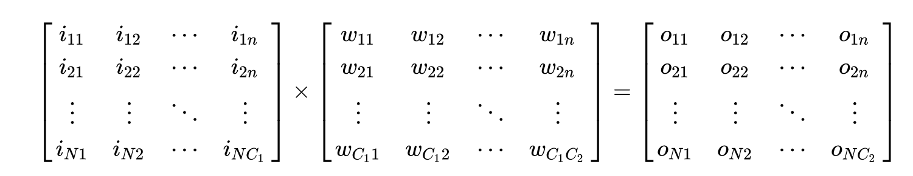
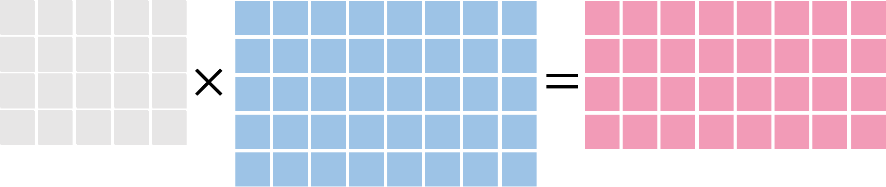
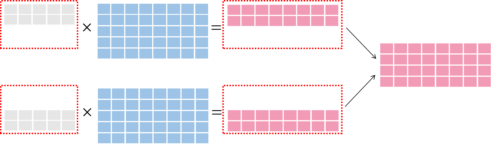
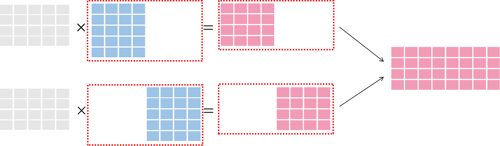

When doing distributed training, OneFlow provides two aspects for determining the relationship between data and models. There are `consistent` strategy and `mirrored` strategy.

In this section, we will introduce:

* The difference and applicable scenario of the data parallelism and model parallelism.

* The characteristics of using  `mirrored`  in distributed training.

* The characteristics of using  `consistent` in distributed training.

## Data parallelism and model parallelism.
In order to better understand  `consistent` and `mirrored` in OneFlow. We need to understand the difference between **data parallelism **and **model parallelism** in distributed training.

To further demonstrate the difference between data parallelism and model parallelism, we will introduce a simple operator(In OneFlow, the logical calculation will regard as operator): matrix multiplication

We assume that in training model have a matrix I as input. Multiply matrix I and W then get result O.



As the description above, size of I is (N, C1), size of W is (C1, C2) and size of O is (N, C2).

Combined  machine learning logic. We can give some definitions to the matrixes above:

* Matrix I as the input object, each row is a sample and each column represents the characteristics of sample.

* Matrix W represents the parameters of model.

* Matrix O is the prediction result or label. If it is a prediction task, it is a process of solving O by I and W to get the classification result. If it is a training task. then it is a process of solving for W by I and O.

When the row N in matrix I is very large. It means we have large scale samples. If when C2 in matrix W is very large, it means we have a very complex model. If the scale and complexity reach a point. The single machine with single GPU will not able to handle the training job. We might consider the distributed training. In distributed training system, we can choose **data parallelism** and **model parallelism**.


In order to better understand data parallelism and model parallelism, we use the following figure as the demo of matrix multiplication:



The first matrix in grey on the left of equation is the input sample. Each row is a sample. The second matrix in blue on the left of equation is the model.

In this section, we will see the operators above switching to different way under data parallelism and model parallelism.


### Data parallelism diagram

In **data parallelism**, the sample data are divided in small parts. **The Data after dividing **will send to each training nodes and calculate with the **completely models**. Finally combine the information in each nodes. As shown in the figure below:



### Model parallelism diagram

In **model parallelism**, model will be divided. **Complete data** will send to each nodes and calculate with **model after dividing**. Finally combine the model in each nodes. As shown in the figure below:



Basically:

* In data parallelism, each node use the same model to train, data will be divided.

* In model parallelism, each node received same data, model will be divided.

We will introduce two parallelism strategies in OneFlow (`mirrored` and `consistent`). Learn how to choose different parallelism methods in different strategies.

### Two types of place holder
In [use OneFlow build neural network](../basics_topics/build_nn_with_op_and_layer.md), we have already introduced the concept of  `Placeholder` and `Blob`. 

Actually, in the view of parallelism, the  `Placeholder`  of OneFlow can be divided to two types: Use `oneflow.typing.Numpy.Placeholder` and `oneflow.typing.ListNumpy.Placeholder` to construct the placeholder, which is corresponding to `Consistent`  and `Mirrored`.

We will explain the detailed examples below.


## Using mirrored in OneFlow

Other framework like TensorFlow or Pytorch supports mirrored strategy. The mirrored strategy of OneFlow is similar to them.

In mirrored, the model are copied in each GPU, each node of creating node for model is the same, thus we only can use **data parallelism**.

In OneFlow, the default strategy is not mirrored, so you should use `default_logical_view` of  `flow.function_config()` to define:

```python
    func_config = flow.function_config()
    func_config.default_logical_view(flow.scope.mirrored_view())
```

In `mirrored_view`, only can use **data parallelism**. When calling the job function, we need divide the  data in average according to number of the GPU and put the data after dividing into `list`. Every element in `list` is the data to send to **each GPU**.

The return value type of job function is `oneflow.typing.ListNumpy`. Every element in  `list`is corresponding to the results of each GPU.

**Combined all **elements in the `list` can make a complete BATCH.

### Code Example
In the following code, we use default  `mirrored_strategy` strategy with two GPUs to train.

Complete Code: [mirrored_strategy.py](../code/extended_topics/mirrored_strategy.py)

The key part of the description please refer to "code explanation" later section.

```python
import numpy as np
import oneflow as flow
import oneflow.typing as tp

BATCH_SIZE = 100
GPU_NUM = 2
BATCH_SIZE_PER_GPU = int(BATCH_SIZE / GPU_NUM)


def get_train_config():
    config = flow.function_config()
    config.default_data_type(flow.float)
    config.default_logical_view(flow.scope.mirrored_view())
    return config


@flow.global_function(type="train", function_config=get_train_config())
def train_job(
    images: tp.ListNumpy.Placeholder((BATCH_SIZE_PER_GPU, 1, 28, 28), dtype=flow.float),
    labels: tp.ListNumpy.Placeholder((BATCH_SIZE_PER_GPU,), dtype=flow.int32),
) -> tp.ListNumpy:
    initializer = flow.truncated_normal(0.1)
    reshape = flow.reshape(images, [images.shape[0], -1])
    hidden = flow.layers.dense(
        reshape,
        512,
        activation=flow.nn.relu,
        kernel_initializer=initializer,
        name="dense1",
    )
    logits = flow.layers.dense(
        hidden, 10, kernel_initializer=initializer, name="dense2"
    )
    loss = flow.nn.sparse_softmax_cross_entropy_with_logits(labels, logits)

    lr_scheduler = flow.optimizer.PiecewiseConstantScheduler([], [0.1])
    flow.optimizer.SGD(lr_scheduler, momentum=0).minimize(loss)
    return loss


if __name__ == "__main__":
    flow.config.gpu_device_num(2)  # 设置GPU数目
    check_point = flow.train.CheckPoint()
    check_point.init()
    (train_images, train_labels), (test_images, test_labels) = flow.data.load_mnist(
        BATCH_SIZE
    )

    for i, (images, labels) in enumerate(zip(train_images, train_labels)):
        images1 = images[:BATCH_SIZE_PER_GPU]
        images2 = images[BATCH_SIZE_PER_GPU:]
        labels1 = labels[:BATCH_SIZE_PER_GPU]
        labels2 = labels[BATCH_SIZE_PER_GPU:]

        imgs_list = [images1, images2]
        labels_list = [labels1, labels2]

        loss = train_job(imgs_list, labels_list)
        total_loss = np.array([*loss[0], *loss[1]])
        if i % 20 == 0:
            print(total_loss.mean())
```

### Code explanation
In the above code:

* Use  `flow.config.gpu_device_num` to set GPU amount as two.
```python
flow.config.gpu_device_num(2)
```

* `oneflow.typing.ListNumpy.Placeholder` defined the sample amount which is divided. And the relationship between `BATCH_SIZE_PER_GPU`  and `BATCH_SIZE` is `BATCH_SIZE=BATCH_SIZE_PER_GPU×GPU_NUM`.
```python
def train_job(
    images: tp.ListNumpy.Placeholder((BATCH_SIZE_PER_GPU, 1, 28, 28), dtype=flow.float),
    labels: tp.ListNumpy.Placeholder((BATCH_SIZE_PER_GPU,), dtype=flow.int32),
) -> tp.ListNumpy:
```

* The data after dividing need to be stored in the `list` and pass to training functions. The number of elements in `list` need to be same as the **GPU number in training**. OneFlow will pass the data according to the order of the elements in `list ` to each GPU(the number i element in `list` is corresponding to number i GPU):
```python
  images1 = images[:BATCH_SIZE_PER_GPU]
  images2 = images[BATCH_SIZE_PER_GPU:]
  labels1 = labels[:BATCH_SIZE_PER_GPU]
  labels2 = labels[BATCH_SIZE_PER_GPU:]

  imgs_list = [images1, images2]
  labels_list = [labels1, labels2]

  loss = train_job(imgs_list, labels_list)
```

* The return result `loss` is a `list`, the number of elements in this `list` need to be same as **the number of GPU in training process**. Then we do the combination then print the  `total_loss`
```python
 total_loss = np.array([*loss[0], *loss[1]])
  if i % 20 == 0:
      print(total_loss.mean())
```

## Use consistent strategies in OneFlow
We have already learned about the mirrored strategy. In `mirrored_view`, sample will be distributed in average to many exactly same models to train. The results of each nodes need be assembled to get the completed batch.

In addition to mirrored strategy, OneFlow also provides consistent strategy. **Consistent strategy is one of the features of OneFlow. Compared with mirrored strategy, it has a great advantage**

OneFlow will use consistent strategy as default. We can declare it explicitly as the following code. 
```python
  config = flow.function_config()
  config.default_distribute_strategy(flow.scope.consistent_view())
```

The reason why consistent strategy is the main character of OneFlow is because in OneFlow design, if we use `consistent_strategy`, then from user's point of view, the op and blob can **get consistently in logic level**. We use matrix multiplication as an example in the beginning of section, we only need focus on [matrix multiplication](#mat_mul_op) itself on mathematics level. But in project, the issue of how to config and use model parallelism or data parallelism can be easily done by using OneFlow. OneFlow will handle **The data division of data parallelism**, **model division of model parallelism** and **serial logic** issue quickly and efficiently. 

 In consistent strategy in OneFlow, we are free to choose either model parallelism or data parallelism or mix of them.

### Code Example
In the following code, we use consistent strategy and use two GPU to train. The default parallels method is **data parallelism** in consistent strategy. The issue of how to set **model parallelism** and **mix parallelism** in consistent strategy will not be discussed in this section. We have special introduction of that in [parallels characters of OneFlow](model_mixed_parallel.md).

Complete code: [consistent_strategy.py](../code/extended_topics/consistent_strategy.py)

```python
import numpy as np
import oneflow as flow
import oneflow.typing as tp

BATCH_SIZE = 100


def lenet(data, train=False):
    initializer = flow.truncated_normal(0.1)
    conv1 = flow.layers.conv2d(
        data,
        32,
        5,
        padding="SAME",
        activation=flow.nn.relu,
        kernel_initializer=initializer,
        name="conv1",
    )
    pool1 = flow.nn.max_pool2d(conv1, ksize=2, strides=2, padding="SAME", name="pool1")
    conv2 = flow.layers.conv2d(
        pool1,
        64,
        5,
        padding="SAME",
        activation=flow.nn.relu,
        kernel_initializer=initializer,
        name="conv2",
    )
    pool2 = flow.nn.max_pool2d(conv2, ksize=2, strides=2, padding="SAME", name="pool2")
    reshape = flow.reshape(pool2, [pool2.shape[0], -1])
    hidden = flow.layers.dense(
        reshape,
        512,
        activation=flow.nn.relu,
        kernel_initializer=initializer,
        name="hidden",
    )
    if train:
        hidden = flow.nn.dropout(hidden, rate=0.5)
    return flow.layers.dense(
        hidden, 10, kernel_initializer=initializer, name="outlayer"
    )


@flow.global_function(type="train")
def train_job(
    images: tp.Numpy.Placeholder((BATCH_SIZE, 1, 28, 28), dtype=flow.float),
    labels: tp.Numpy.Placeholder((BATCH_SIZE,), dtype=flow.int32),
) -> tp.Numpy:
    logits = lenet(images, train=True)
    loss = flow.nn.sparse_softmax_cross_entropy_with_logits(
        labels, logits, name="softmax_loss"
    )
    lr_scheduler = flow.optimizer.PiecewiseConstantScheduler([], [0.1])
    flow.optimizer.SGD(lr_scheduler, momentum=0).minimize(loss)
    return loss


if __name__ == "__main__":
    flow.config.gpu_device_num(2)
    check_point = flow.train.CheckPoint()
    check_point.init()
    (train_images, train_labels), (test_images, test_labels) = flow.data.load_mnist(
        BATCH_SIZE
    )

    for epoch in range(50):
        for i, (images, labels) in enumerate(zip(train_images, train_labels)):
            loss = train_job(images, labels)
            if i % 20 == 0:
                print(loss.mean())
```

### Code explanation
In above code:

* Use  `flow.config.gpu_device_num` to set the GPU number:
```python
flow.config.gpu_device_num(2)
```

* Use  `tp.Numpy.Placeholder` to define the placeholder in consistent strategy. Because the blob of `Numpy.Placeholder` is represent the op and place holder in logic. Thus. the BATCH_SIZE is the totally number of samples and no need for manually dividing or combining.
```python
@flow.global_function(type="train")
def train_job(
    images: tp.Numpy.Placeholder((BATCH_SIZE, 1, 28, 28), dtype=flow.float),
    labels: tp.Numpy.Placeholder((BATCH_SIZE,), dtype=flow.int32),
) -> tp.Numpy:
```

* The result of training use `numpy` as a consistent results. OneFlow done the distributed training and merging process. In consistent model, multi card is basically no difference with single card. User will not find that when using.
```python
      loss = train_job(images, labels).get().ndarray()
      if i % 20 == 0: 
        print(loss.mean())
```

## More extending
With the development of machine learning theory and practice, and now there are already many network unable to training by single card. There have been more and more using of data can not be trained on the parallelism model.

Use  `consistent` in OneFlow, by free to choice and combination of parallelism. Can give a good solutions to the above issue. We will introduce in [parallel characteristic of OneFlow](model_mixed_parallel.md).


