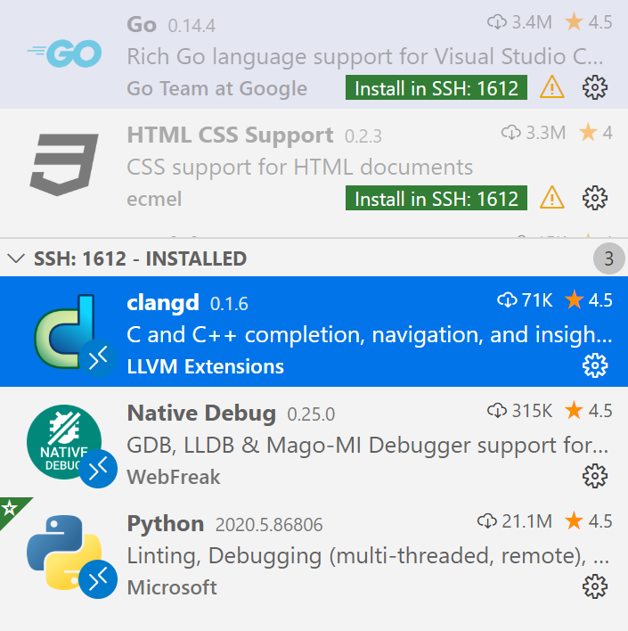

This article describes how to configure VS Code to build OneFlow GUI development environment.

If you are not familiar with VS code please refer to [official documentation](https://code.visualstudio.com/docs).

This article covers:

* How to compile the `Debug` version of OneFlow.

* The necessary extensions of VS code along with installing guidelines.

### Compile the Debug version of OneFlow.

If we use the `Release` version of OneFlow, we may have problems with debugging because of the compiling optimization, and actual running position may not correspond to the source line.

Thus, we need to compile `Debug` version of OneFlow and generate the json file needed by clangd.

When we run cmake, we need add flag of `Debug` and `CMAKE_EXPORT_COMPILE_COMMANDS`.

```shell
cmake .. \
-DCMAKE_BUILD_TYPE=Debug \
-DCMAKE_EXPORT_COMPILE_COMMANDS=1
```

* `-DCMAKE_BUILD_TYPE=Debug` choose the version of Debug.

* `-DCMAKE_EXPORT_COMPILE_COMMANDS` will generate a file named `compile_commands.json` in the `build` folder. The json file is required by clangd and we will configure it later.

### Remote - SSH
This section is intended only for those who need to develop remotely. For those developer developing on local hosts ** may skip this section**.
By the extension "Remote SSH" of VS Code, we can connect to a remote server through SSH.


With the help of "Remote SSH", we can attach to OneFlow running on a remote server and debug OneFlow as if we are debugging a local program.

After installing the extension "Remote - SSH", press F1 and select `Remote-SSH: Connect to Host..` in the pop-up search bar. After that,we can set the SSH connection configuration and connect to the remote host.

After connected to the remote host, the extensions window will be divided to "remote" and "local" automatically.

If a extension that needs to be installed on the remote host is detected, it is grayed out with a button **Install in SSH: remote server name**. Click it to install the corresponding extension on the remote host.



As shown in the figure above, we have installed python, clangd and native debug extensions on the remote host to support remote debugging of OneFlow.

But the extensions Go, HTML CSS Support are not installed remotely.


### clangd
After some simple configuration, clangd can provide us with code completion, symbol jump and other convenience.

Followings are required before we configure clangd:

* We have already compiled OneFlow and generated `compile_commands.json` file.
* We have already installed clangd on remote host through "Remote - SSH".
* It is **NOT** recommended to install the extension "ms-vscode.cpptools C/C++" which is recommended by VS Code. Because it conflicts with clangd.

#### Install clangd
The extensions on VS Code get information and display it by interacting with clangd service. Therefore, in addition to installing the clangd extension on VS Code, we also need to install clangd service program on the host (the remote Linux host in this article) where the OneFlow source code is located.

We use the way downloading the zip file and unziping it to install clangd. For more ways to install clangd, please refer to [clangd offical site](https://clangd.llvm.org/installation.html).

First, download the clangd zip file corresponding to our platform on [this site](https://github.com/clangd/clangd/releases/) and unzip it. After that, we can run clangd first to ensure clangd works well and then we can configure clangd.

```shell
/path/to/clangd/bin/clangd --help
```

#### Configure clangd in VS code

Create a soft link to the `compile_commands.json` in "build" dictionary in the source root of OneFlow. We need to change to the directory of OneFlow's source root and run the command below:

```shell
ln -s ./build/compile_commands.json compile_commands.json
```

Then press `Ctrl+Shift+P` (`command+shift+p` on MacOS) to find the `Open Remote Settings` option and open the `settings.json` file and add the following configuration:

```json
    "clangd.path": "/path/to/bin/clangd",
    "clangd.arguments": [
        "-j",
        "12",
        "-clang-tidy"
    ]
```
The meaning of `clangd.arguments` and more options can be found by `clangd --help`.

#### Using clangd
In View->Output panel of VS code, we can choose "Clang Language Server" in dropdown list and then we will see parsing output of clangd. After that, VS Code can jumps between symbols of C/C++.

Press `Ctrl+P` (`command+P` on MacOS), and then through `@symbols name` or `#symbols name` we can find the symbols in current file or in project scope respectively.

### native debug
Press `Ctrl + Shift + D` (`command+shift+D` on MacOS)  or click the Run button on activity bar can switch VS Code to the view of Run.


And then we choose `Create a launch.json file` first and next choose gdb template.


And then we can set the options:
```json
{
    "version": "0.2.0",
    "configurations": [
        {
            "name": "lenet", //defined job name
            "type": "gdb",
            "request": "launch",
            "target": "/home/yaochi/.conda/envs/ycof/bin/python3", //python path
            "arguments": "lenet_train.py", //script
            "cwd": "/home/yaochi/of_example", //script path
            "valuesFormatting": "parseText"
        }
    ]
}
```

After we set the breakpoint, we can press F5 to start debugging.


### Others:

* If the download speed is too slow in VS Code, you can refer to [offcial document](https://code.visualstudio.com/docs/setup/network) for changing `hostname` or setting proxy.

* The [official introduction](https://clang.llvm.org/extra/clangd/Installation.html) about install of clangd.

* The [official introduction](https://code.visualstudio.com/docs/editor/debugging) about configuration of VS Code.

* The latest version of clangd may have special requirements of glibc. That may lead to raise some errors on missing libraries.

```shell
./bin/clangd: /lib64/libc.so.6: version `GLIBC_2.18' not found (required by ./bin/clangd)
```

We can download the older version of clangd (The recommended version of this article is 9.0.0). Older version of clangd is available on [LLVM official site](https://releases.llvm.org/download.html). Download the LLVM tools package with clangd inside.
