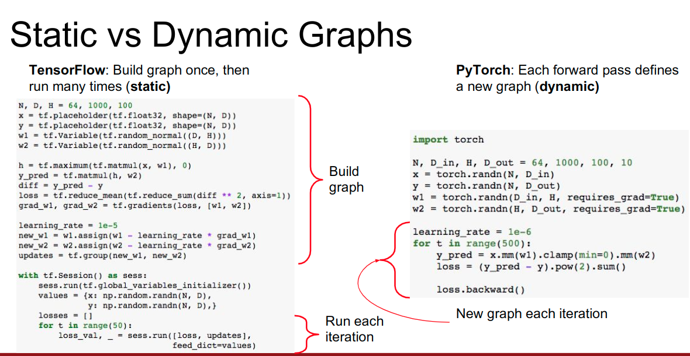

# Eager模式和Lazy模式

## 1.动态图 vs 静态图

在深度学习框架的早期阶段，常分为两大阵营，其中典型的以静态图为代表的有tensorflow，以动态图为代表的pytorch，当然，随着后来的发展tensorflow也逐渐增加了对动态图的支持。

#### 何为动态图、何为静态图 ？

在我们利用深度学习框架进行模型的训练、预测、验证时，通常只需要利用框架提供的api，用代码描述出神经网络模型，然后定义好损失函数、优化方法等，之后的前向/反向传播，自动求梯度，参数更新等过程都是框架帮我们自动完成的。其中，很重要的一个过程就是： **构造计算图**

深度学习框架自动将代码中描述的网络模型和数据计算等综合在一起，构造出前向/反向过程中的计算图，并由此开展计算过程。静态图、动态图描述的就是构图方式的区别。



> 截图来源：http://cs231n.stanford.edu/slides/2018/cs231n_2018_lecture08.pdf

上面图片描述了在tensorflow中的静态图和pytorch中的动态图实现。总结来说：

静态图通常在任务开始时只建立一次，一旦构建完成则会序列化成二进制数据，在随后的任务迭代过程中可以直执行无需改动；而动态图则是在任务的每一轮迭代过程中动态构建和执行，执行结束后随即销毁。

通常来说，静态图相比静态图有更长的编译时间，不过编译会带来一些图结构优化和性能提升，使得后面执行速度较快；动态图的方式则可以随时运行看到效果、方便debug等，有着更高的灵活性。


## 2.Lazy vs Eager

在OneFlow中，支持两种不同模式的任务，这两种模式称为：

-  **Eager模式**
-  **Lazy模式**

#### 何为Lazy、何为Eager ？

OneFlow中，不仅支持静态图，也同样支持动态图。其中Eager模式对应的是动态图，而Lazy模式对应的就是静态图。

#### Lazy模式

OneFlow的lazy模式下，有着良好的底层设计，且针对静态图做了大量的编译期优化工作。这使得我们的任务不仅快速，而且在多机多卡的分布式环境下具备良好的横向拓展能力。最关键的是，无需您手写复杂的代码来控制多机多卡下数据/模型的切分、节点间的通信，oneflow在底层为您自动处理这些复杂的任务，您只需要简单的几行配置代码。

以下是Lazy模式下的一个简单例子，一个多层感知机(mlp)的Training Job：

```python
# mlp_mnist.py
import oneflow as flow
import oneflow.typing as oft

BATCH_SIZE = 100


def get_train_config():
    config = flow.function_config()
    config.default_data_type(flow.float)
    config.train.primary_lr(0.1)
    config.train.model_update_conf({"naive_conf": {}})
    return config


@flow.global_function(get_train_config())
def train_job(images:oft.Numpy.Placeholder((BATCH_SIZE, 1, 28, 28), dtype=flow.float),
              labels:oft.Numpy.Placeholder((BATCH_SIZE,), dtype=flow.int32)) -> oft.Numpy:
    with flow.scope.placement("cpu", "0:0"):
        initializer = flow.truncated_normal(0.1)
        reshape = flow.reshape(images, [images.shape[0], -1])
        hidden = flow.layers.dense(reshape, 512, activation=flow.nn.relu, kernel_initializer=initializer)
        logits = flow.layers.dense(hidden, 10, kernel_initializer=initializer)
        loss = flow.nn.sparse_softmax_cross_entropy_with_logits(labels, logits)
    flow.losses.add_loss(loss)

    return loss


if __name__ == '__main__':
    check_point = flow.train.CheckPoint()
    check_point.init()

    (train_images, train_labels), (test_images, test_labels) = flow.data.load_mnist(BATCH_SIZE)
    for i, (images, labels) in enumerate(zip(train_images, train_labels)):
        loss = train_job(images, labels)
        if i % 20 == 0:
            print(loss.mean())
```


#### Eager 模式

