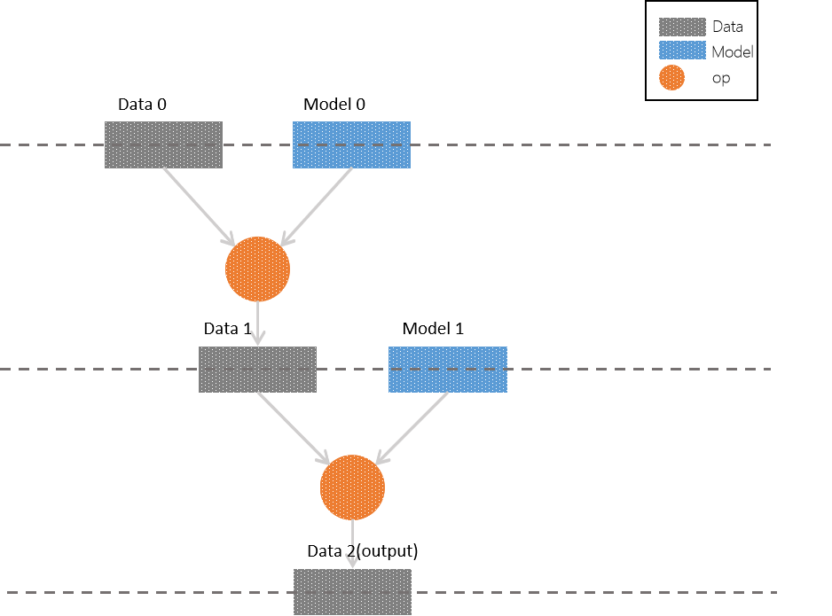
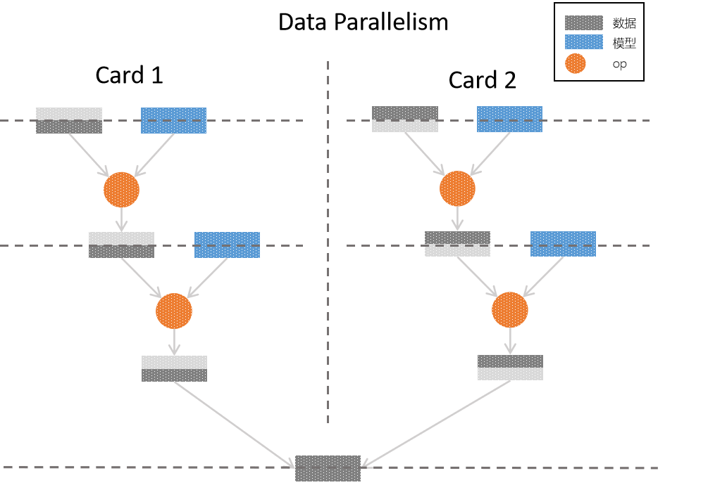
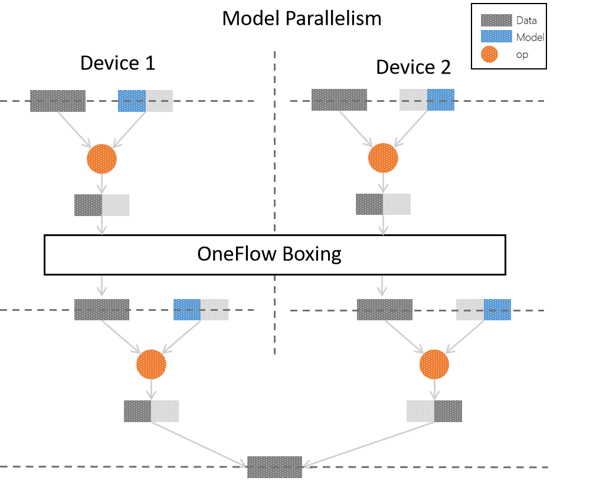
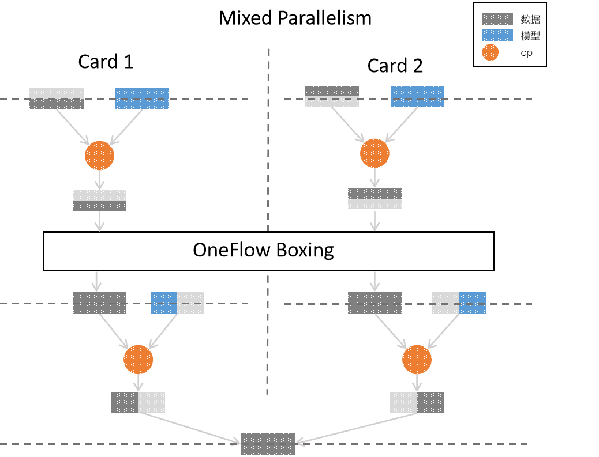

In [Consistent and Mirrored view](consistent_mirrored.md), we already know OneFlow provide mirrored and consistent two point of view. And be aware of  `consistent` in OneFlow have some special characteristics.

Thus, in `consistent_view`, OneFlow give the  unified view on logical side. When doing the distributed training, use can choose use data parallel, model parallel or mix parallel.

In this article, we will keep go through the ` consistent` view in OneFlow. Which includes:

* Process demo of pure data parallel in `consistent_view`.

* Process demo of mixed parallel in `consistent_view`.

* The advantages of mixed parallel and the scenario.

* Example of mixed parallel.

## Network logic diagram of model training
We need to set up a simple multi-layer network first and use this network to discuss parallel methods. The structure like the figure shows:



In each layers, we have **samples**(in grey), **models**(in blue) and **operators**(circles) which operating on both of them. To simplify our discussion, we can limiting the samples and model as** matrixes**. The operator applying on them we called it **Matrix multiplication**.

Compare the figure above, we can easily get the logic of the network:

* The input of layer 0 is `Data 0` matrix and `Model 0`matrix. Then apply `operator`(matrix multiplication) and give output `Data 1`.

* The input of layer 1 is `Data 1` matrix and `Model 1`matrix. Then apply `operator` and get `output`.

* The layer 2 is `output layer` and `Data 2` is the output of network. Of course, it can play as input in deeper network.

In `consistent` view, it supports the data parallel, model parallel and mixed parallel. We will introduce those in order but mixed parallel is the key thing.

## The characteristics of parallel in consistent view

### Pure data parallel

We already know that in consistent view. The default parallel method is data parallel. If we choose mirrored view, we only can use data parallel. Compare passing data in `numpy` when calling the job function with use `flow.data.xxx_reader` in OneFlow. The difference between them is:

* In mirrored view, when we use pure data parallel. We need to cut assembly data according to the number of GPU and use `list` to pass and receive data.

* But in consistent view we have the consistency on logic. Cutting data and assembly data will complete by OneFlow framework.

下图是 consistent 视角下，采用纯数据并行的方式，实现原逻辑网络模型的流程示意图：



在纯数据并行中，采用了2张显卡进行并行训练，因为采用了 **纯数据并行** ，可以看到，对于原逻辑模型中的每一层，样本数据都被平均分配到了各个卡上，每张卡上都拥有 **完整的模型**，与切分的数据进行 `op` 运算，最后组合各个卡上的样本，得到完整的输出。

### 纯模型并行
在 `consistent` 视角下，也可以通过选择纯模型并行（设置方式在下文实例中会介绍），其流程示意图为：



在纯模型并行中，同样是2张显卡进行并行训练，原逻辑模型中的每一层中，都是 **部分模型** 与 **完整的数据** 进行 `op` 运算，最后组合得到完整的输出。

值得一提的是，从上图可以看出，各个卡上第0层的输出，并 **不能** 直接作为第1层的输入：因为模型并行中，为完成 `op` 操作，需要部分的模型与 **完整的** 数据； 为了解决这个问题，OneFlow 中使用了 `boxing` 机制。

`boxing` 机制会统筹分布式训练中各个节点的数据，并合理切分、合并到对应的卡上，除了模型并行过程中的数据重组问题外，数据并行中的反向梯度同步，也使用 `boxing` 机制解决。

`boxing` 的内部机制虽然复杂，但是对于用户而言是透明的，我们仅仅是防止读者产生迷惑才加入了 `boxing` 的图示，对于本文而言，我们只需要了解：OneFlow 会自动协调好分布式中数据的同步问题。

## 选择最优的并行方式
数据并行与模型并行的优劣并不是一成不变的，样本规模、模型规模及模型结构决定了分布式训练中的综合表现，需要具体情况具体分析。

概括而言：

* 数据并行情况下，需要同步的信息是反向传播过程的 **梯度**，因此应该确保各个训练节点之间的信息同步速度要比节点内部的计算速度快，比如说 **卷积层** 的参数较少，但是计算量大，就比较适合使用数据并行；

* 模型并行情况下，因为可以将逻辑上作为整体的模型 **切分到各个物理卡** 上，能够解决“模型太大，一张卡装不下”的问题，因此，对于参数量大的神经网络层（如最后的全连接层），可以考虑使用模型并行。

实际上，也可以使用 **混合并行**，在同一个分布式训练的不同部分，组合使用数据并行、模型并行。比如，对于神经网络中靠前的参数较少、计算量大的层，采用数据并行；在最终的参数众多的全连接层，则采用模型并行，以下是针对本文最开始的网络模型逻辑图的 **混合并行** 实现方案的示意图：比如，对于神经网络中靠前的参数较少、计算量大的层，采用数据并行；在最终的参数众多的全连接层，则采用模型并行，以下是针对本文最开始的网络模型逻辑图的 **混合并行** 实现方案的示意图：



目前，其它的主流框架对于混合并行或者不支持，或者需要深度定制，而OneFlow 中可以通过简单的设置，配置混合并行的分布式训练，还可以用自由度超高的“网络接力”的并行模式，深度优化分布式系统。

## 混合并行实例
### 代码示例
以下，在 `consistent` 视角下，我们对 MLP 模型采用了混合并行方案：输入层与隐藏层采用（默认的）数据并行；输出层采用模型并行并进行列切分。

完整代码：[mixed_parallel_mlp.py](../code/extended_topics/mixed_parallel_mlp.py)

更具体的解析在后文“代码解析”可见。

```python
from mnist_util import load_data
import oneflow as flow
import oneflow.typing as oft

BATCH_SIZE = 100


def mlp(data):
    initializer = flow.truncated_normal(0.1)
    reshape = flow.reshape(data, [data.shape[0], -1])
    hidden = flow.layers.dense(reshape, 512, activation=flow.nn.relu, kernel_initializer=initializer, name="hidden")
    return flow.layers.dense(hidden,
                             10,
                             kernel_initializer=initializer,
                             # dense为列存储，进行split(0)切分
                             model_distribute=flow.distribute.split(axis=0),
                             name="output"
                             )


def get_train_config():
    config = flow.function_config()
    config.default_data_type(flow.float)
    config.train.primary_lr(0.1)
    config.train.model_update_conf({"naive_conf": {}})
    return config


@flow.global_function(get_train_config())
def train_job(images:oft.Numpy.Placeholder((BATCH_SIZE, 1, 28, 28), dtype=flow.float),
              labels:oft.Numpy.Placeholder((BATCH_SIZE,), dtype=flow.int32)) -> oft.Numpy:
    logits = mlp(images)
    loss = flow.nn.sparse_softmax_cross_entropy_with_logits(labels, logits, name="softmax_loss")
    flow.losses.add_loss(loss)
    return loss


if __name__ == '__main__':
    flow.config.gpu_device_num(2)
    check_point = flow.train.CheckPoint()
    check_point.init()

    (train_images, train_labels), (test_images, test_labels) = load_data(BATCH_SIZE)

    for epoch in range(3):
        for i, (images, labels) in enumerate(zip(train_images, train_labels)):
            loss = train_job(images, labels)
            if i % 20 == 0: print(loss.mean())
```

### 代码解析
以上代码修改自[3分钟快速上手](../quick_start/quickstart_in_3_min.md)中的示例代码，比较两份代码，也可以体会到在 OneFlow 的 `consistent_view` 下进行各种并行方案的配置是多么的简单，只需要在单机的程序上稍加修改即可。

以上程序的关键部分有：

* 通过 `oneflow.config.gpu_device_num` 接口设置参与训练的GPU数目：
```python
  flow.config.gpu_device_num(2)
```

* 通过 `flow.function_config().default_logical_view` 接口将默认视角改为 `consistent_view`：
```python
def get_train_config():
  #...
  config.default_logical_view(flow.scope.consistent_view())
  #...
```

* `reshape` 及 `hidden` 采用默认的数据并行，不需要修改；输出层通过设置 `model_distribute` 为 `flow.distribute.split(axis=0)` 变为模型并行：
```python
def mlp(data):
    initializer = flow.truncated_normal(0.1)
    reshape = flow.reshape(data, [data.shape[0], -1])
    hidden = flow.layers.dense(reshape, 512, activation=flow.nn.relu, kernel_initializer=initializer, name="hidden")
    return flow.layers.dense(hidden,
                             10,
                             kernel_initializer=initializer,
                             # dense为列存储，进行split(0)切分
                             model_distribute=flow.distribute.split(axis=0),
                             name="output"
                             )
```
有读者可能好奇为什么`split(axis=0)`是列切分？需要说明的是，OneFlow 中的 `dense` 内部采用列存储，因此以上代码的`flow.distribute.split(axis=0)`确实是在做列切分。

此外，`flow.layers.dense` 使用 `model_distribute` 形参设置并行方式，其内部调用了底层更通用的 `get_variable` 接口创建 `blob`， `get_variable` 接口设置并行方式的形参名为 `distribute`。

可以看到，我们通过极少量的修改，就能将单机训练程序改为分布式、混合并行的程序，这是 OneFlow 区别于其它框架的一大特色。

## 网络接力并行实例
在模型并行之外，OneFlow 还提供了一种灵活度更高的“网络接力”的并行方式，可以让用户使用 `scope.placement` 接口显式指定用来运行逻辑 `op`的 **物理硬件**。

在以下示例中，我们对[Consistent 与 Mirrored 视角](consistent_mirrored.md)中的"在 OneFlow 中使用 consistent 视角"代码进行简单修改，展示了"网络接力"并行模式。

### 代码示例

完整代码：[mixed_parallel_lenet.py](../code/extended_topics/mixed_parallel_lenet.py)

更详细的讨论可见后文的“代码解析”。

```python
import oneflow as flow
import oneflow.typing as oft

BATCH_SIZE = 100


def lenet(data, train=False):
    initializer = flow.truncated_normal(0.1)
    conv1 = flow.layers.conv2d(data, 32, 5, padding='SAME', activation=flow.nn.relu,
                               kernel_initializer=initializer, name="conv1")
    pool1 = flow.nn.max_pool2d(conv1, ksize=2, strides=2, padding='SAME', name="pool1")
    conv2 = flow.layers.conv2d(pool1, 64, 5, padding='SAME', activation=flow.nn.relu,
                               kernel_initializer=initializer, name="conv2")
    pool2 = flow.nn.max_pool2d(conv2, ksize=2, strides=2, padding='SAME', name="pool2")
    reshape = flow.reshape(pool2, [pool2.shape[0], -1])
    with flow.scope.placement("gpu", "0:0"):
        hidden = flow.layers.dense(reshape, 512, activation=flow.nn.relu, kernel_initializer=initializer, name="hidden")
    if train: hidden = flow.nn.dropout(hidden, rate=0.5)

    with flow.scope.placement("gpu", "0:1"):
        output = flow.layers.dense(hidden, 10, kernel_initializer=initializer, name="outlayer")
    return output


def get_train_config():
    config = flow.function_config()
    config.default_data_type(flow.float)
    config.train.primary_lr(0.1)
    config.train.model_update_conf({"naive_conf": {}})
    return config


@flow.global_function(get_train_config())
def train_job(images:oft.Numpy.Placeholder((BATCH_SIZE, 1, 28, 28), dtype=flow.float),
              labels:oft.Numpy.Placeholder((BATCH_SIZE,), dtype=flow.int32)) -> oft.Numpy:
    logits = lenet(images, train=True)
    loss = flow.nn.sparse_softmax_cross_entropy_with_logits(labels, logits, name="softmax_loss")
    flow.losses.add_loss(loss)
    return loss


if __name__ == '__main__':
    flow.config.gpu_device_num(2)
    check_point = flow.train.CheckPoint()
    check_point.init()
    (train_images, train_labels), (test_images, test_labels) = flow.data.load_mnist(BATCH_SIZE)

    for epoch in range(50):
        for i, (images, labels) in enumerate(zip(train_images, train_labels)):
            loss = train_job(images, labels)
            if i % 20 == 0: print(loss.mean())
```
### 代码解析

以上关键的代码只有2行，且他们的本质作用是类似的：

* 通过 `oneflow.scope.placement` ，指定 `hidden` 层的 op 计算运行在0号 GPU 上
```python
  with flow.scope.placement("gpu", "0:0"):
    hidden = flow.layers.dense(reshape, 512, activation=flow.nn.relu, kernel_initializer=initializer, name="hidden")
```

* 通过 `oneflow.scope.placement` ，指定 `output` 层的op计算运行在1号GPU上
```python
  with flow.scope.placement("gpu", "0:1"):
    output = flow.layers.dense(hidden, 10, kernel_initializer=initializer, name="outlayer")
```

其中 `scope.placement` 的第一个参数指定 `cpu` 还是 `gpu`，第二个参数指定机器及运算设备编号，如，“使用第1号机器的第2个 GPU”，则应该写：
```python
  with flow.scope.placement("gpu", "1:2"):
    # ...
```

网络接力的并行方式，使得用户可以为每个 op 指定物理设备，非常适合对网络模型及分布式情况都很熟悉的用户进行 **深度优化** 。

