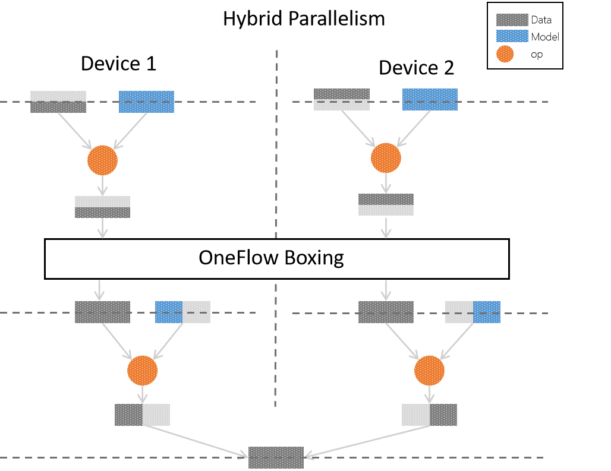

# Features of Parallelism in OneFlow

In [Consistent and Mirrored view](consistent_mirrored.md), we have already known OneFlow provides two types of view: mirrored and consistent view, and we learned about the  `consistent` view in OneFlow have some special features.

Because in `consistent_view`, OneFlow provides a logically unified view. During distributed training, users can freely choose to use data parallelism, model parallelism or hybrid parallelism.

In this article, we will keep going through the special `consistent` view in OneFlow. We will learn about: 

* Data parallelism in `consistent_view` flow chart.

* hybrid parallelism in `consistent_view` flow chart.

* The advantages of hybrid parallelism and the applicable scenario.

* Example of hybrid parallelism.

## Network logical diagram in model training

We need to set up a simple multi-layer network first and use this network to discuss parallelism methods. The structure like the figure shows:


In each layer, we have **samples**(in grey), **models**(in blue) and **operators**(circles) which operating on both of them. To simplify our discussion, we can limit the sample and model as a **matrix**. The operator applying on them we call it **matrix multiplication**.

Compare the figure above, we can easily get the logic of the network:

* The input of layer 0 is `Data 0` matrix and `Model 0 ` matrix. We apply `op` (matrix multiplication) and get output `Data 1`.

* The input of layer 1 is `Data 1` matrix and `Model 1` matrix. We apply `op` and get `output`.

* The layer 2 is `output` layer and `Data 2` is the output of network. Of course, it can play as input in a deeper network.

In `consistent` view, OneFlow supports the data parallelism, model parallelism and hybrid parallelism. We will introduce them in order but hybrid parallelism is the key point.

## The features of parallelism in consistent view

### Data parallelism

We have already known that in consistent view. The default parallelism method is data parallelism. If we choose mirrored view, we can only use data parallelism. If numpy data is passed directly when the job function is called (instead of using OneFlow's `flow.data.xxx_reader` interface for data loading), the difference is that: 

* In mirrored view, when we use data parallelism. We need to split and reorganize data according to the number of device and use `list` to pass and receive data.

* But in consistent view we have the consistency on logic. Splitting data and reorganizing data will be completed by OneFlow framework.

The following figure is in consistent view, using data parallelism to achieve original logical network process:


In data parallelism, we use two devices for training. As we use **data parallelism**, we can see that for each original logical layer, the sample is divided in average to each device. We have a complete **training model** in each device. The data after splitting are processed by `op`. Finally we combine the data in each device and get the complete data.

### Model parallelism

In `consistent` view, we can choose model parallelism (the configuration details we will talk about it later). The flow diagram is as follows:


In model parallelism example, we still use two devices for training. In each layer of original logic model is processed by `op` on **part of model** and **complete data**. Then they are combined and we get the complete results.

One thing we need to mention is in above figure. The output from each device on layer 0 **cannot** use as the input in layer 1: Because in model parallelism, in order to complete the operation. We need partial model and **complete** data. To solve this problem, OneFlow use `boxing` mechanism.

`boxing` will count the data in each node in distributed training and divide or assemble data properly then send to corresponding GPU. Besides the model assembling in model parallelism, `boxing` is also used for reverse gradient synchronization in data parallelism.

The algorithm in `boxing` is complex. But it is transparent to users. The Illustration of boxing is just to prevent users from being confused. In this article, we only need to remember that OneFlow will automatically solve the data distribution issue.

## Choose the optimal parallelism method

The difference between data parallelism and model parallelism is not constant. The sample, model size and model structure decide the performance in distributed training. We need analysis  particular case.

To be concluded:

* In data parallelism case, the information need to synced is **gradient** in backpropagation. Thus, we need to make sure the synchronization's speed in different nodes is faster than the calculation's speed in side nodes. For example, the **Convolution Layer** has fewer parameters, but it need large scale of calculation. It is suitable for data parallelism.

* In model parallelism, we can send the complete model in logical to **each device**, which can be dealt with the oversize model problem. Thus it is suitable for the neural network with massive parameters (like fully connected layer) to use model parallelism.

In fact, we can use **hybrid parallelism**, it means OneFlow uses different parallelism in different parts of training process. For example, at the beginning of the neural network, which have few parameters and need large calculation. We better use data parallelism. But the layer like fully connected layer which have many parameters, we should use model parallelism. The following figure is the demonstration for the neural network in begin of the article which use **hybrid parallelism**.



Currently, other popular frameworks either do not support mixed parallelism or require deep customization. But in OneFlow, the hybrid parallelism distributed training can be configured through simple settings, and the distributed system can also be deeply optimized with the ultra-high degree of freedom pipelining mode.

## Hybrid parallelism example:

### Code example 

In `consistent`  view, we use hybrid parallelism to MLP model: the input layer and hidden layer use data parallelism, output layer use model parallelism.

Complete Code: [hybrid_parallelism_mlp.py](../code/extended_topics/hybrid_parallelism_mlp.py)

More explanations can be seen in later "code explanations"

```python
# hybrid_parallelism_mlp.py
import oneflow as flow
import oneflow.typing as tp

BATCH_SIZE = 100


def mlp(data):
    initializer = flow.truncated_normal(0.1)
    reshape = flow.reshape(data, [data.shape[0], -1])
    hidden = flow.layers.dense(
        reshape,
        512,
        activation=flow.nn.relu,
        kernel_initializer=initializer,
        name="dense1",
    )
    return flow.layers.dense(
        hidden,
        10,
        kernel_initializer=initializer,
        # dense is stored as a column and split on axis=0
        model_distribute=flow.distribute.split(axis=0),
        name="dense2",
    )


def get_train_config():
    config = flow.function_config()
    config.default_data_type(flow.float)
    return config


@flow.global_function(type="train", function_config=get_train_config())
def train_job(
    images: tp.Numpy.Placeholder((BATCH_SIZE, 1, 28, 28), dtype=flow.float),
    labels: tp.Numpy.Placeholder((BATCH_SIZE,), dtype=flow.int32),
) -> tp.Numpy:
    logits = mlp(images)
    loss = flow.nn.sparse_softmax_cross_entropy_with_logits(
        labels, logits, name="softmax_loss"
    )

    lr_scheduler = flow.optimizer.PiecewiseConstantScheduler([], [0.1])
    flow.optimizer.SGD(lr_scheduler, momentum=0).minimize(loss)
    return loss


if __name__ == "__main__":
    flow.config.gpu_device_num(2)
    check_point = flow.train.CheckPoint()
    check_point.init()

    (train_images, train_labels), (test_images, test_labels) = flow.data.load_mnist(
        BATCH_SIZE
    )

    for epoch in range(3):
        for i, (images, labels) in enumerate(zip(train_images, train_labels)):
            loss = train_job(images, labels)
            if i % 20 == 0:
                print(loss.mean())
```

### Code explanation

The above code is modified from the demo in [3 min quick start](../quick_start/quickstart_in_3_min.md). Compare two versions of code, we can see it is easy to configure the parallelism method in `consistent_view` with few codes. 

The crucial parts are:

* Use  `oneflow.config.gpu_device_num`  to set the device number in training:

```python
  flow.config.gpu_device_num(2)
```

* `reshape` and `hidden` using data parallelism as default. The output layer can set `model_distribute` as `flow.distribute.split(axis=0)` to change to model parallelism:

```python
def mlp(data):
    initializer = flow.truncated_normal(0.1)
    reshape = flow.reshape(data, [data.shape[0], -1])
    hidden = flow.layers.dense(reshape, 512, activation=flow.nn.relu, kernel_initializer=initializer, name="hidden")
    return flow.layers.dense(hidden,
                             10,
                             kernel_initializer=initializer,
                             # dense is columns storing，process split(0) cutting 
                             model_distribute=flow.distribute.split(axis=0),
                             name="output"
                             )
```

You may be curious about why `split(axis=0)` is column cutting. We need to explain is in OneFlow, `dense` is column storage. Thus the `flow.distribute.split(axis=0)` in above code do be split by column.

In addition, `flow.layers.dense`  use `model_distribute`  to set parallelism mode, it use the common `get_variable` to create `blob` in basic level from inner, and internally calls the more general interface `get_variable` to create `blob`, The `get_variable` interface has a parameter named `distribute` to set the parallelism mode.

As you can see, we can change the single machine training program to a distributed, hybrid parallel program with few modifications, which is one of the features that distinguishes OneFlow from other frameworks.

## Pipelining example

Besides the model parallelism, OneFlow also provides a more flexible parallelism method called pipelining, it allow user use  `scope.placement` to specify the device of the operator.

In pipelining, the part of layers of whole network are on one device and other layers are on other devices. They work as relay, switch between devices in different phases.

In the following example, we change few code in "Using consistent view in OneFlow" of  [Consistent and Mirrored view](consistent_mirrored.md) and demonstrate pipelining.

### Code Example

Complete Code: [hybrid_parallelism_lenet.py](../code/extended_topics/hybrid_parallelism_lenet.py)

More details please refer to code explanation later.

```python
# hybrid_parallelism_lenet.py
import oneflow as flow
import oneflow.typing as tp

BATCH_SIZE = 100


def lenet(data, train=False):
    initializer = flow.truncated_normal(0.1)
    conv1 = flow.layers.conv2d(
        data,
        32,
        5,
        padding="SAME",
        activation=flow.nn.relu,
        kernel_initializer=initializer,
        name="conv1",
    )
    pool1 = flow.nn.max_pool2d(conv1, ksize=2, strides=2, padding="SAME", name="pool1")
    conv2 = flow.layers.conv2d(
        pool1,
        64,
        5,
        padding="SAME",
        activation=flow.nn.relu,
        kernel_initializer=initializer,
        name="conv2",
    )
    pool2 = flow.nn.max_pool2d(conv2, ksize=2, strides=2, padding="SAME", name="pool2")
    reshape = flow.reshape(pool2, [pool2.shape[0], -1])
    with flow.scope.placement("gpu", "0:0"):
        hidden = flow.layers.dense(
            reshape,
            512,
            activation=flow.nn.relu,
            kernel_initializer=initializer,
            name="hidden",
        )
    if train:
        hidden = flow.nn.dropout(hidden, rate=0.5)

    with flow.scope.placement("gpu", "0:1"):
        output = flow.layers.dense(
            hidden, 10, kernel_initializer=initializer, name="outlayer"
        )
    return output


def get_train_config():
    config = flow.function_config()
    config.default_data_type(flow.float)
    return config


@flow.global_function(type="train", function_config=get_train_config())
def train_job(
    images: tp.Numpy.Placeholder((BATCH_SIZE, 1, 28, 28), dtype=flow.float),
    labels: tp.Numpy.Placeholder((BATCH_SIZE,), dtype=flow.int32),
) -> tp.Numpy:
    logits = lenet(images, train=True)
    loss = flow.nn.sparse_softmax_cross_entropy_with_logits(
        labels, logits, name="softmax_loss"
    )

    lr_scheduler = flow.optimizer.PiecewiseConstantScheduler([], [0.1])
    flow.optimizer.SGD(lr_scheduler, momentum=0).minimize(loss)
    return loss


if __name__ == "__main__":
    flow.config.gpu_device_num(2)
    check_point = flow.train.CheckPoint()
    check_point.init()
    (train_images, train_labels), (test_images, test_labels) = flow.data.load_mnist(
        BATCH_SIZE
    )

    for epoch in range(50):
        for i, (images, labels) in enumerate(zip(train_images, train_labels)):
            loss = train_job(images, labels)
            if i % 20 == 0:
                print(loss.mean())
```

### Code explanation

There are only two important lines of code and they have same effect:

* Use `oneflow.scope.placement` to specify the operator run on number 0 device in  `hidden` layer.

```python
  with flow.scope.placement("gpu", "0:0"):
        hidden = flow.layers.dense(
            reshape,
            512,
            activation=flow.nn.relu,
            kernel_initializer=initializer,
            name="hidden",
        
```

* Use  `oneflow.scope.placement` to specify the operator in ` output ` layer run on number 1 device. 

```python
  with flow.scope.placement("gpu", "0:1"):
        output = flow.layers.dense(
            hidden, 10, kernel_initializer=initializer, name="outlayer"
        )
```

The first parameter in `scope.placement` is to specify `cpu` or `gpu`. The second parameter is to specify machine number and device. Like we use the device 2 on machine 1, it should be:

```python
  with flow.scope.placement("gpu", "1:2"):
    # ...
```

Pipelining can allow user to specify device for each op. It is very useful for user who master the distributed training to **optimize deeply**.

In addition, OneFlow also provides `oneflow.unpack`, `oneflow.pack`. Combined with the own features of task scheduling in OneFlow, they will make the pipelining easier to use and more efficient. We will introduce these in other article.

