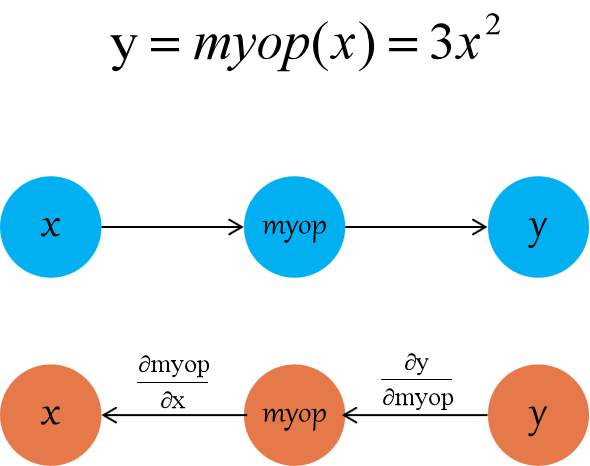

# Extending Op with C++

This article introduces how to use C++ to extend Op which is more flexible and more configurable than extending Op with Python. It also supports the use of GPUs as computing devices. Generally, you can use the Python extending Op for pre-research and the C++ extending Op for higher performance.

Before reading this article, we assuming that you have read [Extending Op with Python](./python_kernel_op.md) and know the following points:

- The concept of the logical unit of operator in OneFlow.
- The concept of the Kernel responsible for calculations in OneFlow.
- The concept of Op identifier `op_type_name`.

### Op System in OneFlow

OneFlow provides a mechanism which we can write and register a custom Op into OneFlow and use custom Op in Python.

The following diagram illustrates the registration mechanism of a custom Op in OneFlow：


In the OneFlow framework, there are three types of registries associated with custom op.

* `OpGradRegistry`：Manage gradient registration for automatic gradient calculation in backward graph.

* `OpRegistry`：Manage op registrations for generating forward digraph and building `Task Graph`.

* `OpKernelRegistry`：Manage kernel registrations for performing user logic at runtime.

In programming, you're actually writing your custom Op in C++ and generating the DLL (so file) which you load in Python to use the custom op. You can use the custom op  by loading the corresponding so file in Python. This is the same mechanism that is used in [Extending Op with Python](./python_kernel_op.md). But   the details are encapsulated in the relevant APIs and are transparent to the developer.

The data structure of user op can be  viewed at [user_op_conf.proto](https://github.com/Oneflow-Inc/oneflow/blob/master/oneflow/core/framework/user_op_conf.proto)：

```text
syntax = "proto2";
package oneflow;

import "oneflow/core/framework/user_op_attr.proto";

message UserOpConf {
  message ListString {
    repeated string s = 1;
  }
  required string op_type_name = 1;
  map<string, ListString> input = 2;
  map<string, ListString> output = 3;
  map<string, UserOpAttrVal> attr = 4;
}
```

The `op_type_name` is a string which representing the class of op and indicate the globally unique ID of the Op. 


### Process of Writing a Custom Op

1. Implementation and registration of op：The implementation of op is primarily used for forward digraph composition which includes specifying the name of op, inputs, outputs, configuration attributes and the necessary functions to infer the shape and data type of the tensor.

2. Implementation and registration of the kernel for an op: The kernel is responsible for the specific computational process during running and an op may correspond to multiple kernels

3. (optional) Implementation and registration of op's corresponding grad: If the custom op needs to support backward spreading. Then we need to implement and register a backward function for it.

4. Compile and link to get so file

5. Load the so file in Python and use `oneflow.user_op_builder` to wrap a custom op written in C++.

6. Testing.

## Example

We will implement a custom op called "myrelu" which supports both CPU and GPU operations.
For the complete code please refer to:  [code/extended_topics/create_user_op](https://github.com/Oneflow-Inc/oneflow-documentation/tree/master/cn/docs/code/extended_topics/create_user_op).

### Implementation and Registration of Op

We defined op and completed the registration in `myrelu_op.cpp`:

```cpp
#include "oneflow/core/framework/framework.h"

namespace oneflow {

namespace {

REGISTER_USER_OP("myrelu")
  .Input("in")
  .Output("out")
  .SetTensorDescInferFn(
      [](user_op::InferContext *ctx) -> Maybe<void> {
        *ctx->Shape4ArgNameAndIndex("out", 0) =
            *ctx->Shape4ArgNameAndIndex("in", 0);
        *ctx->Dtype4ArgNameAndIndex("out", 0) =
            *ctx->Dtype4ArgNameAndIndex("in", 0);
        return Maybe<void>::Ok();
      });
} // namespace

} // namespace oneflow
```

It does exactly the same thing as [Extending Op with Python](./python_kernel_op.md) that is registers an Op named `myrelu` with `REGISTER_USER_OP` and sets both input output then derives the shape and data type of the output from the input.

### Implementation and Registration of CPU Kernel 

We implemented the CPU kernel in `myrelu_cpu_kernel.cpp` and registered it：

```cpp
#include "oneflow/core/framework/framework.h"

namespace oneflow {

namespace {

template <typename T>
void MyRelu(DeviceCtx *ctx, const int64_t n, const T *x, T *y) {
  T zero = (T)(0);
  for (int64_t i = 0; i != n; ++i) {
    y[i] = std::max(x[i], zero);
  }
}

template <DeviceType device_type, typename T>
class ReluKernel final : public user_op::OpKernel {
public:
  ReluKernel() = default;
  ~ReluKernel() = default;

private:
  void Compute(user_op::KernelComputeContext *ctx) const override {
    const user_op::Tensor *in_tensor = ctx->Tensor4ArgNameAndIndex("in", 0);
    user_op::Tensor *out_tensor = ctx->Tensor4ArgNameAndIndex("out", 0);
    MyRelu<T>(ctx->device_ctx(),
           in_tensor->shape().elem_cnt(),
           in_tensor->dptr<T>(), 
           out_tensor->mut_dptr<T>());
  }
  bool AlwaysComputeWhenAllOutputsEmpty() const override { return false; }
};

#define REGISTER_RELU_KERNEL(device, dtype)          \
  REGISTER_USER_KERNEL("myrelu")                     \
      .SetCreateFn<ReluKernel<device, dtype>>()      \
      .SetIsMatchedHob(                              \
          (user_op::HobDeviceType() == device) &     \
          (user_op::HobDataType("out", 0)            \
            == GetDataType<dtype>::value));

REGISTER_RELU_KERNEL(DeviceType::kCPU, float)
REGISTER_RELU_KERNEL(DeviceType::kCPU, double)
} // namespace

} // namespace oneflow
```

To implement the kernel in OneFlow, you must define a class which inherits from `oneflow::user_op::OpKernel` and rewrite the virtual functions of it.

In the above code, we rewrite `Compute` and `AlwaysComputeWhenAllOutputsEmpty` and their respective meanings are:

* `Compute` must be rewritten to implement the specific operating logic.

* `AlwaysComputeWhenAllOutputsEmpty` must be rewritten to return `false` in most cases. For very few ops that need to maintain state internally, and therefore need to call the kernel for calculation even if the output is empty, it should return `true`.

After implementing the kernel class, you need to call `REGISTER_USER_KERNEL` to register it. The string parameter that `REGISTER_USER_KERNEL("myrelu")` accepts is `op_type_name` which is used to complete registration and querying. You also need to use `op_type_name` when wrapping op at the Python layer.

`REGISTER_USER_KERNEL("myrelu") ` returns an `OpKernelRegistry` object. The methods that need to be called to set the registration information are  mention in the code above. 

* `SetCreateFn<T>()`: The method of this template's parameter `T`  is our implementation of the kernel class which OneFlow will use it to create the kernel object.

* `SetIsMatchedHob`：Because an op may have more than one kernels. You need to call `SetIsMatchedHob` to select a specific kernel for the calculation according to the physical device and data format. This method accepts an expression and when the expression is `true`, OneFlow will call the kernel to complete the calculation.

### Implementation and Registration of GPU Kernel

We implemented the GPU version of the kernel in  `myrelu_gpu_kernel.cu`  and registered it：

```cpp
#include "oneflow/core/framework/framework.h"
#include <cub/cub.cuh>

namespace oneflow {
namespace {
template <typename T>
__global__ void ReluForwardGpu(const int n, const T *x, T *y) {
  CUDA_1D_KERNEL_LOOP(i, n) { y[i] = x[i] > 0 ? x[i] : 0; }
}

class ReluGpuFloatKernel final : public user_op::OpKernel {
public:
  ReluGpuFloatKernel() = default;
  ~ReluGpuFloatKernel() = default;

private:
  void Compute(user_op::KernelComputeContext *ctx) const override {
    const user_op::Tensor *in_tensor = ctx->Tensor4ArgNameAndIndex("in", 0);
    user_op::Tensor *out_tensor = ctx->Tensor4ArgNameAndIndex("out", 0);

    int32_t n = in_tensor->shape().elem_cnt();
    const float *in_ptr = in_tensor->dptr<float>();
    float *out_ptr = out_tensor->mut_dptr<float>();
    ReluForwardGpu<float>
        <<<32, 1024, 0, ctx->device_ctx()->cuda_stream()>>>(n, in_ptr, out_ptr);
  }

  bool AlwaysComputeWhenAllOutputsEmpty() const override { return false; }
};

#define REGISTER_RELU_KERNEL(device, dtype)          \
  REGISTER_USER_KERNEL("myrelu")                     \
      .SetCreateFn<ReluGpuFloatKernel>()             \
      .SetIsMatchedHob(                              \
          (user_op::HobDeviceType() == device) &     \
          (user_op::HobDataType("out", 0)            \
            == GetDataType<dtype>::value));

REGISTER_RELU_KERNEL(DeviceType::kGPU, float)
REGISTER_RELU_KERNEL(DeviceType::kGPU, double)
} // namespace
} // namespace oneflow
```

The process of implementing and registering the GPU kernel is almost identical to the CPU kernel. The main differences are:

* Because CUDA programming is used, the CUDA header files are included.

* `Compute` uses GPU methods.

* `SetIsMatchedHob` set the matching device as GPU.

Besides that, because of the use of CUDA, we need to use the nvcc compiler (instead of g++) to compile the GPU kernel.

### Compiling Option Description

The `oneflow.sysconfig` contains the `get_compile_flags`, `get_include`, `get_lib`, and `get_link_flags` which corresponding to:

- Compiling Options
- Dictionary of header file
- Dictionary of link library 
- Linking options

For example：

```text
>>> import oneflow
>>> oneflow.sysconfig.get_compile_flags()
['-I/home/yaochi/oneflow/build/python_scripts/oneflow/include', '-DHALF_ENABLE_CPP11_USER_LITERALS=0', '-DWITH_CUDA', '-D_GLIBCXX_USE_CXX11_ABI=0']
```

You can also get compile and link options directly by using command：

```shell
python -c "import oneflow; print(' '.join(oneflow.sysconfig.get_compile_flags()))"
python -c "import oneflow; print(' '.join(oneflow.sysconfig.get_link_flags()))"
```

For the GPU kernel, the `cudart` library also needs to be specified when linking.

### Get Dynamic Library by Compilation and Linking

For this simple example, you can use the following Makefile to build:

```bash
CFLAGS = $(shell python -c "import oneflow; print(' '.join(oneflow.sysconfig.get_compile_flags()))")
LFLAGS = $(shell python -c "import oneflow; print(' '.join(oneflow.sysconfig.get_link_flags()))")
CUDAPATH = /usr/local/cuda-10.1/lib64

all: final_relu.so

myrelu_op.o: myrelu_op.cpp
	g++ -std=c++11 -c myrelu_op.cpp \
	-o myrelu_op.o                  \
	-fPIC                           \
	${CFLAGS}                       \
	${LFLAGS}                       \
	-O2

myrelu_cpu_kernel.o: myrelu_cpu_kernel.cpp
	g++ -std=c++11 -c myrelu_cpu_kernel.cpp \
	-o myrelu_cpu_kernel.o                  \
	$(CFLAGS) -fPIC

myrelu_gpu_kernel.o: myrelu_gpu_kernel.cu 
	nvcc -std=c++11 -c myrelu_gpu_kernel.cu \
	-o myrelu_gpu_kernel.o                  \
	$(CFLAGS) -x cu -Xcompiler -fPIC

final_relu.so: myrelu_op.o myrelu_cpu_kernel.o myrelu_gpu_kernel.o
	g++ -std=c++11 myrelu_op.o \
	myrelu_cpu_kernel.o        \
	myrelu_gpu_kernel.o        \
	-shared -o final_relu.so   \
	$(CFLAGS)                  \
	-fPIC                      \
	-L$(CUDAPATH)              \
	-lcudart                   \
	$(LFLAGS)

clean:
	rm -rf *.so *.o
```

We use `g++` to compile `myrelu_op.cpp` and `myrelu_cpu_kernel.cpp`, use `nvcc` to compile `myrelu_gpu_kernel.cpp`. Then get the target file (".o" file) and link the target file to `final_ relu.so`.

We are going to load `final_relu.so` in Python then use wrappers and custom op.

### Using the Custom Op in Python 

Using a custom op in Python needs the following steps:

* Load the so file by `oneflow.config.load_library`.

* Use `oneflow.user_op_builder` to generating Python wrapper for custom op.

* Call the above result of Python wrapper.

The following code encapsulates `myrelu` at the Python layer and call it:

```python
import oneflow as flow
import numpy as np
import oneflow.typing as tp

# load modules
flow.config.load_library("final_relu.so")

# default configuration
flow.config.gpu_device_num(1)

# python op wrapper function
def myrelu(input_blob):
    op = (
        flow.user_op_builder("op_myrelu")
        .Op("myrelu")
        .Input("in", [input_blob])
        .Output("out")
        .Build()
    )
    return op.InferAndTryRun().SoleOutputBlob()


# network code
@flow.global_function()
def MyJob(x: tp.Numpy.Placeholder((5,), dtype=flow.float32)) -> tp.Numpy:
    return myrelu(x)

if __name__ == "__main__":
    input = np.array([-2, -1, 0, 1, 2], dtype=np.float32)
    output = MyJob(input)
    print(input)
    print(output)
```

The expected results are：

```text
[-2. -1.  0.  1.  2.]
[0. 0. 0. 1. 2.]
```

In the above code: `flow.config.load_library("final_relu.so") ` is to load the so file.

Building the python wrapper inside `myrelu` is exactly the same as the [ Python interface for wrapping Op](./python_kernel_op.md) in Extending Op with Python. 

So far, we have finished building the `myrelu` which is a relatively simple op. But if we need to build a more complex op, we will need to use some additional advanced features in the registration process.

We will cover from Op registration, kernel registration, gradient registration and encapsulation of the Python layer.

## Detailed Introduction of OpRegistry 

### `Attr`

Some ops require configuration properties in addition to inputs and outputs. For example, the `reshape` needs to be configured the shape and the `conv` needs to be configured the alignment method. We can use the `Attr` at registration to set attributes for op. For example:

```cpp
OpRegistry& Attr<cpp_type>(const std::string& name);

```

We just need to specify the name and type of the attribute.
For example：

```cpp
REGISTER_USER_OP("reshape")
    .Input("in")
    .Output("out")
    .Attr<shape>("shape")
```

```cpp
REGISTER_USER_OP("conv2d")
    .Input("in")
    .Input("weight")
    .Output("out")
    .Attr<std::vector<int32_t>>("padding_before")
```

In OneFlow, we currently support the following C++ data:

| UserOpAttrType | Corresponding C++ data types |
| -------------- | ---------------------------- |
| kAtInt32       | int32_t                      |
| kAtInt64       | int64_t                      |
| kAtBool        | bool                         |
| kAtFloat       | float                        |
| kAtDouble      | double                       |
| kAtShape       | oneflow::Shape               |
| kAtListInt32   | std::vector<int32_t>         |
| kAtListInt64   | std::vector<int64_t>         |
| kAtListFloat   | std::vector< float >         |
| kAtString      | std::string                  |


We can pass an additional parameter and configure a default value for it which is the corresponding C++ datatype in the table. Such as：

``` cpp
.Attr<bool>("is_transpose", false)
    
.Attr<int32_t>("size", 10)
    
.Attr<std::vector<int32_t>>("vector_of_size", std::vector<int32_t>{10, 11, 12})
```

### `SetCheckAttrFn`

For some  `Attributes`, they require a more detailed delineation of the range which can be specified by  `SetCheckAttrFn`  when registering the Op.

Take `Conv` op as an example, it has a configuration option called `data_format` which is a string type but the data must be `channels_first` or `channels_last`. 

```cpp
.Attr<std::string>("data_format", std::string("NCHW"))
.SetCheckAttrFn(
  [](const user_op::UserOpDefWrapper& def,
    const user_op::UserOpConfWrapper& conf) -> Maybe<void> {
   std::string data_format = conf.attr<std::string>("data_format");
   if (data_format == "channels_first" || data_format == "channels_last") { 
     return Maybe<void>::Ok(); 
   }
   return oneflow::Error::CheckFailed()
         << "data_format value: " 
         << data_format 
         << " for Conv op is illegal.";
})
```

Set a function to check that returns `Maybe<void>::Ok()` when the value of the attribute matches the requirement. Otherwise returns `oneflow::Error::CheckFailed()`.

### Multiple In/Output

For some ops, they may have multiple input or output and we need to specify the number of inputs and outputs when we register it.

Input example：

```cpp
// input must have 1 blob
.Input("input")        

// input must have 5 blobs
.Input("input", 5) 

// input input must have at least 5  blobs
.InputWithMinimum("input", 5) 

// input can have no blob or 1 blob
.OptionalInput("input") 

// input can have no blob or 5 blobs
.OptionalInput("input", 5) 

// input can have no blob or at least 5 blobs
.OptionalInputWithMininum("input", 5) 
```

Output setting is similar to Input.

### SetGetSbpFn

`SetGetSbpFn` is for config the [SBP](../basics_topics/essentials_of_oneflow.md#sbp) of this `op`.
Example of "add_n"：

```cpp
REGISTER_USER_OP("add_n")
    .InputWithMinimum("in", 2)
    .Output("out")
    .SetGetSbpFn([](user_op::SbpContext* ctx) {
      int64_t num_axes = ctx->LogicalTensorDesc4InputArgNameAndIndex("in", 0).shape().NumAxes();
      for (int64_t i = 0; i < num_axes; ++i) {
        ctx->NewBuilder().Split(ctx->inputs(), i).Split(user_op::OpArg("out", 0), i).Build();
      }
      ctx->NewBuilder().PartialSum(ctx->inputs()).PartialSum(user_op::OpArg("out", 0)).Build();
      return Maybe<void>::Ok();
    });
```

## Detailed Introduction of OpKernelRegistry

### SetInferTmpSizeFn

In some kernel implementations of op, some extra buffer may be required to store temporary data during the `Compute`.

We can specify the buffer size when registering the kernel by using the `SetInferTmpSizeFn`. Then we get the buffer and use it in the `Compute` function.

The following code registers the kernel with `SetInferTmpSizeFn` to specify a buffer size as 1024 bytes:

``` cpp
REGISTER_USER_KERNEL("XOp")
    .SetInferTmpSizeFn(
      [](const oneflow::user_op::InferContext*) {
         return 1024; 
      });
```

Once the buffer size is set by `SetInferTmpSizeFn`, this buffer can be retrieved in `Compute` by calling the `KernelContext::Tensor4ArgNameAndIndex`. This buffer is encapsulated as `oneflow::user_op::Tensor` which can be converted to other types of pointers by calling the `dptr` or `mut_dptr`.

```cpp
class XKernel final : public oneflow::user_op::OpKernel {
  void Compute(oneflow::user_op::KernelContext* ctx) override {
    oneflow::user_op::Tensor* tmp = ctx->Tensor4ArgNameAndIndex("tmp_buffer", 0);

    //The conversion yields a char* buffer of 1024 bytes.
    char* pBuff = tmp->mut_dptr<char>();

    ...
  }
};
```

## Detailed Introduction of OpGradRegistry

In [Extending Op with Python](./python_kernel_op.md#op_2), we explained how to provide backwards computation for a custom Op which is registered by the `REGISTER_USER_OP_GRAD`.

In fact, `REGISTER_USER_OP_GRAD` is actually defining the backward subgraph for derivation. So we don't necessarily need to specifically implement a backward Op to evaluate the gradient which like in [Providing Backward Computation for Custom Op](./python_kernel_op.md#op_2) to implement a backward Op specifically to derive the gradient. But most of the time we can use OneFlow's existing Op to describe the backward subgraph. This section supplements [Using Python Extension Op](./python_kernel_op.md#op_2) by detailing the method of backward registration and representing an inverse subgraph using an existing Op.

Oneflow is automatically get gradient during backward map expansion and the OneFlow framework uses [Automatic Differentiation](https://en.wikipedia.org/wiki/Automatic_differentiation) to get the gradient which means automatically find the gradient of the entire expression using the chain rule.

In order to automatically get gradient a custom op, we need to register it with `REGISTER_USER_OP_GRAD`. From a mathematical point of view, the registration process is the computation of the backward derivation that we specify for our custom op. From a programming point of view, it is to set up a backward-generating function for a custom op. Within that function, we write code that specifies how the input gradient of that op is to be calculated.

In order to calculate the gradient of a custom op, we need to construct the gradient of the input base on the input and output of the custom op. In most cases, we can represent the process of calculating the gradient of the input through the existing operators and their combination in OneFlow.

The calculation of the input gradient usually consists of the following steps:

1. Use `ctx->DefineOp()` and `BackwardOpBuilder` to represent methods for calculating input gradients. Because input gradient calculations may be combinations of multiple operations. Therefore `DefineOp` and `BackwardOpBuilder` may be used for multiple times.

2. After defining the calculation process in the previous step, the required gradient is finally recorded in the output of some operator. We need to call the `ctx->FwOp().InputGradBind()` to combine the result of the previous calculation to the input gradient of the custom op.

The following example (the complete code, including tests, can be found in [myop_grad repository](https://github.com/Oneflow-Inc/oneflow-documentation/tree/master/cn/docs/code/extended_topics/myop_grad)). A custom op called `myop` will be used to register backward generating functions. This op is only used in this document to show the registration process which compute function is set as `3*x*x`.

Then it is easy to obtain the relationship between its forward and backward propagation as shown below. The gradient of `x` in the reverse process is computed as `6*x*dy`.

<div align="center">
  
  </img>
</div>


The forward op of `myop` is defined as follows:

```cpp
REGISTER_USER_OP("myop").Input("in").Output("out").SetTensorDescInferFn(
    [](user_op::InferContext *ctx) -> Maybe<void> {
      *ctx->Shape4ArgNameAndIndex("out", 0) =
          *ctx->Shape4ArgNameAndIndex("in", 0);
      *ctx->Dtype4ArgNameAndIndex("out", 0) =
          *ctx->Dtype4ArgNameAndIndex("in", 0);
      return Maybe<void>::Ok();
    });
```

That is `myop` contains the only input `in` and the only output `out`.

The reverse gradient registration of `myop` is as follows:

```cpp
REGISTER_USER_OP_GRAD("myop").SetBackwardOpConfGenFn(
    [](user_op::BackwardOpConfContext* ctx) {

      const auto op1_name = ctx->FwOp().op_name() + "_grad1";
      
      // The operator op1_name is used to calculate the gradient of myop.in
      ctx->DefineOp(op1_name, 
        [&ctx](user_op::BackwardOpBuilder& builder) {
          return builder.OpTypeName("multiply")
              .InputBind("x", ctx->FwOp().input("in", 0)) //multiply.x <- myop.in
              .InputBind("y", ctx->FwOp().output_grad("out", 0)) //multiply.y <-  the gradient of myop.out
              .Output("out")
              .Build();
        });

      const auto op2_name = ctx->FwOp().op_name() + "_grad2";
      // The operator op2_name is used to calculate 6*op1_name.
      ctx->DefineOp(op2_name, 
        [&ctx, &op1_name](user_op::BackwardOpBuilder& builder) {
          return builder.OpTypeName("scalar_mul")
              .InputBind("in", ctx->GetOp(op1_name).output("out", 0))
              .Attr("has_float_operand", true)
              .Attr("has_int_operand", false)
              .Attr("float_operand", static_cast<double>(6))
              .Attr("int_operand", static_cast<int64_t>(6))
              .Output("out")
              .Build();
        });
      
      // (the gradient of myop.in) <- op1_name.out
      ctx->FwOp().InputGradBind(user_op::OpArg("in", 0), 
        [&ctx, &op2_name]() -> const std::string& {
          return ctx->GetOp(op2_name)
                .output("out", 0);
        });
  });
```

The string parameter accepted by `REGISTER_USER_OP_GRAD("myop")` is `op_type_name` which needs to be the same as registered with `REGISTER_USER_OP`.

`REGISTER_USER_OP_GRAD("myop")` returns an `oneflow::user_op::OpGradRegistry` object that we can call it to set the custom op's backward generating function.

In the above gradient registration process, the expression for the gradient of `myop` is `6*x*dy` which is demonstrated in the code.

First `op1_name` is defined and `x*dy` is solved by using the existing operator `multiply`: 

```cpp
//  The operator op1_name is used to calculate the gradient of myop.in
ctx->DefineOp(op1_name, 
  [&ctx](user_op::BackwardOpBuilder& builder) {
    return builder.OpTypeName("multiply")
        .InputBind("x", ctx->FwOp().input("in", 0)) //multiply.x <- myop.in
        .InputBind("y", ctx->FwOp().output_grad("out", 0)) //multiply.y <- myop.out的梯度
        .Output("out")
        .Build();
  });
```

Then `op2_name` is defined and use the existing operator `op2_name` to solve for `6*op1_name`.

```cpp
// The operator op2_name is used to calculate 6*op1_name.
ctx->DefineOp(op2_name, 
  [&ctx, &op1_name](user_op::BackwardOpBuilder& builder) {
    return builder.OpTypeName("scalar_mul")
        .InputBind("in", ctx->GetOp(op1_name).output("out", 0))
        .Attr("has_float_operand", true)
        .Attr("has_int_operand", false)
        .Attr("float_operand", static_cast<double>(6))
        .Attr("int_operand", static_cast<int64_t>(6))
        .Output("out")
        .Build();
  });
```

Finally bind the output of `op2_name` (i.e., `6*x*dy`) to the input of `myop` to complete the registration.

```cpp
// (the gradient of myop.in) <- op1_name.out
ctx->FwOp().InputGradBind(user_op::OpArg("in", 0), 
  [&ctx, &op2_name]() -> const std::string& {
    return ctx->GetOp(op2_name)
          .output("out", 0);
  });
```

The above code is the complete process of registering a gradient and the related classes and methods will be described in below.

### SetBackwardOpConfGenFn

We use `OpGradRegistry::SetBackwardOpConfGenFn(fn)` to set the backward generating function `fn` which has the following prototype:

```cpp
void fn(BackwardOpConfContext* ctx);
```

`BackwardOpConfContext* ctx` has all information needed to generate the op.

### BackwardOpConfContext

The common methods and their purpose used in `BackwardOpConfContext` as follows:

* `UserOpWrapper& FwOp();`: Get forward op.

* `GetOp(op_name)`: Create and get the corresponding `op` based on `op_name`. `GetOp` uses a lazy init mechanism and the corresponding op is not actually created until `GetOp` is called.

* `void DefineOp(op_name, fn)`：Define `fn` of the op named `op_name`. When `ctx->GetOp(op_name)` is called, `fn` is triggered in the OneFlow for Op creation and if the op has already been created. Then the result is retrieved directly. The `fn` receives a `BackwardOpBuilder` parameter for constructing the reverse op. We will introduce `BackwardOpBuilder` later on.


### Detailed Introduction of BackwardOpBuilder

`BackwardOpBuilder` is used to build a reverse op. The fragment of above code is an example:

```cpp
ctx->DefineOp(op1_name, 
  [&ctx](user_op::BackwardOpBuilder& builder) {
    return builder.OpTypeName("multiply")
        .InputBind("x", ctx->FwOp().input("in", 0)) //multiply.x <- myop.in
        .InputBind("y", ctx->FwOp().output_grad("out", 0)) //multiply.y <- myop.out的梯度
        .Output("out")
        .Build();
  });
```

In this function, we call `Build` to build a reverse op for computing `x*dy`.
The purpose of each operator is as follows:

* `OpTypeName("multiply")` specifies the `op_type_name` of an op that is used to help us compute the reverse gradient.

* `InputBind(arg_name, blob)` binds the input `arg_name` of `multiply` to the specified `blob` and can be called for multiple times. If the `arg_name` corresponds to multiple  blob which means the order of `Input` is the order of the corresponding index.

* `Output(arg_name, num)` Specifies the number of output blobes that actually correspond to the `arg_name` which defaults to 1 if `num` is not filled in.

* `Attr(attr_name, val) ` sets the value of the attribute which same in the registration.

* Calling `Build()` after above configuration, then the construction of the reverse op is completed. 


### Detailed Introduction of UserOpWrapper

Calling `ctx->FwOp()` will return the `UserOpWrapper`of `myop` and complete the gradient binding by calling the `UserOpWrapper`.

```cpp
ctx->FwOp().InputGradBind(user_op::OpArg("in", 0), 
  [&ctx, &op2_name]() -> const std::string& {
    return ctx->GetOp(op2_name)
          .output("out", 0);
  });
```

Common methods for `UserOpWrapper` are:

* `InputGradBind(input, grad_fn)`：Bind the input of the forward op and get the gradient function `grad_fn`.  OneFlow automatically determines whether input needs to generate a backward gradient, if needed, it will trigger `grad_fn` and binds the input.

* `input(arg_name, index)`：Get the blob corresponding to the `arg_name` of input.

* `output(arg_name,index)`：Get the blob corresponding to the `arg_name` of output.

* `output_grad(output_arg_name, index)`：Get the `output_arg_name` of the forward op which is the blob of the corresponding backward gradient.

* `attr(attr_name)`：Get the value corresponding to the `attr_name`.

* `arg_tensor_desc(arg_name, index)`：Returns the input/output tensor information of the forward op which including `shape`, `dtype` and etc.

### Customized Op for Calculating Gradients

As we mentioned earlier, in most cases, the process of calculating a gradient can be represented by a combination of existing ops. However, when it is difficult to use an existing op to solve the gradient for a particular forward op that we need to design and create operators specifically for the gradient calculation. Example can be found in: [relu_op.cpp](https://github.com/Oneflow-Inc/oneflow/blob/master/oneflow/user/ops/relu_op.cpp), [Extending Op with Python](./python_kernel_op.md#op_2). The Extending Op with Python uses Python to customize the backward derivation of Op and the relu_op.cpp uses C++ to customize the backward derivation of Op.


## Detailed Introduction of UserOpConfBuilder 

In Python frontend of OneFlow, we provide `UserOpConfBuilder` to build the wrapper of custom op which is used in [Use custom opp in Python](./user_op.md#python-op) previously. Here is the summary of the relationship between `UserOpConfBuilder` in Python layer and C++ layer.

For example, we have wrapped a `cast`:

```python
def cast(x, dtype, name):
    return (
        flow.user_op_builder(name)
        .Op("cast")
        .Input("in", [x])
        .Output("out")
        .Attr("dtype", dtype)
        .Build()
        .InferAndTryRun()
        .RemoteBlobList()[0]
    )
)
```

* `Op(op_type_name)`：The accepted parameter is `op_type_name` when it is registered in C++.

* `Input(input_name, input_blob_list)`：`input_name` should be the same as the first parameter of `Input` when registering this op in C++.

* `Output(output_name, num=1)`：`output_name` and `num` should be the same as `Output` of op when registration in C++.

* `Attr(attr_name, attr_value)`：`attr_name` corresponds to the attribute of `OpRegistry::Attr` used for C++ registration and `attr_value` should be the same type as the attribute type when declaration.

* `Build()`：Build the user op for the Python layer.

The derivation can be done by calling `InferAndTryRun` in the user op and the result can be retrieved by calling `RemoteBlobList` or `SoleOutputBlob`.

* `RemoteBlobList`：Get all outputs which applies to op with multiple outputs and all ops are placed in a list.

* `SoleOutputBlob`：Get unique outputs which applies to op with one output.
