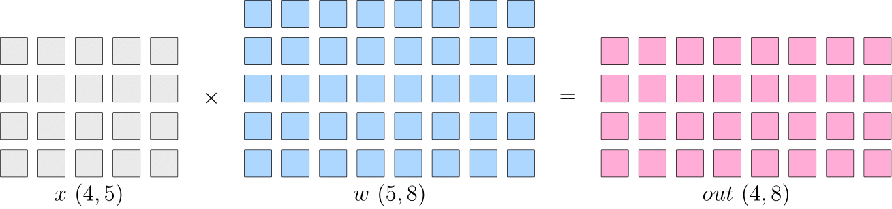
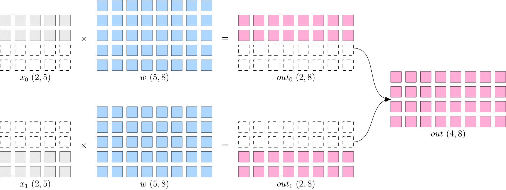

# COMMON DISTRIBUTED PARALLEL STRATEGY

## Why Distributed Training is Prevailing

In recent years, deep learning has been widely used in various fields, including computer vision, language understanding, speech recognition, advertising recommendation and so on. A common feature in these different areas is the growing size of models, such as the GPT-3 model, which has 175 billion parameters. Even with 1,024 of 80 GB A100 cards, the full GPT-3 training time would take a month.

The enlargement of model scale requires the development of hardware (computing power, memory). However, because of the existence of memory walls, the computational power and capacity of a single device, limited by the laws of physics, it is increasingly difficult to continuously improve the integration of chips and to keep up with the demands of model expansion.

In order to solve the problem of insufficient increase speed of computing power, it is necessary to use multi-node cluster for distributed training in order to improve computing speed.

## Common Parallel Strategies

Simply stacking machines does not increase computing power necessarily. Because the training of neural networks can not be simply "divide the work done by one device to multiple ones". It requires not only multiple devices to perform computing, but also data transmission between devices, only by coordinating the computing and communication in the cluster, can we do efficient distributed training.

We will explain the difference between data parallelism and model parallelism with an example of matrix multiplication.

Let's look at the following logical matrix multiplication examples:

If a layer in the neural network is doing matrix multiplication, where the shape of the input $x$ is $4\times5$ and the shape of the model parameter $w$ is $5\times8$, then the matrix multiplication output shape is $4\times8$. The schematic diagram is as follows:

In the single machine single card training situaiton, the above matrix multiplication first calculates $out$, passes $out$ to the next layer, and finally calculates $loss$, and then in the backpropagation process, gets $\frac{\partial loss}{\partial w}$, which then be used to update $w$.

In distributed training, there are "**Data Parallelism**" and "**Model Parallelism**" strategies depending on whether $x$ or $w$ is partitioned. In the next section, we will introduce common strategies for parallelism.

### Data Parallelism

Data parallelism slices $x$, while the model parameter $w$ on each device is complete and consistent. As shown in the figure below, $x$ is split evenly into two devices by dimension 0, each with a full $w$.

In this way, the output on each device is only half the logical output, which shape is $2\times8$. The output on both devices combind together to produce the logically complete output.

Note that because the data is distributed to two devices, the backpropagation process will get different values for $\frac{\partial loss}{\partial w}$, if the models are updated directly using the gradients on each device, it would cause the models on the two devices to be inconsistent, and the training would be meaningless(Which model should be used?).

Therefore, in the process of backpropagation under data parallelism strategy, the gradients on each device should do [AllReduce](https://docs.nvidia.com/deeplearning/nccl/user-guide/docs/usage/collectives.html#allreduce) before use, which ensures the model on each device is always consistent.

When the dataset is large and the model is small, and the communication cost for the gradients synchronization is small in the backpropagation process, so it is more advantageous to choose data parallelism in this situation. For example, the common vision classification model, such as ResNet50, is more suitable to use data parallelism strategy.

### Model Paralelism

When the neural network is very large, the cost of gradients synchronization will be very high, moreover, the network may be too large to be stored in a single computing device, then the model parallelism strategy can be used.

The so called model parallelism is that the data on each device is complete and consistent, while the model $w$ is split into different devices, each device only has a part of the model, all the parts of model on the computing device put together forms the complete model.

As shown in the figure below, $w$ is split evenly into two devices by the first dimension, each with a full $x$. The output on both devices also needs to be combind together to get the logical output.

The benefit of model parallelism is that it eliminates the gradient AllReduce between multiple devices. However, since each device requires complete input data, the input is broadcasted among multiple devices with some communication cost. For example, the $out~(4\times8)$ shown above needs to be broadcast to both devices if it is the input of the next layer.

Language models, such as BERT, often use model parallelism.

### Pipelining Paralelism

When the neural network is too large to be stored on a single device, in addition to the above parallel strategies, we can also choose pipelining parallel strategy. Pipelining paralelism divides the network into stages and places it to different computing devices, each of which completes the training in a "relay" manner.

The figure below shows how to run with pipelining parallelism with a logical four-layer network (`T1` to `T4`).

The four-layer network is divided into two computing devices, so that the `T1` and `T2` are placed to `GPU0` and `T3` and `T4` are placed to `GPU1`.

After computing the first two layers on `GPU0`, its output is treated as the input of `GPU1` to continue computation of the next two layers.

### Hybrid Paralelism

You can also mix with a variety of parallelism strategies when training a network, take GPT-3 as an example, the parallelism strategy for training could be like this:

This large GPT network is partitioned into 64 stages, with each stage running on 6 DGX-A100s. The workload among the 6 machines is trained with data parallelism, while the workload among GPUs inside each machine is trained with model parallelism. The 3072 A100s in the entire cluster are divided into a matrix of $6\times8\times64$, and then train the model using data parallelism, model parallelism and pipeline parallelism simultaneously.

The choice of parallelism strategy affects the efficiency of training. Whether the interface of framework supports parallelism well also determines the efficiency of algorithm engineer. OneFlow's system-level design and innovation for distributed training will help users to get comfortable well with distributed training. The related examples will be shown in other articles on this topic.
