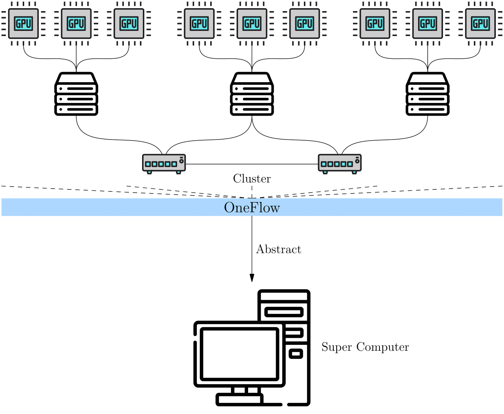
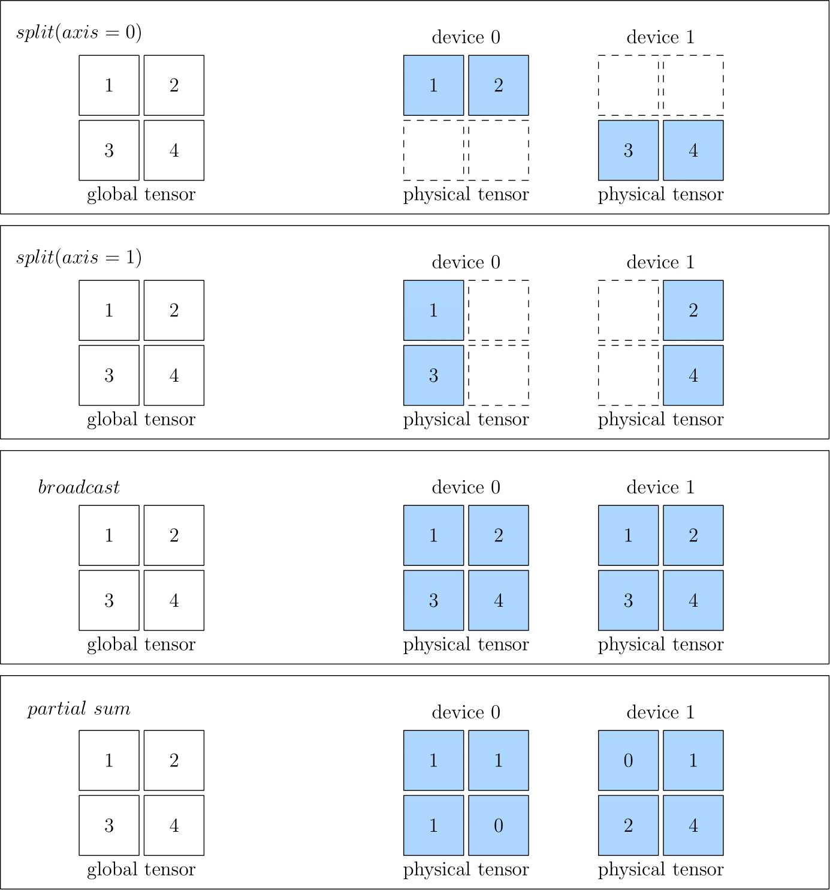
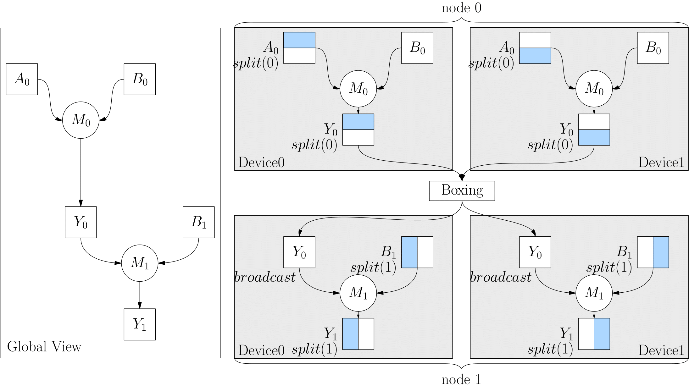

# GLOBAL VIEW

The concept of **global view** in OneFlow is introduced to simplify distributed training. In short, the cluster is abstracted as a "Super Computing Device" under OneFlow global view.

Instead of caring about the details of computing and communication in a cluster, users can program like on a single node, and OneFlow can train the model in a distributed way.




OneFlow's global view relies on several important concepts: **Placement**, **SBP** and **SBP Signature**.

## Placement

The Tensors of OneFlow has a `placement` attribute in global view; the `placement` specifies which local physical device the Tensor is placed on.

OneFlow will automatically number the devices in the cluster. For example, if there are four hosts in a cluster and each host has eight GPU cards, so that 32 cards in total. The 32 devices in the cluser will be numbered 0 to 31.

To place a Tensor on the first four cards on machine 0, simply configure: `placement("cuda", [0, 1, 2, 3])`.

To place a Tensor on the last four cards on machine 0, simply configure: `placement("cuda", [4, 5, 6, 7])`.

Placement makes it easy for OneFlow to support pipelining parallelism, and we’ll see examples of `placement` in other articles on this topic.


## SBP

SBP is a unique concept in OneFlow, which describes the mapping of data from a "Super Computing Device" perspective to data on local physical devices in a cluster. It is a combination of the initials of three words: `split`, `broadcast`, `partial`.

In detail:

- `split` means that the local Tensor is obtained by splitting the global Tensor along a certain dimension. An `axis` parameter is used to indicate the dimension of the split. If multiple local Tensors are concatenated along the dimension of Split, the global Tensor can be restored.
- `broadcast` indicates that each local Tensor is exactly a copy of the global Tensor.
- `partial` indicates that although the local Tensor has the same shape as the global Tensor, the value in the local Tensor is a part of the value in the corresponding position in the global Tensor, if you add multiple local Tensors at the same positions, you can restore the global Tensor. Besides `sum`, `min` or `max` and some other opreations are made available for `partial`.

The figures below show some examples of SBP, including `split(0)`, `split(1)`, `broadcast` and `partial sum`.




When you create a Global Tensor, you can specify the SBP of the Tensor. The example will be seen in the next article: [Global Tensor](./03_consistent_tensor.md).


## SPB Signature

SBP describes the mapping relationship between the data under the global view and the data on the local physical devices. When doing distributed training, OneFlow distributes the data to the local physical devices, computes the results according to the SBP attributes of the data.

For an isolated Tensor, we can set its SBP attributes at will. However, for an operator with input and output data, we can not arbitrarily set the SBP attributes of its input and output. This is because arbitrarily setting the SBP attributes of an operator’s input and output may not conform to the algorithm of the operator under global view.


Let us discuss this problem with the example of matrix multiplication. Look at how the input and output SBP of matrix multiplication are combined to be legal and illegal in a distributed system with tow devices.

Suppose, from the global view, that a matrix $A$ with the shape $$(m, k)$ is multiplied by a matrix $B$ with the shape $(k, n)$ to get $y $, the shape of $y$ must be $(m, n)$.

According to the rule of matrix multiplication, we can divide the matrix $A$ into two matrices $A_0$ and $A_1$ by dimension 0, with the shapes of $(m_0, k)$, $(m_1, k)$ respectively:

Device 1:

$$
\begin{matrix}
A_0     \times     B     =     Y_0
\\
(m_0, k)     (k, n)      (m_0, n)
\end{matrix}
$$

Device 2:

$$
\begin{matrix}
A_1     \times     B     =     Y_1
\\
(m_1, k)     (k, n)      (m_1, n)
\end{matrix}
$$

It’s easy to configure the relationship among local Tensors $A_0$, $A_1$ and the Tensor $A$, which is under the global view. And also the relationship between $Y_0$, $Y_1$ and the global view data $Y$:


$$
\begin{matrix}
A &= concat&(A_0 ,& A_1) \\
(m,k) &  & (m_0, k) & (m_1, k)
\end{matrix}
$$

$$
\begin{matrix}
Y &= concat&(Y_0 ,& Y_1) \\
(m,n) &  & (m_0, n) & (m_1, n)
\end{matrix}
$$

> Note: The `concat` above represents a concatenate operation.


In this way, it is possible to execute the operation and get the correct result from the global view by distributing the data to each local physical device. **The long story we talked above, described in SBP, are surprisingly simple:**

$A$ is `split(0)`, $B$ is `broadcast`, and $Y$ is `split(0)`.


We can see that for matrix multiplication, the SBP of its input and output combined in the above way, is legal. **For matrix multiplication, there are more than one valid SBP combinations, such as:**


$A$ is `broadcast`, $B$ is `split(1)`, and $Y$ is `split(1)`.

Or:

$A$ is `split(1)`, $B$ is `split(0)`, and $Y$ is `partial sum`.


While we showed multiple valid SBP combinations above, not all SBP combinations are valid. For example, for matrix multiplication, if $A$, $B$ are both `split(0)`, then:


$$
\begin{matrix}
A &= concat&(A_0 ,& A_1) \\
(m,k) &  & (m_0, k) & (m_1, k)
\end{matrix}
$$

$$
\begin{matrix}
B &= concat&(B_0 ,& B_1) \\
(k,n) &  & (k_0, n) & (k_1, n)
\end{matrix}
$$

Because the shapes of $A_0$ and $B_0$ do not meet the requirements of matrix multiplication, it is impossible to compute the matrix multiplication on local physical devices. We can say that the combination of $A$ as `split(0)` and $B$ as `split(0)` is illegal.


We defines **a specific, valid SBP combination** of the inputs and outputs of an operator, as shown above, as a **SBP Signature** of this operator.

​
## Automatic derivation of SBP Signature
​
With the concept of SBP Signature, we may ask several questions:
​
- Does the user need to know all SBP Signature of operators before they use Oneflow for distributed training ？
- Does the user set the input SBP for each layer of the network as an algorithm engineer?
​
For the previous question, the user certainly does not need to know all the SBP Signature of the operator. It is the responsibility of  **operator author** to list all possible SBP Signature of an operator. According to the algorithm of the operator, the operator author has already listed and preset all possible SBP Signatures of the operator when developing it.
​
We can also get the answer of the second question: because there is a preset SBP Signature, as long as a certain layer operator has an input SBP, OneFlow can deduce the SBP output by this layer of operator according to the SBP Signature. The output of the upstream operator is also the input of the downstream operator. In this way, the SBP input by the downstream operator is determined, and then its output can be determined according to the SBP Signature... 
It continues to derive and propagate. So in general the user does not need to set the SBP input for each layer of the network. Explicit specification is only required when the layer is initially input, or when it is necessary to force the SBP of a specific layer.
​
The users may also have new questions:
​
- There are multiple valid SBP Signatures for an operator. Which one will Oneflow choose when it runs? What is it based on?
​
For this problem, you need to understand the **SBP Signature automatic derivation** mechanism in Oneflow. The automatic derivation of SBP Signature refers to: given all the valid SBP Signatures of operators, OneFlow has a set of algorithms that will score each valid SBP Signature based on the transmission cost, and select it with the least transmission cost. This maximizes the throughput efficiency of the system
​
### Boxing mechanism
​
Strictly the Boxing mechanism of OneFlow is actually transparent to users. When users use OneFlow for distributed training, they do not need to know it. 
​
But some thoughtful users will ask some questions after understanding the automatic derivation of SBP Signature:
​
- With the SBP Signature automatically selected by OneFlow if the output of the upper layer operator does not match the SBP attribute of the input of the lower layer operator , what should we do?
​
For example, in the following code, the output SBP of the upper operator `matmul` was originally `split(0)`, but the input of the lower operator `matmul` was converted to `broadcast`. At this time, the SBP of upper layer's output and of lower layer's input are inconsistent.
​
```python
import oneflow as flow
P0 = flow.placement("cuda", ranks=[0, 1])
P1 = flow.placement("cuda", ranks=[2, 3])
a0_sbp = flow.sbp.split(0)
b0_sbp = flow.sbp.broadcast
y0_sbp = flow.sbp.broadcast
b1_sbp = flow.sbp.split(1)
A0 = flow.randn(4, 5, placement=P0, sbp=a0_sbp)
B0 = flow.randn(5, 8, placement=P0, sbp=b0_sbp)
Y0 = flow.matmul(A0, B0)
Y0.to_global(placement=P1, sbp=y0_sbp)
B1 = flow.randn(8, 6, placement=P1, sbp=b1_sbp)
Y2 = flow.matmul(Y0, B1)
```
​
In this case, Oneflow will detect the inconsistency and insert an operator between the upstream output and the downstream input to do the relevant conversion work. This type of operator that is automatically added for conversion is called **Boxing operator**。
​
The corresponding relationship between the logical diagram and thephysical execution diagram of the above code is as follows:
​

​
## Conclusion
​
`placement` , `SBP` and `SBP Signature` are the important guarantee of OneFlow distributed global view, which makes OneFlow distributed training as simple as on a single machine single card. 
​
Usually, the users only need to set `SBP` in the initial network layer, which can omit the trouble of handwritten communication operations in traditional distributed training. It is worth mentioning that, in addtion to the automatic derivation mechanism of SBP Signature introduced in this article, the OneFlow team is developing an automatic parallel method to find the global optimal solution, and it is under internal testing. After it goes online, the users can get a good distributed training effect without any SBP configuration. So stay tuned.
​
In the next article [Global Tensor](./03_consistent_tensor), we’ll show you an example of programming under the global view.

