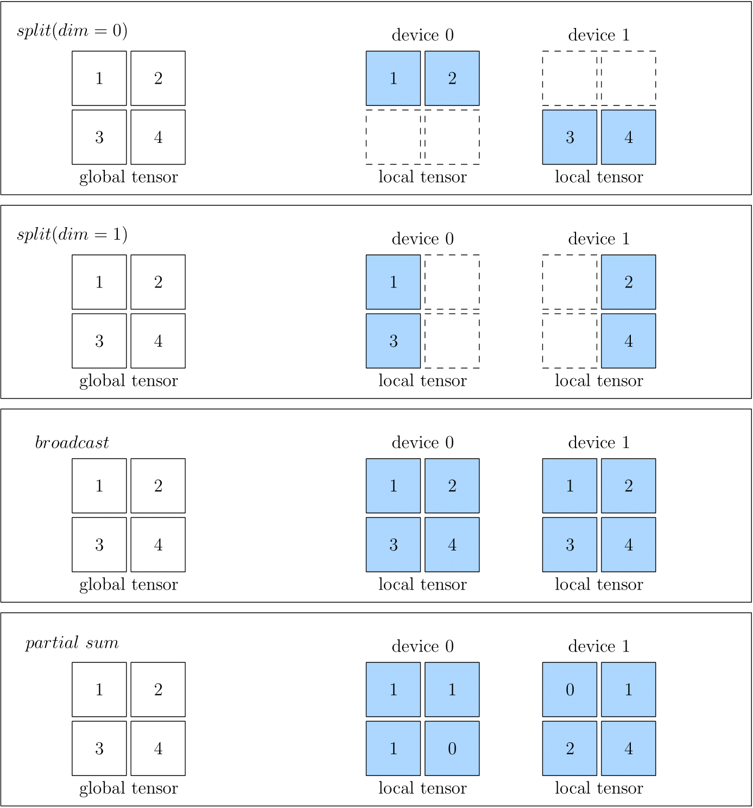

# CONSISTENT VIEW

The concept of **global view** in OneFlow is introduced to simplify distributed training. In short, the cluster is abstracted as a "Super Computing Device" under OneFlow global view.

Instead of caring about the details of computing and communication in a cluster, users can program like on a single node, and OneFlow can train the model in a distributed way.

OneFlow's global view relies on several important concepts: **Placement**, **SBP** and **SBP Signature**.

## Placement

The Tensors of OneFlow has a `placement` attribute in global view; the `placement` specifies which physical device the Tensor is placed on.

OneFlow will automatically number the devices in the cluster. For example, if there are four hosts in a cluster and each host has eight GPU cards, so that 32 cards in total. The 32 devices in the cluser will be numbered 0 to 31.

To place a Tensor on the first four cards on machine 0, simply configure: `placement("cuda", [0, 1, 2, 3])`.

To place a Tensor on the last four cards on machine 0, simply configure: `placement("cuda", [4, 5, 6, 7])`.

Placement makes it easy for OneFlow to support pipelining parallelism, and we’ll see examples of `placement` in other articles on this topic.

## SBP

SBP is a unique concept in OneFlow, which describes the mapping of data from a "Super Computing Device" perspective to data on real physical devices in a cluster. It is a combination of the initials of three words: `split`, `broadcast`, `partial`.

In detail:

- `split` means that the physical Tensor is obtained by splitting the logical Tensor along a certain dimension. An `axis` parameter is used to indicate the dimension of the split. If multiple physical Tensors are concatenated along the dimension of Split, the logical Tensor can be restored.
- `broadcast` indicates that each physical Tensor is exactly a copy of the logical Tensor.
- `partial` indicates that although the physical Tensor has the same shape as the logical Tensor, the value in the physical Tensor is a part of the value in the corresponding position in the logical Tensor, if you add multiple physical Tensors at the same positions, you can restore the logical Tensor. Besides `sum`, `min`, `max` and some other opreations are made available for `partial`.

The figures below show some examples of SBP, including `split(0)`, `split(1)`, `broadcast` and `partial sum`.

When you create a Global Tensor, you can specify the SBP of the Tensor. The example will be seen in the next article: [Global Tensor](./03_consistent_tensor.md).

## SPB Signature

SBP describes the mapping relationship between the data under the global view and the data on the physical devices. When doing distributed training, OneFlow distributes the data to the physical devices, computes the results according to the SBP attributes of the data.

For an isolated Tensor, we can set its SBP attributes at will. However, for an operator with input and output data, we can not arbitrarily set the SBP attributes of its input and output. This is because arbitrarily setting the SBP attributes of an operator’s input and output may not conform to the algorithm of the operator under global view.

Let us discuss this problem with the example of matrix multiplication. Look at how the input and output SBP of matrix multiplication are combined to be legal and illegal in a distributed system with tow devices.

Suppose, from the global view, that a matrix $A$ with the shape $$(m, k)$ is multiplied by a matrix $B$ with the shape $(k, n)$ to get $y $, the shape of $y$ must be $(m, n)$.

According to the rule of matrix multiplication, we can divide the matrix $A$ into two matrices $A_0$ and $A_1$ by dimension 0, with the shapes of $(m_0, k)$, $(m_1, k)$ respectively:

Device 1:

$$
\begin{matrix}
A_0     \times     B     =     Y_0
\\
(m_0, k)     (k, n)      (m_0, n)
\end{matrix}
$$

Device 2:

$$
\begin{matrix}
A_1     \times     B     =     Y_1
\\
(m_1, k)     (k, n)      (m_1, n)
\end{matrix}
$$

It’s easy to configure the relationship among physical Tensors $A_0$, $A_1$ and the Tensor $A$, which is under the global view. And also the relationship between $Y_0$, $Y_1$ and the global view data $Y$:

$$
\begin{matrix}
A &= concat&(A_0 ,& A_1) \\
(m,k) &  & (m_0, k) & (m_1, k)
\end{matrix}
$$

$$
\begin{matrix}
Y &= concat&(Y_0 ,& Y_1) \\
(m,n) &  & (m_0, n) & (m_1, n)
\end{matrix}
$$

> Note: The `concat` above represents a concatenate operation.

In this way, it is possible to execute the operation and get the correct result from the global view by distributing the data to each physical device. **The long story we talked above, described in SBP, are surprisingly simple:**

$A$ is `split(0)`, $B$ is `broadcast`, and $Y$ is `split(0)`.

We can see that for matrix multiplication, the SBP of its input and output combined in the above way, is legal. **For matrix multiplication, there are more than one valid SBP combinations, such as:**

$A$ is `broadcast`, $B$ is `split(1)`, and $Y$ is `split(1)`.

Or:

$A$ is `split(1)`, $B$ is `split(0)`, and $Y$ is `partial sum`.

While we showed multiple valid SBP combinations above, not all SBP combinations are valid. For example, for matrix multiplication, if $A$, $B$ are both `split(0)`, then:

$$
\begin{matrix}
A &= concat&(A_0 ,& A_1) \\
(m,k) &  & (m_0, k) & (m_1, k)
\end{matrix}
$$

$$
\begin{matrix}
B &= concat&(B_0 ,& B_1) \\
(k,n) &  & (k_0, n) & (k_1, n)
\end{matrix}
$$

Because the shapes of $A_0$ and $B_0$ do not meet the requirements of matrix multiplication, it is impossible to compute the matrix multiplication on physical devices. We can say that the combination of $A$ as `split(0)` and $B$ as `split(0)` is illegal.

We defines **a specific, valid SBP combination** of the inputs and outputs of an operator, as shown above, as a **SBP Signature** of this operator.

All operators in OneFlow are presetting all possible SBP signatures according to the operator's Operation Rules. The user only needs to set the `placement` and `SBP` attributes of the data, the selection process is transparent to the user.

## Conclusion

`placement`, `SBP`, and `SBP Signature` are the important guarantee of OneFlow distributed global view, which makes OneFlow distributed training as simple as on a single machine single card.

In the next article [Global Tensor](./03_consistent_tensor), we’ll show you an example of programming under the global view.
