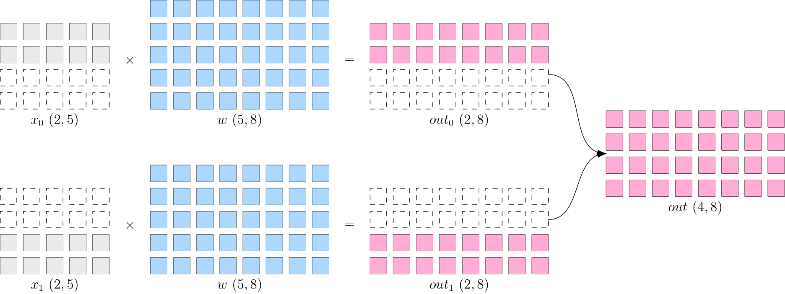
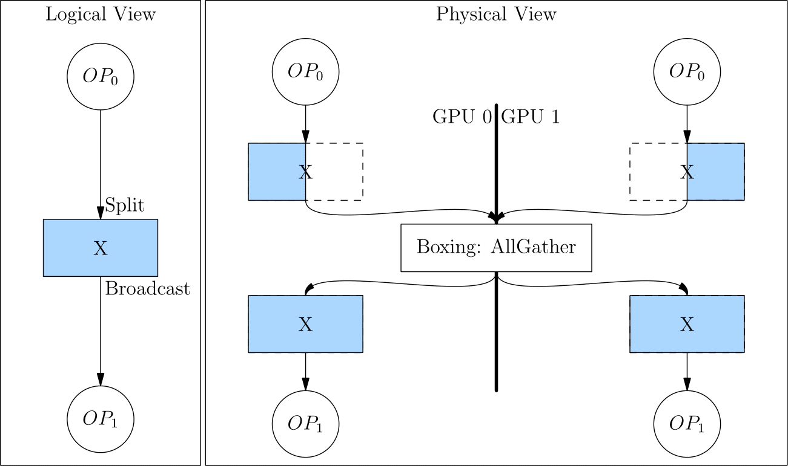

# Consistent Tensor

## The Mapping Between Consistent View and Physical View

## Create Consistent Tensor

To interactively experience consistent tensor on a two-GPU machine, you may launch python separately in two consoles in the following way.

!!! Note
    **Click** the Terminal 0 or Terminal 1 label to check the commands/code

=== "Terminal 0"
    ```shell
    export MASTER_ADDR=127.0.0.1 MASTER_PORT=17789 WORLD_SIZE=2 RANK=0 LOCAL_RANK=0
    python3
    ```

=== "Terminal 1"
    ```shell
    export MASTER_ADDR=127.0.0.1 MASTER_PORT=17789 WORLD_SIZE=2 RANK=1 LOCAL_RANK=1
    python3
    ```

Setting environment variables prepares the machines for distributed computing. Please refer to the [Extended Reading](#extented-reading) section at the end of this article for a detailed explanation and ways to launch distributed computing using provided tools.

### Create Consistent Tensor Directly

In the two consoles, separately import `oneflow` and create `x`.

`flow.placement("cuda", {0:[0,1]})` declears the devices to place the physical tensors.
- `"cuda"` means "on GPU".  The second parameter of - `placement` is a dictionary. Its `key` is the index of machine, and its `value` is the index of the graphic cards. Therefore, `{0:[0,1]}` means that consistent tensor is on the 0th, 1st graphic cards of the 0th machine.

=== "Terminal 0"
    ```python
    import oneflow as flow

    placement = flow.placement("cuda",{0:[0,1]})
    sbp = flow.sbp.split(0)
    x = flow.randn(4,5,placement=placement, sbp=sbp)
    x.shape
    ```

=== "Terminal 1"
    ```python
    import oneflow as flow

    placement = flow.placement("cuda",{0:[0,1]})
    sbp = flow.sbp.split(0)
    x = flow.randn(4,5,placement=placement, sbp=sbp)
    x.shape
    ```

Output:

=== "Terminal 0"
    ```text
    flow.Size([4, 5])
    ```

=== "Terminal 1"
    ```text
    flow.Size([4, 5])
    ```

### Get Local Tensor From Consistent Tensor

Call [to_local()](https://oneflow.readthedocs.io/en/master/tensor.html#oneflow.Tensor.to_local) to check the local tensor on a device

=== "Terminal 0"
    ```python
    x.to_local()
    tensor([[ 2.9186e-01, -3.9442e-01,  4.7072e-04, -3.2216e-01,  1.7788e-01],
            [-4.5284e-01,  1.2361e-01, -3.5962e-01,  2.6651e-01,  1.2951e+00]],
        device='cuda:0', dtype=oneflow.float32)
    ```

=== "Terminal 1"
    ```python
    x.to_local()
    tensor([[-0.4363,  0.9985, -2.5387,  0.3003,  0.3803],
            [ 0.0556, -0.8077,  1.1191, -2.1278,  0.1468]], device='cuda:1',
        dtype=oneflow.float32)
    ```

### Convert Local Tensor to Consistent Tensor

Users can create local tensor first, then convert it to consistent tensor with [Tensor.to_consistent](https://oneflow.readthedocs.io/en/master/tensor.html#oneflow.Tensor.to_consistent).

In the following example, local tensor of `shape=(2, 5)` are created separately on two different machines. `x.to_consistent()` will return the consistent tensor with `shape` `(4, 5)`.

By setting the sbp to `sbp=flow.sbp.split(0)`, two local tensors of shape `(2, 5)` will be concatenated on the 0th dimension, which results in a consistent tensor with logical shape `(4, 5)`.

=== "Terminal 0"
    ```python
    import oneflow as flow

    x = flow.randn(2,5)
    placement = flow.placement("cuda",{0:[0,1]})
    sbp = flow.sbp.split(0)
    x_consistent = x.to_consistent(placement=placement, sbp=sbp)
    x_consistent.shape
    ```

=== "Terminal 1"
    ```python
    import oneflow as flow

    x = flow.randn(2,5)
    placement = flow.placement("cuda",{0:[0,1]})
    sbp = flow.sbp.split(0)
    x_consistent = x.to_consistent(placement=placement, sbp=sbp)
    x_consistent.shape
    ```

## Practice With SBP Signature

### Data-Parallelism

The following code is an example of [data-parallelism of common distributed parallelism](./01_introduction.md#_4)



=== "Terminal 0"
    ```python
    import oneflow as flow

    placement = flow.placement("cuda",{0:[0,1]})
    x = flow.randn(4,5,placement=placement, sbp=flow.sbp.split(0))
    w = flow.randn(5,8,placement=placement, sbp=flow.sbp.broadcast)
    y = flow.matmul(x,w)
    y.sbp
    y.shape
    ```

=== "Terminal 1"
    ```python
    import oneflow as flow

    placement = flow.placement("cuda",{0:[0,1]})
    x = flow.randn(4,5,placement=placement, sbp=flow.sbp.split(0))
    w = flow.randn(5,8,placement=placement, sbp=flow.sbp.broadcast)
    y = flow.matmul(x,w)
    y.sbp
    y.shape
    ```

`flow.matmul` supports many SBP signatures of inputs. When the SBP of `x` and `w` are `split(0)` and `broadcast` respectively, the SBP of output `y` is `split(0)` with logical shape `(4, 8)`. Output:

=== "Terminal 0"
    ```text
    (oneflow.sbp.split(axis=0),)
    flow.Size([4, 8])
    ```

=== "Terminal 1"
    ```text
    (oneflow.sbp.split(axis=0),)
    flow.Size([4, 8])
    ```

### Model-Parallelism

The following code is an example of [model-parallelism of common distributed parallelism](./01_introduction.md#_5).


=== "Terminal 0"
    ```python
    import oneflow as flow

    placement = flow.placement("cuda",{0:[0,1]})
    x = flow.randn(4,5,placement=placement, sbp=flow.sbp.broadcast)
    w = flow.randn(5,8,placement=placement, sbp=flow.sbp.split(1))
    y = flow.matmul(x,w)
    y.sbp
    y.shape
    ```

=== "Terminal 1"
    ```python
    import oneflow as flow

    placement = flow.placement("cuda",{0:[0,1]})
    x = flow.randn(4,5,placement=placement, sbp=flow.sbp.broadcast)
    w = flow.randn(5,8,placement=placement, sbp=flow.sbp.split(1))
    y = flow.matmul(x,w)
    y.sbp
    y.shape
    ```

`flow.matmul` supports many SBP signatures of inputs. When the SBP of `x` and `w` are `broadcast` and `split(0)` respectively, the SBP of output `y` is `split(1)` with logical shape `(4, 8)`. Output:

=== "Terminal 0"
    ```text
    (oneflow.sbp.split(axis=1),)
    flow.Size([4, 8])
    ```

=== "Terminal 1"
    ```text
    (oneflow.sbp.split(axis=1),)
    flow.Size([4, 8])
    ```

## Extended Reading

### Environment Variables in Multi-Machine Training

As in the examples shown above, users can manually launch the distributed training by setting the environment variables. In this way, users can clearly see the effects and outputs in an interactive python environment which is friendly for debuging. In production, users can instead launch the distributed training with [oneflow.distributed.launch](./04_launch.md). This module automatically sets necessary environment variables based on command-line arguments.

- `MASTER_ADDR`：The IP address of the 0th machine in the cluster
- `MASTER_PORT`：The listening port of the 0th machine in a multi-machine case. Note that this port should not be occupied by another process
- `WORLD_SIZE`：The number of computing devices in the whole cluster. Because currently oneflow only supports having the  same number of GPUs on each machines, `WORLD_SIZE` is actually $number\:of\:machines \times number\:of\:GPUs\:on\:one\:machine$. In our example, we have one machine and two GPUs on it, so `WORLD_SIZE=2`

`RANK` and `LOCAL_RANK` are indexes for processes. The difference is that `RANK` is a "global perspective" index, while `LOCAL_RANK` is a "local perspective" index. They are the same when only one machine is involved. In the above examples, we launch two processes on the same machine, so the `RANK` and `LOCAL_RANK` are the same.

When launching the distributed training on multiple machines, the upper bound of `LOCAL_RANK` keeps the same with the number of computing devices on single machine. The upper bound of `RANK` keeps the same with the total number of computing devices in the cluster. The indexing of processes starts from 0. (Both upper bounds are non-inclusive since indexing starts from 0)

Assume that there are two machines and there are two graphic cards on each machine. The list below illustrates the correspondence between `LOCAL_RANK` and `RANK`

|                    | RANK | LOCAL_RANK |
| ------------------ | ---- | ---------- |
| GPU 0 on Machine 0 |   0  |     0      |
| GPU 1 on Machine 0 |   1  |     1      |
| GPU 0 on Machine 1 |   2  |     0      |
| GPU 1 on Machine 1 |   3  |     1      |

### Boxing（Automatic Conversion of SBP）

From the coding example, we learned that an operator can derive and set the SBP of the output tensor, given the SBP of the input tensor and the built-in SBP Signature of the operator.

But what if the SBP of the output tensor does not satisfy the requirements of the next-layer operator?

Assume that in data-parallelism, there are two layers of matrix multiplication. Both layers use model-parallelism.


The SBP (`split(1)`) of the output from the first layer is not what the second layer expects (`broadcast`). In this case, OneFlow automatically inserts Boxing operation (AllGather) between the output of the first layer and the input of the second layer to perform necessary data movement.

Converting `split(1)` to `broadcast` is equivalent to an `AllGather` operation, as shown in the figure below.



Thanks to the Boxing mechanism, users only need to set the SBP signature of the critical places (like the source operator). The rest is all handled by the OneFlow framework and no need to insert the colletive communication operations manually.
