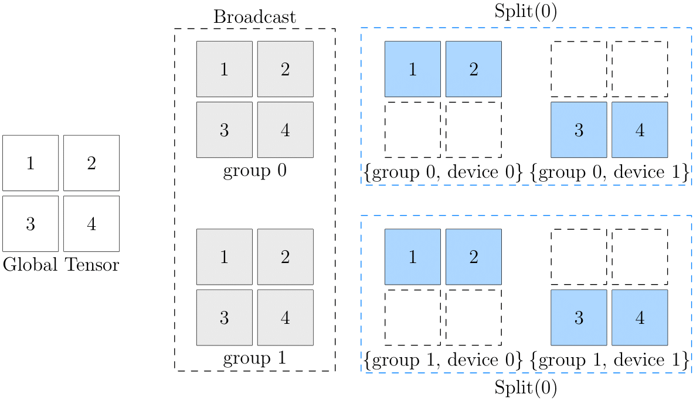

# 2D SBP

After reading the [global view](./02_sbp.md) and [Global Tensor](./03_consistent_tensor.md), I believe you have mastered the basic concepts of SBP and SBP Signature, and can get started with related programming tasks. In fact, the above information refers to **1D SBP**.

This article will introduce 2D SBP based on the reader's mastery of 1D SBP, which can more flexibly deal with more complex distributed training scenarios.

## 2D devices matrix
We are already familiar with the placement configuration of 1D SBP. In the scenario of 1D SBP, configure the cluster through the [oneflow.placement](https://oneflow.readthedocs.io/en/master/placement.html#oneflow.placement) interface, such as using the 0~3 GPU graphics cards in the cluster:

```python
>>> placement1 = flow.placement("cuda", ranks=[0, 1, 2, 3])
```

The above `"cuda"` specifies the device type, and `ranks=[0, 1, 2, 3]` specifies the computing devices in the cluster. In fact, `ranks` can be not only a one-dimensional int list, but also a multi-dimensional int array:

```python
>>> placement2 = flow.placement("cuda", ranks=[[0, 1], [2, 3]])
```

When `ranks` is in the form of a one-dimensional list like `ranks=[0, 1, 2, 3]`, all devices in the cluster form a 1D device vector, which is where the 1D SBP name comes from.

When `ranks` is in the form of a multi-dimensional array, the devices in the cluster are grouped into a multi-dimensional array of devices. `ranks=[[0, 1], [2, 3]]` means that the four computing devices in the cluster are divided into $2 \times 2$ device arrays.

## 2D SBP

We already know that when constructing a Global Tensor, we need to specify both `placement` and `SBP`. When the cluster in `placement` is a 2-dimensional device array, SBP must also correspond to it, which is a `tuple` with a length of 2. The 0th and 1st elements in this tuple respectively describes the distribution of Global Tensor in the 0th and 1st dimensions of the device array.

For example, The following code configures a $2 \times 2$ device array, and sets the 2D SBP to `(broadcast, split(0))`.

```python
>>> a = flow.Tensor([[1,2],[3,4]])
>>> placement = flow.placement("cuda", ranks=[[0, 1], [2, 3]])
>>> sbp = (flow.sbp.broadcast, flow.sbp.split(0))
>>> a_to_global = a.to_global(placement=placement, sbp=sbp)
```

It means that logically the data, over the entire device array, is `broadcast` in the 0th dimension ("viewed vertically"); `split(0)` in the 1st dimension ("viewed across").

We illustrate with the following figure:



The left side of this figure is the data from the global perspective, and the right side is the data of each device on the device array. As you can see, from the perspective of the 0th dimension, they are all `broadcast` relations:

- The data in (group0, device0) and (group1, device0) are consistent, and they are `broadcast` relationship to each other
- The data in (group0, device1) and (group1, device1) are consistent, and they are `broadcast` relationship to each other

And from the perspective of the 1st dimension, they are all `split(0)` relations:

- (group0, device0) and (group0, device1) are `split(0)` relationship to each other
- (group1, device0) and (group1, device1) are `split(0)` relationship to each other

It may be difficult to directly understand the correspondence between logical data and physical data in the final device array. When thinking about 2D SBP, you can imagine an intermediate state (gray part in the above figure), and take `(broadcast, split(0)) ` as an example:

- First, the original logical tensor is broadcast to 2 groups through `broadcast`, and the intermediate state is obtained
- On the basis of the intermediate state, continue to do `split(0)` on the respective group to get the state of each physical tensor in the final device array

## 2D SBP Signature

类似 1D SBP 有 SBP Signature 的概念，算子也有 2D SBP Signature，在掌握了 1D SBP 及其 Signature 概念的基础上，2D SBP Signature 非常简单，只需要遵循一条原则：

- 在各自的维度上独立推导即可

我们以矩阵乘法为例，先回顾 1D SBP 的情况，假定有 $x \times w = y$ 可以有以下的 SBP Signature：

$$ broadcast \times split(1) = split(1) $$

以及

$$ split(0) \times broadcast = split(0) $$

现在，假定我们给 $x$ 设置了 2D SBP 为：$(broadcast, split(0))$， 给 $w$ 设置 2D SBP 为 $(split(0), broadcast)$，那么，在 2D SBP 的背景下， $x \times w = y$ 运算，得到 $y$ 的 SBP
 属性为 $(split(1), split(0))$。

 也就是说，以下几个 2D SBP，构成矩阵乘法的 2D SBP Signature：

$$ (broadcast, split(0)) \times (split(1), broadcast) =  (split(1), split(0)) $$
